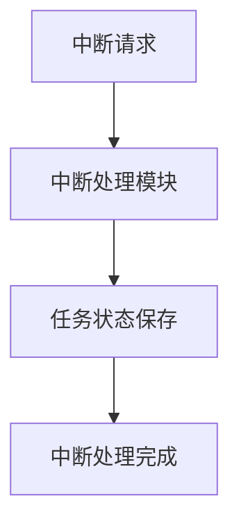
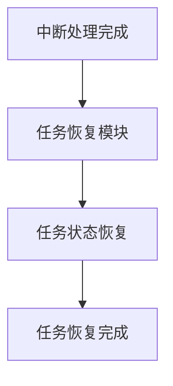
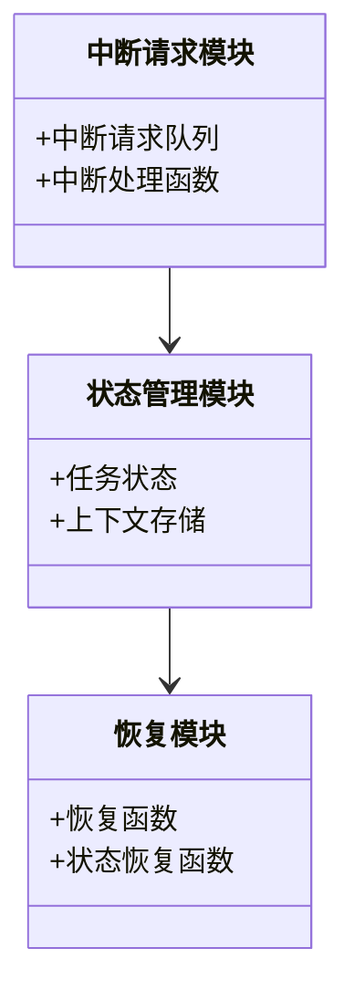
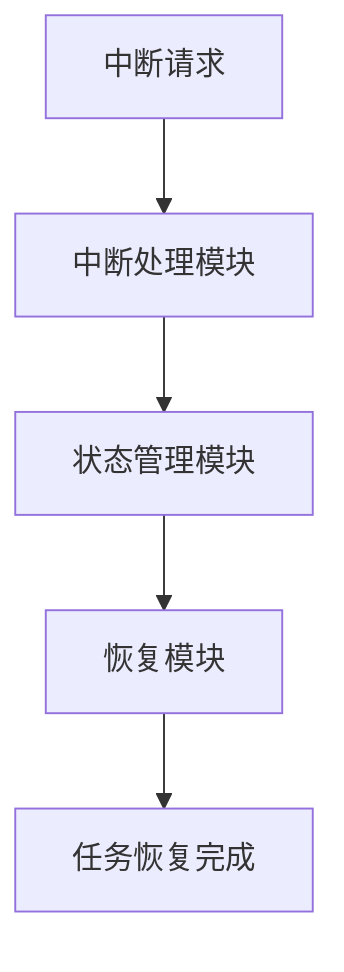
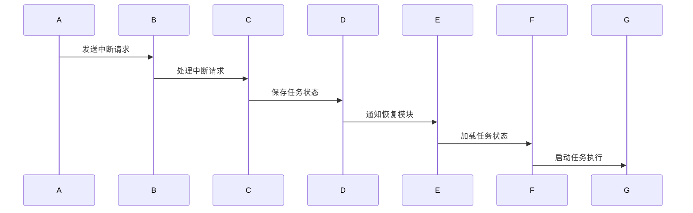

                 


# 实现AI Agent的任务中断与恢复功能

> 关键词：AI Agent, 任务中断, 任务恢复, 状态管理, 中断处理, 恢复机制

> 摘要：本文详细探讨了AI Agent任务中断与恢复功能的实现方法，从理论基础到算法原理，从系统设计到项目实战，系统地分析了任务中断与恢复的关键技术。通过结合实际应用场景，本文提出了完整的实现方案，并通过丰富的案例和代码示例，帮助读者全面掌握AI Agent任务中断与恢复的核心技术。

---

# 第一部分: AI Agent任务中断与恢复的背景与基础

# 第1章: AI Agent与任务中断恢复概述

## 1.1 AI Agent的基本概念

### 1.1.1 AI Agent的定义与特点

AI Agent（人工智能代理）是一种能够感知环境、自主决策并执行任务的智能实体。AI Agent的核心特点包括：

- **自主性**：能够在没有外部干预的情况下自主运行。
- **反应性**：能够根据环境变化动态调整行为。
- **目标导向性**：以实现特定目标为导向执行任务。
- **学习能力**：能够通过经验改进自身行为。

### 1.1.2 AI Agent的分类与应用场景

AI Agent可以根据功能和应用场景分为多种类型，常见的分类包括：

- **简单反射型AI Agent**：基于固定的规则集进行反应，适用于简单的决策任务。
- **基于模型的反射型AI Agent**：利用内部模型和知识库进行决策，适用于复杂任务。
- **目标驱动型AI Agent**：以实现特定目标为导向，适用于需要长期规划的任务。
- **效用驱动型AI Agent**：通过最大化效用函数来优化决策，适用于资源分配和优化问题。

### 1.1.3 任务中断与恢复的必要性

在实际应用中，AI Agent可能会因为外部干扰、资源限制或环境变化等原因需要中断当前任务。任务中断与恢复功能的实现能够确保AI Agent在中断后能够恢复到中断前的状态，并继续执行任务，从而保证系统的稳定性和任务的完整性。

---

## 1.2 任务中断与恢复的背景

### 1.2.1 任务中断的常见场景

任务中断的常见场景包括：

- **外部中断**：例如用户手动停止任务、系统资源不足导致的任务终止。
- **内部中断**：例如AI Agent检测到异常情况（如错误、超时）时主动中断任务。
- **优先级中断**：当更高优先级的任务需要执行时，中断当前任务。

### 1.2.2 任务恢复的挑战与意义

任务恢复的挑战主要体现在：

- **状态管理的复杂性**：任务中断时，需要保存任务的状态信息，恢复时需要准确还原这些状态。
- **资源竞争**：中断和恢复过程中可能会与其他任务竞争系统资源。
- **不确定性处理**：中断后环境可能发生变化，需要重新评估任务的可行性。

任务恢复的意义在于：

- **提高系统的健壮性**：能够从中断中恢复，确保任务的完成。
- **提升用户体验**：在用户或系统干预后，能够无缝恢复任务，减少用户的操作负担。
- **增强系统的灵活性**：在动态环境中，任务中断与恢复功能能够使AI Agent更好地适应变化。

### 1.2.3 任务中断与恢复的边界与外延

任务中断与恢复的边界包括：

- **任务范围**：明确任务的起点和终点，确保中断和恢复仅在任务范围内有效。
- **资源范围**：明确任务使用的资源范围，避免资源泄漏或竞争。
- **时间范围**：明确任务的时间限制，确保中断和恢复在合理的时间范围内完成。

任务中断与恢复的外延包括：

- **任务取消**：彻底终止任务，不再恢复。
- **任务暂停**：临时中断任务，稍后恢复。
- **任务重试**：在中断后重新尝试执行任务。

---

## 1.3 本章小结

本章介绍了AI Agent的基本概念、分类与应用场景，重点分析了任务中断与恢复的背景、挑战与意义。通过明确任务中断与恢复的边界与外延，为后续的实现奠定了基础。

---

# 第二部分: 任务中断与恢复的核心概念与原理

# 第2章: 任务中断与恢复的核心概念

## 2.1 任务中断机制

### 2.1.1 中断触发条件

中断触发条件是指在什么情况下触发任务中断。常见的中断触发条件包括：

- **外部指令**：用户或系统管理员手动触发中断。
- **资源不足**：系统资源（如CPU、内存、网络带宽）不足以继续执行任务。
- **错误发生**：任务执行过程中发生错误或异常。
- **超时**：任务执行时间超过预设的限制。
- **优先级冲突**：更高优先级的任务需要立即执行。

### 2.1.2 中断处理流程

中断处理流程包括以下步骤：

1. **中断请求接收**：接收中断请求，确定中断来源和类型。
2. **中断优先级判断**：根据中断请求的优先级决定是否立即处理。
3. **任务状态保存**：保存当前任务的状态信息，包括任务进度、资源占用情况、上下文信息等。
4. **中断处理**：执行中断处理逻辑，例如释放资源、终止任务执行、通知相关组件等。

### 2.1.3 中断优先级与排队机制

中断优先级决定了不同中断请求的处理顺序。常见的中断优先级策略包括：

- **静态优先级**：根据中断请求的类型预先设定优先级。
- **动态优先级**：根据当前系统状态动态调整优先级。
- **轮转优先级**：公平分配中断请求的处理顺序。

中断请求的排队机制包括：

- **队列管理**：将中断请求加入队列，按优先级顺序处理。
- **信号机制**：使用信号或事件触发中断处理。

---

### 2.1.4 中断处理的流程图（Mermaid）



---

## 2.2 任务恢复机制

### 2.2.1 状态保存与恢复

任务恢复的核心是状态管理。状态保存是指在任务中断前，将任务的当前状态信息保存下来；状态恢复是指在任务中断后，将保存的状态信息加载回来，使任务能够继续执行。

状态保存的内容包括：

- **任务进度**：任务执行到哪个步骤。
- **资源占用**：任务使用的资源状态。
- **上下文信息**：任务执行的上下文信息，例如变量值、数据结构等。

状态恢复的过程包括：

1. **状态加载**：从存储介质中加载任务的状态信息。
2. **资源分配**：为任务分配所需的资源。
3. **任务启动**：重新启动任务的执行。

### 2.2.2 状态管理的实现

状态管理的实现可以通过以下方式：

- **内存存储**：将任务的状态信息保存在内存中，适用于短时间中断的情况。
- **持久化存储**：将任务的状态信息持久化存储在磁盘或数据库中，适用于长时间中断的情况。
- **分布式存储**：在分布式系统中，状态信息可以存储在多个节点中，确保系统的高可用性。

### 2.2.3 恢复策略

恢复策略包括：

- **立即恢复**：中断后立即恢复任务。
- **延迟恢复**：中断后稍后恢复任务。
- **条件恢复**：在满足特定条件后恢复任务。

---

### 2.2.4 恢复处理的流程图（Mermaid）



---

## 2.3 中断与恢复的关联性分析

### 2.3.1 中断与恢复的依赖关系

中断与恢复之间存在密切的依赖关系：

- **中断触发恢复**：中断请求的处理可能会触发任务恢复。
- **恢复依赖中断**：任务恢复的前提是任务中断已经被处理。

### 2.3.2 中断与恢复的流程对比

中断与恢复的流程对比如下：

| 步骤 | 中断处理 | 恢复处理 |
|------|----------|----------|
| 1    | 接收中断请求 | 加载任务状态 |
| 2    | 判断中断优先级 | 分配资源 |
| 3    | 处理中断 | 启动任务执行 |
| 4    | 完成中断处理 | 完成任务恢复 |

---

### 2.3.3 中断与恢复的实体关系图（Mermaid）



---

## 2.4 本章小结

本章详细讲解了任务中断与恢复的核心概念，包括中断触发条件、中断处理流程、中断优先级与排队机制，以及状态保存与恢复的实现。通过流程图和实体关系图，清晰地展示了中断与恢复的依赖关系和实现流程。

---

# 第三部分: 任务中断与恢复的算法原理

# 第3章: 任务中断与恢复的算法实现

## 3.1 中断处理算法

### 3.1.1 中断请求队列管理

中断请求队列管理算法：

- **队列结构**：使用优先队列（优先级队列）来管理中断请求。
- **队列操作**：包括插入、删除和查询操作。
- **优先级策略**：根据中断请求的优先级动态调整队列中的元素顺序。

### 3.1.2 中断优先级调度算法

中断优先级调度算法：

- **静态优先级调度**：根据中断请求的类型预先设定优先级。
- **动态优先级调度**：根据当前系统状态动态调整优先级。
- **轮转优先级调度**：公平分配中断请求的处理顺序。

---

### 3.1.3 中断处理流程图（Mermaid）


---

## 3.2 恢复处理算法

### 3.2.1 状态恢复算法

状态恢复算法：

- **状态加载**：从存储介质中加载任务的状态信息。
- **资源分配**：为任务分配所需的资源。
- **任务启动**：重新启动任务的执行。

---

### 3.2.2 恢复流程图（Mermaid）


---

## 3.3 中断与恢复的数学模型

### 3.3.1 中断概率模型

中断概率模型：

$$ P_{中断} = \frac{N_{中断请求}}{N_{总请求}} $$

其中，$N_{中断请求}$ 是中断请求的数量，$N_{总请求}$ 是总的请求数量。

### 3.3.2 恢复时间模型

恢复时间模型：

$$ T_{恢复} = T_{状态保存} + T_{状态恢复} $$

其中，$T_{状态保存}$ 是状态保存的时间，$T_{状态恢复}$ 是状态恢复的时间。

---

## 3.4 本章小结

本章详细讲解了任务中断与恢复的算法实现，包括中断请求队列管理、中断优先级调度算法、状态恢复算法以及中断与恢复的数学模型。通过流程图和数学公式，清晰地展示了中断与恢复的实现过程。

---

# 第四部分: 系统分析与架构设计

# 第4章: 系统分析与架构设计

## 4.1 问题场景介绍

### 4.1.1 任务中断的场景分析

任务中断的场景分析：

- **外部中断**：用户手动停止任务。
- **资源不足**：系统资源不足，任务无法继续执行。
- **错误发生**：任务执行过程中发生错误，需要中断。

### 4.1.2 任务恢复的场景分析

任务恢复的场景分析：

- **中断后恢复**：中断后重新恢复任务。
- **资源分配**：任务恢复时需要重新分配资源。
- **任务重启**：任务中断后重新启动任务。

### 4.1.3 中断与恢复的交互流程

中断与恢复的交互流程：

1. **中断请求**：用户或系统触发中断请求。
2. **中断处理**：中断请求被处理，任务状态被保存。
3. **任务恢复**：任务状态被加载，任务重新启动。

---

## 4.2 系统功能设计

### 4.2.1 领域模型（Mermaid类图）


---

## 4.3 系统架构设计

### 4.3.1 系统架构图（Mermaid）



---

## 4.4 系统接口设计

### 4.4.1 中断接口设计

中断接口设计：

- **中断请求接口**：接收中断请求，触发中断处理。
- **中断处理接口**：处理中断请求，保存任务状态。

### 4.4.2 恢复接口设计

恢复接口设计：

- **状态恢复接口**：加载任务状态，分配资源。
- **任务恢复接口**：启动任务执行，完成恢复。

---

## 4.5 系统交互流程（Mermaid）



---

## 4.6 本章小结

本章通过系统分析与架构设计，明确了AI Agent任务中断与恢复系统的功能需求和实现方案。通过领域模型、系统架构图和交互流程图，清晰地展示了系统的实现方式。

---

# 第五部分: 项目实战

# 第5章: 项目实战

## 5.1 环境安装与配置

### 5.1.1 系统环境

- **操作系统**：Linux/Windows/MacOS
- **编程语言**：Python/Java/C++
- **开发工具**：IDE（如PyCharm、IntelliJ IDEA、Visual Studio）
- **依赖管理**：使用pip或maven管理依赖。

### 5.1.2 环境配置

- **安装Python**：确保Python版本为3.8以上。
- **安装依赖库**：例如，使用pip安装`mermaid`, `graphviz`等库。

---

## 5.2 核心代码实现

### 5.2.1 中断处理模块实现

```python
class InterruptHandler:
    def __init__(self):
        self.interrupt_queue = []
        self.current_task = None

    def handle_interrupt(self):
        if self.interrupt_queue:
            interrupt_request = self.interrupt_queue.pop(0)
            # 处理中断请求
            print(f"Handling interrupt request: {interrupt_request}")
            # 保存任务状态
            self.save_task_state()
        else:
            print("No pending interrupt requests")

    def save_task_state(self):
        # 保存任务状态到存储介质
        print("Saving task state...")
```

### 5.2.2 恢复模块实现

```python
class RecoveryHandler:
    def __init__(self):
        self.task_state = {}

    def restore_task(self):
        # 加载任务状态
        print("Loading task state...")
        # 启动任务执行
        print("Starting task execution...")
```

---

## 5.3 案例分析与实现

### 5.3.1 案例分析

案例分析：

- **任务中断**：用户手动停止任务。
- **任务恢复**：中断后重新启动任务。

### 5.3.2 实现步骤

实现步骤：

1. **创建中断请求队列**：将用户的中断请求加入队列。
2. **处理中断请求**：中断请求被处理，任务状态被保存。
3. **加载任务状态**：任务状态被加载，任务重新启动。

---

## 5.4 代码实现与解读

### 5.4.1 中断处理模块代码

```python
class InterruptHandler:
    def __init__(self):
        self.interrupt_queue = []
        self.current_task = None

    def handle_interrupt(self):
        if self.interrupt_queue:
            interrupt_request = self.interrupt_queue.pop(0)
            print(f"Handling interrupt request: {interrupt_request}")
            self.save_task_state()
        else:
            print("No pending interrupt requests")

    def save_task_state(self):
        # 保存任务状态到存储介质
        print("Saving task state...")
```

### 5.4.2 恢复模块代码

```python
class RecoveryHandler:
    def __init__(self):
        self.task_state = {}

    def restore_task(self):
        # 加载任务状态
        print("Loading task state...")
        # 启动任务执行
        print("Starting task execution...")
```

---

## 5.5 项目小结

本章通过项目实战，详细讲解了AI Agent任务中断与恢复功能的实现过程。通过核心代码实现和案例分析，帮助读者更好地理解和掌握任务中断与恢复的核心技术。

---

# 第六部分: 总结与展望

# 第6章: 总结与展望

## 6.1 本章总结

本文详细探讨了AI Agent任务中断与恢复功能的实现方法，从理论基础到算法原理，从系统设计到项目实战，系统地分析了任务中断与恢复的关键技术。通过结合实际应用场景，本文提出了完整的实现方案，并通过丰富的案例和代码示例，帮助读者全面掌握AI Agent任务中断与恢复的核心技术。

---

## 6.2 未来展望

随着AI技术的不断发展，任务中断与恢复功能将变得更加复杂和多样化。未来的研究方向包括：

- **智能中断决策**：基于上下文和任务目标智能决定是否中断任务。
- **自适应恢复策略**：根据环境变化动态调整恢复策略。
- **分布式中断与恢复**：在分布式系统中实现任务中断与恢复的协同处理。

---

# 作者：AI天才研究院/AI Genius Institute & 禅与计算机程序设计艺术 /Zen And The Art of Computer Programming

---

# 结束语

感谢您的阅读！希望本文能够为您提供有价值的信息和启发，帮助您更好地理解和实现AI Agent的任务中断与恢复功能。如果需要进一步探讨或技术支持，欢迎随时联系！

