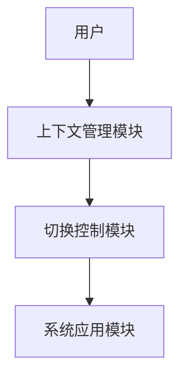
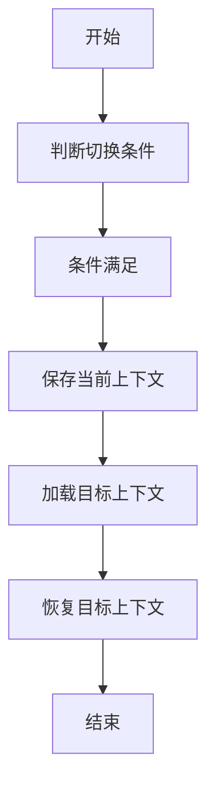
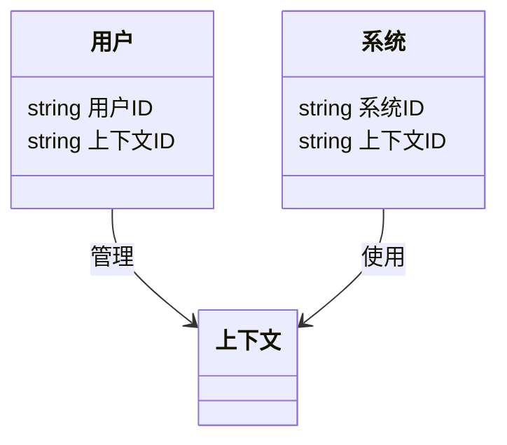
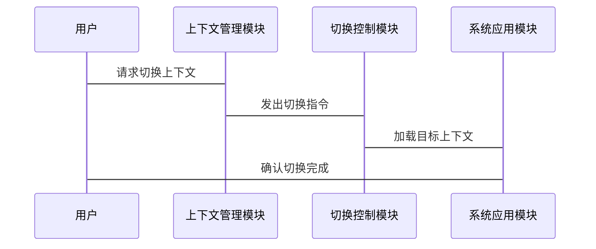

                 


# 实现AI Agent的动态上下文切换机制

> 关键词：AI Agent, 动态上下文切换, 系统架构, 算法原理, 实践案例

> 摘要：本文详细探讨了实现AI Agent动态上下文切换机制的关键技术与方法。通过系统化的分析和设计，结合实际案例，深入解析了该机制的核心概念、算法原理、系统架构及实现细节，为AI Agent的开发提供了理论支持和实践指导。

---

# 第一部分: AI Agent动态上下文切换机制背景与概念

## 第1章: AI Agent与动态上下文切换机制概述

### 1.1 问题背景与问题描述
#### 1.1.1 AI Agent的基本概念与应用场景
AI Agent（智能代理）是一种能够感知环境、自主决策并采取行动以实现目标的实体。它可以广泛应用于推荐系统、自动化控制、智能助手等领域。

#### 1.1.2 动态上下文切换的必要性
在实际应用场景中，AI Agent往往需要在多个上下文中切换。例如，在智能助手场景中，用户可能在短时间内切换任务，如从处理工作邮件切换到安排会议。动态上下文切换机制能够帮助AI Agent快速适应环境变化，提高效率。

#### 1.1.3 当前AI Agent在上下文切换中的挑战
现有AI Agent在处理上下文切换时存在以下问题：
1. 上下文切换时间过长，影响用户体验。
2. 上下文切换可能导致任务中断，影响准确性。
3. 动态上下文切换的算法复杂度高，难以实现。

### 1.2 问题解决与边界定义
#### 1.2.1 动态上下文切换的核心目标
动态上下文切换机制的目标是在不影响整体任务的情况下，快速、无缝地切换上下文，确保AI Agent能够高效运行。

#### 1.2.2 划定问题的边界与外延
动态上下文切换的边界包括：
1. 上下文切换的触发条件。
2. 上下文切换的时间限制。
3. 切换后任务恢复的完整性。

#### 1.2.3 相关概念的对比与联系
动态上下文切换与任务切换、进程切换等概念的区别与联系。

### 1.3 概念结构与核心要素
#### 1.3.1 动态上下文切换的系统架构
动态上下文切换机制的系统架构包括以下几个部分：
1. 上下文管理模块。
2. 切换控制模块。
3. 系统应用模块。

#### 1.3.2 核心要素的定义与属性
1. 上下文表示：包括任务、数据、状态等。
2. 切换条件：基于时间、任务优先级等因素。
3. 切换过程：包括保存当前上下文、加载目标上下文等步骤。

#### 1.3.3 系统模块之间的关系
系统模块之间的关系可以通过ER图和系统架构图来展示。

---

## 第2章: 核心概念原理与系统架构

### 2.1 动态上下文切换机制的原理
#### 2.1.1 上下文的定义与表示
上下文可以表示为一个数据结构，包含任务、环境信息、状态等。

#### 2.1.2 切换机制的工作流程
切换机制的工作流程包括以下几个步骤：
1. 判断是否需要切换上下文。
2. 保存当前上下文。
3. 加载目标上下文。
4. 恢复目标上下文的任务。

#### 2.1.3 机制的核心算法与实现
动态上下文切换的算法可以通过以下步骤实现：
1. 判断切换条件是否满足。
2. 执行上下文切换操作。

### 2.2 核心概念的属性特征对比
#### 2.2.1 上下文表示的多样性
上下文可以采用多种表示方法，如基于状态、基于任务、基于数据等。

#### 2.2.2 切换条件的判断标准
切换条件可以基于时间、任务优先级、资源可用性等因素。

#### 2.2.3 切换过程的可定制性
切换过程可以根据具体需求进行定制，如切换速度、恢复时间等。

### 2.3 实体关系与系统架构
#### 2.3.1 实体关系图（ER图）分析
通过ER图展示系统中的实体及其关系。

#### 2.3.2 系统架构图（Mermaid）


---

## 第3章: 算法原理与实现

### 3.1 算法原理概述
#### 3.1.1 切换触发条件的判断
切换条件可以通过以下方式判断：
1. 时间触发：基于时间间隔。
2. 事件触发：基于特定事件。

#### 3.1.2 上下文切换的实现步骤
上下文切换的实现步骤包括：
1. 判断切换条件。
2. 保存当前上下文。
3. 加载目标上下文。
4. 恢复目标上下文的任务。

#### 3.1.3 切换过程的优化策略
优化策略包括：
1. 并行处理：在切换过程中并行执行任务。
2. 延迟加载：在切换时延迟加载部分上下文。

### 3.2 算法实现
#### 3.2.1 算法流程图（Mermaid）


#### 3.2.2 Python源代码实现
```python
class ContextSwitcher:
    def __init__(self):
        self.current_context = None
        self.target_context = None

    def switch_context(self):
        if self.current_context:
            self.save_context(self.current_context)
        self.load_context(self.target_context)
        self.current_context = self.target_context

    def save_context(self, context):
        # 实现上下文保存逻辑
        pass

    def load_context(self, context):
        # 实现上下文加载逻辑
        pass
```

#### 3.2.3 算法的数学模型与公式
切换过程的数学模型可以用以下公式表示：
$$
\text{切换时间} = \text{保存时间} + \text{加载时间}
$$
切换时间的优化可以通过减少保存和加载时间来实现。

---

## 第4章: 系统分析与架构设计方案

### 4.1 问题场景介绍
在实际应用中，AI Agent需要在多个上下文中切换，以满足不同的任务需求。

### 4.2 系统功能设计
#### 4.2.1 领域模型类图（Mermaid）


#### 4.2.2 系统架构设计（Mermaid）


### 4.3 系统接口设计
#### 4.3.1 系统接口设计
系统接口包括上下文保存、加载、切换等操作。

#### 4.3.2 系统交互序列图（Mermaid）


---

## 第5章: 项目实战

### 5.1 环境安装与配置
#### 5.1.1 环境要求
- Python 3.8及以上版本
- Mermaid图生成工具
- 相关开发库

### 5.2 核心代码实现
#### 5.2.1 上下文管理模块实现
```python
class ContextManager:
    def __init__(self):
        self.contexts = {}

    def save_context(self, context_id, data):
        self.contexts[context_id] = data

    def load_context(self, context_id):
        return self.contexts.get(context_id, {})
```

#### 5.2.2 切换控制模块实现
```python
class SwitchController:
    def __init__(self, context_manager):
        self.context_manager = context_manager

    def switch_context(self, current_id, target_id):
        self.context_manager.save_context(current_id, self.context_manager.load_context(current_id))
        self.context_manager.load_context(target_id)
```

### 5.3 代码应用解读与分析
通过具体案例分析代码实现，展示动态上下文切换机制的应用场景。

### 5.4 项目小结
总结项目实现的关键点和经验教训。

---

## 第6章: 最佳实践与注意事项

### 6.1 小结
总结实现AI Agent动态上下文切换机制的核心内容和关键点。

### 6.2 注意事项
- 切换条件的设置要合理。
- 切换过程中要确保数据完整性和一致性。
- 系统架构设计要合理，避免耦合度过高。

### 6.3 实践技巧
- 使用缓存技术优化切换性能。
- 通过日志记录切换过程，便于调试和优化。

### 6.4 拓展阅读
推荐相关领域的书籍和论文，供读者进一步学习。

---

# 作者：AI天才研究院 & 禅与计算机程序设计艺术

