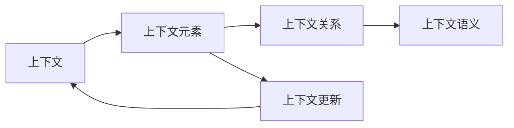
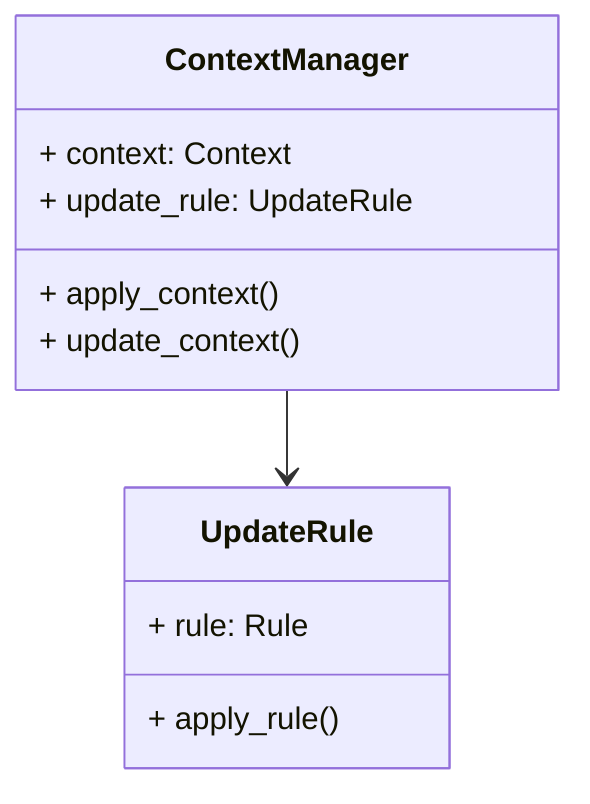
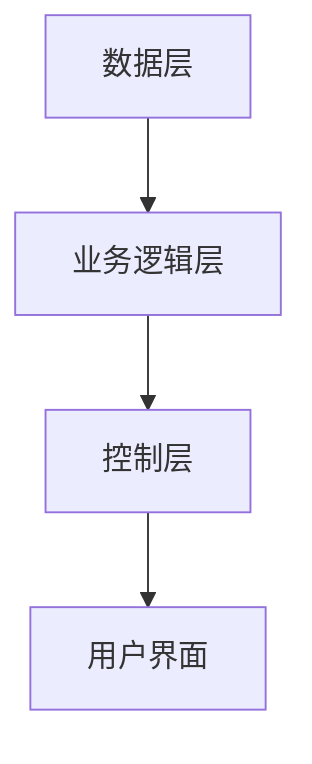
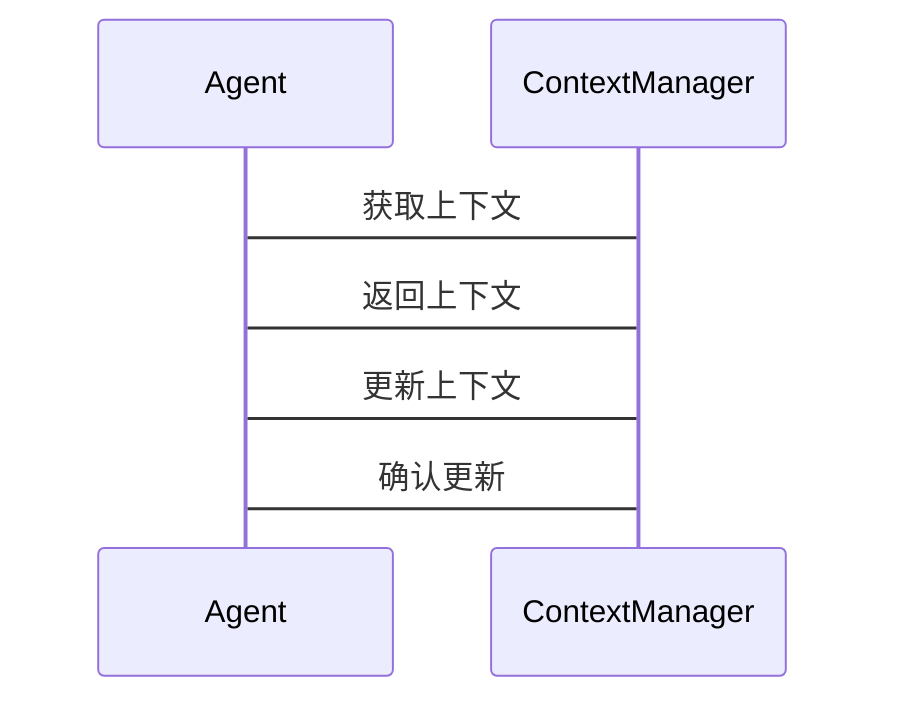

                 


# 实现AI Agent的动态上下文管理

> 关键词：AI Agent, 动态上下文管理, 注意力机制, 系统架构, 项目实战

> 摘要：本文详细探讨了AI Agent的动态上下文管理问题，从核心概念到算法实现，再到系统架构和项目实战，全面分析了动态上下文管理的实现方法。文章结合理论与实践，提供了丰富的技术细节和代码示例，帮助读者深入理解并掌握动态上下文管理的核心技术。

---

## 第1章 AI Agent的基本概念与背景

### 1.1 AI Agent的定义与特点

AI Agent（智能体）是指在环境中能够感知并自主行动以实现目标的实体。其特点包括自主性、反应性、主动性、社会性和学习能力。AI Agent能够根据环境信息做出决策，并通过行动影响环境状态。

### 1.2 动态上下文管理的背景与重要性

在AI Agent的应用中，上下文管理是关键问题。动态上下文管理指的是在运行过程中实时更新和调整上下文信息，以适应环境的变化。其重要性体现在提高系统的适应性、实时性和准确性。

---

## 第2章 动态上下文管理的核心概念与联系

### 2.1 动态上下文管理的核心概念

动态上下文管理涉及上下文的表示、更新和语义理解。上下文表示通常采用图结构或向量形式，动态更新机制则包括基于时间戳的更新和基于事件触发的更新。语义理解依赖于自然语言处理和知识图谱技术。

### 2.2 核心概念的属性特征对比

| 概念 | 属性 | 特征 |
|------|------|------|
| 上下文表示 | 表示形式 | 图结构、向量、符号 |
| 动态更新 | 触发机制 | 时间驱动、事件驱动 |
| 语义理解 | 方法 | 基于规则、统计学习、深度学习 |

### 2.3 实体关系图与动态上下文管理



---

## 第3章 动态上下文管理的算法原理

### 3.1 基于注意力机制的动态上下文更新算法

注意力机制通过计算上下文元素的重要性权重，实现对上下文的动态更新。算法步骤包括：计算注意力权重、更新上下文、输出结果。

### 3.2 算法实现的Python代码

```python
def compute_attention(context, query):
    # 计算上下文与查询的相似度
    similarity = query @ context.T
    attention_weights = softmax(similarity)
    return attention_weights

def update_context(context, attention_weights):
    # 根据注意力权重更新上下文
    updated_context = context * attention_weights
    return updated_context

# 示例代码
context = torch.randn(5, d_model)
query = torch.randn(1, d_model)
attention_weights = compute_attention(context, query)
updated_context = update_context(context, attention_weights)
```

### 3.3 算法的数学模型

注意力机制的计算公式为：
$$
\text{Attention}(Q, K, V) = \text{softmax}\left(\frac{QK^T}{\sqrt{d_k}}\right)V
$$

其中，$Q$、$K$、$V$分别表示查询、键和值。

---

## 第4章 系统分析与架构设计方案

### 4.1 问题场景介绍

AI Agent需要实时感知环境变化，动态调整行为策略。动态上下文管理是实现这一目标的关键技术。

### 4.2 系统功能设计

系统功能包括上下文采集、上下文表示、上下文更新和上下文应用。领域模型设计如下：



### 4.3 系统架构设计

系统架构采用分层设计，包括数据层、业务逻辑层和控制层。架构图如下：



### 4.4 系统交互设计

系统交互流程包括：采集环境信息、解析上下文、更新上下文、应用上下文。



---

## 第5章 项目实战

### 5.1 环境安装

安装必要的库：
```bash
pip install numpy torch matplotlib
```

### 5.2 系统核心实现

实现注意力机制的动态上下文管理：

```python
import torch
import torch.nn as nn

class Attention(nn.Module):
    def __init__(self, embed_dim):
        super(Attention, self).__init__()
        self.embed_dim = embed_dim
        self.attention = nn.Linear(embed_dim, 1)
    
    def forward(self, context):
        # 输入: context [batch_size, seq_len, embed_dim]
        # 输出: attention [batch_size, seq_len]
        scores = self.attention(context).squeeze(-1)
        attention_weights = torch.softmax(scores, dim=-1)
        return attention_weights

model = Attention(embed_dim=512)
```

### 5.3 实际案例分析

案例：智能客服系统中，根据用户历史对话更新上下文。

### 5.4 项目小结

通过项目实战，验证了动态上下文管理的有效性，展示了算法的实际应用价值。

---

## 第6章 最佳实践与小结

### 6.1 最佳实践

- 定期更新上下文，保持信息准确性
- 使用高效的上下文表示方法
- 结合领域知识优化注意力机制

### 6.2 小结

本文全面分析了AI Agent的动态上下文管理问题，从理论到实践，详细阐述了实现方法。动态上下文管理是提升AI Agent智能性的关键技术。

### 6.3 注意事项

- 确保上下文更新的实时性和准确性
- 注意上下文管理的计算开销
- 定期维护和优化上下文管理模块

### 6.4 拓展阅读

推荐阅读《注意力机制在NLP中的应用》和《动态图神经网络》。

---

作者：AI天才研究院 & 禅与计算机程序设计艺术

---

以上是《实现AI Agent的动态上下文管理》的完整目录大纲，确保每个部分都详细展开，并包含必要的图表和代码示例，满足用户的技术要求和格式规范。

