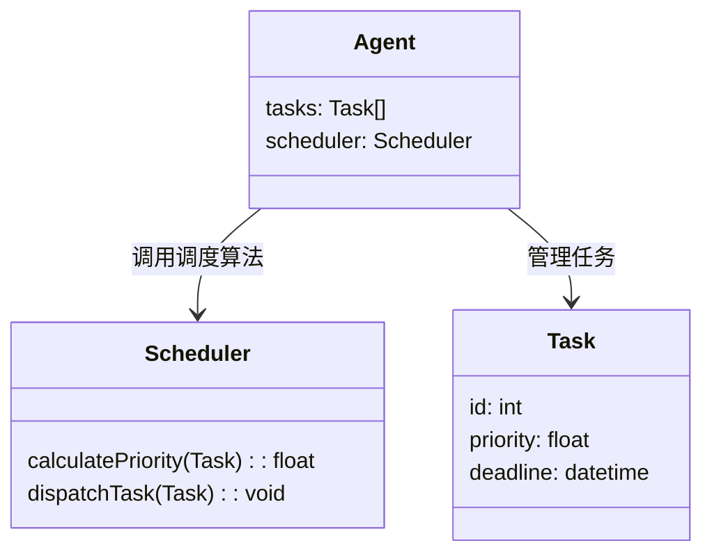

                 


# 实现AI Agent的动态任务优先级调度

## 关键词：AI Agent，动态任务优先级，调度算法，多目标优化，强化学习，系统架构

## 摘要：  
本文详细探讨了AI Agent在动态环境下的任务优先级调度问题，分析了其核心概念、算法原理、系统架构以及实际应用。通过结合多目标优化和强化学习等技术，提出了动态任务优先级调度的解决方案，并通过实际案例展示了其在智能助手、自动驾驶等场景中的应用效果。文章还探讨了系统设计的关键点，包括任务分解、优先级计算和反馈机制，并总结了实现动态任务优先级调度的最佳实践。

---

# 第1章: AI Agent与动态任务优先级调度概述

## 1.1 AI Agent的基本概念  
### 1.1.1 AI Agent的定义与特点  
AI Agent（人工智能代理）是指能够感知环境、自主决策并执行任务的智能实体。它具有以下特点：  
- **自主性**：能够在没有外部干预的情况下独立运行。  
- **反应性**：能够根据环境变化调整行为。  
- **目标导向性**：具有明确的目标，并通过行动实现目标。  
- **学习能力**：能够通过经验优化自身行为。  

### 1.1.2 AI Agent的核心功能与应用场景  
AI Agent的核心功能包括感知、推理、规划和执行。它广泛应用于智能助手、自动驾驶、机器人控制、推荐系统等领域。  

### 1.1.3 动态任务优先级调度的定义与意义  
动态任务优先级调度是指在动态变化的环境中，根据任务的重要性和紧迫性，实时调整任务执行顺序的过程。其意义在于提高任务处理效率，确保关键任务优先完成。  

## 1.2 动态任务优先级调度的背景与问题  
### 1.2.1 多任务处理的挑战  
在复杂的环境中，AI Agent需要同时处理多个任务，如何在有限的资源下合理分配任务优先级是关键挑战。  

### 1.2.2 动态环境下的优先级变化  
环境的变化（如任务紧急性、资源可用性）会直接影响任务优先级，动态调度需要实时适应这些变化。  

### 1.2.3 任务优先级调度的核心问题  
任务优先级调度的核心问题包括：  
1. 如何量化任务的重要性和紧迫性。  
2. 如何在动态环境中实时更新优先级。  
3. 如何平衡短期目标与长期目标。  

## 1.3 动态任务优先级调度的应用场景  
### 1.3.1 智能助手与个人任务管理  
AI Agent可以协助用户管理日常任务，根据优先级自动安排日程。  

### 1.3.2 自动驾驶中的任务优先级调度  
自动驾驶系统需要实时调度感知、决策和执行任务，确保行车安全。  

### 1.3.3 企业级任务调度系统  
在企业环境中，AI Agent可以根据任务优先级分配资源，优化生产效率。  

## 1.4 本章小结  
本章介绍了AI Agent的基本概念和动态任务优先级调度的重要性和应用场景，为后续内容奠定了基础。

---

# 第2章: 动态任务优先级调度的核心概念与原理

## 2.1 任务分解与优先级计算  
### 2.1.1 任务分解的基本原理  
任务分解是指将复杂任务拆解为多个子任务，每个子任务都有其独立的目标和优先级。  

### 2.1.2 优先级计算的关键指标  
优先级计算的关键指标包括：  
- **任务的重要性**：任务对整体目标的贡献程度。  
- **任务的紧急性**：任务的截止时间或紧迫性。  
- **资源需求**：任务执行所需的资源量。  

### 2.1.3 动态任务优先级的更新机制  
动态优先级的更新机制包括定期检查任务状态、环境变化和用户反馈，实时调整优先级。  

## 2.2 多目标优化与优先级调度  
### 2.2.1 多目标优化的基本概念  
多目标优化是指在多个目标之间寻找最优折中的过程，常用于任务优先级调度中的权衡问题。  

### 2.2.2 优先级调度中的目标权重分配  
任务优先级的计算需要根据目标权重进行加权求和，权重反映了目标的重要性。  

### 2.2.3 动态权重调整的实现方法  
动态权重调整可以根据环境变化或任务状态实时更新权重值，以适应新的优先级需求。  

## 2.3 基于反馈的优先级调整策略  
### 2.3.1 反馈机制的基本原理  
反馈机制是指通过任务执行结果调整优先级，确保重要任务优先完成。  

### 2.3.2 基于反馈的优先级调整算法  
反馈调整算法包括：  
1. 根据任务完成情况调整优先级。  
2. 根据用户反馈动态调整权重。  

### 2.3.3 反馈在动态调度中的应用  
反馈机制可以用于优化任务调度策略，提高系统整体效率。  

## 2.4 本章小结  
本章详细介绍了动态任务优先级调度的核心概念，包括任务分解、优先级计算和多目标优化，为后续算法设计奠定了基础。

---

# 第3章: 动态任务优先级调度的算法原理

## 3.1 多目标优化算法  
### 3.1.1 多目标优化的基本原理  
多目标优化通过同时优化多个目标，找到最优解的 Pareto 前沿。  

### 3.1.2 基于权重的优先级计算方法  
优先级计算公式：  
$$ P_i = \sum_{j=1}^{n} w_j \cdot f_j(i) $$  
其中，$w_j$ 是目标 $j$ 的权重，$f_j(i)$ 是任务 $i$ 在目标 $j$ 上的得分。  

### 3.1.3 多目标优化的实现步骤  
1. 确定任务目标和权重。  
2. 计算每个任务在各目标上的得分。  
3. 根据权重加和计算任务优先级。  

## 3.2 基于强化学习的动态调度算法  
### 3.2.1 强化学习的基本原理  
强化学习通过智能体与环境的交互，学习最优策略。  

### 3.2.2 动态调度算法的实现步骤  
1. 状态表示：任务优先级、资源状态、环境变化。  
2. 动作选择：选择优先级最高的任务执行。  
3. 奖励机制：根据任务完成情况给予奖励或惩罚。  

### 3.2.3 动态调度算法的数学模型  
优先级更新公式：  
$$ P_i^{new} = P_i + \alpha \cdot r_i $$  
其中，$\alpha$ 是学习率，$r_i$ 是奖励值。  

## 3.3 动态任务优先级调度算法的比较  
### 3.3.1 多目标优化与强化学习的对比  
| 技术 | 优点 | 缺点 |  
|------|------|------|  
| 多目标优化 | 全局最优 | 计算复杂 |  
| 强化学习 | 实时调整 | 收敛速度慢 |  

### 3.3.2 选择合适算法的策略  
根据任务特性和环境动态选择算法。  

## 3.4 本章小结  
本章详细介绍了动态任务优先级调度的算法原理，包括多目标优化和强化学习，并分析了其优缺点。

---

# 第4章: 动态任务优先级调度的系统分析与架构设计

## 4.1 系统分析  
### 4.1.1 问题场景介绍  
系统需要在动态环境中实时调整任务优先级，确保任务高效执行。  

### 4.1.2 项目介绍  
设计一个AI Agent系统，实现动态任务优先级调度功能。  

## 4.2 系统功能设计  
### 4.2.1 系统功能模块  
- 任务管理模块：任务创建、分解和状态监控。  
- 优先级计算模块：基于多目标优化计算优先级。  
- 调度控制模块：根据优先级分配资源。  

### 4.2.2 领域模型（Mermaid 类图）  


## 4.3 系统架构设计  
### 4.3.1 系统架构（Mermaid 架构图）  


### 4.3.2 系统接口设计  
- 感知层接口：获取环境信息。  
- 决策层接口：计算任务优先级。  
- 执行层接口：分配资源和执行任务。  

## 4.4 本章小结  
本章通过系统分析和架构设计，明确了动态任务优先级调度系统的实现框架。

---

# 第5章: 动态任务优先级调度的项目实战

## 5.1 环境安装与配置  
### 5.1.1 环境需求  
- Python 3.8+  
- 基础库：numpy, pandas, scikit-learn  
- 可选库：keras, tensorflow  

## 5.2 核心代码实现  
### 5.2.1 多目标优化算法实现  
```python
def multi_objective_optimization(tasks, weights):
    for task in tasks:
        priority = 0
        for i, (weight, score) in enumerate(zip(weights, task.scores)):
            priority += weight * score
        task.priority = priority
    return tasks
```

### 5.2.2 基于强化学习的动态调度算法实现  
```python
class DynamicScheduler:
    def __init__(self, alpha=0.1):
        self.alpha = alpha

    def update_priority(self, tasks, rewards):
        for task, reward in zip(tasks, rewards):
            task.priority += self.alpha * (reward - task.priority)
        return tasks
```

## 5.3 代码解读与分析  
### 5.3.1 多目标优化算法解读  
- 通过权重分配计算任务优先级，实现全局最优。  

### 5.3.2 强化学习算法解读  
- 根据任务执行结果调整优先级，实现动态优化。  

## 5.4 实际案例分析  
### 5.4.1 案例背景  
设计一个自动驾驶系统，需要实时调度感知、决策和执行任务。  

### 5.4.2 实施步骤  
1. 任务分解：将自动驾驶任务分解为感知、决策和执行。  
2. 优先级计算：根据任务紧急性和资源需求计算优先级。  
3. 动态调整：根据环境变化实时更新优先级。  

## 5.5 本章小结  
本章通过项目实战，展示了动态任务优先级调度算法的实际应用，并分析了其效果。

---

# 第6章: 动态任务优先级调度的最佳实践

## 6.1 经验总结  
### 6.1.1 算法选择建议  
根据任务特性和环境动态选择合适算法。  

### 6.1.2 系统设计注意事项  
- 确保系统的实时性和响应速度。  
- 合理分配资源，避免资源冲突。  

## 6.2 小结  
动态任务优先级调度是实现高效AI Agent的核心技术，通过多目标优化和强化学习可以有效解决调度问题。  

## 6.3 注意事项  
- 定期监控系统状态，及时调整优先级。  
- 避免过度优化，确保系统简洁高效。  

## 6.4 拓展阅读  
推荐阅读《强化学习入门》和《多目标优化算法》等书籍，深入理解相关技术。  

## 6.5 本章小结  
本章总结了实现动态任务优先级调度的最佳实践，并提供了未来研究方向。

---

# 作者：AI天才研究院/AI Genius Institute & 禅与计算机程序设计艺术 /Zen And The Art of Computer Programming

---

本文通过系统性的分析和实践，详细探讨了AI Agent的动态任务优先级调度问题，为实现高效智能系统提供了理论和实践指导。

