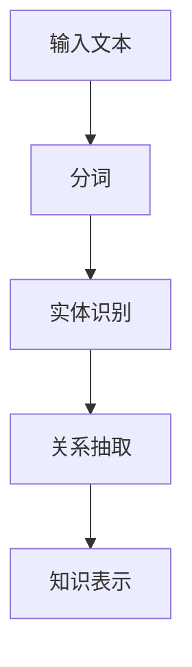
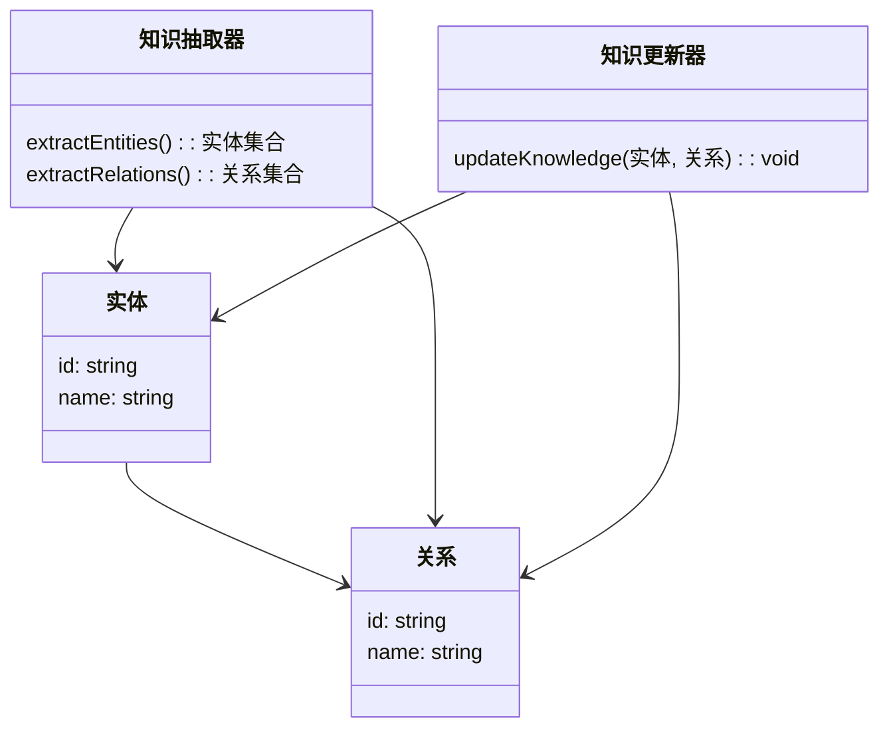
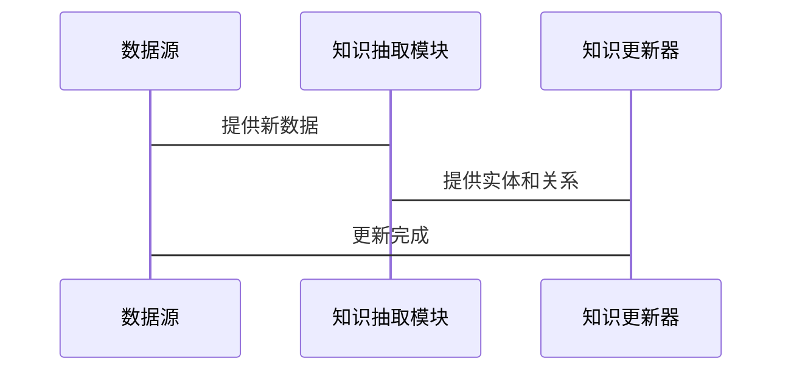

                 


# 实现AI Agent的动态知识图谱构建

## 关键词
AI Agent, 动态知识图谱, 知识抽取, 实时推理, 系统架构

## 摘要
随着人工智能技术的快速发展，AI Agent在各个领域的应用越来越广泛。动态知识图谱作为AI Agent的核心支撑，能够实时更新和推理知识，使其具备更强的适应性和智能性。本文将详细探讨动态知识图谱的构建原理、算法实现以及系统架构设计，为AI Agent的应用提供理论和技术支持。

---

## 第一部分: AI Agent与动态知识图谱构建的背景介绍

### 第1章: 问题背景与核心概念

#### 1.1 问题背景
- **AI Agent的定义与特点**
  - AI Agent是一种能够感知环境、自主决策并执行任务的智能实体。
  - 具有主动性、反应性、社会性、自主性和学习性等特点。

- **知识图谱的基本概念**
  - 知识图谱是一种以图结构表示知识的数据库，包含实体和关系。
  - 实体：现实世界中的具体事物，如“人”、“书”等。
  - 关系：实体之间的关联，如“写”、“出版”等。

- **动态知识图谱的必要性**
  - 知识图谱需要实时更新以反映最新信息。
  - 动态知识图谱能够适应不断变化的环境，提升AI Agent的智能水平。

#### 1.2 问题描述
- **AI Agent在知识图谱中的作用**
  - 通过感知环境，AI Agent能够从动态知识图谱中提取所需信息。
  - 利用推理能力，AI Agent能够基于知识图谱做出决策。

- **动态知识图谱的构建挑战**
  - 数据实时更新的难度。
  - 知识抽取的准确性问题。
  - 动态更新的效率问题。

- **当前技术的局限性与改进方向**
  - 当前知识图谱构建多为静态，难以适应动态变化。
  - 需要引入实时推理和动态更新机制，提升知识图谱的灵活性。

#### 1.3 问题解决与边界
- **动态知识图谱构建的目标**
  - 实现知识的实时更新和动态扩展。
  - 提供高效的查询和推理能力。

- **AI Agent在动态知识图谱中的边界**
  - 知识图谱的构建和更新由AI Agent驱动。
  - AI Agent的决策和推理依赖动态知识图谱。

- **相关技术的外延与限制**
  - 相关技术包括自然语言处理、图数据库、实时计算等。
  - 限制主要体现在计算资源和数据更新频率上。

### 第2章: 核心概念与联系

#### 2.1 动态知识图谱的原理
- **知识抽取与表示**
  - 知识抽取是动态知识图谱构建的基础，包括实体识别和关系抽取。
  - 知识表示采用图结构，便于后续推理和计算。

- **动态更新机制**
  - 基于规则的动态更新，适用于结构化数据。
  - 基于机器学习的动态更新，适用于非结构化数据。

- **实时推理能力**
  - 实时推理是动态知识图谱的核心，支持AI Agent做出快速决策。

#### 2.2 AI Agent的核心原理
- **感知与学习**
  - AI Agent通过感知环境获取信息，学习新知识。
  - 学习过程包括监督学习、无监督学习和强化学习。

- **决策与推理**
  - AI Agent基于知识图谱进行推理，生成决策。
  - 推理过程依赖图结构的遍历和关系的计算。

- **交互与反馈**
  - AI Agent与用户或环境交互，获取反馈。
  - 反馈用于优化知识图谱和决策策略。

#### 2.3 核心概念对比与ER图
- **动态知识图谱与静态知识图谱的对比**
  - 静态知识图谱：数据固定，不支持实时更新。
  - 动态知识图谱：支持实时更新，适应变化。

- **AI Agent与传统知识图谱构建的区别**
  - 传统方法：依赖人工构建，更新频率低。
  - AI Agent：自动化构建，实时更新。

```mermaid
er
    actor: AI Agent
    knowledge_base: 动态知识图谱
    action: 知识更新
    actor --> knowledge_base: 查询与更新
    knowledge_base --> action: 触发更新
```

---

## 第三部分: 动态知识图谱构建的算法原理

### 第3章: 知识抽取与表示算法

#### 3.1 知识抽取算法
- **基于规则的抽取**
  - 使用正则表达式或领域知识规则进行实体识别和关系抽取。
  - 适用于结构化数据，如表格和数据库。

- **基于深度学习的抽取**
  - 使用神经网络模型，如LSTM和BERT，进行实体识别和关系抽取。
  - 适用于非结构化文本，如新闻和网页内容。

- **实例分析**
  - 从文本中抽取实体和关系，构建知识图谱节点和边。



#### 3.2 知识表示方法
- **图表示法**
  - 使用图结构表示知识，节点为实体，边为关系。
  - 支持复杂的查询和推理。

- **向量表示法**
  - 使用向量表示实体和关系，便于计算和检索。
  - 常用Word2Vec和GraphSAGE等模型。

- **知识图谱构建的数学模型**
  - 实体表示为向量，关系表示为边权重。
  - 知识图谱构建的数学模型可以表示为：
    $$ \text{实体关系} = \{ (e_1, r, e_2) \mid e_1, e_2 \in \text{实体}, r \in \text{关系} \} $$

---

## 第四部分: 系统分析与架构设计

### 第4章: 系统功能设计

#### 4.1 问题场景介绍
- **动态知识图谱构建系统**
  - 系统目标：实时更新知识图谱，支持AI Agent的决策和推理。
  - 使用场景：应用于智能客服、智能推荐、智能监控等领域。

#### 4.2 系统架构设计
- **领域模型类图**
  - 包含实体类、关系类、知识抽取器、知识更新器等。
  - 类图展示系统各模块之间的关系。



- **系统架构图**
  - 包含数据源、知识抽取模块、知识图谱存储、推理引擎和AI Agent。
  - 架构图展示系统的整体结构。


#### 4.3 系统接口设计
- **API接口**
  - 提供知识抽取、知识更新、知识查询等接口。
  - 接口设计基于RESTful API，便于集成和调用。

#### 4.4 系统交互流程
- **知识更新流程**
  - 数据源提供新数据。
  - 知识抽取模块抽取实体和关系。
  - 知识更新器更新知识图谱。
  - 推理引擎实时推理新知识。



---

## 第五部分: 项目实战

### 第5章: 环境安装与核心实现

#### 5.1 环境安装
- **安装Python和相关库**
  - 安装Python 3.8及以上版本。
  - 安装库：networkx、numpy、spacy、transformers。

#### 5.2 核心功能实现
- **知识抽取模块**
  ```python
  import spacy

  nlp = spacy.load("en_core_web_sm")

  def extract_entities(text):
      doc = nlp(text)
      entities = [(ent.text, ent.label_) for ent in doc.ents]
      return entities
  ```

- **知识更新模块**
  ```python
  import networkx as nx

  def update_knowledge_graph(graph, entities, relations):
      for e in entities:
          graph.add_node(e)
      for r in relations:
          graph.add_edge(r[0], r[1], label=r[2])
      return graph
  ```

- **实时推理模块**
  ```python
  from transformers import AutoModelForQuestionAnswering, AutoTokenizer

  model = AutoModelForQuestionAnswering.from_pretrained("bert-large-uncased-whole-word-masking-finetuned-squad")
  tokenizer = AutoTokenizer.from_pretrained("bert-large-uncased-whole-word-masking-finetuned-squad")

  def answer_question(question, context):
      inputs = tokenizer.encode_plus(question, context, return_tensors="pt")
      outputs = model(**inputs)
      start = outputs.start_logits.argmax()
      end = outputs.end_logits.argmax()
      answer = tokenizer.decode(inputs.input_ids[0][start:end+1])
      return answer
  ```

#### 5.3 代码应用解读
- **知识抽取模块**
  - 使用spaCy进行实体识别和关系抽取。
  - 返回实体和关系的列表。

- **知识更新模块**
  - 使用NetworkX构建图结构。
  - 添加节点和边，更新知识图谱。

- **实时推理模块**
  - 使用BERT进行问答推理。
  - 基于知识图谱提供实时答案。

#### 5.4 案例分析与总结
- **案例分析**
  - 应用场景：智能客服。
  - 知识图谱包含产品信息和常见问题。
  - AI Agent能够实时更新知识图谱，回答用户问题。

- **总结**
  - 通过动态知识图谱构建，AI Agent能够实时更新知识，提供更智能的服务。
  - 系统架构设计合理，功能实现完善，具备良好的扩展性和实用性。

---

## 第六部分: 总结与展望

### 第6章: 总结
- **核心内容回顾**
  - 动态知识图谱构建的核心算法和系统架构。
  - AI Agent在动态知识图谱中的应用和实现。

- **实践意义**
  - 动态知识图谱构建为AI Agent提供了强大的知识支持。
  - 提高了AI Agent的智能性和适应性。

### 第7章: 展望
- **未来研究方向**
  - 提升动态知识图谱的实时更新效率。
  - 引入更先进的机器学习算法，提高知识推理的准确性。
  - 探索动态知识图谱在更多领域的应用，如自动驾驶、智能医疗等。

- **注意事项**
  - 确保数据安全和隐私保护。
  - 优化系统架构，提升性能。

- **拓展阅读**
  - 推荐阅读相关领域的最新论文和书籍。
  - 关注动态知识图谱和AI Agent的最新研究进展。

---

## 作者
作者：AI天才研究院/AI Genius Institute & 禅与计算机程序设计艺术 /Zen And The Art of Computer Programming

---

通过以上步骤，我们详细探讨了动态知识图谱的构建原理、算法实现以及系统架构设计，为实现AI Agent的动态知识图谱构建提供了全面的技术支持。

