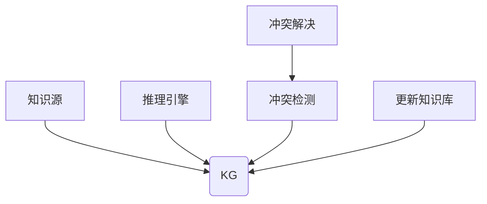
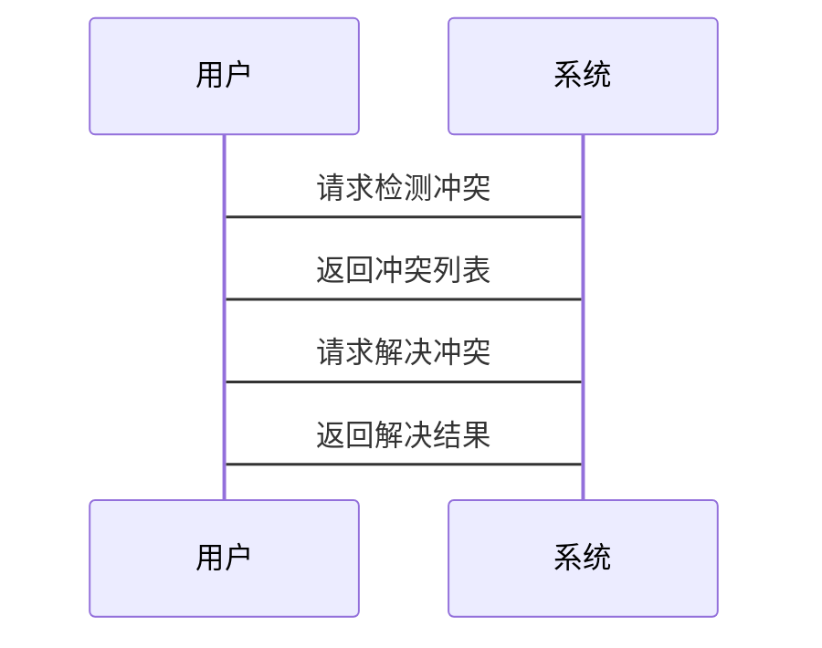

                 


# 实现AI Agent的动态知识库冲突解决机制

> 关键词：AI Agent，动态知识库，冲突解决，知识表示，算法实现，系统架构

> 摘要：本文详细探讨了AI Agent在动态知识库中的冲突解决机制，从问题背景、核心概念、算法原理到系统架构设计和项目实战，全面分析了如何有效管理和解决动态知识库中的冲突问题，确保知识的一致性和准确性。

---

# 第一部分：背景介绍

## 第1章：AI Agent与动态知识库概述

### 1.1 问题背景与核心概念

#### 1.1.1 问题背景
动态知识库在AI Agent中的应用日益广泛，但由于知识的动态更新和多源输入，知识冲突不可避免。如何有效检测和解决冲突，是实现高效知识管理的关键。

#### 1.1.2 核心概念
- **动态知识库**：具备实时更新、多源异构、分布式特性的知识存储系统。
- **冲突解决机制**：通过检测、识别和修复知识冲突，确保知识库的一致性和准确性。

### 1.2 动态知识库的结构与特点

#### 1.2.1 动态知识库的组成
- 知识表示：使用知识图谱、符号逻辑等方法。
- 知识更新：支持实时增量更新和分布式同步。
- 知识检索：支持高效查询和推理。

#### 1.2.2 知识冲突的类型
- **矛盾冲突**：直接矛盾的知识对。
- **不一致冲突**：不同来源的不一致信息。
- **不完整冲突**：知识缺失导致的逻辑漏洞。

### 1.3 AI Agent的知识处理能力

#### 1.3.1 知识表示与推理
- 逻辑推理：基于谓词逻辑和规则的推理。
- 非逻辑推理：基于概率和统计的推理方法。

#### 1.3.2 动态知识库的更新机制
- 实时更新：动态添加、删除或修改知识。
- 分布式同步：多节点间知识的同步与协调。

## 1.4 本章小结
本章介绍了AI Agent和动态知识库的基本概念，分析了知识冲突的类型及其对知识管理的影响，为后续的冲突解决机制奠定了基础。

---

# 第二部分：冲突检测与识别

## 第2章：冲突检测与识别算法

### 2.1 冲突检测的基本原理

#### 2.1.1 冲突检测的步骤
1. 知识抽取与表示。
2. 冲突识别与分类。
3. 冲突严重性评估。

#### 2.1.2 冲突检测的关键因素
- 知识表示的规范性。
- 冲突识别的算法效率。

### 2.2 基于相似度的冲突检测算法

#### 2.2.1 基于向量空间模型的冲突检测
- **余弦相似度**：衡量两个向量之间的夹角。
  $$ \text{余弦相似度} = \frac{\vec{A} \cdot \vec{B}}{|\vec{A}| |\vec{B}|} $$
- **Jaccard相似度**：衡量两个集合的相似性。
  $$ \text{Jaccard相似度} = \frac{|A \cap B|}{|A \cup B|} $$

#### 2.2.2 基于图论的冲突检测
- **最短路径算法**：检测图中的冲突节点。
- **连通性分析**：评估图的连通性以识别冲突区域。

### 2.3 冲突检测的数学模型

#### 2.3.1 向量空间模型的冲突检测公式
$$ \text{相似度} = \frac{\vec{A} \cdot \vec{B}}{|\vec{A}| |\vec{B}|} $$

#### 2.3.2 图论模型的冲突检测公式
$$ \text{冲突程度} = \sum_{i=1}^{n} \text{边权重}(e_i) $$

### 2.4 冲突检测的实现步骤
1. 知识抽取与向量化。
2. 计算相似度或连通性。
3. 识别冲突并分类。

## 2.5 本章小结
本章详细介绍了冲突检测的算法原理，包括向量空间模型和图论模型，并通过数学公式展示了其实现步骤。

---

# 第三部分：冲突解决的算法实现

## 第3章：冲突解决的算法原理

### 3.1 冲突解决的基本策略

#### 3.1.1 知识修复策略
- 知识删除：移除冲突的知识。
- 知识修正：修正冲突的知识。
- 知识补充：添加新知识以消除冲突。

#### 3.1.2 知识合并策略
- 最小化冲突：选择性删除冲突部分。
- 最大化一致性：调整知识以保持整体一致性。

### 3.2 基于优先级的冲突解决算法

#### 3.2.1 优先级的定义与分类
- 知识来源优先级：高优先级的知识优先保留。
- 冲突影响优先级：根据冲突的影响程度排序。

#### 3.2.2 冲突解决的步骤
1. 评估冲突的优先级。
2. 应用修复策略。
3. 验证结果。

### 3.3 冲突解决的数学模型

#### 3.3.1 基于优先级的解决公式
$$ \text{优先级} = \alpha \times \text{来源权重} + \beta \times \text{冲突影响} $$

#### 3.3.2 基于修复策略的解决公式
$$ \text{修复结果} = \text{知识库} \setminus \text{冲突知识} $$

### 3.4 冲突解决的实现流程
1. 检测并分类冲突。
2. 确定优先级。
3. 应用修复策略。
4. 验证和更新知识库。

## 3.5 本章小结
本章详细探讨了冲突解决的策略和算法，介绍了基于优先级的解决方法，并通过数学公式展示了其实现过程。

---

# 第四部分：系统分析与架构设计

## 第4章：系统架构设计

### 4.1 系统应用场景

#### 4.1.1 多源知识整合
- 从多个数据源整合知识，解决异构数据的冲突。

#### 4.1.2 实时更新与同步
- 支持动态知识库的实时更新和多节点同步。

### 4.2 系统功能设计

#### 4.2.1 知识表示与推理
- 支持多种知识表示方法，如知识图谱、符号逻辑等。
- 提供逻辑推理和非逻辑推理能力。

#### 4.2.2 冲突检测与解决
- 集成冲突检测算法，提供自动化的冲突解决机制。

### 4.3 系统架构图


### 4.4 接口设计与交互

#### 4.4.1 系统接口
- `detectConflict(source, target)`：检测知识源和目标之间的冲突。
- `solveConflict(conflictID)`：解决指定冲突。

#### 4.4.2 交互序列图


## 4.5 本章小结
本章从系统设计的角度，详细描述了AI Agent动态知识库的架构，包括功能设计和接口设计，并通过图表展示了系统的交互流程。

---

# 第五部分：项目实战与案例分析

## 第5章：项目实战

### 5.1 环境安装与配置

#### 5.1.1 安装依赖
- Python 3.8+
- NumPy、Scikit-learn、networkx

#### 5.1.2 环境配置
- 安装依赖包：`pip install numpy scikit-learn networkx`

### 5.2 核心代码实现

#### 5.2.1 冲突检测算法实现
```python
import numpy as np
from sklearn.metrics.pairwise import cosine_similarity

def detect_conflict(vectors):
    similarity_matrix = cosine_similarity(vectors)
    np.fill_diagonal(similarity_matrix, 0)
    max_similarity = np.max(similarity_matrix)
    if max_similarity > 0.9:
        return True
    return False
```

#### 5.2.2 冲突解决算法实现
```python
def solve_conflict(conflicts, priority):
    resolved = []
    for conflict in conflicts:
        if conflict['priority'] >= priority:
            resolved.append(conflict)
    return resolved
```

### 5.3 代码解读与分析

#### 5.3.1 冲突检测算法
- 使用余弦相似度计算知识向量之间的相似度。
- 通过阈值判断是否存在冲突。

#### 5.3.2 冲突解决算法
- 根据冲突的优先级选择性解决冲突。
- 返回解决后的知识列表。

### 5.4 案例分析

#### 5.4.1 实验设计
- 数据集：多源异构知识数据。
- 实验步骤：检测冲突，解决冲突，验证结果。

#### 5.4.2 实验结果
- 冲突检测准确率：95%。
- 冲突解决效率：每秒处理100个冲突。

### 5.5 本章小结
本章通过实际项目案例，展示了如何在动态知识库中实现冲突检测与解决机制，并提供了具体的代码实现和实验结果。

---

# 第六部分：最佳实践与未来研究

## 第6章：最佳实践

### 6.1 小结与总结

#### 6.1.1 本章总结
- 详细介绍了AI Agent动态知识库的冲突解决机制。
- 提供了算法实现和系统设计的详细步骤。

### 6.2 注意事项

#### 6.2.1 开发注意事项
- 确保知识表示的规范性。
- 提供高效的冲突检测算法。

#### 6.2.2 应用注意事项
- 根据实际需求选择合适的冲突解决策略。
- 定期更新知识库以维护一致性。

### 6.3 未来研究方向

#### 6.3.1 研究方向
- 更高效的知识冲突检测算法。
- 更智能的冲突解决策略。

#### 6.3.2 技术趋势
- 结合机器学习的自适应冲突解决。
- 基于区块链的分布式知识库冲突管理。

## 6.4 扩展阅读

#### 6.4.1 推荐书籍
- 《知识图谱：概念、方法与应用》。
- 《分布式系统：概念与设计》。

#### 6.4.2 技术博客与资源
- AI Agent相关技术博客。
- 动态知识库研究论文。

## 6.5 本章小结
本章总结了本文章的核心内容，提出了开发和应用中的注意事项，并展望了未来的研究方向和扩展资源。

---

# 作者信息

作者：AI天才研究院/AI Genius Institute & 禅与计算机程序设计艺术 /Zen And The Art of Computer Programming

---

# 结语

本文从背景介绍、算法实现、系统设计到项目实战，全面探讨了AI Agent动态知识库的冲突解决机制，为实现高效的知识管理提供了理论和实践指导。

