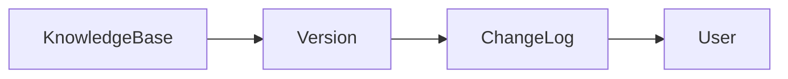

                 


# 实现AI Agent的动态知识库版本控制与回滚

> 关键词：AI Agent，动态知识库，版本控制，回滚机制，知识库管理，系统架构，算法原理

> 摘要：本文详细探讨了AI Agent动态知识库版本控制与回滚的实现方法，从核心概念、算法原理、系统架构到项目实战，全面分析了如何确保知识库的可靠性和可恢复性。通过结合具体案例和代码示例，本文为AI Agent的开发人员提供了实用的指导和解决方案。

---

## 第一部分：AI Agent与动态知识库版本控制概述

### 第1章：AI Agent与动态知识库概述

#### 1.1 AI Agent的基本概念
- **1.1.1 AI Agent的定义与特点**
  - AI Agent的定义：智能代理，能够感知环境并采取行动以实现目标。
  - 特点：自主性、反应性、主动性、社会性。

- **1.1.2 动态知识库在AI Agent中的作用**
  - 知识库作为AI Agent的核心，存储必要信息以支持决策和行动。
  - 动态知识库的特点：实时更新、高度依赖性、可扩展性。

- **1.1.3 动态知识库的背景与应用领域**
  - 背景：随着AI Agent的应用场景扩展，知识库的动态更新需求增加。
  - 应用领域：自动驾驶、智能客服、推荐系统等。

#### 1.2 动态知识库版本控制的背景
- **1.2.1 知识库动态更新的必要性**
  - 数据实时性要求：AI Agent需要处理最新信息。
  - 知识库的复杂性：数据量大，结构复杂，容易出错。

- **1.2.2 版本控制在知识库管理中的重要性**
  - 确保数据的可追溯性和一致性。
  - 便于问题排查和恢复。

- **1.2.3 回滚机制的核心价值**
  - 在错误更新时快速恢复到稳定状态。
  - 支持实验性更新，降低风险。

---

### 第2章：动态知识库版本控制的核心概念

#### 2.1 动态知识库版本控制的定义与属性
- **2.1.1 动态知识库版本控制的定义**
  - 对知识库的变更进行记录和管理，确保版本可追溯和可恢复。

- **2.1.2 核心属性对比分析**
  | 属性       | 特性描述                             |
  |------------|--------------------------------------|
  | 版本号     | 唯一标识符，确保每个版本的唯一性       |
  | 变更日志   | 记录每个版本的修改内容                 |
  | 依赖关系   | 描述版本之间的依赖关系               |
  | 回滚策略   | 定义如何从当前版本回滚到指定版本         |

- **2.1.3 动态知识库版本控制的边界与外延**
  - 边界：仅管理知识库的数据变更，不涉及其他系统组件。
  - 外延：与其他系统如日志系统、监控系统集成。

#### 2.2 动态知识库版本控制的实体关系分析
- **2.2.1 实体关系图（ER图）**



---

## 第二部分：动态知识库版本控制的算法原理

### 第3章：动态知识库版本控制的算法原理

#### 3.1 版本控制算法概述
- **3.1.1 版本号生成算法**
  - 简单递增：`version_number = current_version + 1`
  - 哈希函数：使用SHA-256生成唯一版本号。

- **3.1.2 数据变更日志记录算法**
  - 记录每个版本的变更内容，便于回滚。
  - 使用结构化数据存储，如JSON。

- **3.1.3 回滚算法**
  - 基于版本号和变更日志，恢复到指定版本。

#### 3.2 算法实现代码示例

```python
def generate_version_number(current_version):
    return current_version + 1

def record_change_log(change, version_number):
    return f"Version {version_number}: {change}"

def rollback(version_number, change_log):
    return change_log[:version_number]
```

#### 3.3 数学模型与公式
- **版本号生成公式：**
  $$ \text{version\_number} = \text{current\_version} + 1 $$

---

## 第三部分：动态知识库版本控制的系统架构设计

### 第4章：动态知识库版本控制的系统架构

#### 4.1 系统功能设计
- **知识库管理模块：**
  - 负责知识库的存储和访问。
  - 支持版本控制和回滚操作。

- **版本控制模块：**
  - 记录每个版本的信息。
  - 生成和管理版本号。

- **回滚机制模块：**
  - 根据版本号恢复知识库状态。
  - 支持部分回滚和全盘回滚。

#### 4.2 系统架构设计


#### 4.3 系统接口设计
- **版本控制接口：**
  - `create_version()`：创建新版本。
  - `get_version()`：获取指定版本信息。
  - `rollback_to_version()`：回滚到指定版本。

---

## 第四部分：动态知识库版本控制的项目实战

### 第5章：项目实战与案例分析

#### 5.1 环境安装与配置
- 安装Python和相关库。
- 配置版本控制工具，如Git。

#### 5.2 核心代码实现
- 知识库管理类：

```python
class KnowledgeBase:
    def __init__(self):
        self.current_version = 0
        self.changelog = []

    def update(self, data):
        self.current_version = generate_version_number(self.current_version)
        self.changelog.append(record_change_log(data, self.current_version))
```

#### 5.3 代码功能解读
- `update()`方法：在每次更新知识库时，生成新的版本号并记录变更日志。

#### 5.4 案例分析
- 实际案例：智能客服系统中知识库更新出现错误，通过回滚机制恢复到之前版本。

---

## 第五部分：最佳实践与总结

### 第6章：最佳实践与总结

#### 6.1 小结
- 动态知识库版本控制是AI Agent可靠运行的关键。
- 通过合理设计版本号和变更日志，确保系统的稳定性和可恢复性。

#### 6.2 注意事项
- 定期备份知识库，防止数据丢失。
- 严格控制版本回滚权限，避免误操作。

#### 6.3 拓展阅读
- 推荐阅读《软件工程》中的版本控制相关内容。
- 关注最新的分布式版本控制技术，如Git和Docker。

---

## 作者：AI天才研究院/AI Genius Institute & 禅与计算机程序设计艺术 /Zen And The Art of Computer Programming

