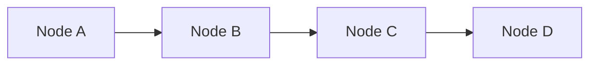
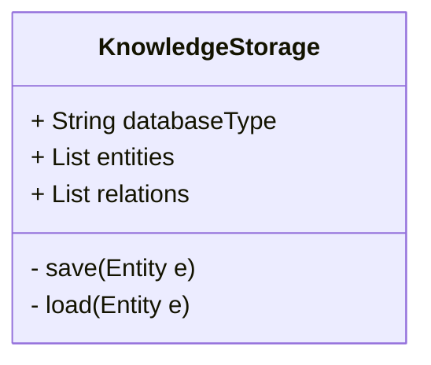
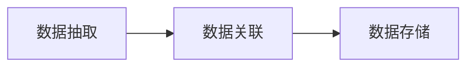
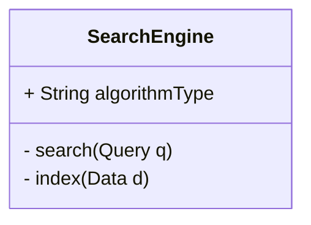
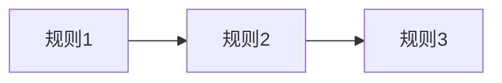
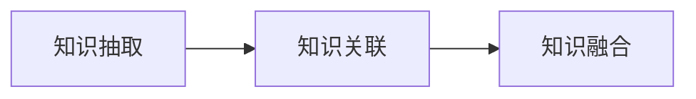
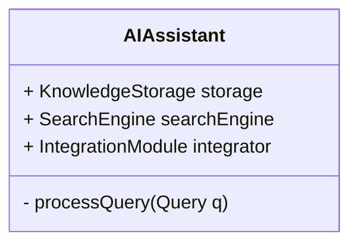
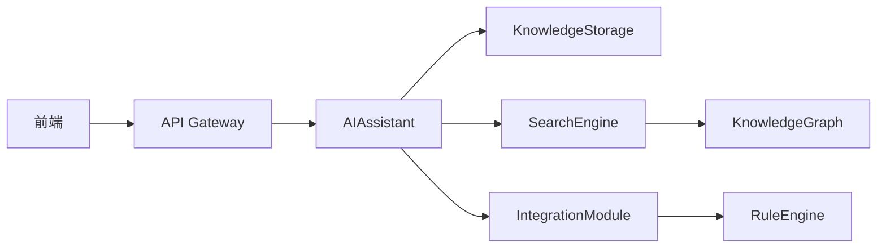

                 


# 实现AI Agent的动态知识检索与整合

> 关键词：AI Agent，动态知识检索，知识图谱，自然语言处理，信息检索，知识整合

> 摘要：本文详细探讨了实现AI Agent的动态知识检索与整合的关键技术与方法。首先介绍了AI Agent的基本概念和动态知识检索的必要性，然后分析了相关技术基础。接着深入讲解了动态知识检索和整合的核心算法，包括基于向量的检索算法和基于图的检索算法。随后，详细设计了系统的架构，包括知识存储、检索引擎和整合模块等部分。最后，通过具体的项目实战案例，展示了如何在实际场景中应用这些技术，并总结了实现过程中需要注意的问题和最佳实践。

---

## 第一部分: AI Agent与动态知识检索基础

### 第1章: AI Agent概述

#### 1.1 AI Agent的基本概念

##### 1.1.1 什么是AI Agent
AI Agent（人工智能代理）是指能够感知环境、自主决策并执行任务的智能实体。AI Agent可以是软件程序、机器人或其他智能系统，其核心目标是通过与环境交互来实现特定任务。

##### 1.1.2 AI Agent的核心特征
- **自主性**：能够自主决策和行动，无需外部干预。
- **反应性**：能够实时感知环境并做出反应。
- **目标导向**：具有明确的目标，所有行动均围绕目标展开。
- **学习能力**：能够通过经验改进自身的知识和能力。

##### 1.1.3 AI Agent的应用场景
- **智能助手**：如Siri、Alexa等，帮助用户完成日常任务。
- **智能推荐系统**：根据用户行为推荐个性化内容。
- **自动驾驶**：通过感知环境做出驾驶决策。
- **智能客服**：通过自然语言处理与用户交互，解决问题。

---

#### 1.2 动态知识检索的必要性

##### 1.2.1 知识检索的动态性
动态知识检索是指在实时环境中，根据需求快速检索和更新知识的过程。与静态知识检索不同，动态知识检索需要适应环境的变化，确保知识的准确性和及时性。

##### 1.2.2 动态知识检索的挑战
- **数据量大**：实时环境中数据量庞大，检索效率要求高。
- **数据更新快**：知识库需要实时更新，检索系统必须支持动态数据。
- **语义理解**：动态知识检索不仅仅是关键词匹配，还需要理解语义和上下文。

##### 1.2.3 动态知识检索的意义
动态知识检索是实现AI Agent智能化的核心能力之一。它能够使AI Agent在复杂多变的环境中快速获取所需知识，提高决策的准确性和效率。

---

#### 1.3 相关技术基础

##### 1.3.1 自然语言处理
自然语言处理（NLP）是研究如何让计算机理解和生成人类语言的技术。动态知识检索中，NLP主要用于文本的理解和生成。

##### 1.3.2 知识图谱
知识图谱是一种以图结构表示知识的技术，节点表示实体，边表示实体之间的关系。动态知识检索中，知识图谱提供了丰富的语义信息。

##### 1.3.3 信息检索技术
信息检索技术用于从大规模数据中快速找到相关的信息。动态知识检索中，信息检索技术是核心工具之一。

---

### 第2章: 动态知识检索的核心概念

#### 2.1 动态知识检索的定义与特点

##### 2.1.1 动态知识检索的定义
动态知识检索是指在实时环境中，根据需求快速检索和更新知识的过程。

##### 2.1.2 动态知识检索的核心特点
- **实时性**：能够实时获取最新的知识。
- **适应性**：能够根据环境变化调整检索策略。
- **准确性**：确保检索结果的准确性。

##### 2.1.3 动态知识检索与静态知识检索的对比
| 特性        | 动态知识检索       | 静态知识检索       |
|-------------|------------------|------------------|
| 数据来源     | 动态变化          | 静态或少量变化    |
| 检索频率     | 高频             | 低频             |
| 检索结果     | 需要动态更新       | 结果固定          |

---

#### 2.2 AI Agent的知识表示

##### 2.2.1 知识表示的多样性
知识表示可以是文本、结构化数据或图结构等多种形式。不同的表示形式适用于不同的场景。

##### 2.2.2 知识图谱的构建
知识图谱是一种图结构，由节点和边组成。节点表示实体，边表示实体之间的关系。知识图谱构建需要对数据进行清洗、抽取和关联。

##### 2.2.3 知识表示的动态更新
动态知识检索需要实时更新知识图谱，以反映最新的信息。更新机制包括增量式更新和全量式更新。

---

#### 2.3 知识表示的核心概念

##### 2.3.1 实体与属性
- **实体**：表示现实世界中的具体事物，如“人”、“书籍”等。
- **属性**：描述实体的特征，如“人的年龄”、“书籍的作者”等。

##### 2.3.2 实体关系
- **实体关系**：描述实体之间的关联，如“人是作者”、“书属于类别”等。

##### 2.3.3 ER图
ER图（实体关系图）用于描述数据库的结构。以下是知识表示的ER图示例：

```mermaid
er
actor
    name: String
    age: Integer
book
    title: String
    publish_date: Date
many-to-many relation
actor -- own -- book
```

---

### 第3章: 动态知识检索的算法原理

#### 3.1 基于向量的检索算法

##### 3.1.1 向量空间模型
向量空间模型将文本表示为向量，通过计算向量的相似度来衡量文本的相关性。

##### 3.1.2 余弦相似度计算
余弦相似度是衡量两个向量相似度的指标，公式如下：

$$ \cos\theta = \frac{\vec{A} \cdot \vec{B}}{|\vec{A}| |\vec{B}|} $$

##### 3.1.3 使用Faiss库实现向量检索
以下是使用Faiss库实现向量检索的示例代码：

```python
import numpy as np
import faiss

# 创建向量索引
index = faiss.IndexFlatL2(50)  # 50维向量

# 添加向量
vectors = np.random.rand(1000, 50).astype('float32')
index.add(vectors)

# 查询向量
query_vector = np.random.rand(1, 50).astype('float32')
D, I = index.search(query_vector, 10)  # 返回最相似的10个向量
```

---

#### 3.2 基于图的检索算法

##### 3.2.1 图嵌入技术
图嵌入技术将图中的节点表示为低维向量，以便于计算相似度。

##### 3.2.2 图遍历算法
图遍历算法用于在图中进行深度优先搜索或广度优先搜索，以找到相关节点。

##### 3.2.3 基于图的相似度计算
以下是基于图的相似度计算示例：



---

### 第4章: 动态知识整合的算法原理

#### 4.1 知识整合的定义与挑战

##### 4.1.1 知识整合的定义
知识整合是将多个来源的知识进行融合，形成一致的知识表示。

##### 4.1.2 知识整合的挑战
- **冲突处理**：如何处理不同来源的知识冲突。
- **一致性维护**：如何保持知识的一致性。
- **动态更新**：如何处理知识的动态变化。

---

#### 4.2 基于规则的知识整合

##### 4.2.1 规则的定义与应用
规则用于描述知识整合的条件和操作，例如“如果A属于类别B，则将A与类别B关联”。

##### 4.2.2 基于规则的冲突解决
通过规则可以自动解决知识冲突，例如通过优先级规则选择最可靠的知识源。

##### 4.2.3 规则的动态更新
规则可以根据环境变化进行动态更新，以适应新的知识。

---

#### 4.3 基于学习的知识整合

##### 4.3.1 知识图谱嵌入
知识图谱嵌入是将知识图谱中的节点表示为低维向量，以便于计算相似度。

##### 4.3.2 知识整合的深度学习方法
深度学习方法可以自动学习知识的表示和关联，例如使用图神经网络进行知识推理。

##### 4.3.3 基于图神经网络的知识整合
以下是基于图神经网络的知识整合示例：


---

## 第五章: 系统架构与设计

### 5.1 系统架构概述

#### 5.1.1 系统整体架构
系统整体架构包括知识存储模块、检索引擎模块和整合模块。

#### 5.1.2 系统功能模块划分
- **知识存储模块**：负责存储和管理知识。
- **检索引擎模块**：负责根据查询条件检索知识。
- **整合模块**：负责整合多个来源的知识。

#### 5.1.3 系统架构的优缺点
- **优点**：模块化设计，易于扩展和维护。
- **缺点**：需要协调各个模块的交互，增加系统复杂性。

---

### 5.2 功能模块设计

#### 5.2.1 知识存储模块

##### 5.2.1.1 数据库设计
知识存储模块可以使用关系型数据库或NoSQL数据库存储知识。以下是知识存储模块的类图：



##### 5.2.1.2 知识图谱的构建
知识图谱的构建包括数据抽取、关联和存储。以下是知识图谱的构建流程图：



---

#### 5.2.2 检索引擎模块

##### 5.2.2.1 检索算法实现
检索引擎模块可以使用多种检索算法，如基于向量的检索和基于图的检索。以下是检索引擎模块的类图：



##### 5.2.2.2 检索性能优化
检索性能优化可以通过索引优化、并行计算和缓存技术实现。

---

#### 5.2.3 整合模块

##### 5.2.3.1 知识整合规则
知识整合规则可以是基于规则的或基于学习的。以下是知识整合的规则示例：



##### 5.2.3.2 知识整合流程
知识整合流程包括知识抽取、关联和融合。以下是知识整合的流程图：



---

### 5.3 系统架构设计

#### 5.3.1 问题场景介绍
假设我们正在开发一个智能客服系统，需要实时检索和整合客户信息、产品信息和知识库信息。

#### 5.3.2 系统功能设计
以下是系统的功能模块类图：



#### 5.3.3 系统架构设计
以下是系统的整体架构图：



---

## 第六章: 项目实战

### 6.1 环境安装

#### 6.1.1 安装Python环境
使用Anaconda或virtualenv安装Python环境。

#### 6.1.2 安装依赖库
安装所需的依赖库，如Faiss、numpy、pandas等。

```bash
pip install faiss-cpu numpy pandas
```

---

### 6.2 系统核心实现源代码

#### 6.2.1 知识存储模块实现
以下是知识存储模块的实现代码：

```python
class KnowledgeStorage:
    def __init__(self):
        self.entities = {}
        self.relations = {}

    def save_entity(self, entity_id, entity):
        self.entities[entity_id] = entity

    def save_relation(self, relation_id, relation):
        self.relations[relation_id] = relation
```

#### 6.2.2 检索引擎模块实现
以下是检索引擎模块的实现代码：

```python
class SearchEngine:
    def __init__(self, storage):
        self.storage = storage
        self.index = None

    def build_index(self):
        # 实现索引构建
        pass

    def search(self, query, top_k=10):
        # 实现检索逻辑
        pass
```

---

#### 6.2.3 整合模块实现
以下是整合模块的实现代码：

```python
class IntegrationModule:
    def __init__(self, storage):
        self.storage = storage
        self.rules = []

    def add_rule(self, rule):
        self.rules.append(rule)

    def integrate(self, query):
        # 实现整合逻辑
        pass
```

---

### 6.3 代码应用解读与分析

#### 6.3.1 知识存储模块解读
知识存储模块负责存储实体和关系。存储可以基于数据库或文件系统。

#### 6.3.2 检索引擎模块解读
检索引擎模块负责根据查询条件检索知识。检索算法可以是基于向量的检索或基于图的检索。

#### 6.3.3 整合模块解读
整合模块负责整合多个来源的知识。整合规则可以是基于规则的或基于学习的。

---

### 6.4 实际案例分析

#### 6.4.1 案例背景
假设我们正在开发一个医疗领域的智能客服系统，需要实时检索和整合患者的病历信息和医生的建议。

#### 6.4.2 案例实现
以下是案例实现的代码：

```python
# 知识存储模块
storage = KnowledgeStorage()
storage.save_entity("patient1", {"name": "张三", "age": 30})
storage.save_relation("relation1", {"patient": "patient1", "doctor": "doctor1"})

# 检索引擎模块
engine = SearchEngine(storage)
engine.build_index()
results = engine.search("张三的医生是谁")

# 整合模块
integrator = IntegrationModule(storage)
integrator.add_rule(lambda x: x["name"] == "张三")
integrator.integrate("张三的医生是谁")
```

#### 6.4.3 案例分析
通过上述代码，我们可以实现医疗领域的智能客服系统，实时检索和整合患者的病历信息和医生的建议。

---

## 第七章: 总结与展望

### 7.1 小结

本文详细探讨了实现AI Agent的动态知识检索与整合的关键技术与方法。通过分析动态知识检索的核心概念和算法原理，设计了系统的架构，并通过具体案例展示了实现过程。

---

### 7.2 注意事项

- 知识检索和整合需要考虑数据的实时性和准确性。
- 系统设计需要考虑模块的可扩展性和可维护性。
- 代码实现需要考虑性能优化和错误处理。

---

### 7.3 拓展阅读

- 《图神经网络入门》
- 《自然语言处理实战》
- 《知识图谱构建与应用》

---

作者：AI天才研究院/AI Genius Institute & 禅与计算机程序设计艺术 /Zen And The Art of Computer Programming

