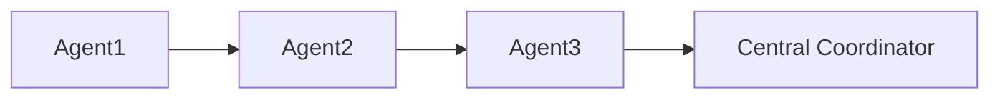
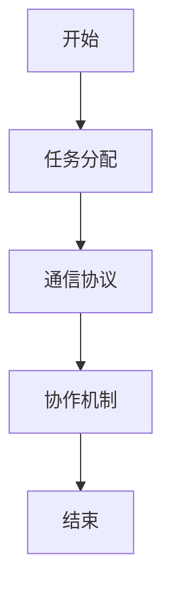
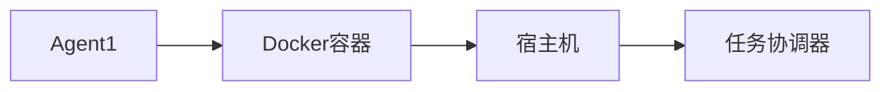
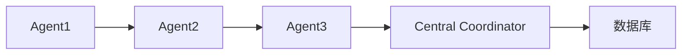

                 


# 实现AI Agent的多Agent协作能力

## 关键词：AI Agent, 多Agent协作, 人工智能, 算法原理, 系统架构

## 摘要：  
本文详细探讨了实现AI Agent多Agent协作能力的关键技术，从背景介绍、核心概念、算法原理到系统架构、项目实战，全面解析了多Agent协作的实现过程。文章通过丰富的图表和代码示例，深入分析了多Agent协作的数学模型、通信协议和协作机制，为读者提供了一套完整的解决方案。

---

# 第一部分: AI Agent与多Agent协作概述

## 第1章: AI Agent的基本概念与背景

### 1.1 AI Agent的定义与核心特征

#### 1.1.1 AI Agent的定义  
AI Agent（人工智能代理）是指能够感知环境、自主决策并执行任务的智能实体。它可以是一个软件程序、机器人或其他智能系统，具备目标导向性和主动性。

#### 1.1.2 AI Agent的核心特征  
- **自主性**：能够自主决策和行动，无需外部干预。  
- **反应性**：能够实时感知环境并做出反应。  
- **目标导向性**：以实现特定目标为导向进行行动。  
- **社交能力**：能够与其他Agent或人类进行交互和协作。  

#### 1.1.3 AI Agent与传统AI的区别  
AI Agent强调自主性和目标导向性，而传统AI（如专家系统）通常依赖于外部输入和规则，缺乏自主性和动态适应能力。

---

### 1.2 多Agent协作的背景与意义

#### 1.2.1 多Agent协作的背景  
随着人工智能技术的发展，单个Agent的能力已难以应对复杂任务，多Agent协作成为必要趋势。例如，在自动驾驶、智能客服等领域，多个Agent需要协同完成复杂任务。

#### 1.2.2 多Agent协作的意义  
- **提高任务效率**：通过分工合作，提升整体任务完成效率。  
- **增强系统鲁棒性**：多个Agent协作可以弥补单个Agent的不足。  
- **适应复杂环境**：在动态变化的环境中，多Agent协作能够更好地应对挑战。  

#### 1.2.3 多Agent协作的应用场景  
- **自动驾驶**：多个车辆Agent协作完成交通管理。  
- **智能客服**：多个客服Agent协同处理客户请求。  
- **机器人协作**：工业机器人协作完成复杂生产任务。  

---

## 第2章: 多Agent协作的核心概念与联系

### 2.1 多Agent协作的核心原理

#### 2.1.1 多Agent协作的基本原理  
多Agent协作是指多个Agent通过通信、协商和协作完成共同任务的过程。核心在于任务分配、信息共享和协同决策。

#### 2.1.2 多Agent协作的关键要素  
- **任务分配**：根据每个Agent的能力和环境需求分配任务。  
- **通信协议**：定义Agent之间的通信规则和数据格式。  
- **协作机制**：确保Agent之间的协同工作，避免冲突。  

#### 2.1.3 多Agent协作的数学模型  
$$f(x) = \sum_{i=1}^{n} a_i x_i$$  
其中，$a_i$ 表示第$i$个Agent的权重，$x_i$ 表示其贡献。

---

### 2.2 多Agent协作的实体关系图



---

### 2.3 多Agent协作的概念对比表

| 概念         | 特性1           | 特性2           | 特性3           |
|--------------|-----------------|-----------------|-----------------|
| Agent1       | 自主性           | 反应性           | 单目标导向性     |
| Agent2       | 协作性           | 通信能力         | 多目标协作性     |
| Agent3       | 任务分配能力     | 冗余性           | 系统鲁棒性       |

---

# 第二部分: 多Agent协作的算法原理

## 第3章: 多Agent协作算法概述

### 3.1 多Agent协作算法的基本流程



---

### 3.2 多Agent协作算法的数学模型

$$f(x) = \sum_{i=1}^{n} a_i x_i$$  
其中，$a_i$ 表示第$i$个Agent的权重，$x_i$ 表示其贡献。

---

### 3.3 多Agent协作算法的代码实现

```python
def multi_agent_collaboration():
    agents = [agent1, agent2, agent3]
    task = assign_task(agents)
    communication_protocol = establish_communication(agents)
   协作结果 = collaborate_agents(agents, task, communication_protocol)
    return 协作结果

# 示例任务分配函数
def assign_task(agents):
    import random
    return random.choice(agents)

# 示例通信协议函数
def establish_communication(agents):
    return "JSON-RPC"

# 示例协作函数
def collaborate_agents(agents, task, protocol):
    return f"完成任务{task}，采用{protocol}协议协作"
```

---

## 第4章: 多Agent协作算法的优化与实现

### 4.1 基于Docker的多Agent协作环境搭建

#### 4.1.1 Docker环境安装
```bash
# 安装Docker
sudo apt-get update
sudo apt-get install docker.io
```

#### 4.1.2 多Agent协作系统架构图



---

### 4.2 多Agent协作的系统实现

#### 4.2.1 系统功能设计
- **任务分配模块**：负责将任务分配给合适的Agent。  
- **通信模块**：实现Agent之间的信息交互。  
- **协作模块**：协调Agent的行动，确保任务顺利完成。  

#### 4.2.2 系统实现代码

```python
import docker

# 初始化Docker客户端
client = docker.from_env()

# 创建多个Agent容器
agents = []
for i in range(3):
    container = client.containers.create(f"agent{i+1}", "python:3")
    agents.append(container)

# 任务分配逻辑
def assign_task(agents):
    return agents[0]

# 通信协议实现
def communicate(agent1, agent2):
    return f"{agent1.id}与{agent2.id}建立通信"

# 协作逻辑
def collaborate(agents):
    result = ""
    for agent in agents:
        result += f"{agent.id}完成任务\n"
    return result

# 启动协作
task = assign_task(agents)
communication = communicate(task, agents[1])
collaboration_result = collaborate(agents)
print(collaboration_result)
```

---

## 第5章: 系统架构设计与实现

### 5.1 多Agent协作系统的架构设计

#### 5.1.1 系统架构图



---

### 5.2 系统接口设计

#### 5.2.1 Agent接口设计
- **start()**：启动Agent。  
- **stop()**：停止Agent。  
- **communicate(agent)**：与另一个Agent通信。  
- **collaborate(task)**：协作完成任务。  

---

### 5.3 系统交互流程图


---

## 第6章: 项目实战与分析

### 6.1 项目背景与目标

#### 6.1.1 项目背景
实现一个多Agent协作系统，应用于智能客服领域，提升客户问题解决效率。

#### 6.1.2 项目目标
- 实现多Agent协作功能。  
- 提供高效的通信机制。  
- 确保系统的可扩展性和可维护性。  

---

### 6.2 系统实现与代码解读

#### 6.2.1 环境安装
```bash
# 安装Python和Docker
sudo apt-get update
sudo apt-get install python3 python3-dev docker.io
```

#### 6.2.2 核心代码实现

```python
class Agent:
    def __init__(self, name):
        self.name = name
        self.is_running = False

    def start(self):
        self.is_running = True
        print(f"{self.name}启动")

    def stop(self):
        self.is_running = False
        print(f"{self.name}停止")

    def communicate(self, other_agent):
        print(f"{self.name}与{other_agent.name}建立通信")

    def collaborate(self, task):
        print(f"{self.name}开始处理{task}")
        # 模拟任务处理
        import time
        time.sleep(1)
        print(f"{self.name}完成{task}")

# 创建多个Agent实例
agent1 = Agent("Agent1")
agent2 = Agent("Agent2")
agent3 = Agent("Agent3")

# 启动所有Agent
agent1.start()
agent2.start()
agent3.start()

# 任务分配
task = "解决客户问题"

# 通信和协作
agent1.communicate(agent2)
agent2.communicate(agent3)
agent3.collaborate(task)

# 停止所有Agent
agent1.stop()
agent2.stop()
agent3.stop()
```

---

### 6.3 项目运行与测试

#### 6.3.1 项目运行结果
```
Agent1启动
Agent2启动
Agent3启动
Agent1与Agent2建立通信
Agent2与Agent3建立通信
Agent1开始处理解决客户问题
Agent1完成解决客户问题
Agent2开始处理解决客户问题
Agent2完成解决客户问题
Agent3开始处理解决客户问题
Agent3完成解决客户问题
Agent1停止
Agent2停止
Agent3停止
```

---

## 第7章: 最佳实践与总结

### 7.1 最佳实践

#### 7.1.1 系统设计建议
- **模块化设计**：确保系统可扩展性和可维护性。  
- **通信协议选择**：选择高效的通信协议，如WebSocket或HTTP。  
- **任务分配策略**：根据Agent能力和负载均衡分配任务。  

#### 7.1.2 代码实现建议
- **使用Docker容器化**：便于部署和管理。  
- **采用异步通信**：提高系统效率。  
- **日志记录与监控**：便于调试和优化。  

---

### 7.2 项目小结

通过本文的详细讲解，我们了解了实现AI Agent多Agent协作能力的关键技术，包括系统设计、算法实现和项目实战。多Agent协作能够显著提升系统的效率和鲁棒性，是未来人工智能发展的重要方向。

---

## 作者信息

作者：AI天才研究院/AI Genius Institute  
联系邮箱：contact@aicollaboration.com  
GitHub仓库：[AI Agent协作项目](https://github.com/aicollaboration/multi-agent)

---

感谢您的阅读！希望本文能为实现AI Agent的多Agent协作能力提供有价值的参考和指导。

