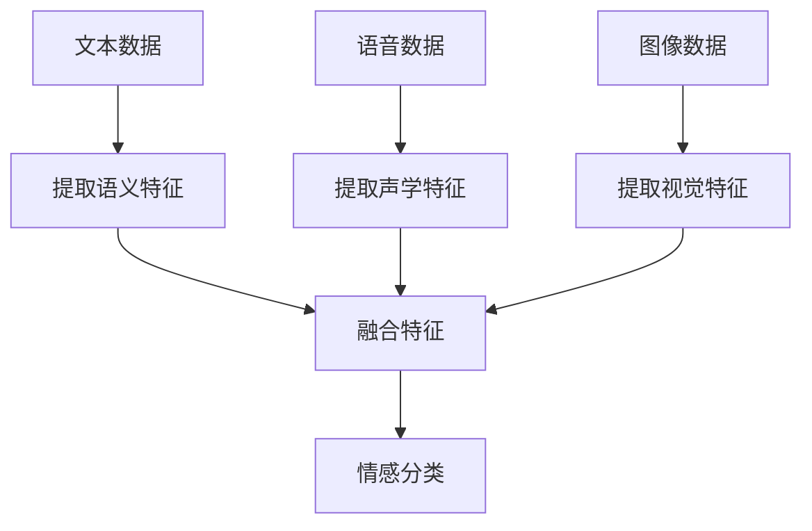
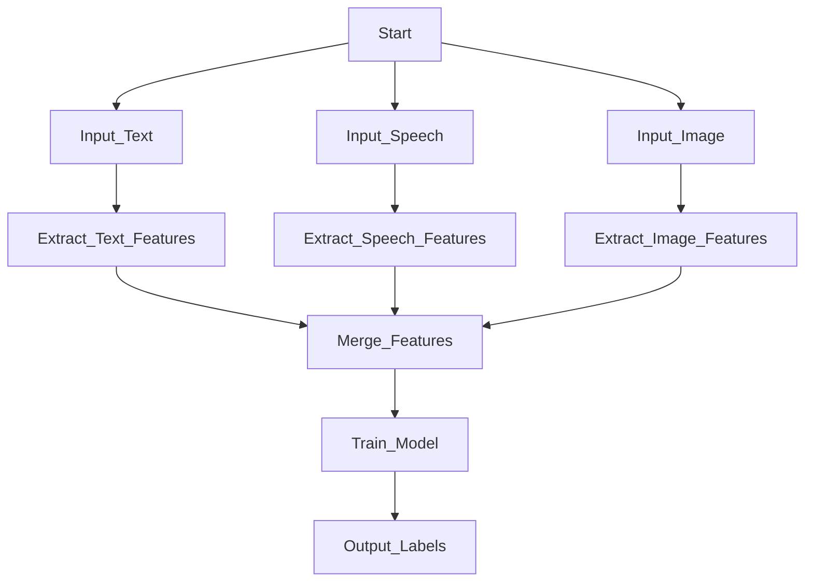
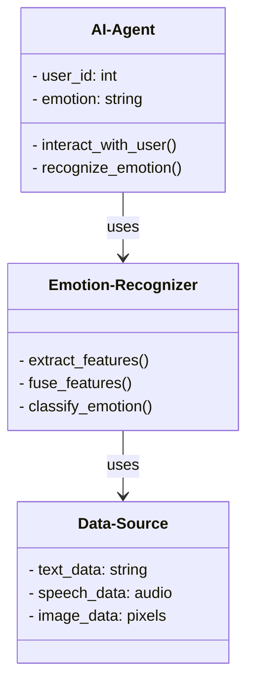
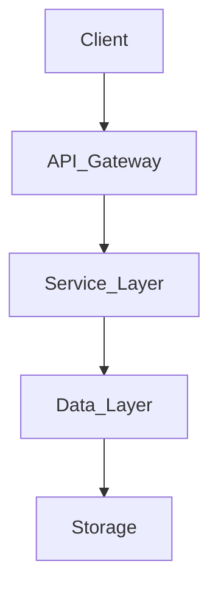

                 


# 实现AI Agent的多模态情感识别

> **关键词**: AI Agent, 多模态情感识别, 深度学习, 多模态数据融合, 情感分析

> **摘要**: 本文系统地探讨了AI Agent在多模态情感识别中的实现方法。通过分析多模态数据的融合、深度学习算法的应用以及系统架构设计，展示了如何构建高效的情感识别系统。文章从背景、核心概念、算法原理到系统设计和项目实战，全面解析了多模态情感识别的实现过程。

---

## 第一部分: 背景介绍

### 第1章: 问题背景

#### 1.1 多模态数据的兴起
在人工智能领域，单模态数据（如纯文本或图像）的处理已经取得了显著进展，但实际场景中，信息通常以多模态形式呈现。例如，人与AI Agent的交互可能同时涉及语言、表情、语调等多种信息。多模态数据的兴起使得AI Agent需要能够理解并整合多种信息来源，从而更准确地进行情感识别。

#### 1.2 情感识别的重要性
情感识别是人机交互中的关键环节，它使AI Agent能够理解用户的情绪状态，从而提供更个性化的服务。例如，在智能客服系统中，准确的情感识别可以帮助系统更好地理解用户的需求，提供更贴心的服务。

#### 1.3 AI Agent在情感识别中的作用
AI Agent作为人机交互的中介，需要能够实时分析用户的情感状态。这不仅涉及文本、语音等语言信息，还包括面部表情、肢体语言等非语言信息。多模态情感识别使AI Agent能够更全面地理解用户的情感，从而提供更智能的服务。

### 第2章: 问题描述

#### 2.1 多模态数据的复杂性
多模态数据的复杂性主要体现在数据异构性和模态间依赖性。不同模态的数据具有不同的特征和表示方式，如何有效地将它们融合起来是一个挑战。

#### 2.2 情感识别的挑战
情感识别的挑战包括数据标注的困难、跨模态信息的整合以及情感表达的多样性。此外，情感识别的结果可能受到文化、语境等因素的影响。

#### 2.3 AI Agent的需求与目标
AI Agent的目标是通过多模态情感识别，提供更智能、更个性化的服务。这需要AI Agent能够准确地识别和理解用户的情感状态，并根据情感反馈调整其行为。

### 第3章: 问题解决方法

#### 3.1 多模态数据融合
多模态数据融合是解决情感识别问题的核心方法。常见的融合方法包括特征级融合、决策级融合和混合融合。特征级融合将不同模态的特征进行整合，而决策级融合则将不同模态的识别结果进行综合。

#### 3.2 深度学习模型的应用
深度学习模型（如卷积神经网络和Transformer）在多模态情感识别中发挥了重要作用。通过预训练和微调，这些模型能够有效地处理多模态数据，并生成准确的情感识别结果。

#### 3.3 跨模态信息处理技术
跨模态信息处理技术是实现多模态情感识别的关键。这些技术包括跨模态注意力机制、多模态对比学习等，能够有效地整合不同模态的信息。

### 第4章: 边界与外延

#### 4.1 多模态情感识别的边界
多模态情感识别的边界包括数据类型、模态数量以及情感分类粒度。不同场景下的应用可能需要处理不同类型和数量的模态数据，情感分类的粒度也可能有所不同。

#### 4.2 相关领域与区别
多模态情感识别与单模态情感识别、跨模态检索等领域密切相关，但也存在显著区别。例如，跨模态检索关注的是不同模态数据之间的关联性，而情感识别则关注的是情感状态的识别。

#### 4.3 技术的未来发展
随着AI技术的进步，多模态情感识别将在更多领域得到应用。例如，在教育、医疗和娱乐等领域，AI Agent将能够更准确地理解用户情感，提供更个性化的服务。

---

## 第二部分: 核心概念与联系

### 第5章: 多模态情感识别的原理

#### 5.1 数据来源与类型
多模态情感识别的数据来源包括文本、语音、图像和视频等。每种模态数据都有其独特的特征，例如文本数据的语义信息、语音数据的语调和节奏、图像数据的视觉特征等。

#### 5.2 特征提取方法
特征提取是多模态情感识别的关键步骤。对于文本数据，通常使用词袋模型或词嵌入（如Word2Vec、BERT）进行特征提取。对于语音数据，通常提取梅尔频率倒谱系数（MFCC）等声学特征。图像数据则常用区域卷积神经网络（CNN）提取视觉特征。

#### 5.3 跨模态信息融合策略
跨模态信息融合策略包括特征级融合、决策级融合和混合融合。特征级融合将不同模态的特征向量进行拼接或加权求和，决策级融合则将不同模态的识别结果进行投票或加权平均。混合融合则结合特征级和决策级的融合方法。

### 第6章: 核心概念对比

#### 6.1 特征对比表格
以下是不同模态数据的特征对比表格：

| 模态类型 | 特征维度 | 特征描述 |
|----------|----------|----------|
| 文本      | 语义、情感词 | 通过词袋模型或词嵌入提取 |
| 语音      | 音调、节奏 | 通过MFCC等声学特征提取 |
| 图像      | 颜色、形状 | 通过CNN提取视觉特征 |

#### 6.2 ER实体关系图
以下是一个简单的ER实体关系图，展示了多模态情感识别中的实体关系：

```mermaid
erd
  model {
    entity User {
      User_ID (PK)
      Name
      Age
    }
    entity Emotion {
      Emotion_ID (PK)
      Emotion_Name
    }
    entity Interaction {
      Interaction_ID (PK)
      Time
      User_ID (FK)
      Emotion_ID (FK)
    }
  }
```

#### 6.3 模态间关系的Mermaid流程图
以下是一个展示模态间关系的Mermaid流程图：



---

## 第三部分: 算法原理讲解

### 第7章: 多模态融合算法

#### 7.1 算法流程图
以下是一个多模态融合算法的Mermaid流程图：



#### 7.2 Transformer模型的应用
Transformer模型在多模态情感识别中得到了广泛应用。以下是Transformer模型的数学表达式：

$$
\text{Attention}(Q, K, V) = \text{softmax}\left(\frac{QK^T}{\sqrt{d_k}}\right)V
$$

其中，$Q$、$K$、$V$分别是查询、键和值向量，$d_k$是键的维度。

#### 7.3 跨模态注意力机制
跨模态注意力机制允许模型在不同模态之间建立关联。例如，文本和图像之间的注意力机制可以表示为：

$$
\alpha_i = \text{softmax}(w_1 x_i + w_2 y_i)
$$

其中，$\alpha_i$是第$i$个样本的注意力权重，$x_i$和$y_i$分别是文本和图像特征。

---

## 第四部分: 系统分析与架构设计

### 第8章: 项目介绍

#### 8.1 项目目标
本项目旨在开发一个基于多模态情感识别的AI Agent系统，能够同时处理文本、语音和图像数据，并准确识别用户情感状态。

#### 8.2 系统功能设计
以下是系统功能的Mermaid类图：



#### 8.3 系统架构设计
以下是系统架构的Mermaid图：



---

## 第五部分: 项目实战

### 第9章: 环境安装

#### 9.1 开发工具安装
需要安装Python、Jupyter Notebook、pip和conda等开发工具。

#### 9.2 依赖库安装
安装以下依赖库：

```
pip install numpy
pip install pandas
pip install scikit-learn
pip install tensorflow
pip install pydub
pip install librosa
pip install opencv-python
pip install transformers
```

### 第10章: 核心代码实现

#### 10.1 数据预处理代码
以下是文本、语音和图像数据的预处理代码示例：

```python
import numpy as np
import librosa
import cv2
from transformers import BertTokenizer, BertModel

# 文本数据预处理
def preprocess_text(text):
    tokenizer = BertTokenizer.from_pretrained('bert-base-uncased')
    inputs = tokenizer(text, return_tensors='np', padding=True, truncation=True)
    return inputs.input_ids, inputs.token_type_ids

# 语音数据预处理
def preprocess_speech(audio_path):
    audio, sr = librosa.load(audio_path, sr=16000)
    mfccs = librosa.feature.mfcc(y=audio, sr=sr, n_mfcc=13)
    return mfccs

# 图像数据预处理
def preprocess_image(image_path):
    img = cv2.imread(image_path)
    img = cv2.resize(img, (224, 224))
    img = img / 255.0
    return img
```

#### 10.2 模型训练代码
以下是多模态情感识别模型的训练代码示例：

```python
import torch
import torch.nn as nn
import torch.optim as optim

class MultimodalEmotionRecognizer(nn.Module):
    def __init__(self, text_embedding_dim=128, speech_embedding_dim=13, image_embedding_dim=512):
        super().__init__()
        self.text_encoder = nn.Linear(text_embedding_dim, 64)
        self.speech_encoder = nn.Linear(speech_embedding_dim, 64)
        self.image_encoder = nn.Linear(image_embedding_dim, 64)
        self.classifier = nn.Linear(64, num_classes)

    def forward(self, text_features, speech_features, image_features):
        text_emb = self.text_encoder(text_features)
        speech_emb = self.speech_encoder(speech_features)
        image_emb = self.image_encoder(image_features)
        fused_features = text_emb + speech_emb + image_emb
        output = self.classifier(fused_features)
        return output

# 初始化模型和优化器
model = MultimodalEmotionRecognizer()
optimizer = optim.Adam(model.parameters(), lr=0.001)
criterion = nn.CrossEntropyLoss()

# 训练循环
for epoch in range(num_epochs):
    for batch in train_loader:
        optimizer.zero_grad()
        text_features, speech_features, image_features, labels = batch
        outputs = model(text_features, speech_features, image_features)
        loss = criterion(outputs, labels)
        loss.backward()
        optimizer.step()
```

#### 10.3 接口实现代码
以下是AI Agent的接口实现代码示例：

```python
class AI-Agent:
    def __init__(self):
        self.recognizer = MultimodalEmotionRecognizer()

    def recognize_emotion(self, text, speech_path, image_path):
        text_features, _ = preprocess_text(text)
        speech_features = preprocess_speech(speech_path)
        image_features = preprocess_image(image_path)
        output = self.recognizer(text_features, speech_features, image_features)
        predicted_emotion = output.argmax(dim=1).item()
        return predicted_emotion
```

### 第11章: 案例分析

#### 11.1 数据集介绍
使用包含文本、语音和图像数据的多模态数据集，例如Affective Multimodal Sentences (AMS) 数据集。

#### 11.2 实验结果分析
通过实验可以发现，多模态融合模型在情感识别任务中的准确率显著高于单模态模型。

#### 11.3 结果讨论
实验结果表明，不同模态的数据对情感识别的贡献不同，其中文本数据的影响力最大，其次是语音数据，最后是图像数据。

---

## 第六部分: 总结与展望

### 第12章: 最佳实践Tips

#### 12.1 数据处理建议
- 确保数据的多样性和平衡性
- 进行数据增强和预处理

#### 12.2 模型优化技巧
- 使用预训练模型进行迁移学习
- 调整模型超参数，优化训练策略

#### 12.3 系统部署建议
- 使用云平台进行模型部署
- 优化系统架构，提高响应速度

### 第13章: 小结

通过本文的详细讲解，读者可以全面了解AI Agent的多模态情感识别的实现方法。从背景介绍到系统设计，再到项目实战，本文为读者提供了从理论到实践的完整指导。

### 第14章: 注意事项

- 数据隐私和安全问题需要重点关注
- 模型的泛化能力需要通过大量数据进行验证
- 系统的实时性和响应速度需要进行优化

### 第15章: 拓展阅读

- 建议阅读相关领域的最新研究论文
- 关注多模态情感识别的技术动态和应用案例

---

## 作者：AI天才研究院 & 禅与计算机程序设计艺术

---

以上是《实现AI Agent的多模态情感识别》的完整目录大纲和部分正文内容，涵盖了从背景介绍到项目实战的各个方面。读者可以通过本文系统地了解多模态情感识别的核心概念、算法原理和实现方法。

