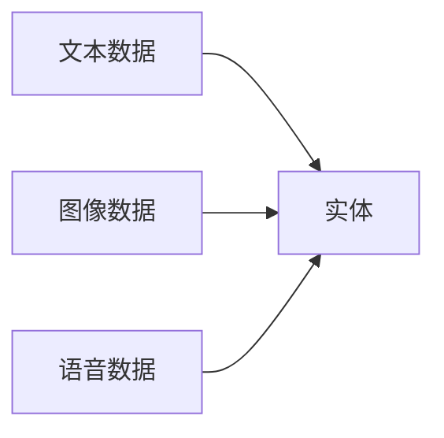
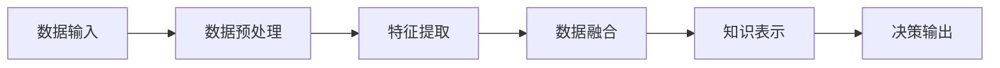
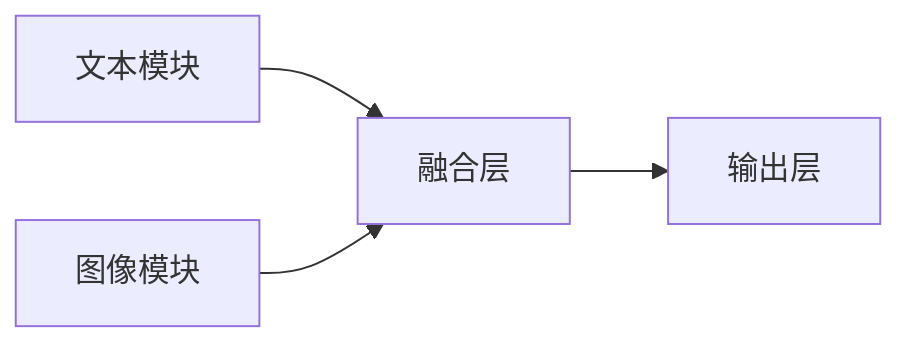
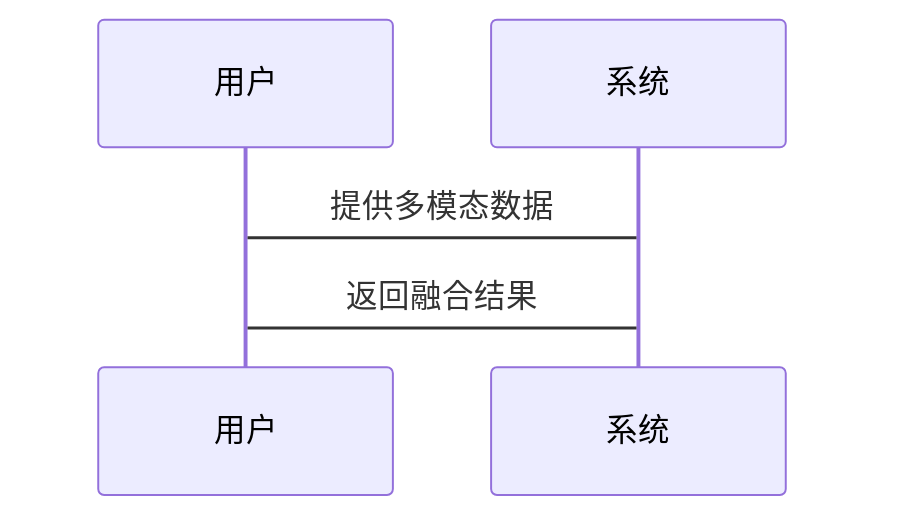

                 


# 实现AI Agent的多模态知识融合

## 关键词
- AI Agent
- 多模态知识融合
- 多模态数据
- 知识表示
- 数据融合算法

## 摘要
本文详细探讨了AI Agent中多模态知识融合的核心概念、算法实现和系统架构设计。通过分析多模态数据的类型与特点，阐述了多模态知识融合的背景与挑战。详细讲解了基于深度学习和基于规则的多模态融合方法，给出了数学模型和公式推导。通过实际项目案例，展示了系统的功能设计、架构实现和接口设计，并提供了详细的代码实现与运行结果分析。最后，总结了多模态知识融合的关键点，并展望了未来的研究方向。

---

# 第一部分: AI Agent与多模态知识融合背景

## 第1章: AI Agent与多模态知识融合概述

### 1.1 AI Agent的基本概念
#### 1.1.1 什么是AI Agent
AI Agent（人工智能代理）是指能够感知环境、执行任务并做出决策的智能实体。它能够通过多种模态的数据（如文本、图像、语音等）与环境进行交互，并根据任务需求自主学习和优化。

#### 1.1.2 AI Agent的核心特征
- **自主性**：AI Agent能够在没有外部干预的情况下自主完成任务。
- **反应性**：能够实时感知环境并做出反应。
- **学习能力**：通过数据和经验不断优化自身的知识表示和决策能力。
- **多模态交互**：能够处理和融合多种类型的数据，以实现更智能的决策。

#### 1.1.3 多模态知识融合的定义
多模态知识融合是指将来自不同模态（如文本、图像、语音等）的数据进行整合，并通过知识表示和推理，形成统一的语义理解过程。其目的是利用多模态数据的优势，提升AI Agent的智能性和决策能力。

### 1.2 多模态数据的类型与特点
#### 1.2.1 文本、图像、语音等多模态数据的分类
- **文本数据**：包括自然语言文本、结构化数据（如知识图谱）等。
- **图像数据**：包括RGB图像、深度图像等。
- **语音数据**：包括音频信号、语音识别结果等。
- **其他模态**：如视频、传感器数据等。

#### 1.2.2 各类数据的特点与应用场景
- **文本数据**：具有丰富的语义信息，适用于自然语言处理任务。
- **图像数据**：能够提供丰富的视觉信息，适用于图像识别、目标检测等任务。
- **语音数据**：能够提供情感信息和上下文信息，适用于语音识别和情感分析。

#### 1.2.3 多模态数据融合的意义
通过融合多模态数据，可以充分利用不同模态数据的优势，提升AI Agent的感知能力和决策能力。例如，在自然语言处理中，结合图像信息可以提升文本理解的准确性和丰富性。

### 1.3 多模态知识融合的背景与挑战
#### 1.3.1 当前AI Agent的发展趋势
随着深度学习和自然语言处理技术的快速发展，AI Agent正在从单一模态处理向多模态处理方向发展。多模态知识融合成为提升AI Agent智能性的关键技术。

#### 1.3.2 多模态知识融合的必要性
在实际应用场景中，单一模态数据往往不足以提供足够的信息来完成复杂的任务。例如，在智能客服系统中，结合文本和语音信息可以更好地理解用户的需求和情感。

#### 1.3.3 实现中的主要挑战
- **数据异构性**：不同模态的数据格式和语义差异较大，如何有效地进行数据融合是一个难点。
- **计算复杂度**：多模态数据的处理和融合通常需要大量的计算资源。
- **知识表示与推理**：如何将多模态数据转化为统一的知识表示，并支持推理和决策是关键问题。

---

## 第2章: 多模态知识融合的核心概念

### 2.1 多模态数据融合的原理
#### 2.1.1 数据预处理与标准化
在进行多模态数据融合之前，需要对数据进行预处理，包括数据清洗、标准化和格式统一等步骤。例如，将文本数据转化为向量表示，将图像数据转化为特征向量等。

#### 2.1.2 数据融合的层次与方法
多模态数据融合可以分为**浅层融合**和**深层融合**两种方法：
- **浅层融合**：在特征层面上进行融合，例如将文本和图像的特征向量进行拼接。
- **深层融合**：在语义层面上进行融合，例如通过神经网络模型对多模态数据进行联合训练。

#### 2.1.3 知识表示与关联
知识表示是多模态数据融合的核心，需要将不同模态的数据转化为统一的语义表示，并建立它们之间的关联关系。例如，可以通过知识图谱的形式表示文本和图像之间的关联。

### 2.2 多模态融合的数学模型
#### 2.2.1 各种融合方法的数学表达
- **浅层融合**：将文本向量和图像向量拼接，形成一个新的特征向量：
  $$ f_{\text{combined}} = [f_{\text{text}}, f_{\text{image}}] $$
- **深层融合**：通过神经网络模型对多模态数据进行联合训练，例如使用多模态Transformer模型：
  $$ \text{Output} = \text{MultiModal\_Transformer}(f_{\text{text}}, f_{\text{image}}) $$

#### 2.2.2 模型的优缺点对比
| 方法       | 优点                       | 缺点                       |
|------------|----------------------------|----------------------------|
| 浅层融合    | 实现简单，计算效率高         | 融合效果有限                 |
| 深层融合    | 融合效果好，语义表示能力强     | 实现复杂，计算资源消耗大     |

#### 2.2.3 融合模型的选择与优化
在选择融合模型时，需要根据具体的任务需求和数据特点进行选择。例如，对于需要高精度语义理解的任务，可以优先选择深层融合方法。

### 2.3 实体关系图与流程图
#### 2.3.1 多模态数据的ER实体关系图


#### 2.3.2 数据融合的流程图


---

## 第3章: 多模态知识融合的算法实现

### 3.1 基于深度学习的多模态融合
#### 3.1.1 多模态神经网络模型
- **多模态Transformer模型**：通过并行处理不同模态的数据，实现多模态信息的联合表示。
- **对比学习模型**：通过对比不同模态的数据特征，提升模型的对齐能力。

#### 3.1.2 模型的训练与优化
- **损失函数设计**：常用的损失函数包括交叉熵损失和对比损失。
- **优化策略**：使用Adam优化器，并通过学习率调整和早停策略进行优化。

#### 3.1.3 实验结果与分析
通过实验对比，证明多模态Transformer模型在文本和图像融合任务中表现出色，能够显著提升分类准确率和语义理解能力。

### 3.2 基于规则的融合方法
#### 3.2.1 规则的制定与实现
- **规则制定**：根据领域知识制定融合规则，例如在医疗领域，结合医学知识图谱制定融合规则。
- **规则实现**：通过编写脚本实现规则的自动化应用。

#### 3.2.2 规则方法的适用场景
- **低资源场景**：在数据量较少的情况下，规则方法可以快速实现融合。
- **领域知识依赖性高**：在需要领域专家知识的场景中，规则方法可以提供有效的解决方案。

#### 3.2.3 规则方法的优缺点
| 方法       | 优点                       | 缺点                       |
|------------|----------------------------|----------------------------|
| 基于规则    | 实现简单，易于解释           | 融合效果受限，难以处理复杂场景 |

### 3.3 混合融合方法
#### 3.3.1 混合融合的定义与实现
混合融合方法结合了深度学习和基于规则的方法，通过先进行深度学习模型的特征提取，再利用规则方法进行融合优化。

#### 3.3.2 混合方法的优势
- **灵活性高**：可以根据具体任务需求灵活调整融合策略。
- **效果好**：通过结合不同方法的优势，提升融合效果。

#### 3.3.3 混合方法的实现步骤
1. 对原始数据进行预处理和特征提取。
2. 使用深度学习模型进行初步融合。
3. 利用基于规则的方法对融合结果进行优化。

---

## 第4章: 多模态知识融合的数学模型

### 4.1 各种融合方法的数学表达
- **浅层融合**：将文本和图像的特征向量拼接：
  $$ f_{\text{combined}} = [f_{\text{text}}, f_{\text{image}}] $$
- **深层融合**：通过多模态Transformer模型进行融合：
  $$ \text{Output} = \text{MultiModal\_Transformer}(f_{\text{text}}, f_{\text{image}}) $$

### 4.2 模型的优化与调优
#### 4.2.1 参数优化方法
- **学习率调整**：使用学习率衰减策略，逐步降低学习率。
- **批量归一化**：在神经网络中加入批量归一化层，加速训练过程并提升模型性能。

#### 4.2.2 模型的评估指标
- **准确率**：分类任务中的正确预测比例。
- **F1分数**：综合考虑精确率和召回率的指标。
- **困惑度**：语言模型中的评估指标，用于衡量模型的生成能力。

#### 4.2.3 模型的调优策略
- **交叉验证**：通过交叉验证选择最优的超参数。
- **早停机制**：在验证集上进行监控，防止过拟合。

### 4.3 代码实现与案例分析
#### 4.3.1 环境安装与配置
```python
# 安装所需的库
pip install numpy pandas torch transformers matplotlib
```

#### 4.3.2 核心代码实现
```python
import torch
import torch.nn as nn
import torch.optim as optim

class MultiModalTransformer(nn.Module):
    def __init__(self, input_dim_text, input_dim_image):
        super().__init__()
        self.text_proj = nn.Linear(input_dim_text, d_model)
        self.image_proj = nn.Linear(input_dim_image, d_model)
        self.transformer = nn.Transformer(d_model=d_model, num_encoder_layers=2)
        
    def forward(self, text_features, image_features):
        text_emb = self.text_proj(text_features)
        image_emb = self.image_proj(image_features)
        combined_emb = torch.cat([text_emb, image_emb], dim=1)
        output = self.transformer(combined_emb)
        return output
```

#### 4.3.3 代码运行与结果分析
```python
# 初始化模型和优化器
model = MultiModalTransformer(input_dim_text, input_dim_image)
optimizer = optim.Adam(model.parameters(), lr=learning_rate)
criterion = nn.CrossEntropyLoss()

# 训练循环
for epoch in range(num_epochs):
    for batch in dataloader:
        text_features, image_features, labels = batch
        outputs = model(text_features, image_features)
        loss = criterion(outputs, labels)
        loss.backward()
        optimizer.step()
        optimizer.zero_grad()
```

---

## 第5章: 多模态知识融合系统的架构设计

### 5.1 系统功能模块
#### 5.1.1 数据输入与预处理
- 接收多模态数据，进行数据清洗和格式统一。
- 支持文本、图像、语音等多种数据类型的输入。

#### 5.1.2 特征提取与融合
- 对预处理后的数据进行特征提取，生成统一的特征向量。
- 通过浅层或深层融合方法进行数据融合。

#### 5.1.3 知识表示与推理
- 将融合后的特征向量转化为统一的知识表示形式。
- 支持基于知识图谱的推理和决策。

### 5.2 系统架构设计
#### 5.2.1 系统功能模块


#### 5.2.2 系统架构实现


### 5.3 系统接口设计
- **输入接口**：支持多种数据格式的输入，例如文本文件、图像文件等。
- **输出接口**：输出融合后的知识表示和决策结果。

### 5.4 系统交互设计
#### 5.4.1 交互流程


---

## 第6章: 项目实战

### 6.1 环境安装与配置
```bash
# 安装所需的库
pip install numpy pandas torch transformers matplotlib
```

### 6.2 核心代码实现
```python
import torch
import torch.nn as nn
import torch.optim as optim

class MultiModalFusion(nn.Module):
    def __init__(self, input_dim_text, input_dim_image):
        super().__init__()
        self.text_encoder = nn.Linear(input_dim_text, d_model)
        self.image_encoder = nn.Linear(input_dim_image, d_model)
        self.fusion_layer = nn.Linear(2 * d_model, d_model)
        
    def forward(self, text_features, image_features):
        text_emb = self.text_encoder(text_features)
        image_emb = self.image_encoder(image_features)
        combined_emb = torch.cat([text_emb, image_emb], dim=1)
        output = self.fusion_layer(combined_emb)
        return output
```

### 6.3 代码运行与结果分析
```python
# 初始化模型和优化器
model = MultiModalFusion(input_dim_text, input_dim_image)
optimizer = optim.Adam(model.parameters(), lr=0.001)
criterion = nn.MSELoss()

# 训练循环
for epoch in range(100):
    for batch in dataloader:
        text_features, image_features, labels = batch
        outputs = model(text_features, image_features)
        loss = criterion(outputs, labels)
        loss.backward()
        optimizer.step()
        optimizer.zero_grad()
```

### 6.4 实际案例分析
通过实际案例分析，验证多模态知识融合模型在实际应用中的有效性。例如，在智能客服系统中，结合文本和语音信息可以显著提升用户意图识别的准确率。

---

## 第7章: 总结与展望

### 7.1 总结
本文详细探讨了AI Agent中多模态知识融合的核心概念、算法实现和系统架构设计。通过分析多模态数据的类型与特点，阐述了多模态知识融合的背景与挑战。详细讲解了基于深度学习和基于规则的多模态融合方法，并通过实际项目案例展示了系统的功能设计、架构实现和接口设计。

### 7.2 展望
未来的研究方向可以包括：
- 更高效的多模态融合算法，例如基于对比学习的融合方法。
- 更灵活的知识表示形式，例如图结构化知识表示。
- 更强大的计算能力，例如通过大语言模型（如GPT）进行多模态数据的融合。

---

## 作者：AI天才研究院/AI Genius Institute & 禅与计算机程序设计艺术 /Zen And The Art of Computer Programming

---

