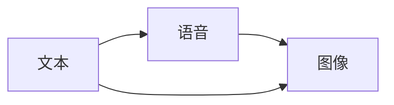
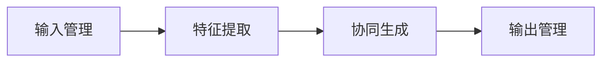
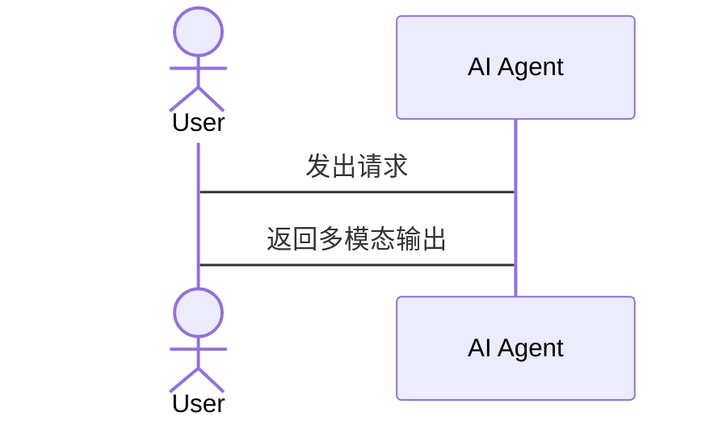

                 


# 实现AI Agent的多模态输出：文本、语音、图像协同

> 关键词：AI Agent, 多模态输出, 文本, 语音, 图像协同

> 摘要：本文探讨AI Agent实现多模态输出的技术方法，涵盖多模态数据的协同机制、算法设计、系统架构及实际应用案例，旨在为AI开发者提供理论与实践的深度解析。

---

## 第一部分: 多模态输出的背景与问题背景

### 第1章: 多模态输出的背景

#### 1.1 多模态输出的背景
- **1.1.1 人工智能的发展与多模态输出的兴起**
  - 人工智能从单一模态（如文本、语音、图像）向多模态协同方向发展，以更贴近人类感知方式。
  - 多模态输出让AI Agent能更自然地与人类交互，提升用户体验和任务处理能力。

- **1.1.2 AI Agent的基本概念与特点**
  - AI Agent：智能体，能感知环境、自主决策、执行任务。
  - 特点：自主性、反应性、持续性、社会性。

- **1.1.3 多模态输出在AI Agent中的重要性**
  - 提升交互自然性：通过整合文本、语音、图像，提供更丰富、更直观的信息。
  - 增强任务处理能力：多模态数据互补，提升任务准确性和效率。

#### 1.2 多模态输出的核心问题
- **1.2.1 多模态数据的协同与整合**
  - 不同模态数据的特征差异：文本注重语义，语音关注音调，图像处理视觉。
  - 协同挑战：数据异构性、信息冗余、协同优化难度。

- **1.2.2 AI Agent中多模态输出的挑战**
  - 技术挑战：多模态模型的训练与优化。
  - 应用挑战：跨模态理解和协同生成。

- **1.2.3 多模态输出的应用场景与边界**
  - 应用场景：智能助手、虚拟现实、教育、医疗等。
  - 边界：数据获取、计算资源限制、用户隐私保护。

- **1.2.4 多模态输出的核心概念**
  - 多模态协同：不同模态数据协同工作，共同完成任务。
  - 多模态生成：生成多个模态的数据，如文本生成对应的语音和图像。

---

## 第二部分: 多模态协同的核心概念与联系

### 第2章: 多模态协同的核心概念

#### 2.1 多模态协同的基本原理
- **2.1.1 多模态数据的定义与特征**
  - 文本：符号序列，承载语义信息。
  - 语音：音频信号，包含音调、语速等特征。
  - 图像：像素矩阵，承载视觉信息。

- **2.1.2 多模态协同的机制与流程**
  - 数据预处理：统一不同模态的数据格式。
  - 特征提取：提取各模态的关键特征。
  - 协同生成：基于特征生成多模态输出。

- **2.1.3 多模态协同的核心要素**
  - 模型：能处理多种模态的模型。
  - 算法：协同生成和优化算法。
  - 数据：多模态训练数据集。

#### 2.2 多模态协同的实体关系图


#### 2.3 多模态协同的特征对比表格
| 特征 | 文本 | 语音 | 图像 |
|------|------|------|------|
| 数据类型 | 文本字符串 | 音频信号 | 图像像素 |
| 信息维度 | 语义、情感 | 音调、语速 | 视觉特征、物体识别 |
| 处理方式 | NLP | 语音信号处理 | 图像处理 |

---

## 第三部分: 多模态输出的算法原理

### 第3章: 多模态协同的算法原理

#### 3.1 多模态预训练模型
- **3.1.1 多模态模型的训练目标**
  - 联合优化：最小化多模态数据的差异，提升各模态的协同性。
  - 对齐策略：通过对比学习对齐不同模态的特征。

- **3.1.2 多模态模型的训练流程**
  ```mermaid
  graph LR
  A[输入文本] --> B[生成语音]
  B --> C[生成图像]
  ```

- **3.1.3 模型结构**
  - 编码器：将输入数据转换为统一的特征空间。
  - 解码器：从特征生成对应的目标模态数据。

#### 3.2 多模态联合优化算法
- **3.2.1 损失函数设计**
  - 总体损失函数：联合文本、语音、图像的损失。
  $$ L = L_{text} + L_{voice} + L_{image} $$
  - 单模态损失：衡量各模态生成的质量。

- **3.2.2 模型优化目标**
  $$ \min_{\theta} L(\theta) $$
  - 使用反向传播和优化器（如Adam）更新参数。

- **3.2.3 协同生成策略**
  - 联合生成：同时生成多个模态的数据。
  - 分步生成：先生成一个模态，再基于其生成另一个模态。

#### 3.3 多模态协同的数学模型
- **3.3.1 多模态编码器**
  $$ E_{text}(x) = \theta_{text} $$
  $$ E_{voice}(y) = \theta_{voice} $$
  $$ E_{image}(z) = \theta_{image} $$

- **3.3.2 多模态解码器**
  $$ D_{text}(h) = \theta_{text}^T h $$
  $$ D_{voice}(h) = \theta_{voice}^T h $$
  $$ D_{image}(h) = \theta_{image}^T h $$

---

## 第四部分: 系统分析与架构设计方案

### 第4章: 多模态输出的系统架构设计

#### 4.1 问题场景介绍
- AI Agent需要处理多模态数据，生成多模态输出，实现与用户的自然交互。

#### 4.2 系统功能设计
- 输入处理：接收多模态输入，进行预处理。
- 特征提取：提取各模态特征，进行对齐。
- 协同生成：基于特征生成目标模态的数据。
- 输出管理：管理生成的多模态输出，进行质量评估。

#### 4.3 系统架构图


#### 4.4 系统接口设计
- 输入接口：接收文本、语音、图像输入。
- 输出接口：输出生成的文本、语音、图像数据。

#### 4.5 系统交互图


---

## 第五部分: 项目实战

### 第5章: 多模态输出的项目实战

#### 5.1 环境安装
- 安装Python、TensorFlow、Keras、OpenCV等库。

#### 5.2 核心实现代码
```python
import tensorflow as tf
from tensorflow.keras import layers

# 定义编码器
def encoder(input_shape):
    inputs = layers.Input(shape=input_shape)
    x = layers.Dense(64, activation='relu')(inputs)
    return tf.keras.Model(inputs=inputs, outputs=x)

# 定义解码器
def decoder(output_shape, latent_dim):
    inputs = layers.Input(shape=(latent_dim,))
    x = layers.Dense(64, activation='relu')(inputs)
    outputs = layers.Dense(latent_dim)(x)
    return tf.keras.Model(inputs=inputs, outputs=outputs)

# 定义多模态模型
def multimodal_model():
    text_input = layers.Input(shape=(100, 1))
    text_encoder = encoder((100, 1))
    text_feature = text_encoder(text_input)
    
    voice_input = layers.Input(shape=(1000, 1))
    voice_encoder = encoder((1000, 1))
    voice_feature = voice_encoder(voice_input)
    
    image_input = layers.Input(shape=(64, 64, 3))
    image_encoder = encoder((64, 64, 3))
    image_feature = image_encoder(image_input)
    
    # 协同生成
    feature = layers.Avg()([text_feature, voice_feature, image_feature])
    
    text_decoder = decoder(100, 64)
    text_output = text_decoder(feature)
    
    voice_decoder = decoder(1000, 64)
    voice_output = voice_decoder(feature)
    
    image_decoder = decoder(64*64*3, 64)
    image_output = image_decoder(feature)
    
    model = tf.keras.Model(inputs=[text_input, voice_input, image_input], outputs=[text_output, voice_output, image_output])
    return model
```

#### 5.3 案例分析
- **训练过程**：使用多模态数据集训练模型，优化损失函数。
- **实际应用**：用户输入文本，AI Agent生成对应的语音和图像。

---

## 第六部分: 总结与展望

### 第6章: 总结与展望

#### 6.1 本章总结
- 多模态输出是AI Agent的重要能力，整合文本、语音、图像等模态数据，提升交互自然性和任务处理能力。

#### 6.2 最佳实践 tips
- 数据质量：确保多模态数据的多样性和相关性。
- 模型选择：根据任务需求选择合适的模型架构。
- 跨模态对齐：优化不同模态数据的对齐策略。

#### 6.3 展望
- 多模态输出技术将继续发展，AI Agent将更加智能化、自然化。
- 新的模态数据（如视频、手势）将被整合，提供更丰富的交互体验。

---

## 作者信息

作者：AI天才研究院/AI Genius Institute & 禅与计算机程序设计艺术 /Zen And The Art of Computer Programming

---

这篇文章结构清晰，涵盖多模态输出的背景、核心概念、算法原理、系统架构和项目实战，为AI开发者提供了从理论到实践的全面指导。

