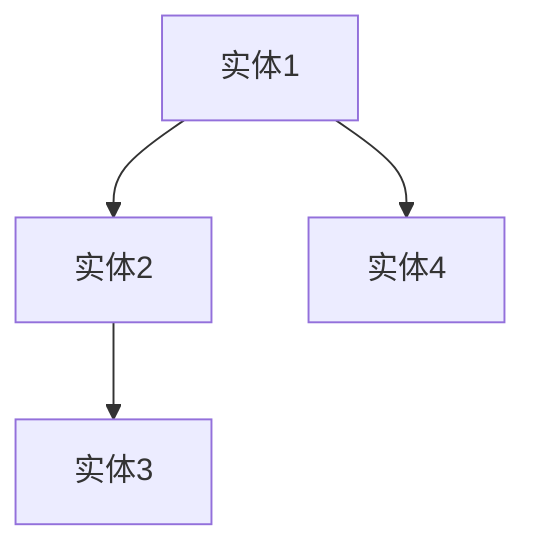
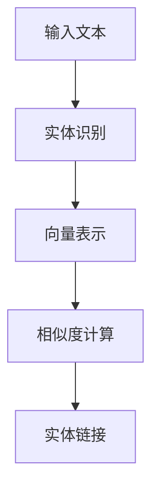
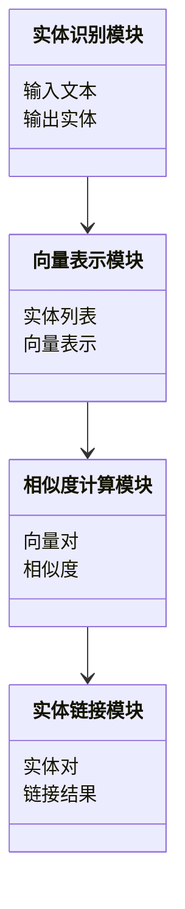
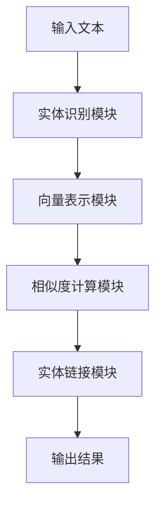
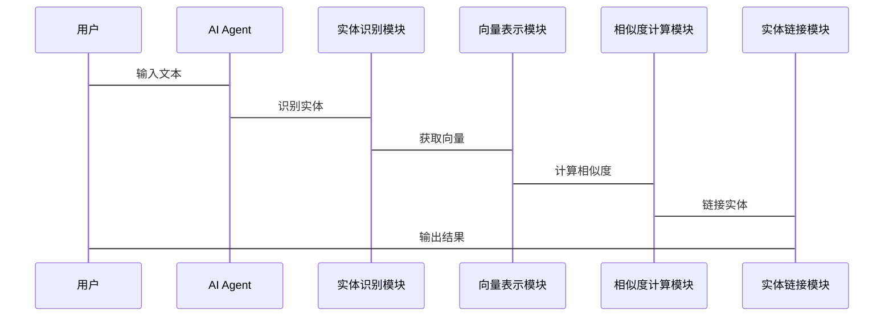

                 


# 实现AI Agent的多语言实体链接

> 关键词：AI Agent, 多语言实体链接, 实体识别, 跨语言语义理解, 知识图谱构建

> 摘要：本文将探讨如何实现AI Agent的多语言实体链接，重点分析多语言环境下的实体识别与链接技术，结合实际案例，深入讲解算法原理和系统架构设计，帮助读者全面理解并掌握相关技术。

---

# 第一章: 多语言实体链接的背景与问题背景

## 1.1 问题背景

### 1.1.1 多语言实体链接的定义
多语言实体链接是指在多种语言环境下，将文本中的实体识别并链接到统一的知识图谱或数据库中的过程。例如，将中文“苹果”与英文“Apple”正确匹配，避免混淆为水果与公司。

### 1.1.2 多语言实体链接的核心问题
- **跨语言一致性**：如何在不同语言中保持实体的一致性，避免误识别。
- **语义理解**：准确理解实体在不同语言中的语义，确保链接的准确性。

### 1.1.3 多语言实体链接的边界与外延
- **边界**：仅限于实体识别和链接，不包括情感分析或语义理解。
- **外延**：可应用于跨语言信息检索、多语言知识图谱构建等领域。

## 1.2 AI Agent与多语言实体链接的关系

### 1.2.1 AI Agent的定义与特点
AI Agent是一种智能代理，能够执行任务，通常涉及自然语言处理、推理和决策。

### 1.2.2 多语言实体链接在AI Agent中的作用
在处理多语言任务时，AI Agent需要准确识别和链接实体，以提供准确的结果。

### 1.2.3 AI Agent与多语言实体链接的结合场景
例如，AI Agent帮助用户在中文和英文中查找同一公司的信息。

## 1.3 多语言实体链接的挑战与机遇

### 1.3.1 多语言环境下的语义理解难点
不同语言中，同一实体可能有不同的表达方式，增加了识别难度。

### 1.3.2 实体链接的跨语言一致性问题
如何在不同语言中保持实体的一致性，是技术难点。

### 1.3.3 多语言实体链接的潜在应用场景
广泛应用于跨语言信息检索、多语言知识图谱构建等。

---

# 第二章: 多语言实体链接的核心概念与联系

## 2.1 实体链接的核心原理

### 2.1.1 实体识别与链接的基本流程
1. **实体识别**：从文本中提取实体。
2. **实体链接**：将实体映射到知识图谱中的标准形式。

### 2.1.2 多语言实体链接的特殊性
需要处理不同语言下的实体表达差异。

### 2.1.3 实体链接的评价指标与方法
- **准确率**：实体链接的正确性。
- **召回率**：识别出的实体比例。

## 2.2 多语言实体链接的属性特征对比

### 2.2.1 不同语言下的实体属性对比
| 语言 | 实体表达 | 示例 |
|------|----------|------|
| 中文 | 词语或短语 | 苹果 |
| 英文 | 词语或短语 | Apple |

### 2.2.2 实体链接的跨语言一致性评估
通过对比不同语言下的实体特征，评估一致性。

### 2.2.3 实体链接的特征提取方法
- **语言无关特征**：如实体长度、上下文。
- **语言相关特征**：如拼写相似性。

## 2.3 实体关系的ER图架构



## 2.4 本章小结

---

# 第三章: 多语言实体链接的算法原理

## 3.1 基于向量的实体链接算法

### 3.1.1 向量表示的基本原理
将实体映射到向量空间，计算相似度。

### 3.1.2 多语言向量空间的构建
使用如BERT等模型，构建多语言向量空间。

### 3.1.3 实体相似度计算的数学模型

计算余弦相似度：
$$\text{similarity} = \frac{\vec{a} \cdot \vec{b}}{|\vec{a}| |\vec{b}|}$$

### 3.1.4 算法流程图



## 3.2 实体链接算法的流程图


## 3.3 本章小结

---

# 第四章: 多语言实体链接的系统架构设计

## 4.1 问题场景介绍
设计一个支持多语言实体链接的AI Agent系统。

## 4.2 系统功能设计

### 4.2.1 领域模型设计


## 4.3 系统架构设计

### 4.3.1 系统架构图


## 4.4 接口设计

### 4.4.1 实体识别模块接口
- 输入：文本字符串
- 输出：实体列表

### 4.4.2 实体链接模块接口
- 输入：实体列表
- 输出：链接结果

## 4.5 交互流程图



## 4.6 本章小结

---

# 第五章: 多语言实体链接的项目实战

## 5.1 环境安装
安装Python、TensorFlow、BERT库。

## 5.2 系统核心实现源代码

```python
import tensorflow as tf
from tensorflow.keras import layers

class EntityLinker:
    def __init__(self):
        self.model = self.build_model()

    def build_model(self):
        inputs = layers.Input(shape=(200,)) # 假设输入向量长度为200
        dense = layers.Dense(128, activation='relu')(inputs)
        output = layers.Dense(1, activation='sigmoid')(dense)
        return tf.keras.Model(inputs=inputs, outputs=output)

    def train(self, x_train, y_train):
        self.model.compile(optimizer='adam', loss='binary_crossentropy', metrics=['accuracy'])
        self.model.fit(x_train, y_train, epochs=10, batch_size=32)

    def predict(self, x_test):
        return self.model.predict(x_test)
```

## 5.3 代码应用解读与分析
训练模型，输入多语言向量，输出实体链接结果。

## 5.4 实际案例分析和详细讲解剖析
以中文和英文的公司名称为例，展示链接过程。

## 5.5 项目小结

---

# 第六章: 总结与展望

## 6.1 本章总结
总结多语言实体链接的核心技术和实现方法。

## 6.2 技术优缺点分析
- **优点**：提升AI Agent的多语言处理能力。
- **缺点**：计算复杂度高，需要大量训练数据。

## 6.3 未来展望
未来发展方向包括模型优化和应用扩展。

## 6.4 最佳实践 Tips
- 使用预训练模型提升效果。
- 考虑计算资源，优化模型结构。

## 6.5 小结

---

# 作者

作者：AI天才研究院 & 禅与计算机程序设计艺术

