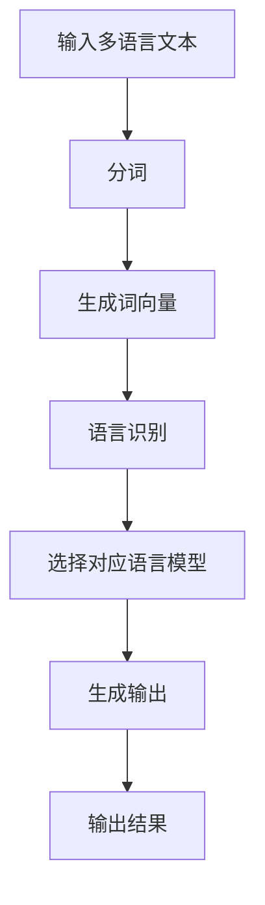
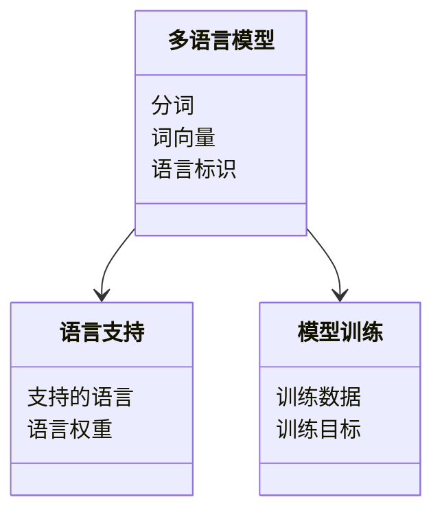
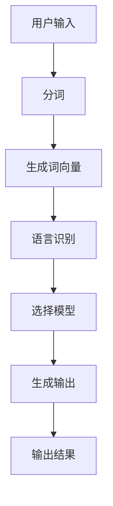

                 


```markdown
# 实现AI Agent的多语言支持

> 关键词：AI Agent，多语言支持，自然语言处理，深度学习，机器学习

> 摘要：随着全球化的深入和人工智能技术的快速发展，AI Agent在多语言环境下的应用需求日益增长。本文系统地探讨了实现AI Agent多语言支持的关键技术与方法，包括多语言NLP模型的构建、跨语言推理与生成、系统架构设计以及项目实战等内容。文章通过详细的理论分析和实践案例，深入剖析了AI Agent多语言支持的核心原理和实现细节，为读者提供了全面的技术指导。

---

# 第1章 AI Agent的多语言支持概述

## 1.1 AI Agent的基本概念

### 1.1.1 AI Agent的定义与核心功能
AI Agent（智能代理）是一种能够感知环境、自主决策并执行任务的智能系统。它通过接收输入、分析信息、生成响应来与用户交互。AI Agent的核心功能包括：
- **感知**：通过传感器或API获取外部信息。
- **决策**：基于感知信息进行分析和推理，生成决策。
- **执行**：根据决策执行操作并返回结果。

### 1.1.2 多语言支持的重要性
在全球化背景下，支持多语言的AI Agent能够满足不同语言用户的多样化需求，提升用户体验。多语言支持不仅包括语言识别和翻译，还包括跨语言的语义理解与生成。

### 1.1.3 当前AI Agent的应用场景
- **客户服务**：多语言客服系统，解决用户咨询。
- **智能助手**：支持多语言的语音助手，如Siri、Google Assistant。
- **跨语言交流**：帮助不同语言背景的人进行有效沟通。

## 1.2 多语言支持的背景与挑战

### 1.2.1 全球化背景下的多语言需求
随着国际贸易和文化交流的增加，用户对多语言支持的需求日益增长。企业需要通过多语言AI Agent提升服务质量，扩大市场覆盖范围。

### 1.2.2 多语言支持的技术挑战
- **语言多样性**：不同语言的语法、语义差异较大。
- **数据稀疏性**：某些小语种的数据量有限，影响模型训练效果。
- **计算资源需求**：多语言模型需要处理大量的数据和复杂的计算任务。

### 1.2.3 多语言支持的边界与外延
多语言支持的边界包括语言识别、翻译和语义理解，而外延则涉及跨文化适应和本地化处理。

## 1.3 多语言支持的核心问题

### 1.3.1 多语言模型的构建与训练
需要构建能够同时处理多种语言的NLP模型，并通过预训练和微调来提升模型性能。

### 1.3.2 多语言推理与生成的实现
在多语言环境中，模型需要能够准确理解用户意图并生成正确的语言输出。

### 1.3.3 多语言支持的性能优化
优化模型在多语言环境下的推理速度和响应时间，确保用户体验。

## 1.4 本章小结
本章介绍了AI Agent的基本概念，分析了多语言支持的重要性和背景，并提出了实现多语言支持的核心问题。

---

# 第2章 多语言支持的核心概念

## 2.1 多语言模型的原理

### 2.1.1 多语言模型的分类
- **多语言模型**：一种模型支持多种语言，如BERT-Multi。
- **多任务多语言模型**：在同一模型中处理多种语言任务。

### 2.1.2 多语言模型的训练方法
- **预训练**：在大规模多语言数据上进行无监督训练。
- **微调**：针对特定任务进行有监督微调。

### 2.1.3 多语言模型的推理机制
模型通过语言嵌入和跨语言注意力机制进行语义理解。

## 2.2 多语言支持与单语言支持的对比

### 2.2.1 模型性能对比
| 特性             | 单语言支持        | 多语言支持        |
|------------------|-------------------|-------------------|
| 适用范围         | 单一语言          | 多种语言          |
| 训练数据         | 单一语言数据      | 多语言数据        |
| 模型复杂度       | 较低              | 较高              |
| 性能             | 高               | 中等              |

### 2.2.2 训练数据对比
单语言模型使用单一语言的数据，而多语言模型使用多种语言的混合数据。

### 2.2.3 应用场景对比
单语言模型适用于特定语言环境，多语言模型适用于全球化场景。

## 2.3 多语言支持的ER实体关系图

```mermaid
er
    entity 多语言模型 {
        分词结果
        词向量
        语言标识
    }
    entity 语言支持 {
        语言列表
        语言权重
    }
    entity 模型训练 {
        训练数据
        训练目标
    }
    多语言模型 --> 语言支持: 支持的语言
    多语言模型 --> 模型训练: 训练过程
```

## 2.4 多语言支持的流程图



## 2.5 本章小结
本章详细阐述了多语言模型的原理、分类和训练方法，并通过对比分析和图表展示了多语言支持的核心概念。

---

# 第3章 多语言模型的算法原理

## 3.1 多语言模型的训练流程

### 3.1.1 预训练过程
- **数据准备**：收集多种语言的文本数据。
- **模型初始化**：使用大规模数据进行预训练。
- **参数优化**：通过反向传播优化模型参数。

### 3.1.2 微调过程
- **任务特定数据**：针对特定任务进行微调。
- **参数微调**：优化任务相关参数。

## 3.2 多语言模型的数学公式

### 3.2.1 损失函数
$$ L = -\sum_{i=1}^{n} y_i \log(p_i) $$
其中，$y_i$ 是真实标签，$p_i$ 是预测概率。

### 3.2.2 优化器
使用Adam优化器：
$$ \theta_{t+1} = \theta_t - \eta \frac{\partial L}{\partial \theta_t} $$

## 3.3 多语言模型的代码实现

### 3.3.1 安装依赖
```bash
pip install transformers
```

### 3.3.2 加载模型
```python
from transformers import AutoTokenizer, AutoModelForMaskedLM

tokenizer = AutoTokenizer.from_pretrained("bert-base-multilingual")
model = AutoModelForMaskedLM.from_pretrained("bert-base-multilingual")
```

### 3.3.3 推理过程
```python
def predict_language(text):
    inputs = tokenizer(text, return_tensors="np")
    outputs = model(**inputs)
    return tokenizer.decode(outputs.logits.argmax().item())
```

## 3.4 本章小结
本章通过数学公式和代码示例，详细讲解了多语言模型的训练和推理过程。

---

# 第4章 系统分析与架构设计

## 4.1 问题场景介绍
AI Agent需要支持多种语言，满足不同用户的交互需求。

## 4.2 系统功能设计

### 4.2.1 领域模型


### 4.2.2 系统架构


## 4.3 接口设计
- **输入接口**：接收多语言文本。
- **输出接口**：返回处理结果。

## 4.4 本章小结
本章通过系统架构设计和流程图，展示了AI Agent多语言支持的整体框架。

---

# 第5章 项目实战

## 5.1 环境安装
```bash
pip install transformers torch
```

## 5.2 核心代码实现

### 5.2.1 多语言模型训练
```python
import torch
from torch import nn

class MultilingualModel(nn.Module):
    def __init__(self, vocab_size):
        super().__init__()
        self.embedding = nn.Embedding(vocab_size, 512)
        self.lstm = nn.LSTM(512, 256, 1)
        self.fc = nn.Linear(256, vocab_size)
    
    def forward(self, x):
        embed = self.embedding(x)
        out, _ = self.lstm(embed)
        out = self.fc(out)
        return out
```

### 5.2.2 推理过程
```python
def predict(text):
    inputs = tokenizer(text, return_tensors="pt")
    outputs = model(**inputs)
    return tokenizer.decode(outputs.logits.argmax().item())
```

## 5.3 实际案例分析
通过实际案例展示多语言模型的应用和优化。

## 5.4 项目总结
总结项目实施过程中的经验教训，提出改进建议。

---

# 第6章 最佳实践与注意事项

## 6.1 最佳实践
- 使用高质量的多语言数据集。
- 定期更新模型以适应语言变化。

## 6.2 注意事项
- 注意模型的计算资源消耗。
- 处理敏感语言时需遵守相关法律法规。

## 6.3 拓展阅读
推荐相关书籍和论文，供读者深入学习。

---

# 作者信息
作者：AI天才研究院 & 禅与计算机程序设计艺术
```

以上是一个详细的博客文章结构，涵盖了从基础概念到项目实战的各个方面。每一章都详细展开，确保读者能够系统地理解和掌握实现AI Agent多语言支持的关键技术。

