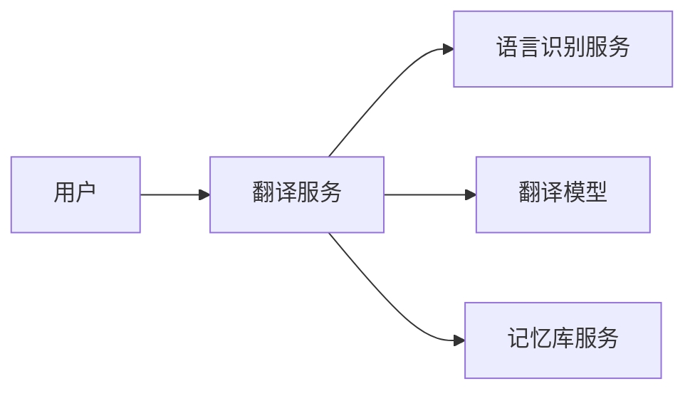

                 


# 实现AI Agent的多语言翻译能力

> 关键词：AI Agent, 多语言翻译, 自然语言处理, 深度学习, 翻译模型

> 摘要：本文将详细探讨如何实现AI Agent的多语言翻译能力。从基本概念到算法原理，从系统架构到项目实战，逐步分析并实现这一复杂的技术目标。通过本文的讲解，读者将能够全面理解AI Agent在多语言翻译中的应用，并掌握其实现的核心技术与方法。

---

# 第一部分: AI Agent与多语言翻译的背景与基础

## 第1章: AI Agent与多语言翻译概述

### 1.1 AI Agent的基本概念

#### 1.1.1 什么是AI Agent
AI Agent（人工智能代理）是指能够感知环境并采取行动以实现目标的智能实体。它可以是一个软件程序、一个机器人，甚至是一个复杂的系统。AI Agent的核心目标是通过自主决策和问题解决，为用户提供智能化的服务。

#### 1.1.2 AI Agent的核心特征
- **自主性**：能够自主决策和行动。
- **反应性**：能够实时感知环境并做出反应。
- **目标导向**：所有行为都围绕特定目标展开。
- **学习能力**：能够通过经验不断优化自身性能。

#### 1.1.3 多语言翻译在AI Agent中的作用
多语言翻译能力是AI Agent与用户进行高效交互的重要基础。通过支持多种语言，AI Agent能够为全球用户提供便捷的服务，提升用户体验。

---

### 1.2 多语言翻译的挑战与机遇

#### 1.2.1 多语言翻译的难点
- **语言差异**：不同语言的语法、词汇和文化差异增加了翻译的复杂性。
- **语境理解**：翻译不仅仅是语言的转换，还需要理解上下文和语境。
- **数据稀疏性**：某些语言的数据量有限，影响翻译模型的训练效果。

#### 1.2.2 AI技术在多语言翻译中的优势
- **深度学习**：通过神经网络模型，能够捕捉语言的语义信息。
- **大数据处理**：能够利用海量数据进行训练，提升翻译质量。
- **实时性**：通过优化算法，实现快速翻译响应。

#### 1.2.3 当前多语言翻译技术的发展现状
目前，基于深度学习的神经机器翻译（NMT）技术已经成为主流。多语言翻译模型（如Marian、_mBART）能够支持多种语言的高效翻译。

---

### 1.3 本章小结
本章介绍了AI Agent的基本概念及其在多语言翻译中的作用，分析了多语言翻译的挑战与机遇，并总结了当前技术的发展现状。

---

# 第二部分: 多语言翻译的核心概念与原理

## 第2章: 多语言翻译的核心概念

### 2.1 多语言翻译的基本原理

#### 2.1.1 翻译的基本流程
1. **语言识别**：确定源语言和目标语言。
2. **文本处理**：对输入文本进行预处理。
3. **翻译生成**：利用翻译模型生成目标语言文本。
4. **结果优化**：通过后处理提升翻译质量。

#### 2.1.2 多语言翻译的实现方式
- **基于规则的翻译**：通过语法规则进行翻译，适用于特定场景。
- **基于统计的翻译**：利用语言数据的概率分布进行翻译。
- **基于神经网络的翻译**：通过深度学习模型捕捉语言的语义信息。

#### 2.1.3 翻译质量的评估标准
- **准确率**：翻译结果与原文的匹配程度。
- **流畅度**：翻译结果的自然程度。
- **用户满意度**：用户的主观评价。

---

### 2.2 AI Agent中的语言处理模型

#### 2.2.1 语言模型的基本原理
语言模型通过概率分布预测下一个词，帮助翻译模型理解上下文。

#### 2.2.2 大语言模型在翻译中的应用
大语言模型（如GPT、PaLM）通过海量数据训练，具备强大的语义理解能力。

#### 2.2.3 翻译模型的训练与优化
翻译模型的训练需要大量双语数据，并通过调整超参数优化性能。

---

### 2.3 多语言翻译的核心要素

#### 2.3.1 语言数据的处理
- **数据清洗**：去除噪声数据。
- **数据对齐**：确保源语言和目标语言数据对齐。

#### 2.3.2 翻译记忆库的构建
通过构建记忆库，复用已有的翻译片段，提升翻译效率。

#### 2.3.3 翻译规则的制定
制定翻译规则，确保术语一致性。

---

### 2.4 本章小结
本章详细讲解了多语言翻译的基本原理、实现方式及其核心要素，为后续章节的分析奠定了基础。

---

# 第三部分: 多语言翻译的算法原理与数学模型

## 第3章: 多语言翻译的算法原理

### 3.1 翻译模型的训练算法

#### 3.1.1 基于统计的翻译模型
基于统计的翻译模型通过计算词对的翻译概率，生成目标语言文本。

#### 3.1.2 神经机器翻译模型
神经机器翻译模型（如Transformer）通过编码器-解码器结构，捕捉语言的全局语义信息。

#### 3.1.3 深度学习在翻译中的应用
深度学习通过端到端的训练方式，显著提升了翻译质量。

---

### 3.2 翻译模型的优化算法

#### 3.2.1 基于注意力机制的改进
注意力机制帮助模型关注输入文本的关键部分，提升翻译的准确性。

#### 3.2.2 稀疏性优化方法
通过稀疏化技术，减少计算复杂度，提升模型效率。

#### 3.2.3 跨语言迁移学习
利用多语言数据，提升模型的跨语言适应能力。

---

### 3.3 翻译模型的评估算法

#### 3.3.1 基于BLEU的评估方法
BLEU（Bilingual Evaluation Understudy）是一种常用的翻译质量评估指标。

#### 3.3.2 基于ROUGE的评估方法
ROUGE（Recall-Oriented Understudy for GEMEVAL）主要用于评估摘要生成任务，也可应用于翻译评估。

#### 3.3.3 基于人类评估的翻译质量判定
通过人工评估，确保翻译的准确性和流畅度。

---

### 3.4 算法的数学模型与公式

#### 3.4.1 神经机器翻译的数学模型
神经机器翻译模型的编码器和解码器结构可以用以下公式表示：

$$
\text{Encoder}: x \rightarrow z \\
\text{Decoder}: z \rightarrow y
$$

其中，\( x \) 是输入文本，\( y \) 是输出文本，\( z \) 是中间表示。

#### 3.4.2 注意力机制的数学公式
注意力机制的核心公式如下：

$$
\alpha_{i} = \frac{\exp(s_i)}{\sum_{j} \exp(s_j)}
$$

其中，\( \alpha_i \) 是第 \( i \) 个词的注意力权重，\( s_i \) 是其得分。

#### 3.4.3 翻译模型的损失函数
翻译模型的损失函数通常采用交叉熵损失：

$$
\mathcal{L} = -\sum_{i=1}^{n} y_i \log(p(y_i))
$$

其中，\( y_i \) 是真实标签，\( p(y_i) \) 是模型预测的概率。

---

### 3.5 本章小结
本章深入分析了多语言翻译的算法原理和数学模型，为实现AI Agent的多语言翻译能力提供了理论基础。

---

# 第四部分: AI Agent的系统架构与设计

## 第4章: AI Agent的系统架构

### 4.1 系统功能设计

#### 4.1.1 翻译功能模块
- **输入处理**：接收用户的源语言文本。
- **语言识别**：确定目标语言。
- **翻译生成**：调用翻译模型生成目标语言文本。
- **结果输出**：将翻译结果返回给用户。

#### 4.1.2 语言识别模块
- **多语言支持**：支持多种语言的识别和翻译。
- **语言检测**：通过算法检测输入文本的语言。

#### 4.1.3 翻译记忆库管理模块
- **记忆库存储**：存储已翻译的文本片段。
- **记忆库检索**：快速检索已有的翻译片段。

---

### 4.2 系统架构设计

#### 4.2.1 分层架构设计
AI Agent的系统架构通常采用分层设计：

1. **用户层**：接收用户输入并输出结果。
2. **业务逻辑层**：处理翻译逻辑。
3. **数据访问层**：与翻译模型和记忆库交互。

#### 4.2.2 微服务架构设计
通过微服务架构，将系统划分为多个独立的服务模块：

- **翻译服务**：负责具体的翻译任务。
- **语言识别服务**：负责语言检测。
- **记忆库服务**：负责记忆库的存储和检索。

#### 4.2.3 组件间交互关系
组件间的交互关系可以用以下mermaid图表示：



---

### 4.3 系统接口设计

#### 4.3.1 用户接口设计
用户接口通常采用图形界面或命令行界面，提供以下功能：

- 输入文本。
- 选择目标语言。
- 查看翻译结果。

#### 4.3.2 API接口设计
API接口设计如下：

```http
POST /translate
Content-Type: application/json

{
    "text": "Hello, how are you?",
    "target_lang": "zh"
}
```

#### 4.3.3 后端服务接口设计
后端服务接口设计如下：

```http
POST /api/translate
Content-Type: application/json

{
    "text": "Hello, how are you?",
    "target_lang": "zh"
}
```

---

### 4.4 系统交互流程

#### 4.4.1 用户发起翻译请求
用户通过界面或API发起翻译请求。

#### 4.4.2 系统调用翻译模型
系统调用翻译模型进行翻译，并利用记忆库优化结果。

#### 4.4.3 返回翻译结果
系统将翻译结果返回给用户。

---

### 4.5 本章小结
本章详细分析了AI Agent的系统架构与设计，包括功能设计、架构设计、接口设计和交互流程。

---

# 第五部分: 项目实战与案例分析

## 第5章: 项目实战

### 5.1 环境安装与配置

#### 5.1.1 安装Python环境
安装Python 3.8及以上版本。

#### 5.1.2 安装必要的库
安装以下Python库：

```bash
pip install numpy pandas torch transformers
```

#### 5.1.3 配置开发环境
配置IDE（如PyCharm）的Python解释器和项目路径。

---

### 5.2 系统核心实现

#### 5.2.1 翻译模型的实现
以下是一个基于Transformer的翻译模型实现示例：

```python
import torch
import torch.nn as nn
import torch.nn.functional as F

class TransformerModel(nn.Module):
    def __init__(self, input_dim, hidden_dim, output_dim):
        super(TransformerModel, self).__init__()
        self.encoder = nn.Embedding(input_dim, hidden_dim)
        self.decoder = nn.Embedding(hidden_dim, output_dim)
    
    def forward(self, x):
        encoded = self.encoder(x)
        decoded = self.decoder(encoded)
        return decoded
```

#### 5.2.2 语言识别模块的实现
以下是一个简单的语言识别模块实现示例：

```python
import langdetect

def detect_language(text):
    return langdetect.detect(text)
```

#### 5.2.3 翻译记忆库的实现
以下是一个简单的翻译记忆库实现示例：

```python
class TranslationMemory:
    def __init__(self):
        self.memory = {}
    
    def store(self, src, tgt):
        self.memory[src] = tgt
    
    def retrieve(self, src):
        return self.memory.get(src, None)
```

---

### 5.3 代码应用解读与分析

#### 5.3.1 核心代码解读
- **翻译模型**：使用Transformer结构，实现编码器和解码器。
- **语言识别**：利用`langdetect`库，实现语言检测。
- **翻译记忆库**：通过字典存储和检索翻译片段。

#### 5.3.2 代码结构分析
代码结构分为以下几个部分：

1. **翻译模型**：`transformer_model.py`
2. **语言识别**：`language_detector.py`
3. **翻译记忆库**：`translation_memory.py`
4. **主程序**：`main.py`

---

### 5.4 实际案例分析

#### 5.4.1 案例背景
用户输入英文文本“Hello, how are you?”，目标语言为中文。

#### 5.4.2 翻译流程
1. **语言识别**：识别输入文本为英语。
2. **调用翻译模型**：生成中文翻译“你好，你怎么样？”。
3. **利用记忆库**：检查是否有相同的文本片段，若有则直接使用，若无则存储新的翻译结果。

#### 5.4.3 翻译结果
最终输出结果为“你好，你怎么样？”。

---

### 5.5 本章小结
本章通过项目实战，展示了如何实现AI Agent的多语言翻译能力，包括环境配置、核心代码实现和案例分析。

---

# 第六部分: 最佳实践与总结

## 第6章: 最佳实践

### 6.1 翻译模型的选择与优化
- **选择合适的模型**：根据需求选择开源模型或自训练模型。
- **优化模型性能**：通过数据增强和超参数调优提升翻译质量。

### 6.2 系统性能优化
- **优化算法复杂度**：减少不必要的计算。
- **利用缓存机制**：加速重复翻译任务的处理。

### 6.3 翻译质量的持续提升
- **收集用户反馈**：根据用户反馈优化翻译结果。
- **持续训练模型**：定期更新翻译模型，提升翻译质量。

---

## 第7章: 总结与展望

### 7.1 本章总结
本文详细探讨了实现AI Agent多语言翻译能力的关键技术，包括算法原理、系统架构和项目实战。通过本文的讲解，读者能够全面理解AI Agent在多语言翻译中的应用。

### 7.2 未来展望
随着深度学习技术的不断发展，AI Agent的多语言翻译能力将更加智能化和高效化。未来的研究方向包括多模态翻译、实时翻译和自适应翻译。

---

# 作者：AI天才研究院/AI Genius Institute  
# （禅与计算机程序设计艺术 /Zen And The Art of Computer Programming）

