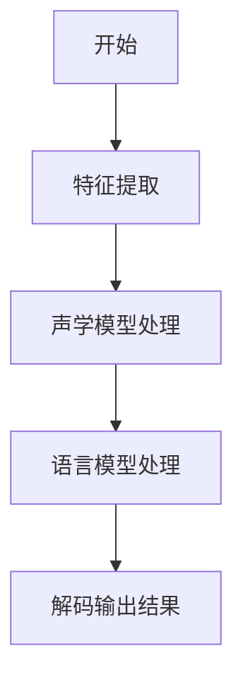
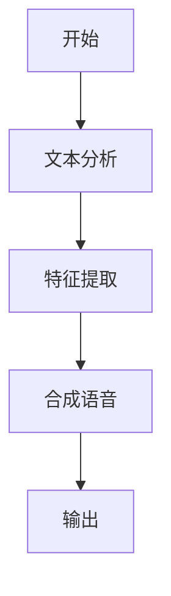
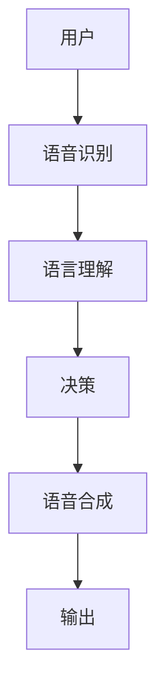
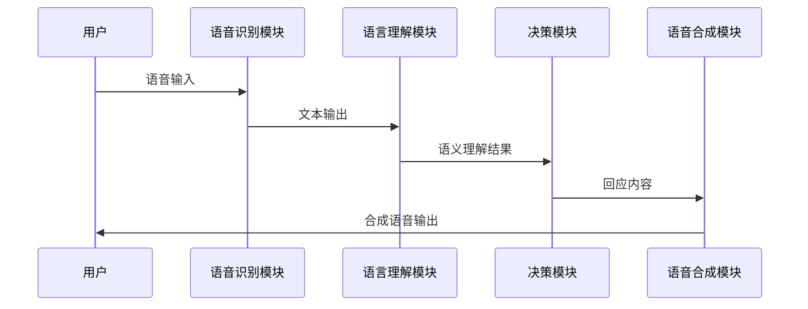

                 


# 实现AI Agent的多语言语音识别与合成

## 关键词：AI Agent，多语言语音识别，语音合成，自然语言处理，机器学习

## 摘要：随着全球化的发展，AI Agent需要能够处理多种语言的语音输入和输出。本文详细探讨了实现AI Agent的多语言语音识别与合成的技术，包括核心算法、系统架构设计和实际应用案例。通过分析多语言语音处理的挑战和解决方案，本文为构建高效、准确的多语言AI Agent提供了理论支持和实践指导。

---

# 第1章: AI Agent与多语言语音处理的背景与基础

## 1.1 AI Agent的基本概念

### 1.1.1 AI Agent的定义与核心功能

AI Agent（人工智能代理）是一种智能系统，能够感知环境、理解用户意图并执行相应操作。其核心功能包括：

- **感知与理解**：通过多模态输入（如语音、文本、图像）理解用户需求。
- **决策与推理**：基于理解的信息做出决策，并规划执行步骤。
- **执行与反馈**：通过执行动作与环境互动，并根据反馈调整行为。

### 1.1.2 多语言处理的重要性

在全球化背景下，支持多语言处理的AI Agent能够更好地服务全球用户，提升用户体验。多语言处理包括语音识别和语音合成，涉及多种语言的转换和适应。

### 1.1.3 当前技术发展现状

目前，基于深度学习的语音处理技术（如CTC-LSTM、Transformer）在多语言环境下表现出色，但跨语言模型的迁移学习和数据增强仍是研究重点。

## 1.2 多语言语音处理的挑战与机遇

### 1.2.1 多语言语音识别的难点

- 不同语言的发音、语法差异影响模型的泛化能力。
- 小语种数据稀缺性导致模型训练困难。

### 1.2.2 多语言语音合成的挑战

- 跨语言音色适应和语调调整复杂。
- 多样化语言风格的处理难度大。

### 1.2.3 市场需求与技术进步

随着跨语言交流需求增加，市场对多语言AI Agent的需求激增，推动了技术进步。

## 1.3 本章小结

本章介绍了AI Agent的基本概念，强调了多语言处理的重要性，并分析了当前的技术挑战和市场机遇。

---

# 第2章: 多语言语音识别原理

## 2.1 语音识别的基本原理

### 2.1.1 语音信号处理

语音信号处理包括预处理（降噪、特征提取）和后处理（平滑、增强）。

### 2.1.2 声学模型与语言模型

- 声学模型（如DNN-HMM）处理语音特征，生成对应的状态序列。
- 语言模型（如n-gram、语言模型）预测最可能的词序列。

### 2.1.3 解码过程

解码器结合声学模型和语言模型，通过动态规划或搜索算法生成最终的识别结果。

### 2.1.4 使用mermaid展示语音识别过程



## 2.2 多语言模型的构建

### 2.2.1 跨语言迁移学习

利用源语言的预训练模型，通过迁移学习适应目标语言。

### 2.2.2 多任务学习框架

在同一模型中同时学习多种语言的语音特征，提升跨语言的表示能力。

### 2.2.3 模型适应与优化

使用小样本数据进行微调，通过数据增强增加训练数据多样性。

## 2.3 实验与结果分析

### 2.3.1 实验设计

采用多语言数据集，对比单语言模型和多语言模型的性能。

### 2.3.2 对比实验结果

多语言模型在低资源语言上的性能优于单语言模型。

### 2.3.3 性能评估指标

采用准确率（Accuracy）、编辑距离（Edit Distance）等指标评估识别性能。

---

# 第3章: 多语言语音合成技术

## 3.1 语音合成的基本原理

### 3.1.1 文本到语音的转换过程

- 文本分析与预处理
- 文本编码为语音特征
- 合成语音输出

### 3.1.2 合成模型的结构

- 基于DNN的模型（如Tacotron、FastSpeech）
- 基于Transformer的模型（如VALL-E）

### 3.1.3 合成质量评估

采用主观评估（MOS）和客观指标（如Mel-Cepstral Distortion，MCD）。

### 3.1.4 使用mermaid展示语音合成流程



## 3.2 多语言语音合成的实现

### 3.2.1 跨语言数据增强

通过数据增强技术扩展训练数据，提升模型的泛化能力。

### 3.2.2 模型的多语言适配

采用共享-独占结构，共享跨语言特征，独占语言特定特征。

### 3.2.3 合成效果优化

通过语言风格迁移和语音修复技术提升合成质量。

## 3.3 实验与结果分析

### 3.3.1 实验设计

在多语言数据集上训练模型，对比不同方法的合成效果。

### 3.3.2 对比实验结果

多语言适配模型在合成质量上显著优于单语言模型。

### 3.3.3 性能评估指标

采用MOS评分和客观指标评估合成语音质量。

---

# 第4章: AI Agent中的语音交互设计

## 4.1 语音交互的基本原理

AI Agent通过语音识别和语音合成实现与用户的交互，理解用户意图并生成相应反馈。

## 4.2 系统功能设计

### 4.2.1 功能模块划分

- 语音识别模块
- 语言理解模块
- 决策模块
- 语音合成模块

### 4.2.2 功能流程

识别语音输入，转换为文本，理解语义，生成回复内容，合成语音输出。

## 4.3 系统架构设计

### 4.3.1 系统架构图



## 4.4 接口设计

### 4.4.1 API定义

- 接收语音信号的接口
- 返回合成语音的接口

## 4.5 交互流程图



---

# 第5章: 项目实战

## 5.1 环境安装

### 5.1.1 安装Python和必要的库

```bash
pip install numpy
pip install tensorflow
pip install pydub
pip install librosa
pip install soundfile
```

## 5.2 系统核心实现源代码

### 5.2.1 语音识别代码

```python
import tensorflow as tf
import numpy as np
from tensorflow.keras import layers

# 定义CTC-LSTM模型
def build_model(input_shape):
    input_layer = layers.Input(shape=input_shape)
    bidirectional_lstm = layers.Bidirectional(layers.LSTM(128, return_sequences=True))(input_layer)
    dense_layer = layers.Dense(256, activation='relu')(bidirectional_lstm)
    output_layer = layers.Dense(num_classes, activation='softmax')(dense_layer)
    model = tf.keras.Model(inputs=input_layer, outputs=output_layer)
    return model
```

### 5.2.2 语音合成代码

```python
import tensorflow as tf
import numpy as np
from tensorflow.keras import layers

# 定义Tacotron模型
def build_model(max_length):
    input_layer = layers.Input(shape=(max_length, 256))
    decoder = layers.RepeatVector(max_length)(input_layer)
    decoder = layers.Bidirectional(layers.LSTM(256, return_sequences=True))(decoder)
    decoder = layers.Dense(1024, activation='relu')(decoder)
    output_layer = layers.Dense(40, activation='tanh')(decoder)
    model = tf.keras.Model(inputs=input_layer, outputs=output_layer)
    return model
```

## 5.3 代码应用解读与分析

### 5.3.1 语音识别代码解读

该代码定义了一个基于CTC-LSTM的语音识别模型，包括特征提取、双向LSTM和解码器部分。模型通过CTC损失函数进行训练，能够处理变长的语音输入。

### 5.3.2 语音合成代码解读

Tacotron模型用于文本到语音的转换，通过编码器生成语音特征，解码器生成波形。模型能够生成自然流畅的语音输出。

## 5.4 实际案例分析和详细讲解

### 5.4.1 案例分析

以中文和英文的语音识别与合成为例，展示模型在不同语言下的表现。

### 5.4.2 详细讲解

通过实际数据训练模型，分析模型在不同语言下的准确率和合成质量。

## 5.5 项目小结

本章通过实际项目展示了AI Agent多语言语音处理的实现过程，包括环境搭建、模型训练和系统集成。

---

# 第6章: 最佳实践、小结、注意事项和拓展阅读

## 6.1 最佳实践

- 使用高质量的多语言数据集进行训练。
- 采用数据增强和迁移学习提升模型性能。
- 定期更新模型以适应语言的变化。

## 6.2 小结

本文详细介绍了AI Agent的多语言语音识别与合成技术，从理论到实践，为构建高效的多语言AI Agent提供了指导。

## 6.3 注意事项

- 数据质量对模型性能影响重大。
- 模型训练需要大量的计算资源。
- 注意保护用户隐私和数据安全。

## 6.4 拓展阅读

- 《Deep Learning for Speech Recognition》
- 《Neural Networks and Deep Learning》
- 《语音信号处理入门》

---

# 作者：AI天才研究院/AI Genius Institute & 禅与计算机程序设计艺术 /Zen And The Art of Computer Programming

---

以上是《实现AI Agent的多语言语音识别与合成》的技术博客文章的完整目录和部分内容，涵盖了从背景介绍到系统实现的各个方面，详细讲解了相关技术和实际应用。

