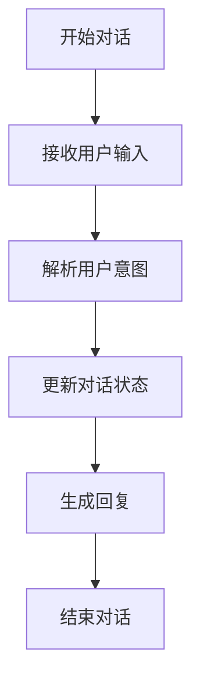
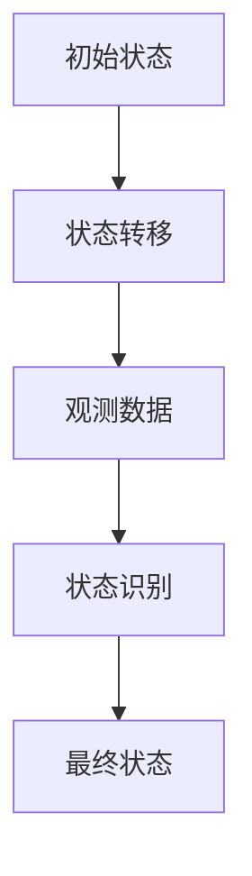
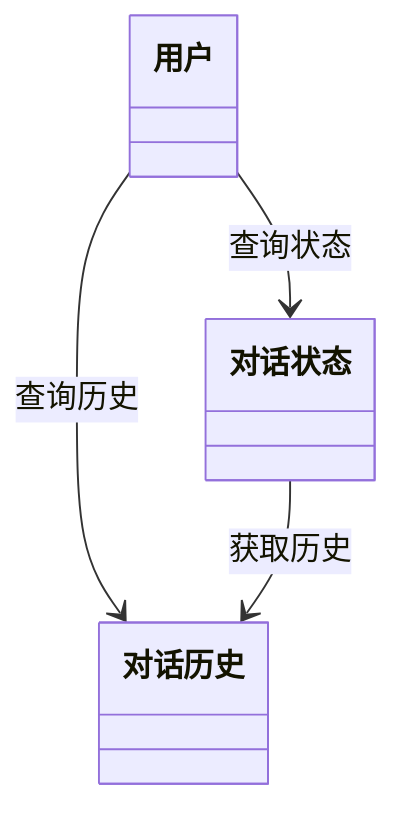
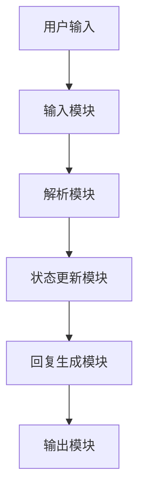
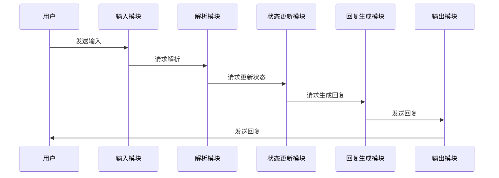

                 


# 实现AI Agent的多轮对话状态跟踪

> 关键词：AI Agent, 多轮对话, 状态跟踪, 对话系统, 智能对话, 状态管理

> 摘要：本文详细探讨了AI Agent在多轮对话中的状态跟踪技术，分析了对话状态跟踪的核心概念、算法原理、系统架构设计及其实现方法。通过理论与实践相结合的方式，深入讲解了如何实现高效、准确的对话状态跟踪，帮助读者全面理解并掌握这一技术。

---

# 第一部分: AI Agent与多轮对话状态跟踪概述

## 第1章: AI Agent与多轮对话状态跟踪概述

### 1.1 AI Agent的基本概念

#### 1.1.1 AI Agent的定义与特点

AI Agent（人工智能代理）是指能够感知环境、自主决策并执行任务的智能实体。AI Agent的核心特点包括：

- **自主性**：能够在没有外部干预的情况下独立执行任务。
- **反应性**：能够实时感知环境并做出反应。
- **目标导向性**：具有明确的目标，并通过行动来实现这些目标。
- **社交能力**：能够与其他Agent或人类进行交互和协作。

AI Agent在多轮对话中的应用，使其能够与人类用户进行自然的交互，理解用户的意图并提供相应的反馈。

#### 1.1.2 多轮对话的定义与重要性

多轮对话是指在对话过程中，用户与AI Agent之间进行多轮的交互。相比于单轮对话，多轮对话更加接近人类自然的交流方式，能够处理复杂的上下文关系。多轮对话的重要性体现在以下几个方面：

1. **上下文理解**：通过多轮对话，AI Agent能够逐步理解用户的意图和需求。
2. **信息整合**：多轮对话能够整合历史信息，提供更准确的回复。
3. **用户体验**：多轮对话能够提升用户体验，使其更加自然和流畅。

#### 1.1.3 对话状态跟踪的背景与意义

在多轮对话中，对话状态跟踪是关键技术之一。对话状态跟踪的目标是维护对话的上下文信息，确保AI Agent能够根据当前和历史信息做出合理的回应。对话状态跟踪的背景与意义包括：

1. **上下文维护**：对话状态跟踪能够维护对话的上下文信息，确保每轮对话都能基于前一轮的信息进行。
2. **意图识别**：通过对话状态跟踪，AI Agent能够更准确地识别用户的意图。
3. **状态更新**：对话状态跟踪能够根据对话的进展实时更新状态，确保对话的连贯性和一致性。

### 1.2 多轮对话的挑战与应用场景

#### 1.2.1 多轮对话的核心挑战

在多轮对话中，AI Agent需要面对以下核心挑战：

1. **信息丢失**：在多轮对话中，历史信息的丢失可能导致对话理解的错误。
2. **上下文依赖**：对话的后续内容依赖于前文的理解，任何误解都可能导致对话失败。
3. **动态变化**：对话的上下文和用户意图可能在对话过程中动态变化，这对对话状态跟踪提出了更高的要求。

#### 1.2.2 多轮对话的主要应用场景

多轮对话的应用场景非常广泛，包括：

1. **智能客服**：通过多轮对话帮助用户解决问题。
2. **智能助手**：如Siri、Alexa等，能够与用户进行多轮交互。
3. **教育机器人**：在教育领域，多轮对话能够提供个性化的学习指导。
4. **医疗咨询**：在医疗领域，多轮对话能够辅助医生与患者进行有效的沟通。

#### 1.2.3 对话状态跟踪的边界与外延

对话状态跟踪的边界与外延需要明确：

1. **边界**：对话状态跟踪仅关注对话中的上下文信息，不涉及用户的其他行为或意图。
2. **外延**：对话状态跟踪可以与其他技术（如意图识别、情感分析）结合，形成更完整的对话系统。

### 1.3 本章小结

本章介绍了AI Agent的基本概念、多轮对话的定义与重要性，以及对话状态跟踪的背景与意义。通过分析多轮对话的挑战与应用场景，明确了对话状态跟踪在AI Agent中的核心地位。

---

# 第二部分: 对话状态跟踪的核心概念与原理

## 第2章: 对话状态跟踪的核心概念与联系

### 2.1 对话状态跟踪的定义与核心要素

#### 2.1.1 对话状态的定义

对话状态是指在对话过程中，基于当前和历史信息所形成的上下文信息。对话状态包括以下要素：

1. **当前状态**：对话的当前阶段或状态。
2. **历史信息**：对话中所有已进行的轮次的信息。
3. **用户意图**：用户在当前对话中的目标或需求。

#### 2.1.2 对话状态跟踪的核心要素

对话状态跟踪的核心要素包括：

1. **状态表示**：如何表示对话的状态。
2. **状态更新**：如何根据对话内容更新状态。
3. **状态查询**：如何在后续对话中利用状态信息。

#### 2.1.3 对话状态与对话历史的关系

对话状态与对话历史密切相关。对话历史是对话状态的来源，而对话状态是对对话历史的总结和抽象。通过对话历史，AI Agent可以推断出当前的对话状态，并根据状态做出相应的回应。

### 2.2 对话状态跟踪的原理与流程

#### 2.2.1 对话状态跟踪的基本原理

对话状态跟踪的基本原理是通过分析对话历史，提取关键信息，更新当前状态，并在后续对话中利用状态信息进行推理和决策。

#### 2.2.2 对话状态跟踪的流程图

以下是对话状态跟踪的流程图（使用Mermaid）：



#### 2.2.3 对话状态与相关概念的对比

对话状态与其他相关概念（如对话意图、对话情感）有以下区别：

| 概念 | 定义 | 关联性 |
|------|------|--------|
| 对话状态 | 当前对话的上下文信息 | 高 |
| 对话意图 | 用户在当前对话中的目标 | 中 |
| 对话情感 | 用户在当前对话中的情感倾向 | 低 |

### 2.3 本章小结

本章详细介绍了对话状态跟踪的核心概念，包括对话状态的定义、核心要素以及与对话历史的关系。通过流程图和对比表，明确了对话状态与其他相关概念的区别与联系。

---

# 第三部分: 对话状态跟踪的算法原理

## 第3章: 对话状态跟踪的算法原理

### 3.1 基于概率的对话状态跟踪算法

#### 3.1.1 隐马尔可夫模型（HMM）的基本原理

隐马尔可夫模型是一种用于序列数据建模的概率模型。其基本假设是，当前状态仅依赖于前一状态，且观测数据仅依赖于当前状态。

#### 3.1.2 HMM在对话状态跟踪中的应用

HMM可以用于对话状态跟踪中的状态识别和状态转移。以下是HMM在对话状态跟踪中的应用流程图：



#### 3.1.3 HMM的数学模型与公式

HMM的数学模型包括以下公式：

- 转移概率矩阵：
  $$ A = \{a_{ij}\} $$，其中$a_{ij}$表示从状态$i$转移到状态$j$的概率。
- 状态转移方程：
  $$ P(q_t = j | q_{t-1} = i) = a_{ij} $$

### 3.2 基于深度学习的对话状态跟踪算法

#### 3.2.1 基于循环神经网络（RNN）的对话状态跟踪

循环神经网络是一种适用于序列数据的深度学习模型。其核心思想是通过递归结构处理序列数据，捕捉时序信息。

#### 3.2.2 基于Transformer的对话状态跟踪

Transformer是一种基于注意力机制的深度学习模型。其核心思想是通过自注意力机制捕捉全局信息，适用于长序列的处理。

#### 3.2.3 对话状态跟踪算法的对比与选择

以下是几种算法的优缺点对比：

| 算法 | 优点 | 缺点 |
|------|------|------|
| HMM | 简单易实现，适合小规模数据 | 无法处理大规模数据，对长序列依赖性差 |
| RNN | 能够处理长序列数据 | 计算复杂度高，训练时间长 |
| Transformer | 处理能力强，性能优越 | 计算资源需求高，实现复杂 |

### 3.3 本章小结

本章介绍了基于概率的对话状态跟踪算法和基于深度学习的对话状态跟踪算法，包括HMM和Transformer模型的原理与应用。通过对比不同算法的优缺点，明确了在实际应用中的选择依据。

---

# 第四部分: 对话状态跟踪的系统分析与架构设计

## 第4章: 对话状态跟踪的系统分析与架构设计

### 4.1 对话状态跟踪系统的功能设计

#### 4.1.1 系统的功能模块划分

对话状态跟踪系统的功能模块包括：

1. **输入模块**：接收用户的输入。
2. **解析模块**：解析用户的意图。
3. **状态更新模块**：更新对话状态。
4. **回复生成模块**：根据对话状态生成回复。
5. **输出模块**：输出回复。

#### 4.1.2 系统的输入与输出设计

输入设计包括用户输入的文本和历史对话记录。输出设计包括对话状态和生成的回复。

#### 4.1.3 对话状态跟踪的领域模型类图

以下是领域模型类图（使用Mermaid）：



### 4.2 对话状态跟踪系统的架构设计

#### 4.2.1 系统架构图

以下是系统架构图（使用Mermaid）：



#### 4.2.2 系统接口设计

系统接口包括：

1. **输入接口**：接收用户的输入。
2. **状态接口**：获取对话状态。
3. **历史接口**：获取对话历史。

#### 4.2.3 系统交互序列图

以下是系统交互序列图（使用Mermaid）：



### 4.3 本章小结

本章详细介绍了对话状态跟踪系统的功能设计、架构设计和交互设计，通过类图和序列图明确了系统的各个模块和接口之间的关系。

---

# 第五部分: 对话状态跟踪的项目实战

## 第5章: 对话状态跟踪的项目实战

### 5.1 环境安装与配置

对话状态跟踪项目的环境安装与配置包括：

1. **Python环境**：安装Python 3.x。
2. **依赖库安装**：安装Numpy、Tensorflow等库。

### 5.2 对话状态跟踪的核心实现代码

以下是对话状态跟踪的核心代码示例：

```python
class DialogStateTracker:
    def __init__(self):
        self.history = []
        self.current_state = None

    def update_state(self, user_input):
        # 解析用户输入
        intent = self.parse_intent(user_input)
        # 更新状态
        self.current_state = intent
        self.history.append(user_input)

    def parse_intent(self, user_input):
        # 简单的意图解析示例
        if "天气" in user_input:
            return "weather"
        elif "时间" in user_input:
            return "time"
        else:
            return "unknown"
```

### 5.3 代码解读与分析

1. **类定义**：`DialogStateTracker`类用于管理对话状态。
2. **初始化方法**：初始化时创建历史记录和当前状态。
3. **更新状态方法**：根据用户输入更新对话状态。
4. **意图解析方法**：解析用户输入的意图。

### 5.4 案例分析与详细讲解

以天气查询为例，分析对话状态跟踪的过程：

1. **用户输入**："北京天气怎么样？"
2. **解析意图**：解析出意图是查询天气。
3. **更新状态**：将当前状态更新为"weather"。
4. **生成回复**："北京今天天气晴朗，温度25度。"

### 5.5 本章小结

本章通过实际项目案例，详细讲解了对话状态跟踪的核心代码实现，分析了代码的结构和功能。

---

# 第六部分: 对话状态跟踪的最佳实践

## 第6章: 对话状态跟踪的最佳实践

### 6.1 小结与总结

对话状态跟踪是实现高效多轮对话的核心技术，通过合理的算法设计和系统架构，能够提升对话系统的准确性和用户体验。

### 6.2 注意事项与常见问题

1. **状态更新的及时性**：确保对话状态能够及时更新。
2. **意图解析的准确性**：意图解析的准确性直接影响对话状态的准确性。
3. **状态管理的规范性**：确保对话状态的管理规范，避免信息丢失或混乱。

### 6.3 拓展阅读与深入学习

1. **相关论文**：阅读对话状态跟踪相关的学术论文。
2. **开源项目**：学习开源项目中的实现。
3. **技术博客**：关注技术博客，了解最新的技术动态。

### 6.4 本章小结

本章总结了对话状态跟踪的最佳实践，包括小结、注意事项和拓展阅读等内容。

---

# 作者

作者：AI天才研究院/AI Genius Institute & 禅与计算机程序设计艺术 /Zen And The Art of Computer Programming

---

通过本文的详细讲解，读者可以全面理解AI Agent多轮对话状态跟踪的核心技术，掌握其实现方法和最佳实践，为后续的深入研究和实际应用打下坚实的基础。

