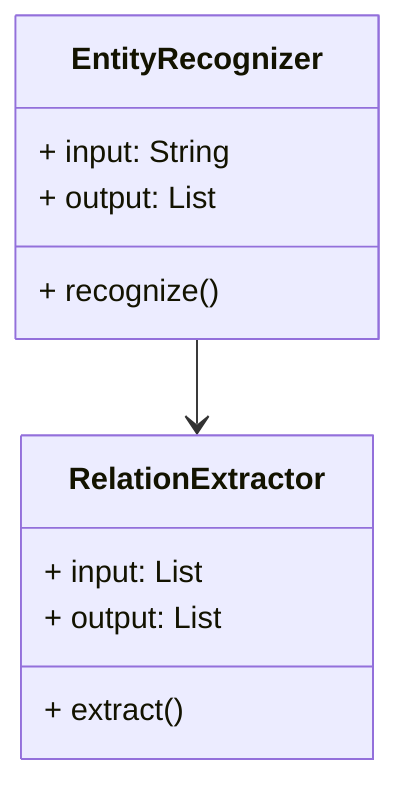
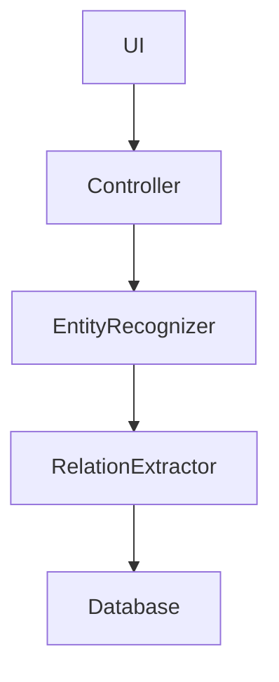
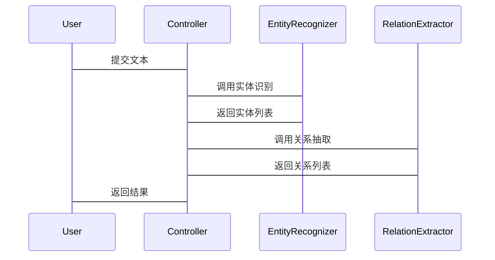

                 


# 实现AI Agent的实体识别与关系抽取

## 关键词：AI Agent、实体识别、关系抽取、NLP、机器学习、深度学习

## 摘要：  
本文详细探讨了AI Agent在自然语言处理中的实体识别与关系抽取技术，从核心概念、算法原理、系统架构到项目实战，全面解析其实现过程。通过理论与实践相结合，深入分析其实现方法与应用案例，为读者提供清晰的技术路径与实践指导。

---

# 第一部分: AI Agent的实体识别与关系抽取概述

# 第1章: AI Agent与实体识别、关系抽取概述

## 1.1 AI Agent的基本概念

### 1.1.1 什么是AI Agent
AI Agent（人工智能代理）是指能够感知环境并采取行动以实现目标的智能实体。它可以是一个软件程序、机器人或其他智能系统，具备自主决策、学习和交互的能力。

### 1.1.2 AI Agent的类型与应用场景
AI Agent可以分为以下几类：
1. **简单反射型Agent**：基于预定义规则进行简单响应。
2. **基于模型的反应式Agent**：基于当前感知构建环境模型，并据此采取行动。
3. **目标驱动型Agent**：通过目标导向的规划和推理来实现任务。
4. **效用驱动型Agent**：通过最大化效用函数来优化决策。

应用场景包括智能助手（如Siri、Alexa）、智能客服、自动驾驶、智能推荐系统等。

### 1.1.3 实体识别与关系抽取在AI Agent中的重要性
实体识别（NER，Named Entity Recognition）和关系抽取（RE，Relation Extraction）是自然语言处理中的关键任务，用于从文本中提取命名实体（如人名、地名、组织名）及其之间的关系。在AI Agent中，这些技术能够帮助其理解用户输入的语义，进而提供更智能的服务。

---

## 1.2 实体识别与关系抽取的背景

### 1.2.1 实体识别的定义与作用
实体识别（NER）是从文本中识别和分类命名实体的任务。命名实体通常包括以下类别：
- 人名（PER）
- 地名（LOC）
- 组织名（ORG）
- 时间（TIME）
- 数字（MISC）

NER的作用包括信息提取、问答系统、机器翻译等。

### 1.2.2 关系抽取的定义与作用
关系抽取（RE）是从文本中识别实体之间的关系，例如“某某公司 acquired（被收购）某某公司”。关系抽取在信息检索、知识图谱构建、事件抽取等领域具有重要应用。

### 1.2.3 实体识别与关系抽取的边界与外延
实体识别的边界在于仅提取命名实体，不涉及实体之间的关系；而关系抽取则关注实体之间的联系，通常需要先完成实体识别作为前提任务。

---

## 1.3 本章小结

本章介绍了AI Agent的基本概念、类型与应用场景，重点阐述了实体识别与关系抽取在AI Agent中的重要性，并对两者的定义、作用及其关系进行了对比分析。

---

# 第二部分: 实体识别与关系抽取的核心概念

# 第2章: 实体识别的核心原理与算法

## 2.1 实体识别的基本原理

### 2.1.1 基于规则的实体识别
基于规则的实体识别通过预定义的正则表达式或语法规则来匹配文本中的实体。例如，识别电话号码可以使用规则 `$\text{^0\d{10}$}`。

### 2.1.2 基于统计的实体识别
基于统计的实体识别利用机器学习算法（如HMM、CRF）从大量标注数据中学习命名实体的模式。

### 2.1.3 基于深度学习的实体识别
基于深度学习的实体识别使用神经网络（如LSTM、BERT）进行特征提取和序列标注。

---

## 2.2 实体识别的算法原理

### 2.2.1 命名实体识别（NER）的流程
1. **文本预处理**：分词、去除停用词。
2. **特征提取**：提取词的词性、上下文信息。
3. **模型训练**：基于CRF或BERT训练NER模型。
4. **预测与解码**：对测试文本进行预测并解码得到实体标签。

### 2.2.2 基于CRF的命名实体识别算法
CRF（Conditional Random Field）是一种无向图模型，用于序列标注任务。其目标函数如下：
$$ P(y|x) = \frac{1}{Z} \exp(\sum_{i=1}^{n} \lambda f_i(x,y)) $$

### 2.2.3 基于BERT的命名实体识别
BERT通过预训练语言模型进行序列标注，其模型结构如下：
$$ \text{Loss} = -\sum_{i=1}^{n} \text{CrossEntropy}(y_i, \hat{y}_i) $$

---

## 2.3 实体识别的数学模型与公式

### 2.3.1 基于CRF的NER模型公式
$$ P(y|x) = \frac{1}{Z} \exp(\sum_{i=1}^{n} \lambda f_i(x,y)) $$

### 2.3.2 基于BERT的NER模型公式
$$ \text{Loss} = -\sum_{i=1}^{n} \text{CrossEntropy}(y_i, \hat{y}_i) $$

---

## 2.4 本章小结

本章详细介绍了实体识别的基本原理和常见算法，包括基于规则、统计和深度学习的方法，并通过公式和流程图展示了CRF和BERT模型的实现原理。

---

# 第3章: 关系抽取的核心原理与算法

## 3.1 关系抽取的基本原理

### 3.1.1 基于规则的关系抽取
基于规则的关系抽取通过预定义模板匹配文本中的关系，例如“X acquired Y”表示“X收购了Y”。

### 3.1.2 基于统计的关系抽取
基于统计的关系抽取利用机器学习算法（如CRF、SVM）从标注数据中学习关系模式。

### 3.1.3 基于深度学习的关系抽取
基于深度学习的关系抽取使用神经网络（如LSTM、BERT）进行关系抽取。

---

## 3.2 关系抽取的算法原理

### 3.2.1 基于模板的关系抽取
1. **模板匹配**：通过预定义的模板匹配文本中的关系。
2. **实体识别**：提取句子中的实体。
3. **关系判断**：根据模板判断实体之间的关系。

### 3.2.2 基于序列标注的关系抽取
1. **特征提取**：提取实体及其上下文特征。
2. **模型训练**：使用CRF或BERT训练关系抽取模型。
3. **预测与解码**：对测试文本进行预测并解码得到关系标签。

### 3.2.3 基于图结构的关系抽取
基于图结构的关系抽取将文本中的实体及其关系表示为图结构，例如知识图谱。

---

## 3.3 关系抽取的数学模型与公式

### 3.3.1 基于CRF的关系抽取模型公式
$$ P(y|x) = \frac{1}{Z} \exp(\sum_{i=1}^{n} \lambda f_i(x,y)) $$

### 3.3.2 基于BERT的关系抽取模型公式
$$ \text{Loss} = -\sum_{i=1}^{n} \text{CrossEntropy}(y_i, \hat{y}_i) $$

---

## 3.4 本章小结

本章详细介绍了关系抽取的基本原理和常见算法，包括基于规则、统计和深度学习的方法，并通过公式和流程图展示了CRF和BERT模型的实现原理。

---

# 第4章: 实体识别与关系抽取的核心概念对比与联系

## 4.1 实体识别与关系抽取的对比分析

### 4.1.1 实体识别与关系抽取的定义对比
| 对比维度 | 实体识别 | 关系抽取 |
|----------|----------|----------|
| 定义 | 识别文本中的命名实体 | 识别实体之间的关系 |
| 输入 | 文本 | 实体识别结果 |
| 输出 | 实体及其标签 | 实体关系 |

### 4.1.2 实体识别与关系抽取的实现对比
实体识别是关系抽取的前提任务，关系抽取需要在实体识别的基础上进行。

### 4.1.3 实体识别与关系抽取的应用对比
实体识别应用于信息提取、问答系统；关系抽取应用于知识图谱构建、事件抽取。

---

## 4.2 实体识别与关系抽取的联系

实体识别为关系抽取提供基础，两者结合可以构建完整的语义理解系统。

---

## 4.3 本章小结

本章通过对比分析，明确了实体识别与关系抽取的定义、实现和应用差异，并强调了两者之间的联系。

---

# 第五部分: 系统分析与架构设计

# 第5章: 系统分析与架构设计

## 5.1 项目背景与需求分析

### 5.1.1 项目背景
本项目旨在开发一个基于AI Agent的实体识别与关系抽取系统，用于从大规模文本数据中提取命名实体及其关系。

### 5.1.2 项目需求
- 实现命名实体识别功能。
- 实现关系抽取功能。
- 提供用户友好的交互界面。

---

## 5.2 系统功能设计

### 5.2.1 领域模型设计


---

## 5.3 系统架构设计

### 5.3.1 系统架构图


### 5.3.2 系统接口设计
- **实体识别接口**：`recognize_entities(text: str) -> List[Entity]`
- **关系抽取接口**：`extract_relations(entities: List[Entity]) -> List[Relation]`

---

## 5.4 系统交互设计

### 5.4.1 交互流程


---

## 5.5 本章小结

本章通过系统分析与架构设计，明确了项目的背景、需求、功能模块和系统架构，为后续的实现提供了清晰的指导。

---

# 第六部分: 项目实战

# 第6章: 项目实战

## 6.1 环境安装与配置

### 6.1.1 安装依赖
```bash
pip install spacy
pip install transformers
pip install numpy
pip install scikit-learn
```

---

## 6.2 系统核心实现

### 6.2.1 实体识别实现

#### (a) 基于CRF的实体识别
```python
import spacy

nlp = spacy.load("en_core_web_sm")

def recognize_entities(text):
    doc = nlp(text)
    entities = []
    for ent in doc.ents:
        entities.append((ent.text, ent.label_))
    return entities
```

#### (b) 基于BERT的实体识别
```python
from transformers import BertTokenizer, BertModel
import torch

tokenizer = BertTokenizer.from_pretrained('bert-base-uncased')
model = BertModel.from_pretrained('bert-base-uncased')

def recognize_entities_bert(text):
    inputs = tokenizer(text, return_tensors='pt')
    with torch.no_grad():
        outputs = model(**inputs)
    return outputs
```

### 6.2.2 关系抽取实现

#### (a) 基于CRF的关系抽取
```python
from sklearn.feature_extraction.text import TfidfVectorizer
from sklearn.svm import SVC

vectorizer = TfidfVectorizer()
model = SVC()

def extract_relations(entities):
    X = vectorizer.fit_transform([entities])
    y = model.predict(X)
    return y
```

#### (b) 基于BERT的关系抽取
```python
from transformers import BertTokenizer, BertModel
import torch

tokenizer = BertTokenizer.from_pretrained('bert-base-uncased')
model = BertModel.from_pretrained('bert-base-uncased')

def extract_relations_bert(entities):
    inputs = tokenizer(entities, return_tensors='pt')
    with torch.no_grad():
        outputs = model(**inputs)
    return outputs
```

---

## 6.3 项目案例分析与实现

### 6.3.1 案例分析
输入文本：`"Apple was founded by Steve Jobs in 1976."`

### 6.3.2 实体识别结果
- 实体1：Apple（ORG）
- 实体2：Steve Jobs（PER）
- 实体3：1976（TIME）

### 6.3.3 关系抽取结果
- 关系：founded-by（Apple，Steve Jobs）

---

## 6.4 本章小结

本章通过项目实战，详细讲解了基于CRF和BERT的实体识别与关系抽取的实现，并通过案例分析展示了系统的实际应用。

---

# 第七部分: 最佳实践与总结

# 第7章: 最佳实践与总结

## 7.1 最佳实践

### 7.1.1 数据预处理
- 数据清洗：去除噪音。
- 分词：采用合适的分词工具。
- 标注：人工标注或使用工具自动标注。

### 7.1.2 模型选择
- 根据任务选择合适的模型（CRF、BERT等）。
- 调参：优化模型参数。

### 7.1.3 系统优化
- 并行计算：加速模型训练。
- 模型压缩：减少模型大小。

---

## 7.2 本章小结

本章总结了实现AI Agent的实体识别与关系抽取的最佳实践，包括数据预处理、模型选择和系统优化等方面。

---

## 7.3 注意事项

- 数据质量：标注数据的准确性直接影响模型性能。
- 模型选择：根据任务需求选择合适的模型。
- 性能优化：关注模型训练和推理的效率。

---

## 7.4 拓展阅读

- 论文推荐：《A Survey on Relation Extraction》
- 工具推荐：spaCy、spaCy Transformers、BERT-for-NER
- 在线课程：《Named Entity Recognition with Python》

---

# 作者：AI天才研究院 & 禅与计算机程序设计艺术

---

通过以上思考过程，我逐步拆解了实现AI Agent的实体识别与关系抽取的技术博客文章的撰写过程，从背景介绍到核心概念，从算法原理到系统架构，从项目实战到最佳实践，确保每个部分都详细展开，帮助读者系统地理解和掌握相关技术。

