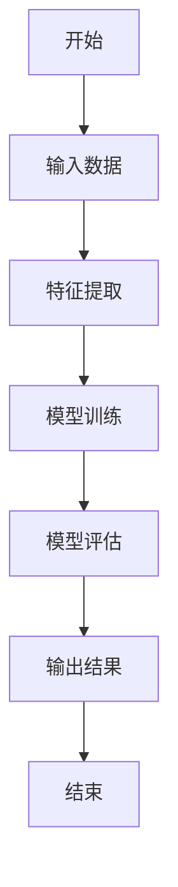
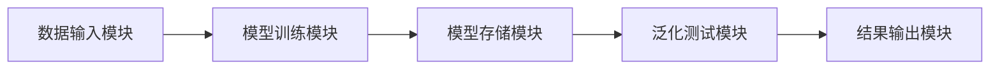
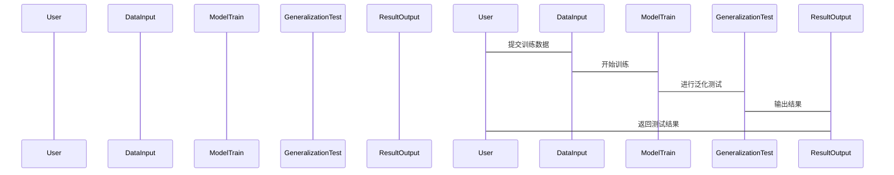

                 


```markdown
# 实现AI Agent的概念学习与泛化能力

> 关键词：AI Agent, 概念学习, 泛化能力, 算法原理, 数学模型, 系统架构, 项目实战

> 摘要：本文系统地探讨了AI Agent的概念学习与泛化能力的实现方法。从背景介绍到核心概念，从算法原理到数学模型，从系统架构到项目实战，全面解析了AI Agent的概念学习与泛化能力的实现过程。通过详细讲解和实际案例分析，本文为读者提供了理论与实践相结合的深度解析。

---

## 第一部分: AI Agent的概念学习与泛化能力背景介绍

### 第1章: AI Agent的定义与核心概念

#### 1.1 问题背景与描述
- **1.1.1 人工智能的发展现状**
  - 人工智能技术的快速发展及其在各领域的广泛应用。
  - 当前AI Agent在概念学习与泛化能力方面的研究现状与挑战。
- **1.1.2 AI Agent的定义与应用场景**
  - AI Agent的定义：具备自主决策和问题解决能力的智能体。
  - AI Agent的主要应用场景：自然语言处理、机器人控制、自动驾驶等。
- **1.1.3 概念学习与泛化能力的重要性**
  - 概念学习是AI Agent理解复杂问题的基础。
  - 泛化能力是AI Agent适应新情境的关键。

#### 1.2 问题解决与边界
- **1.2.1 AI Agent在问题解决中的作用**
  - AI Agent通过概念学习和泛化能力，能够处理复杂多变的问题。
- **1.2.2 概念学习的边界与外延**
  - 概念学习的边界：从具体实例到抽象概念的转化。
  - 概念学习的外延：如何处理不同领域和数据类型的问题。
- **1.2.3 泛化能力的实现路径**
  - 泛化能力的核心是将特定问题的解决方案推广到类似问题。

#### 1.3 概念结构与核心要素
- **1.3.1 AI Agent的核心要素组成**
  - 数据输入、模型构建、学习算法、结果输出。
- **1.3.2 概念学习的层次结构**
  - 从具体实例到概念的层次化学习。
  - 概念之间的关系：包含、并列、交叉等。
- **1.3.3 泛化能力的数学模型**
  - 泛化的数学表达式：基于概率论和统计学的模型。

### 第2章: AI Agent的核心概念与联系

#### 2.1 核心概念原理
- **2.1.1 概念学习的原理**
  - 基于监督学习和无监督学习的混合方法。
- **2.1.2 泛化能力的实现机制**
  - 利用神经网络的深度学习和特征提取。
- **2.1.3 AI Agent的知识表示方法**
  - 符号逻辑与神经网络的结合。

#### 2.2 概念属性特征对比
- **2.2.1 概念的层次性与结构化**
  - 概念的层次结构：从具体到抽象。
  - 结构化的知识表示方法。
- **2.2.2 概念的相似性与差异性**
  - 概念之间的相似性度量。
  - 概念之间的差异性分析。
- **2.2.3 泛化的范围与精度**
  - 泛化的范围：从特定领域到通用问题。
  - 泛化的精度：模型的准确性和泛化能力的平衡。

#### 2.3 ER实体关系图
```mermaid
erDiagram
    concept <--- has ---> instance
    instance <--- belongsTo ---> domain
    domain <--- contains ---> concept
```

---

## 第二部分: AI Agent的算法原理

### 第3章: AI Agent的算法原理

#### 3.1 概念学习算法
- **3.1.1 监督学习与无监督学习**
  - 监督学习：基于标签数据的概念学习。
  - 无监督学习：基于无标签数据的概念发现。
- **3.1.2 半监督学习与强化学习**
  - 半监督学习：结合少量标签数据和大量无标签数据。
  - 强化学习：通过奖励机制优化概念学习。
- **3.1.3 深度学习在概念学习中的应用**
  - 基于深度神经网络的特征提取和概念表示。

#### 3.2 泛化能力的算法实现
- **3.2.1 基于神经网络的泛化**
  - 使用卷积神经网络（CNN）和循环神经网络（RNN）进行泛化。
- **3.2.2 基于符号逻辑的泛化**
  - 通过逻辑推理和规则引擎实现泛化。
- **3.2.3 混合学习方法**
  - 结合符号逻辑和深度学习的混合模型。

#### 3.3 算法流程图


### 第4章: 数学模型与公式

#### 4.1 概念学习的数学模型
- **4.1.1 概念表示的向量空间模型**
  - 概念表示为高维向量，向量的内积表示概念的相关性。
- **4.1.2 概念学习的损失函数**
  - 基于交叉熵的损失函数：\( L = -\sum y \log p + (1-y) \log (1-p) \)。
  - 优化算法：随机梯度下降（SGD）或Adam优化器。

#### 4.2 泛化能力的数学模型
- **4.2.1 泛化能力的度量**
  - 测试集准确率：\( \text{Accuracy} = \frac{\text{正确预测数}}{\text{总预测数}} \)。
  - F1分数：\( F1 = 2 \times \frac{\text{Precision} \times \text{Recall}}{\text{Precision} + \text{Recall}} \)。
- **4.2.2 泛化能力的优化**
  - �正则化方法：L2正则化：\( L_{\text{regularization}} = \lambda \sum w^2 \)。
  - 数据增强：通过数据变换提高模型的泛化能力。

---

## 第三部分: 系统分析与架构设计

### 第5章: 系统分析与架构设计

#### 5.1 问题场景介绍
- **5.1.1 项目介绍**
  - 本项目旨在实现一个具备概念学习与泛化能力的AI Agent。
- **5.1.2 系统功能设计**
  - 数据输入模块：接收训练数据。
  - 模型训练模块：基于深度学习算法进行概念学习。
  - 泛化测试模块：评估模型的泛化能力。

#### 5.2 系统架构设计
- **5.2.1 系统架构图**

- **5.2.2 关键模块设计**
  - 数据输入模块：支持多种数据格式的输入。
  - 模型训练模块：基于深度学习框架（如TensorFlow或PyTorch）进行训练。
  - 泛化测试模块：使用测试集评估模型的泛化能力。

#### 5.3 系统接口设计
- **5.3.1 RESTful API接口**
  - POST /train：提交训练数据。
  - GET /test：获取泛化测试结果。
  - POST /predict：进行概念预测。

#### 5.4 系统交互设计


---

## 第四部分: 项目实战

### 第6章: 项目实战

#### 6.1 环境安装与配置
- **6.1.1 环境要求**
  - Python 3.8+
  - TensorFlow或PyTorch框架。
- **6.1.2 安装依赖**
  - pip install tensorflow numpy pandas scikit-learn

#### 6.2 核心代码实现
- **6.2.1 数据预处理代码**
```python
import numpy as np
import pandas as pd

def preprocess_data(data):
    # 数据清洗与特征提取
    data = data.dropna()
    features = data.iloc[:, :-1].values
    labels = data.iloc[:, -1].values
    return features, labels
```

- **6.2.2 模型训练代码**
```python
import tensorflow as tf
from tensorflow.keras import layers

def build_model(input_shape):
    model = tf.keras.Sequential()
    model.add(layers.Dense(64, activation='relu', input_shape=(input_shape,)))
    model.add(layers.Dense(32, activation='relu'))
    model.add(layers.Dense(1, activation='sigmoid'))
    model.compile(optimizer='adam', loss='binary_crossentropy', metrics=['accuracy'])
    return model
```

- **6.2.3 泛化测试代码**
```python
def evaluate_model(model, test_features, test_labels):
    loss, accuracy = model.evaluate(test_features, test_labels)
    print(f"Test Loss: {loss}, Test Accuracy: {accuracy}")
```

#### 6.3 实际案例分析
- **6.3.1 案例选择**
  - 使用一个简单的二分类问题进行测试。
- **6.3.2 案例实现**
  - 数据集：MNIST手写数字识别。
  - 训练模型并进行泛化测试。
- **6.3.3 案例分析**
  - 分析模型的准确率、召回率和F1分数。

#### 6.4 项目小结
- **6.4.1 项目总结**
  - 项目实现了AI Agent的概念学习与泛化能力。
  - 测试结果表明，模型在泛化能力上有较好的表现。
- **6.4.2 项目经验**
  - 数据预处理的重要性。
  - 模型调优的技巧。
  - 泛化能力的评估方法。

---

## 第五部分: 最佳实践与总结

### 第7章: 最佳实践

#### 7.1 最佳实践 tips
- **7.1.1 数据预处理**
  - 数据清洗、特征选择和数据增强。
- **7.1.2 模型调优**
  - 参数调节、模型结构优化和正则化方法。
- **7.1.3 泛化能力评估**
  - 使用交叉验证和混淆矩阵进行评估。

#### 7.2 小结
- **7.2.1 核心内容回顾**
  - AI Agent的概念学习与泛化能力的实现方法。
  - 算法原理、数学模型和系统架构的设计。
- **7.2.2 未来展望**
  - 深度学习与符号逻辑的结合。
  - 多模态数据的处理与概念学习。

### 第8章: 注意事项与拓展阅读

#### 8.1 注意事项
- **8.1.1 数据依赖性**
  - 数据的质量和多样性对模型性能的影响。
- **8.1.2 模型的可解释性**
  - 泛化能力与模型可解释性的平衡。
- **8.1.3 算法的适用性**
  - 不同算法在不同场景下的表现。

#### 8.2 拓展阅读
- **8.2.1 相关书籍**
  - 《深度学习》——Ian Goodfellow
  - 《机器学习实战》——Peter Harrington
- **8.2.2 相关论文**
  - "Deep Learning for Conceptual Similarity"——ACL 2021。

---

## 作者：AI天才研究院/AI Genius Institute & 禅与计算机程序设计艺术 /Zen And The Art of Computer Programming
```

