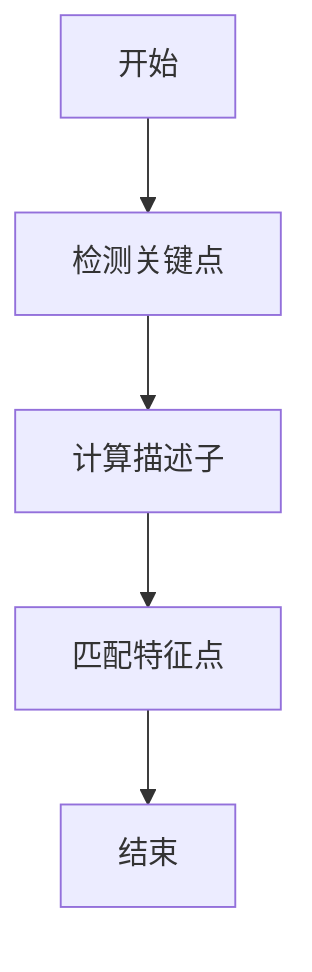
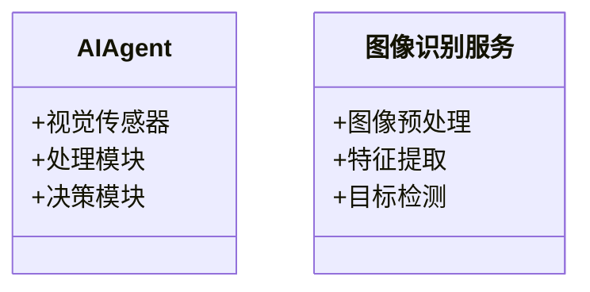
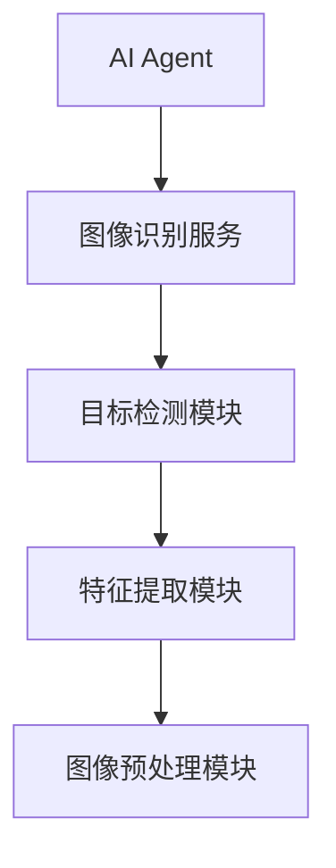

                 


```markdown
# 实现AI Agent的视觉理解能力：图像识别与分析

> 关键词：AI Agent，视觉理解，图像识别，深度学习，计算机视觉，目标检测

> 摘要：本文系统地探讨了实现AI Agent视觉理解能力的关键技术，重点分析了图像识别与分析的核心概念、算法原理、系统架构设计以及实际项目中的应用。通过对比传统图像处理与深度学习方法，结合实际案例，详细阐述了AI Agent视觉理解能力的实现过程。

---

## 第一部分：AI Agent与视觉理解基础

### 第1章：AI Agent与视觉理解的背景介绍

#### 1.1 AI Agent的基本概念
AI Agent（智能体）是指能够感知环境并采取行动以实现目标的实体。AI Agent的核心能力包括感知、决策和行动。在复杂环境中，AI Agent需要处理多模态信息，其中视觉信息占据了重要地位。

- **AI Agent的特点**：
  - 智能性：能够理解环境并做出合理决策。
  - 自主性：能够在没有外部干预的情况下运行。
  - 反应性：能够实时感知环境变化并做出反应。
  - 学习能力：通过经验改进性能。

- **视觉理解在AI Agent中的作用**：
  - 通过视觉感知环境，识别物体、场景和行为。
  - 为决策提供关键信息，例如路径规划、目标识别等。

#### 1.2 图像识别与分析的核心概念
图像识别是AI Agent视觉理解的基础，涉及从图像中提取有用信息的过程。以下是图像识别的关键概念：

- **图像分类**：将图像归类到预定义的类别中，例如识别一张图片是猫还是狗。
- **目标检测**：在图像中定位并识别特定对象的位置和类别。
- **图像分割**：将图像分割成有意义的区域，例如将人、车、道路分开。
- **图像描述**：用文字描述图像内容，例如“一只猫在草地上玩耍”。

### 第2章：图像识别与分析的核心概念与联系

#### 2.1 核心概念原理
图像识别的过程可以分为以下几个步骤：
1. **图像预处理**：调整图像亮度、对比度等，增强目标物体的特征。
2. **特征提取**：提取图像中的关键特征，例如边缘、纹理等。
3. **分类或检测**：基于提取的特征进行分类或定位。
4. **结果分析**：对结果进行解释和应用。

#### 2.2 核心概念对比表格
以下是传统图像处理与深度学习方法的对比：

| 特性                | 传统图像处理          | 深度学习方法          |
|---------------------|-----------------------|-----------------------|
| 数据需求            | 小规模数据            | 大规模标注数据        |
| 特征提取            | 手工设计特征          | 自动学习特征          |
| 算法复杂度          | 较低                  | 较高                  |
| 精度                | 有限                  | 更高                  |

#### 2.3 ER实体关系图
以下是AI Agent与图像识别服务的关系图：

```mermaid
er
actor: AI Agent
role: 使用图像识别服务
```

---

## 第二部分：图像识别与分析的算法原理

### 第3章：传统图像处理算法

#### 3.1 SIFT算法流程图
SIFT（尺度不变特征变换）是一种常用的特征提取算法，其流程如下：



#### 3.2 SIFT算法代码示例
以下是SIFT算法的Python实现示例：

```python
import cv2

# 读取图像
img = cv2.imread('image.jpg')
gray = cv2.cvtColor(img, cv2.COLOR_BGR2GRAY)

# SIFT特征提取
sift = cv2.SIFT_create()
kp, des = sift.detectAndCompute(gray, None)

print("Number of keypoints:", len(kp))
```

---

## 第三部分：AI Agent视觉理解的系统架构设计

### 第4章：问题场景介绍
AI Agent需要在复杂环境中进行视觉理解，例如自动驾驶中的物体识别、智能安防中的目标检测等。

#### 4.1 系统功能设计
以下是系统功能的领域模型：



#### 4.2 系统架构设计
以下是系统架构的mermaid图：



---

## 第四部分：AI Agent视觉理解的项目实战

### 第5章：环境安装与系统实现
以下是垃圾分类系统的实现步骤：

#### 5.1 环境安装
```bash
pip install numpy
pip install opencv-python
pip install tensorflow
```

#### 5.2 数据准备
将图片分类到不同的文件夹中，例如：
```
data/
  train/
    dog/
    cat/
  test/
    dog/
    cat/
```

#### 5.3 模型训练
使用卷积神经网络（CNN）进行训练：

```python
import tensorflow as tf
from tensorflow.keras import layers

model = tf.keras.Sequential([
    layers.Conv2D(32, (3,3), activation='relu', input_shape=(150, 150, 3)),
    layers.MaxPooling2D((2,2)),
    layers.Conv2D(64, (3,3), activation='relu'),
    layers.MaxPooling2D((2,2)),
    layers.Flatten(),
    layers.Dense(128, activation='relu'),
    layers.Dense(2, activation='softmax')
])

model.compile(optimizer='adam', loss='sparse_categorical_crossentropy', metrics=['accuracy'])
model.fit(train_images, train_labels, epochs=10, validation_data=(test_images, test_labels))
```

---

## 第五部分：高级主题与未来展望

### 第6章：模型压缩与部署
为了提高模型的运行效率，可以使用模型压缩技术，例如剪枝和量化。

#### 6.1 模型剪枝
剪枝是指移除模型中冗余的神经元或连接，减少计算量。

#### 6.2 模型量化
量化是指将模型中的浮点数权重转换为整数，减少存储空间和计算时间。

### 第7章：多模态融合与实时性优化
结合其他模态数据（如音频、文本）可以提高模型的准确性和鲁棒性。此外，实时性优化技术（如并行计算、硬件加速）可以提升模型的运行效率。

---

## 结语
本文系统地探讨了实现AI Agent视觉理解能力的关键技术，从图像识别的基本概念到深度学习算法，再到系统的实际应用，为读者提供了全面的视角。未来，随着技术的进步，AI Agent的视觉理解能力将更加智能化和多样化。

---

## 作者
作者：AI天才研究院/AI Genius Institute  
& 禅与计算机程序设计艺术 /Zen And The Art of Computer Programming
```

