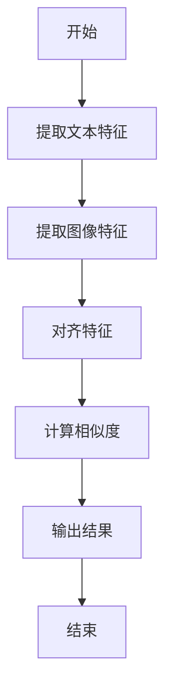
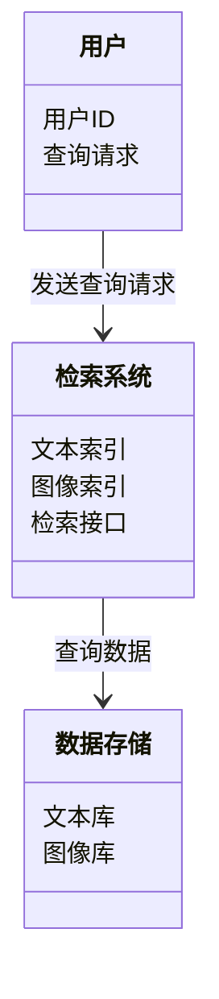
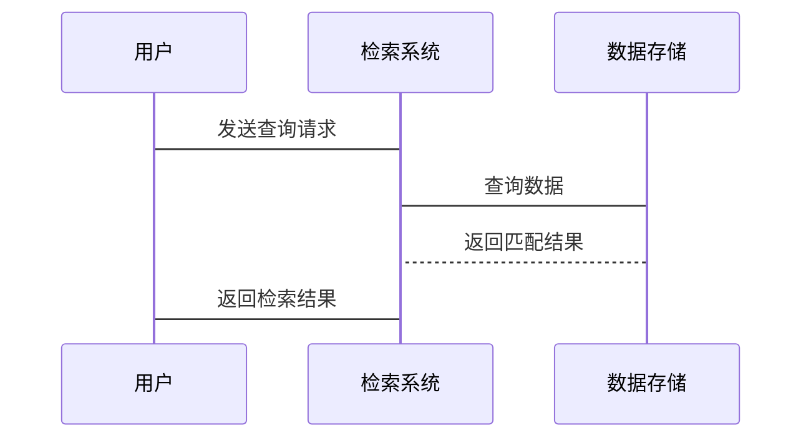

                 


# 实现AI Agent的跨模态检索能力

> 关键词：AI Agent，跨模态检索，多模态数据，检索算法，系统架构，应用场景

> 摘要：本文详细探讨了实现AI Agent跨模态检索能力的关键技术，包括跨模态检索的核心概念、算法原理、系统架构设计、项目实战以及最佳实践。通过理论与实践相结合的方式，帮助读者理解如何在AI Agent中构建高效的跨模态检索系统。

---

# 第1章: 跨模态检索与AI Agent的背景介绍

## 1.1 跨模态检索的定义与问题背景

### 1.1.1 跨模态数据的定义
跨模态数据是指来自不同感官或数据类型的组合数据，例如文本、图像、语音、视频等。这些数据类型之间存在语义关联，但形式和特征完全不同。

### 1.1.2 跨模态检索的核心问题
跨模态检索的核心问题是在不同模态的数据之间建立语义关联，并通过检索技术实现跨模态数据的高效匹配。

### 1.1.3 跨模态检索的应用场景
跨模态检索在多个领域有广泛应用，例如：
- **多模态搜索**：在搜索引擎中实现文本与图像的联合检索。
- **智能问答系统**：结合文本和图像信息提供更精准的答案。
- **推荐系统**：根据用户行为和偏好推荐相关内容。
- **机器人视觉与语言交互**：机器人通过视觉和语言理解环境并执行任务。

---

## 1.2 AI Agent的定义与特点

### 1.2.1 AI Agent的基本概念
AI Agent（人工智能代理）是指能够感知环境、自主决策并执行任务的智能实体。它可以是一个软件程序、机器人或其他智能系统。

### 1.2.2 AI Agent的核心能力
- **感知能力**：通过传感器或数据输入接口获取环境信息。
- **决策能力**：基于获取的信息做出合理决策。
- **执行能力**：通过执行机构或接口完成任务。

### 1.2.3 AI Agent与传统检索系统的区别
AI Agent具有自主性和学习能力，能够根据动态环境调整行为，而传统检索系统仅基于静态规则进行匹配。

---

## 1.3 跨模态检索在AI Agent中的重要性

### 1.3.1 跨模态检索的需求来源
AI Agent需要处理多种模态的数据，例如自然语言理解、图像识别等，因此需要跨模态检索能力来实现多模态数据的融合与分析。

### 1.3.2 跨模态检索对AI Agent能力的提升
- **提升信息处理能力**：通过跨模态检索，AI Agent能够更全面地理解用户需求。
- **增强决策能力**：结合多模态数据，AI Agent可以做出更准确的决策。
- **优化用户体验**：通过跨模态检索，用户可以获得更相关和个性化的结果。

### 1.3.3 跨模态检索的未来发展
随着AI技术的不断进步，跨模态检索将在AI Agent中扮演越来越重要的角色，推动人机交互和智能系统的发展。

---

## 1.4 本章小结
本章介绍了跨模态检索的核心概念和AI Agent的基本特点，强调了跨模态检索在AI Agent中的重要性。下一章将深入探讨跨模态检索的核心原理与技术。

---

# 第2章: 跨模态检索的核心概念与联系

## 2.1 跨模态检索的核心原理

### 2.1.1 跨模态数据的表示方法
跨模态数据可以通过多种方式表示，例如：
- **文本表示**：使用词袋模型、TF-IDF或BERT等深度学习模型。
- **图像表示**：使用CNN提取图像特征。

### 2.1.2 跨模态检索的匹配机制
匹配机制是跨模态检索的核心，常用的方法包括：
- **基于相似度匹配**：计算文本和图像的相似度，选择最接近的结果。
- **基于概率匹配**：利用概率模型计算不同模态之间的匹配概率。

### 2.1.3 跨模态检索的评价指标
常用的评价指标包括准确率（Accuracy）、召回率（Recall）、F1分数等。

---

## 2.2 跨模态检索的关键技术

### 2.2.1 多模态特征提取
- **文本特征提取**：使用词嵌入（Word2Vec）或BERT模型提取文本特征。
- **图像特征提取**：使用CNN提取图像特征。

### 2.2.2 跨模态对齐方法
- **对齐技术**：通过对比学习或对抗训练实现不同模态之间的对齐。

### 2.2.3 跨模态检索的优化策略
- **多任务学习**：同时优化多个任务，例如文本分类和图像检索。
- **知识蒸馏**：将复杂模型的知识迁移到轻量级模型。

---

## 2.3 跨模态检索与AI Agent的实体关系图

### 2.3.1 跨模态数据的ER图
以下是一个简单的ER图示例：

```mermaid
erDiagram
    用户 ||--o[拥有] 文本数据
    用户 ||--o[拥有] 图像数据
    文本数据 --|> 检索请求
    图像数据 --|> 检索请求
```

### 2.3.2 AI Agent与跨模态检索的实体关系
以下是一个AI Agent与跨模态检索系统的实体关系图：

```mermaid
erDiagram
    AI Agent ||--o[使用] 跨模态检索系统
    跨模态检索系统 --|> 文本数据
    跨模态检索系统 --|> 图像数据
    检索请求 --|> 检索结果
```

---

## 2.4 本章小结
本章介绍了跨模态检索的核心原理和关键技术，并通过ER图展示了跨模态检索与AI Agent之间的实体关系。下一章将深入探讨跨模态检索的算法原理。

---

# 第3章: 跨模态检索的算法原理

## 3.1 跨模态检索的模型结构

### 3.1.1 多模态编码器的结构
多模态编码器通常由文本编码器和图像编码器组成，分别提取文本和图像的特征向量。

### 3.1.2 跨模态匹配网络的设计
跨模态匹配网络用于将不同模态的特征向量进行匹配，通常使用全连接层或注意力机制。

### 3.1.3 跨模态检索模型的训练流程
1. **特征提取**：分别提取文本和图像的特征向量。
2. **对齐训练**：通过对比学习或对抗训练对齐不同模态的特征。
3. **模型优化**：通过反向传播优化模型参数。

---

## 3.2 跨模态检索的训练方法

### 3.2.1 对比学习方法
对比学习通过最大化正样本的相似度和最小化负样本的相似度来优化模型。

### 3.2.2 多任务学习策略
多任务学习通过同时优化多个任务来提高模型的泛化能力。

### 3.2.3 知识蒸馏技术
知识蒸馏通过将复杂模型的知识迁移到轻量级模型，降低计算成本。

---

## 3.3 跨模态检索的评估指标

### 3.3.1 基准测试指标
常用的基准测试指标包括MAP（平均准确率）、mAP（修正平均准确率）等。

### 3.3.2 检索性能的评价方法
- **准确率（Accuracy）**：检索结果中相关项的比例。
- **召回率（Recall）**：检索结果中相关项的数量占所有相关项的比例。

### 3.3.3 不同场景下的评估策略
- **精确检索**：注重检索结果的准确性。
- **全面检索**：注重检索结果的全面性。

---

## 3.4 跨模态检索的算法流程图

### 3.4.1 算法流程图
以下是一个跨模态检索算法的流程图：



---

## 3.5 本章小结
本章详细介绍了跨模态检索的算法原理和训练方法，并通过流程图展示了跨模态检索的实现流程。下一章将探讨跨模态检索在AI Agent中的系统设计与实现。

---

# 第4章: 跨模态检索的系统分析与架构设计

## 4.1 跨模态检索系统的功能设计

### 4.1.1 领域模型（类图）
以下是一个跨模态检索系统的领域模型：



### 4.1.2 系统架构设计
跨模态检索系统的典型架构包括：
1. **数据存储层**：存储文本和图像数据。
2. **特征提取层**：提取文本和图像的特征向量。
3. **检索引擎层**：实现跨模态检索功能。
4. **用户交互层**：接收用户请求并返回结果。

---

## 4.2 跨模态检索系统的接口设计

### 4.2.1 API接口设计
- **输入接口**：接收用户的查询请求。
- **输出接口**：返回检索结果。

### 4.2.2 接口交互流程
1. 用户发送查询请求。
2. 系统提取查询特征。
3. 系统匹配目标数据。
4. 系统返回检索结果。

---

## 4.3 跨模态检索系统的交互流程图

### 4.3.1 序列图
以下是一个跨模态检索系统的交互流程图：



---

## 4.4 本章小结
本章通过系统分析和架构设计，展示了跨模态检索在AI Agent中的实现流程。下一章将通过一个具体的项目实战，进一步探讨跨模态检索的实现细节。

---

# 第5章: 跨模态检索的项目实战

## 5.1 项目环境搭建

### 5.1.1 环境要求
- **Python**：3.8+
- **深度学习框架**：TensorFlow或PyTorch
- **其他依赖**：scikit-learn、numpy等。

### 5.1.2 安装依赖
```bash
pip install numpy scikit-learn tensorflow
```

---

## 5.2 系统核心实现源代码

### 5.2.1 文本特征提取代码
```python
import tensorflow as tf
from tensorflow.keras.layers import Dense, GlobalAveragePooling2D
from tensorflow.keras.models import Model

def text_feature_extractor():
    base_model = tf.keras.applications.BERT(include_top=False, input_shape=(max_length,))
    features = base_model.output
    features = GlobalAveragePooling2D()(features)
    predictions = Dense(1, activation='sigmoid')(features)
    model = Model(inputs=base_model.input, outputs=predictions)
    return model
```

### 5.2.2 图像特征提取代码
```python
import tensorflow as tf
from tensorflow.keras.layers import Dense, GlobalAveragePooling2D
from tensorflow.keras.models import Model

def image_feature_extractor():
    base_model = tf.keras.applications.ResNet50(include_top=False, input_shape=(224, 224, 3))
    features = GlobalAveragePooling2D()(base_model.output)
    predictions = Dense(1, activation='sigmoid')(features)
    model = Model(inputs=base_model.input, outputs=predictions)
    return model
```

---

## 5.3 代码应用解读与分析

### 5.3.1 文本特征提取解读
文本特征提取代码使用了BERT模型提取文本特征，并通过全局平均池化层和全连接层进行分类。

### 5.3.2 图像特征提取解读
图像特征提取代码使用了ResNet50模型提取图像特征，并通过全局平均池化层和全连接层进行分类。

---

## 5.4 实际案例分析

### 5.4.1 案例背景
假设我们有一个包含文本描述和对应图像的数据库，用户可以通过文本查询图像。

### 5.4.2 实现步骤
1. **数据预处理**：将文本和图像数据进行归一化处理。
2. **特征提取**：分别提取文本和图像的特征向量。
3. **模型训练**：通过对比学习优化模型参数。
4. **模型推理**：接收用户查询并返回检索结果。

---

## 5.5 本章小结
本章通过一个具体的项目实战，详细讲解了跨模态检索的实现过程，包括环境搭建、代码实现和案例分析。下一章将总结跨模态检索的最佳实践和未来发展方向。

---

# 第6章: 跨模态检索的最佳实践与小结

## 6.1 最佳实践 tips

### 6.1.1 数据预处理
- **数据清洗**：去除噪声数据。
- **数据增强**：通过数据增强技术提高模型的泛化能力。

### 6.1.2 模型优化
- **模型调参**：通过网格搜索或随机搜索优化模型参数。
- **模型融合**：结合多种模型的优势。

### 6.1.3 系统优化
- **分布式计算**：通过分布式计算提高系统性能。
- **缓存机制**：通过缓存机制减少重复计算。

---

## 6.2 小结与展望

### 6.2.1 本章小结
本章总结了跨模态检索的最佳实践，并展望了未来的发展方向。

### 6.2.2 未来展望
- **多模态学习的进一步融合**：通过更先进的模型结构实现更高效的跨模态检索。
- **实时检索技术的突破**：实现低延迟、高吞吐量的实时检索。
- **跨模态检索的可解释性**：提高检索过程的可解释性，满足用户对结果透明性的需求。

---

## 6.3 注意事项

### 6.3.1 数据隐私与安全
在实现跨模态检索时，需要注意数据隐私和安全问题，避免数据泄露。

### 6.3.2 系统性能优化
在实际应用中，需要通过多种技术手段优化系统性能，例如分布式计算和缓存机制。

---

## 6.4 拓展阅读

### 6.4.1 推荐书籍
- 《Deep Learning》
- 《Natural Language Processing with PyTorch》

### 6.4.2 推荐论文
- "Cross-modal retrieval through deep learning"
- "Learning cross-modal embeddings for image-text matching"

---

# 作者：AI天才研究院/AI Genius Institute & 禅与计算机程序设计艺术 /Zen And The Art of Computer Programming

---

本文通过详细分析跨模态检索的核心概念、算法原理、系统设计和项目实战，帮助读者全面理解如何在AI Agent中实现跨模态检索能力。希望本文的内容能够为相关领域的研究人员和开发者提供有价值的参考和启发。

