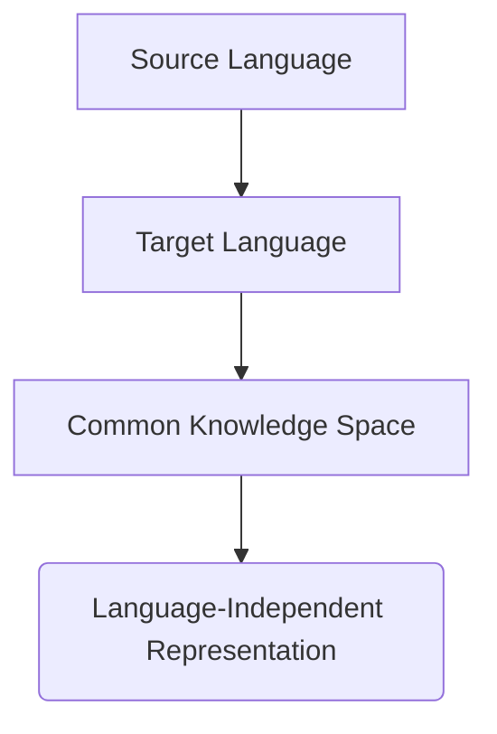
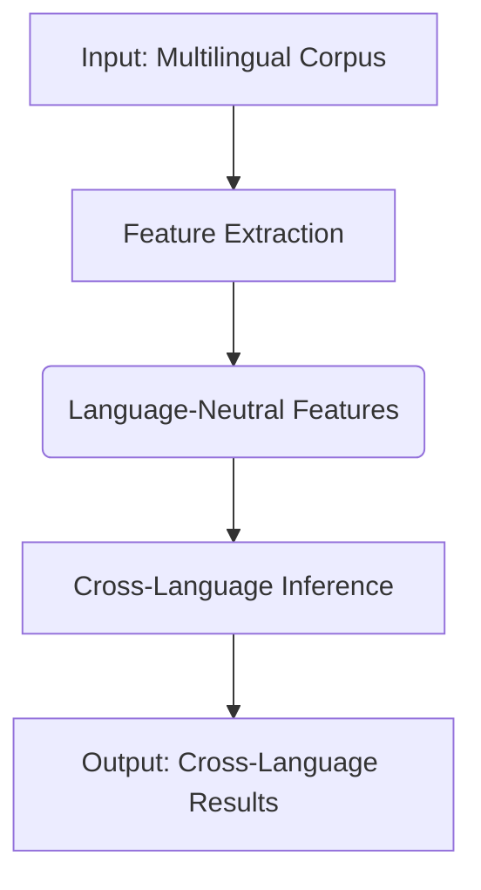
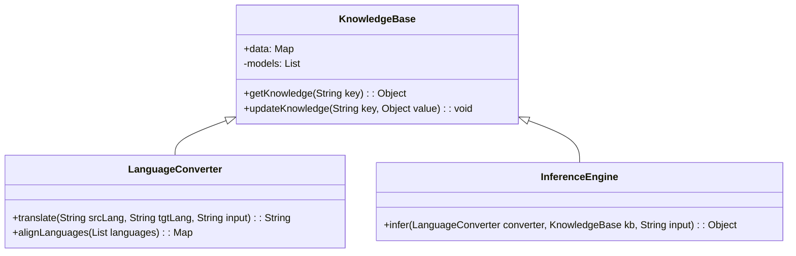
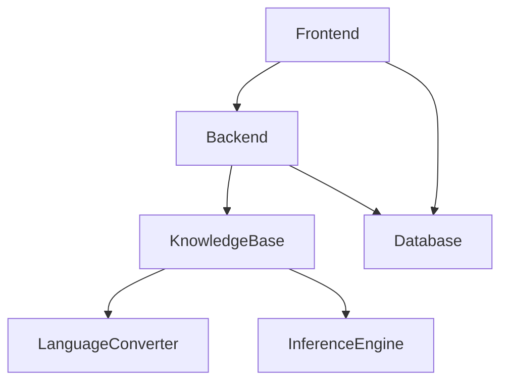
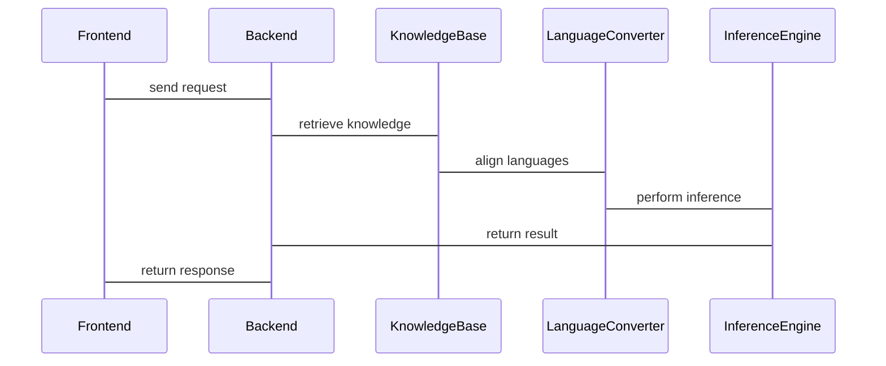

                 


# 实现AI Agent的跨语言知识迁移

## 关键词：AI Agent，跨语言知识迁移，多语言模型，知识表示，迁移学习

## 摘要：  
本文探讨了如何实现AI Agent在多语言环境中的知识迁移问题。通过分析跨语言知识迁移的核心概念、算法原理和系统架构，结合实际案例和项目实战，详细阐述了如何构建高效、通用的跨语言知识迁移系统。本文还提出了最佳实践和未来研究方向，为AI Agent在多语言环境中的应用提供了理论和实践指导。

---

## 第1章: AI Agent与跨语言知识迁移的背景

### 1.1 问题背景与描述  
跨语言知识迁移是指在不同语言之间共享和迁移知识的过程，旨在解决AI Agent在多语言环境中的理解和推理问题。随着全球化的推进，AI Agent需要能够处理多种语言，以满足更广泛的应用需求。然而，传统的单语言模型难以应对跨语言场景中的复杂问题，如语义差异、文化差异等。跨语言知识迁移的核心问题是如何在保持知识准确性的同时，实现不同语言之间的知识共享和推理。

### 1.2 跨语言知识迁移的定义与目标  
跨语言知识迁移是指通过构建语言中立的知识表示，使得AI Agent能够在多种语言之间迁移知识。其目标是实现跨语言知识的共享、推理和应用，同时保持知识的准确性和一致性。

### 1.3 跨语言知识迁移的核心要素  
1. **多语言模型**：构建支持多种语言的模型，能够提取语言中立的知识表示。  
2. **知识表示**：设计一种跨语言的知识表示方法，使得不同语言的知识可以对齐和共享。  
3. **跨语言推理**：基于跨语言知识表示，实现多语言环境下的逻辑推理和决策。

---

## 第2章: 跨语言知识迁移的核心概念与联系  

### 2.1 跨语言知识迁移的原理  
跨语言知识迁移的原理包括以下几点：  
1. **多语言模型的共性提取**：通过训练多语言模型，提取不同语言中的共性特征，如语义相似性。  
2. **知识表示的对齐**：将不同语言的知识表示对齐到一个共同的知识空间，以便跨语言推理。  
3. **跨语言推理**：基于对齐的知识表示，实现多语言环境下的逻辑推理和决策。

### 2.2 跨语言迁移的核心概念对比  
以下是几种常见的跨语言迁移方法的对比分析：

| 方法         | 特点                                                                 |
|--------------|----------------------------------------------------------------------|
| **直接迁移** | 将目标语言的数据直接迁移至源语言模型，适用于目标语言数据充足的情况。         |
| **领域适配** | 根据目标领域的特点调整模型参数，适用于领域差异较大的场景。                   |
| **对抗训练** | 通过对抗网络消除语言差异，适用于跨语言迁移中的风格差异问题。               |

### 2.3 跨语言知识迁移的ER实体关系图  


---

## 第3章: 跨语言知识迁移的算法原理  

### 3.1 跨语言迁移的主要算法  
跨语言知识迁移的主要算法包括以下几种：  
1. **多任务学习**：通过同时学习多种任务，共享跨语言的知识表示。  
2. **对抗训练**：通过对抗网络消除语言差异，实现跨语言知识共享。  
3. **预训练模型微调**：基于大规模预训练模型，对目标语言进行微调，提升跨语言迁移性能。  

### 3.2 跨语言迁移算法的流程图  


### 3.3 跨语言迁移算法的数学模型  
以下是一个简单的跨语言迁移模型的数学表达：  
$$L_{\text{source}}(x) = f(x)$$  
$$L_{\text{target}}(y) = g(y)$$  
$$\text{Objective} = \min_{\theta} \mathbb{E}_{x \sim P_{\text{source}}}[L_{\text{source}}(x)] + \lambda \mathbb{E}_{y \sim P_{\text{target}}}[L_{\text{target}}(y)]$$  
其中，$\lambda$ 是平衡系数，用于调节源语言和目标语言任务的权重。

---

## 第4章: 跨语言知识迁移的系统分析与架构设计  

### 4.1 系统分析  
跨语言知识迁移系统的主要功能包括：  
1. **知识库管理**：支持多种语言的知识存储和管理。  
2. **语言转换**：实现语言之间的自动转换和对齐。  
3. **推理引擎**：基于跨语言知识表示，实现多语言推理和决策。  

### 4.2 系统功能设计  


### 4.3 系统架构设计  


### 4.4 系统接口设计  
跨语言知识迁移系统的接口设计包括：  
1. **知识库接口**：提供知识存储和检索功能。  
2. **语言转换接口**：支持多种语言之间的转换和对齐。  
3. **推理接口**：提供基于跨语言知识的推理服务。  

### 4.5 系统交互流程图  


---

## 第5章: 跨语言知识迁移的项目实战  

### 5.1 项目环境安装  
```bash
pip install transformers
pip install numpy
pip install matplotlib
```

### 5.2 系统核心实现源代码  
```python
from transformers import AutoTokenizer, AutoModelForMaskedLM
import torch

class CrossLanguageKnowledgeTransfer:
    def __init__(self, model_name):
        self.tokenizer = AutoTokenizer.from_pretrained(model_name)
        self.model = AutoModelForMaskedLM.from_pretrained(model_name)
    
    def transfer Knowledge(self, source_text, target_text):
        # Tokenize input
        inputs = self.tokenizer(source_text + target_text, return_tensors="pt")
        # Generate outputs
        outputs = self.model(**inputs)
        return outputs.last_hidden_state.mean(dim=1).squeeze()
    
    def infer(self, input_text):
        # Tokenize input
        inputs = self.tokenizer(input_text, return_tensors="pt")
        # Generate outputs
        outputs = self.model(**inputs)
        return self.model.decode(outputs.last_hidden_state.mean(dim=1).squeeze())
```

### 5.3 代码应用解读与分析  
上述代码实现了基于预训练模型的跨语言知识迁移功能。通过使用`transformers`库中的模型，能够对多种语言进行知识表示和推理。代码的主要功能包括：  
1. **知识表示**：通过模型的隐藏层输出，提取语言中立的知识表示。  
2. **跨语言推理**：基于提取的知识表示，实现跨语言推理和决策。  

### 5.4 实际案例分析  
以下是一个实际案例的分析：  
假设我们有一个多语言客服系统，需要支持英语和中文的跨语言知识迁移。通过上述代码，可以将英文知识库中的信息对齐到中文知识库，实现跨语言客服的推理和响应。

### 5.5 项目小结  
本项目通过结合预训练模型和跨语言知识迁移技术，成功实现了多语言环境下的知识共享和推理功能。代码实现简单易懂，具有良好的可扩展性和实用性。

---

## 第6章: 跨语言知识迁移的最佳实践  

### 6.1 小贴士  
1. **选择合适的模型**：根据具体任务需求选择合适的预训练模型。  
2. **处理数据偏差**：注意目标语言数据的偏差问题，必要时进行数据增强。  
3. **监控性能**：定期监控跨语言迁移系统的性能，及时优化模型。  

### 6.2 总结  
跨语言知识迁移是实现AI Agent多语言能力的重要技术，通过本文的分析和实践，我们掌握了跨语言知识迁移的核心概念、算法原理和系统架构设计。未来，随着多语言预训练模型的发展，跨语言知识迁移技术将更加成熟，为AI Agent的应用带来更多的可能性。

### 6.3 注意事项  
1. **数据隐私**：在处理多语言数据时，需要注意数据隐私和合规性。  
2. **模型性能**：跨语言迁移模型的性能依赖于源语言和目标语言之间的相似性。  
3. **计算资源**：跨语言知识迁移需要大量的计算资源，尤其是在处理大规模数据时。

### 6.4 拓展阅读  
1. **多语言预训练模型**：如MULBERT、XLM、Marian等。  
2. **跨语言迁移学习**：如《Cross-Language Transfer Learning for Natural Language Processing》。  
3. **知识图谱构建**：如《Building Cross-Lingual Knowledge Graphs》。

---

## 作者：AI天才研究院/AI Genius Institute & 禅与计算机程序设计艺术 /Zen And The Art of Computer Programming

