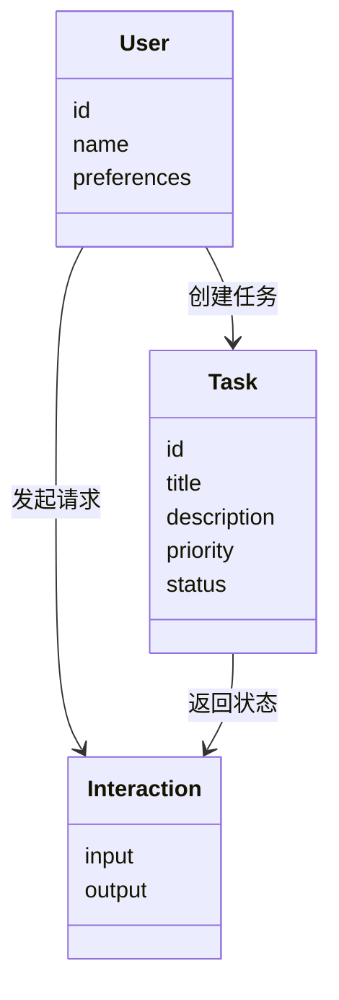
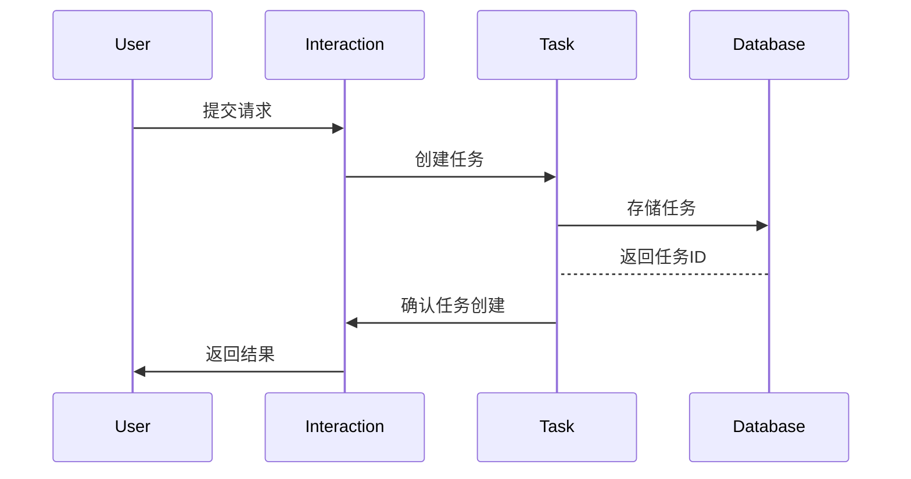

                 


# 实现基于AI Agent的个人助理系统

> 关键词：AI Agent，个人助理系统，机器学习，自然语言处理，系统架构

> 摘要：本文详细探讨了如何基于AI Agent实现个人助理系统。从背景介绍到项目实战，系统性地分析了其实现的关键技术与方法，涵盖核心算法原理、系统架构设计、项目实现与优化等内容，为读者提供了从理论到实践的全面指导。

---

# 第一部分: 背景介绍

## 第1章: 基于AI Agent的个人助理系统概述

### 1.1 问题背景
#### 1.1.1 传统个人助理系统的局限性
传统个人助理系统主要依赖规则引擎和固定脚本，难以处理复杂多变的用户需求和意图识别。例如，基于规则的系统在处理自然语言输入时，容易出现理解偏差，且难以应对上下文关联的复杂场景。

#### 1.1.2 AI技术如何解决这些问题
人工智能技术，尤其是自然语言处理和机器学习的进步，为解决这些问题提供了新的思路。AI Agent可以通过深度学习模型理解用户意图，结合上下文信息提供更智能、个性化的服务。

#### 1.1.3 当前AI Agent的发展趋势
随着大语言模型的发展（如GPT系列），AI Agent正在从单一任务处理向多任务协同方向发展，逐步具备自适应学习和自我优化的能力。

### 1.2 问题描述
#### 1.2.1 个人助理系统的功能需求
- 用户需求分析
- 智能任务调度
- 自然语言理解与生成
- 个性化服务

#### 1.2.2 AI Agent在个人助理中的应用
- 智能日程管理
- 信息检索与过滤
- 任务执行与反馈

#### 1.2.3 系统设计的目标与边界
目标：实现一个能够理解用户意图、提供个性化服务的智能助理系统。边界：仅限于个人使用场景，不涉及企业级功能。

### 1.3 问题解决
#### 1.3.1 AI Agent的核心能力
- 自然语言理解
- 多轮对话能力
- 任务执行与反馈

#### 1.3.2 个人助理系统的实现路径
从需求分析到系统设计，再到实现和优化，形成完整的实现路径。

#### 1.3.3 系统实现的关键技术
- 自然语言处理
- 机器学习
- 系统架构设计

### 1.4 边界与外延
#### 1.4.1 系统功能的边界
明确系统功能的范围，避免功能过于复杂。

#### 1.4.2 与其他系统的区别
区分与其他智能设备或平台的不同之处。

#### 1.4.3 系统的可扩展性
设计系统的可扩展性，以便未来功能的扩展。

### 1.5 概念结构与核心要素组成
#### 1.5.1 系统的组成模块
- 用户交互模块
- 意图识别模块
- 任务执行模块

#### 1.5.2 各模块之间的关系
模块之间的数据流和控制流关系。

#### 1.5.3 核心要素的定义与作用
明确每个模块的功能和作用。

---

# 第二部分: 核心概念与联系

## 第2章: AI Agent的核心概念与原理

### 2.1 核心概念原理
#### 2.1.1 AI Agent的定义与分类
- 定义：AI Agent是一个能够感知环境并采取行动以实现目标的智能体。
- 分类：基于任务的AI Agent，基于对话的AI Agent。

#### 2.1.2 基于AI Agent的个人助理系统的实现原理
- 感知环境：通过自然语言处理技术理解用户输入。
- 采取行动：根据理解的意图执行相应任务。
- 学习优化：通过反馈机制不断优化自身性能。

#### 2.1.3 系统的核心算法与技术
- 自然语言处理（NLP）
- 强化学习（Reinforcement Learning）
- 机器学习（Machine Learning）

### 2.2 核心概念属性特征对比

| 特征      | AI Agent                         | 传统规则引擎                     |
|-----------|----------------------------------|----------------------------------|
| 智能性     | 高                                | 低                              |
| 可扩展性   | 强                                | 弱                              |
| 自适应性   | 强                                | 无                              |

---

## 第3章: 系统分析与架构设计方案

### 3.1 问题场景介绍
- 用户需求：智能日程管理、信息检索、任务执行。

### 3.2 项目介绍
- 系统名称：AI Assistant。
- 开发目标：实现一个基于AI Agent的个人助理系统。

### 3.3 系统功能设计
#### 3.3.1 领域模型
- 用户信息管理模块：用户身份识别、偏好设置。
- 任务管理模块：任务创建、优先级排序、状态跟踪。
- 交互模块：自然语言输入输出。

#### 3.3.2 领域模型Mermaid类图


### 3.4 系统架构设计
#### 3.4.1 系统架构Mermaid架构图
```mermaid
containerDiagram
    container Database {
        User表
        Task表
    }
    container Service {
        UserService
        TaskService
    }
    container Web {
        Web界面
    }
    Web --> Service: 请求处理
    Service --> Database: 数据存取
```

### 3.5 系统接口设计
- 用户与系统之间的接口：HTTP API。
- 系统内部接口：模块之间的通信接口。

### 3.6 系统交互Mermaid序列图


---

## 第4章: 项目实战

### 4.1 环境安装
- 安装Python 3.8以上版本。
- 安装必要的库：transformers, requests, json。

### 4.2 系统核心实现
#### 4.2.1 意图识别模块
```python
from transformers import pipeline

intent_classifier = pipeline("text-classification", model="snlmed/pretrained-intent")
```

#### 4.2.2 任务执行模块
```python
import requests

def execute_task(task):
    response = requests.post("http://task_api/task", json={"task": task})
    return response.json()
```

### 4.3 实际案例分析
- 实现一个简单的对话系统，展示意图识别和任务执行的流程。

### 4.4 代码应用解读与分析
- 解释代码的每一部分，分析实现原理。

### 4.5 项目小结
- 总结项目实现的关键点和经验教训。

---

## 第5章: 最佳实践与小结

### 5.1 小结
- 总结全文内容，强调AI Agent在个人助理系统中的重要性。

### 5.2 注意事项
- 数据安全和隐私保护。
- 系统的可扩展性和维护性。

### 5.3 拓展阅读
- 推荐相关书籍和论文，供有兴趣的读者深入学习。

---

作者：AI天才研究院/AI Genius Institute & 禅与计算机程序设计艺术 /Zen And The Art of Computer Programming

