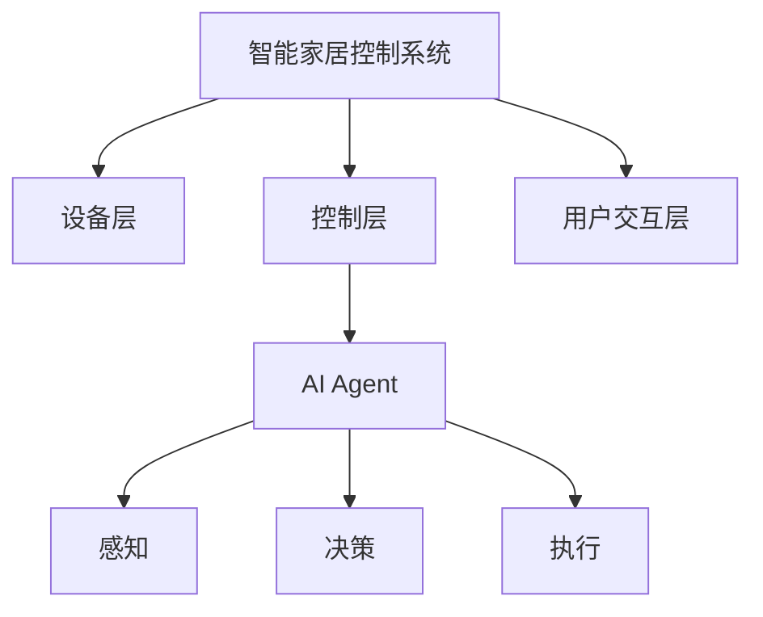
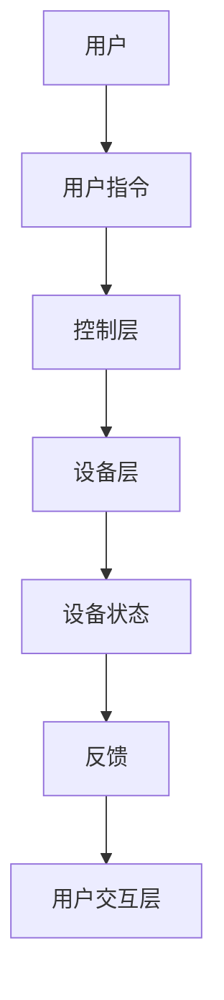
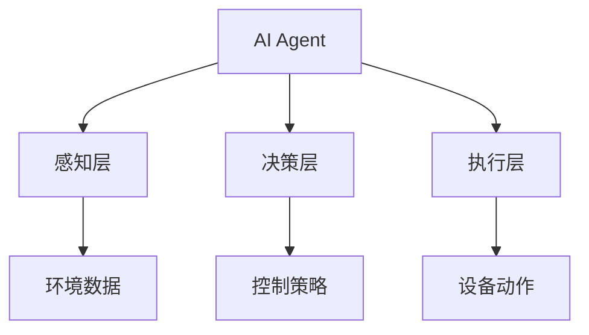
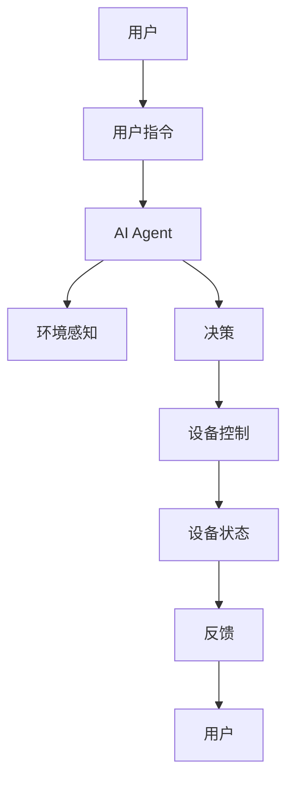
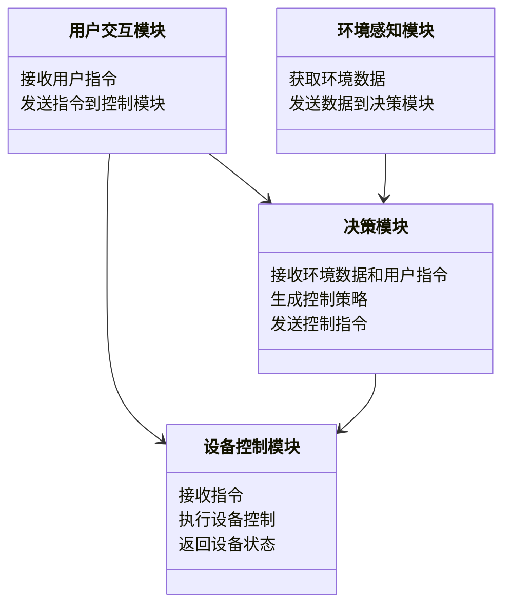
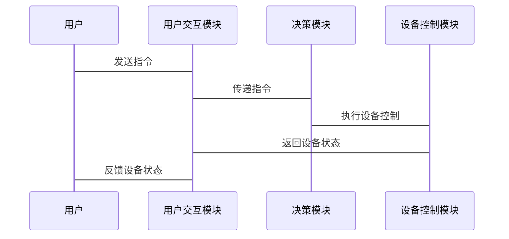

                 


# 实现基于AI Agent的智能家居控制系统

## 关键词：AI Agent, 智能家居, 控制系统, 算法原理, 系统架构, 项目实战

## 摘要：  
本文详细探讨了基于AI Agent的智能家居控制系统的设计与实现。从背景分析到核心概念，从算法原理到系统架构，从项目实战到最佳实践，系统地阐述了如何利用AI Agent技术构建一个高效、智能的家居控制系统。通过具体案例分析和代码实现，展示了如何通过感知、决策和执行三层架构实现智能家居的智能化控制。

---

## 第一部分: 基于AI Agent的智能家居控制系统背景与核心概念

### 第1章: 智能家居控制系统的背景与问题描述

#### 1.1 智能家居的发展历程
##### 1.1.1 从传统家居到智能家居的演进
智能家居的概念最早可以追溯到20世纪90年代，随着物联网技术的发展，智能家居逐渐从概念走向实际应用。早期的智能家居系统主要集中在单一设备的自动化控制，例如智能灯泡、智能门锁等。随着人工智能技术的兴起，智能家居系统开始具备学习和决策能力，能够根据用户行为和环境变化自动调整设备状态。

##### 1.1.2 当前智能家居的发展现状
目前，智能家居市场呈现出多样化和集成化的特点。主流的智能家居平台（如Google Nest、Apple HomeKit、华为鸿蒙等）已经实现了设备间的互联互通，用户可以通过手机APP、语音助手（如Siri、Google Assistant）或智能面板进行设备控制。然而，现有的智能家居系统在用户体验、设备协同和智能化水平上仍存在一定的局限性。

##### 1.1.3 智能家居系统的构成与特点
智能家居系统通常由设备层、控制层和用户交互层构成。设备层包括各种智能硬件（如智能灯泡、空调、摄像头等）；控制层负责接收用户的指令并协调设备的执行；用户交互层则通过APP、语音助手或智能面板为用户提供操作界面。智能家居系统的特点包括：智能化、远程控制、设备联动和个性化设置。

#### 1.2 智能家居控制系统的挑战
##### 1.2.1 当前智能家居控制系统的痛点
尽管智能家居技术已经取得了显著进展，但仍然存在一些问题。例如，设备之间的兼容性问题导致用户需要使用多个APP控制不同的设备；设备的联动逻辑不够智能，无法根据用户的习惯或环境变化自动调整；系统的安全性和稳定性也有待提高。

##### 1.2.2 传统智能家居控制系统的局限性
传统智能家居控制系统通常基于规则引擎，通过预设的规则实现设备的联动。这种方式虽然简单，但难以适应用户的个性化需求和复杂场景。例如，用户希望在特定时间开启灯光并调整室温，传统规则引擎可能需要手动设置多个规则，操作繁琐且不够灵活。

##### 1.2.3 用户需求与体验的提升空间
用户对智能家居系统的需求日益多样化。除了基本的设备控制功能，用户还希望系统能够具备学习能力，能够根据用户的习惯自动优化设备的运行状态。此外，用户对系统的易用性和安全性也有更高的要求。

#### 1.3 基于AI Agent的解决方案
##### 1.3.1 AI Agent的基本概念与特点
AI Agent（人工智能代理）是一种能够感知环境、自主决策并执行任务的智能实体。AI Agent的核心特征包括：自主性、反应性、目标导向和社会能力。在智能家居控制系统中，AI Agent可以作为系统的“大脑”，负责接收用户的指令、感知环境变化并协调设备的执行。

##### 1.3.2 基于AI Agent的智能家居控制系统的优势
与传统的规则引擎相比，基于AI Agent的智能家居控制系统具有以下优势：  
1. **智能性**：AI Agent能够通过学习用户的习惯和环境数据，自动优化设备的运行状态。  
2. **灵活性**：AI Agent可以根据用户的实时需求动态调整设备的控制策略，无需手动设置复杂的规则。  
3. **可扩展性**：AI Agent能够通过模块化设计，轻松扩展新的设备和功能。  

##### 1.3.3 问题背景与问题解决路径
智能家居系统的核心问题在于如何实现设备的智能化控制和用户的个性化需求。通过引入AI Agent技术，可以将系统的感知、决策和执行能力融为一体，从而实现更加智能化和个性化的家居控制。

#### 1.4 本章小结
本章通过对智能家居控制系统的发展历程、现状及挑战的分析，阐述了基于AI Agent的解决方案的优势和必要性。AI Agent技术的引入为智能家居系统的智能化升级提供了新的思路。

---

### 第2章: AI Agent与智能家居控制系统的概念结构

#### 2.1 AI Agent的核心要素
##### 2.1.1 感知能力
AI Agent的感知能力是指其获取环境信息的能力。在智能家居系统中，AI Agent可以通过传感器、摄像头、麦克风等设备感知环境数据，例如温度、湿度、光照强度、人体活动等。

##### 2.1.2 决策能力
AI Agent的决策能力是指其根据感知到的信息做出决策的能力。通过机器学习算法，AI Agent可以学习用户的习惯和偏好，生成最优的设备控制策略。

##### 2.1.3 执行能力
AI Agent的执行能力是指其通过驱动设备或与其他系统交互来实现决策的能力。在智能家居系统中，AI Agent可以通过智能插座、继电器等设备控制家电的开关状态。

#### 2.2 智能家居控制系统的核心要素
##### 2.2.1 设备层
设备层是智能家居系统的硬件基础，包括各种智能设备（如智能灯泡、空调、摄像头等）。

##### 2.2.2 控制层
控制层负责接收用户的指令并协调设备的执行，可以通过AI Agent实现智能化的设备控制。

##### 2.2.3 用户交互层
用户交互层是用户与智能家居系统之间的接口，可以通过手机APP、语音助手或智能面板实现用户与系统的交互。

#### 2.3 AI Agent与智能家居控制系统的关联
##### 2.3.1 AI Agent在智能家居中的角色
AI Agent作为智能家居系统的“大脑”，负责感知环境、分析数据、制定策略并协调设备的执行。

##### 2.3.2 系统整体架构
智能家居控制系统基于AI Agent的三层次架构：感知层、决策层和执行层。

##### 2.3.3 核心概念的结构化描述
通过Mermaid图展示了智能家居控制系统的核心概念及其关联关系。



#### 2.4 本章小结
本章通过分析AI Agent的核心要素及其在智能家居控制系统中的角色，明确了系统的整体架构和核心概念的关联关系。

---

### 第3章: 基于AI Agent的智能家居控制系统的算法原理

#### 3.1 AI Agent的核心算法
##### 3.1.1 感知层
感知层通过多种传感器获取环境数据，例如温度、湿度、光照强度等。

##### 3.1.2 决策层
决策层基于感知数据和用户需求，通过机器学习算法生成最优的设备控制策略。

##### 3.1.3 执行层
执行层通过驱动设备或与其他系统交互，将决策层生成的控制策略转化为实际的设备动作。

#### 3.2 智能家居控制系统的实体关系分析
##### 3.2.1 实体关系图
通过Mermaid图展示了智能家居控制系统中的实体关系。



##### 3.2.2 实体属性特征对比表
通过对比表展示了不同实体的核心属性和特征。

| 实体 | 核心属性 | 特征 |
|------|----------|------|
| 用户 | 偏好、习惯 | 动态变化 |
| 设备 | 类型、状态 | 可控性高 |
| 环境 | 参数、变化 | 多样性 |

#### 3.3 AI Agent与智能家居设备的交互流程
##### 3.3.1 实体关系图
通过Mermaid图展示了AI Agent与智能家居设备的交互流程。



##### 3.3.2 交互流程图
通过Mermaid图展示了AI Agent与设备之间的交互流程。



#### 3.4 本章小结
本章通过分析AI Agent的核心算法和实体关系，明确了智能家居控制系统的交互流程和架构设计。

---

### 第4章: 基于AI Agent的智能家居控制系统的算法原理

#### 4.1 AI Agent的核心算法
##### 4.1.1 感知层
感知层通过多种传感器获取环境数据，例如温度、湿度、光照强度等。

##### 4.1.2 决策层
决策层基于感知数据和用户需求，通过机器学习算法生成最优的设备控制策略。

##### 4.1.3 执行层
执行层通过驱动设备或与其他系统交互，将决策层生成的控制策略转化为实际的设备动作。

#### 4.2 智能家居控制系统的实体关系分析
##### 4.2.1 实体关系图
通过Mermaid图展示了智能家居控制系统中的实体关系。


##### 4.2.2 实体属性特征对比表
通过对比表展示了不同实体的核心属性和特征。

| 实体 | 核心属性 | 特征 |
|------|----------|------|
| 用户 | 偏好、习惯 | 动态变化 |
| 设备 | 类型、状态 | 可控性高 |
| 环境 | 参数、变化 | 多样性 |

#### 4.3 AI Agent与智能家居设备的交互流程
##### 4.3.1 实体关系图
通过Mermaid图展示了AI Agent与智能家居设备的交互流程。


##### 4.3.2 交互流程图
通过Mermaid图展示了AI Agent与设备之间的交互流程。


#### 4.4 本章小结
本章通过分析AI Agent的核心算法和实体关系，明确了智能家居控制系统的交互流程和架构设计。

---

## 第二部分: 系统分析与架构设计

### 第5章: 基于AI Agent的智能家居控制系统系统分析与架构设计

#### 5.1 项目背景与目标
本项目旨在通过AI Agent技术实现智能家居系统的智能化控制，提升用户体验和设备协同能力。

#### 5.2 系统功能设计
##### 5.2.1 功能模块划分
系统功能模块包括：用户交互模块、设备控制模块、环境感知模块、决策模块和反馈模块。

##### 5.2.2 领域模型设计
通过Mermaid类图展示了系统的领域模型。



#### 5.3 系统架构设计
##### 5.3.1 分层架构设计
系统的分层架构包括：感知层、决策层和执行层。

##### 5.3.2 模块化设计
通过模块化设计，系统可以灵活扩展新的设备和功能。

#### 5.4 系统接口设计
##### 5.4.1 API接口设计
系统通过标准化的API接口实现设备间的互联互通。

##### 5.4.2 交互流程图
通过Mermaid序列图展示了系统的交互流程。



#### 5.5 本章小结
本章通过系统分析与架构设计，明确了基于AI Agent的智能家居控制系统的实现路径。

---

## 第三部分: 项目实战

### 第6章: 项目实战

#### 6.1 环境安装与配置
##### 6.1.1 系统环境
需要安装Python、TensorFlow、Mermaid等工具。

##### 6.1.2 依赖库安装
使用pip安装所需的依赖库，例如：`pip install mermaid`。

#### 6.2 系统核心实现
##### 6.2.1 AI Agent核心代码
实现AI Agent的核心算法，包括感知、决策和执行三个部分。

```python
class AI-Agent:
    def __init__(self):
        self.sensors = []
        self.devices = []
    
    def perceive(self):
        # 获取环境数据
        return [sensor.read() for sensor in self.sensors]
    
    def decide(self, data):
        # 根据环境数据生成决策
        return self.generate_decision(data)
    
    def execute(self, decision):
        # 执行决策
        for device in self.devices:
            device.control(decision)
```

##### 6.2.2 设备控制代码
实现设备的控制逻辑，通过API接口与AI Agent交互。

```python
class DeviceController:
    def __init__(self, devices):
        self.devices = devices
    
    def control(self, decision):
        # 根据决策控制设备
        for device in self.devices:
            if device.id == decision['device_id']:
                device.switch(decision['state'])
```

##### 6.2.3 交互代码
实现用户与系统的交互逻辑，支持多种交互方式（如语音、APP）。

```python
class UserInteraction:
    def __init__(self):
        pass
    
    def receive_command(self, command):
        # 接收用户的指令
        return command
    
    def send_feedback(self, feedback):
        # 发送反馈给用户
        print(feedback)
```

#### 6.3 代码实现与解读
##### 6.3.1 AI Agent实现
AI Agent通过感知环境数据、生成决策并执行设备控制，实现了智能家居系统的智能化管理。

##### 6.3.2 设备控制实现
通过设备控制器实现设备的开关控制，支持多种设备类型和控制策略。

##### 6.3.3 用户交互实现
通过用户交互模块实现用户与系统的双向通信，支持多种交互方式。

#### 6.4 项目小结
本章通过具体的代码实现，展示了基于AI Agent的智能家居控制系统的实现过程。

---

## 第四部分: 最佳实践与总结

### 第7章: 最佳实践与总结

#### 7.1 最佳实践
##### 7.1.1 设备选择
选择兼容性高、易于控制的设备，确保系统的可扩展性。

##### 7.1.2 系统优化
通过算法优化和系统调优，提升系统的运行效率和用户体验。

##### 7.1.3 安全性保障
采取多层次的安全防护措施，确保系统的安全性和稳定性。

#### 7.2 项目总结
##### 7.2.1 核心成果
通过AI Agent技术实现了智能家居系统的智能化控制，提升了用户体验和设备协同能力。

##### 7.2.2 项目意义
本项目展示了AI技术在智能家居领域的广泛应用前景，为未来的智能生活提供了新的思路。

#### 7.3 未来展望
随着AI技术的不断发展，智能家居系统将更加智能化和个性化，AI Agent技术将在其中发挥越来越重要的作用。

---

## 作者：AI天才研究院/AI Genius Institute & 禅与计算机程序设计艺术/Zen And The Art of Computer Programming

