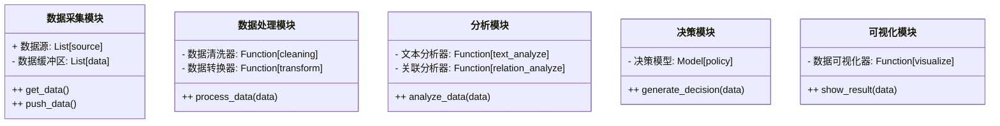
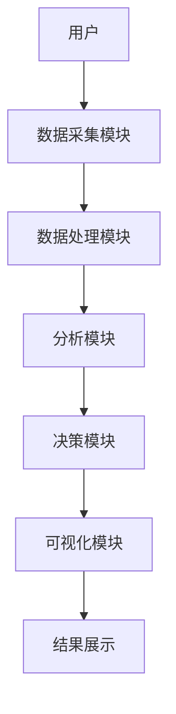
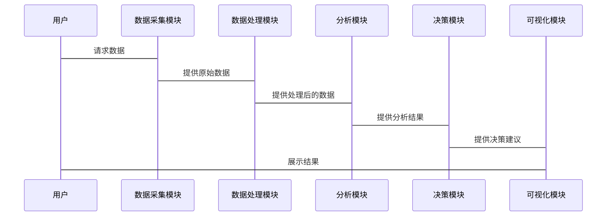

                 


# 实现基于AI Agent的智能情报分析系统

> 关键词：AI Agent，智能情报分析，自然语言处理，知识图谱，深度学习，文本挖掘

> 摘要：本文将详细介绍如何基于AI Agent构建智能情报分析系统。通过分析情报分析的核心挑战，探讨AI Agent在情报感知、理解、推理和决策中的应用。从数学模型到系统架构，从算法实现到项目实战，全面解析基于AI Agent的智能情报分析系统的实现过程，为读者提供理论与实践相结合的深度解析。

---

# 第一部分：基于AI Agent的智能情报分析系统概述

# 第1章：AI Agent与智能情报分析概述

## 1.1 AI Agent的基本概念

### 1.1.1 AI Agent的定义

AI Agent（人工智能代理）是一种能够感知环境、自主决策并执行任务的智能实体。它通过传感器获取信息，利用推理能力分析信息，并通过执行器采取行动。AI Agent的核心目标是通过自动化手段提高任务处理效率。

### 1.1.2 AI Agent的核心特征

- **自主性**：能够独立决策，无需外部干预。
- **反应性**：能够实时感知环境变化并调整行为。
- **学习能力**：通过数据和经验不断优化自身的决策能力。
- **协作性**：能够与其他AI Agent或人类协同工作。

### 1.1.3 智能情报分析的定义与特点

智能情报分析是指利用AI技术对海量信息进行处理、理解、关联和预测，最终生成有价值的洞察的过程。其特点包括：

- **实时性**：能够快速处理实时信息。
- **准确性**：通过算法优化提高分析结果的准确性。
- **可扩展性**：能够处理海量数据并支持大规模应用。

## 1.2 智能情报分析的背景与应用

### 1.2.1 当前情报分析的挑战

- **数据量大**：信息来源多样化，数据量呈指数级增长。
- **信息复杂性**：信息种类繁多，关联性复杂。
- **实时性要求高**：需要快速响应和处理实时信息。

### 1.2.2 AI Agent在情报分析中的优势

- **高效性**：AI Agent能够快速处理和分析大量信息。
- **准确性**：通过机器学习和深度学习技术提高分析结果的准确性。
- **可扩展性**：能够轻松扩展以处理更大的数据规模。

### 1.2.3 智能情报分析的典型应用场景

- **舆情分析**：实时监控社交媒体上的信息，分析公众情绪。
- **威胁检测**：通过分析网络日志，发现潜在的安全威胁。
- **市场分析**：帮助企业分析市场趋势，优化业务决策。

## 1.3 本章小结

本章介绍了AI Agent的基本概念及其在智能情报分析中的应用，强调了AI Agent在解决情报分析难题中的重要作用。

---

# 第二部分：AI Agent的核心原理与技术

# 第2章：AI Agent的感知与理解能力

## 2.1 自然语言处理技术

### 2.1.1 分词与词性标注

分词是将文本分割成词语的过程，词性标注是对每个词语赋予其词性。例如，中文分词可以使用jieba库，词性标注可以使用HanLP。

```python
import jieba
text = "人工智能是一种新兴的技术"
words = jieba.lcut(text)
print(words)  # 输出: ['人工智能', '是', '一种', '新兴', '的技术']
```

### 2.1.2 句法分析与语义理解

句法分析包括句法树构建和依存关系分析。语义理解则通过词向量（如Word2Vec）或深度学习模型（如BERT）实现。

### 2.1.3 基于深度学习的文本表示

深度学习模型如BERT可以生成语义向量，用于表示文本的意义。

$$
\text{BERT输入} = \{ \text{输入序列}, \text{段落分隔符}, \text{输出序列} \}
$$

## 2.2 知识图谱构建与应用

### 2.2.1 知识图谱的定义与构建方法

知识图谱是一种图结构，节点表示实体，边表示实体之间的关系。构建方法包括数据抽取、实体识别和关系抽取。

### 2.2.2 知识图谱在情报分析中的应用

知识图谱可以用于实体关联分析和知识推理。例如，通过分析人名、组织名和事件之间的关系，发现隐藏的关联。

### 2.2.3 实体识别与关系抽取

实体识别可以使用CRF或BERT模型，关系抽取可以使用远程监督或基于规则的方法。

## 2.3 本章小结

本章介绍了AI Agent的感知能力，包括自然语言处理和知识图谱构建技术。

---

# 第3章：AI Agent的推理与决策机制

## 3.1 基于规则的推理

### 3.1.1 规则的定义与设计

规则是基于条件的判断逻辑，例如：如果A且B，则C。

### 3.1.2 基于规则的推理过程

1. **提取事实**：从数据中提取事实。
2. **匹配规则**：匹配预定义的规则。
3. **生成结论**：根据匹配的规则生成结论。

### 3.1.3 规则推理的优缺点

优点：简单易懂，适合规则明确的场景。缺点：难以处理复杂和动态变化的场景。

## 3.2 基于机器学习的推理

### 3.2.1 机器学习在推理中的应用

机器学习模型可以用于分类、回归和聚类任务。

### 3.2.2 基于深度学习的推理模型

深度学习模型如RNN和Transformer可以用于序列推理任务。

### 3.2.3 推理模型的训练与优化

训练数据的质量和模型的调参是关键。

## 3.3 综合推理与决策

### 3.3.1 多策略推理的实现

结合规则推理和机器学习推理，形成混合推理模型。

### 3.3.2 基于概率的决策机制

通过概率计算，确定每个决策的可能性。

### 3.3.3 实时推理与动态调整

动态调整推理模型以适应环境变化。

## 3.4 本章小结

本章介绍了AI Agent的推理与决策机制，包括基于规则和机器学习的推理方法。

---

# 第三部分：智能情报分析系统的数学模型与算法

# 第4章：情报分析的数学模型

## 4.1 文本相似度计算

### 4.1.1 余弦相似度公式

$$
\text{余弦相似度} = \frac{\mathbf{u} \cdot \mathbf{v}}{\|\mathbf{u}\| \|\mathbf{v}\|}
$$

### 4.1.2 基于词嵌入的相似度计算

使用Word2Vec或BERT生成词向量，计算相似度。

### 4.1.3 应用场景与案例

例如，在舆情分析中，计算两篇文本的相似度。

## 4.2 情报关联分析

### 4.2.1 关联规则挖掘

通过Apriori算法挖掘关联规则。

### 4.2.2 基于图论的关联分析

构建图模型，分析节点之间的关联性。

### 4.2.3 马尔可夫链在关联分析中的应用

通过马尔可夫链模型分析事件的序列依赖关系。

## 4.3 本章小结

本章介绍了情报分析的数学模型，包括文本相似度计算和关联分析。

---

# 第5章：AI Agent的算法实现

## 5.1 基于强化学习的决策算法

### 5.1.1 强化学习

通过奖励机制优化决策策略。

### 5.1.2 算法流程

1. **状态感知**：获取当前环境状态。
2. **动作选择**：基于策略选择动作。
3. **奖励反馈**：获得奖励或惩罚。
4. **策略更新**：更新策略以优化奖励。

### 5.1.3 实战代码示例

```python
import gym
env = gym.make('CartPole-v0')
for _ in range(1000):
    observation = env.reset()
    done = False
    while not done:
        action = env.action_space.sample()
        observation, reward, done, info = env.step(action)
        print(f"reward: {reward}")
```

---

# 第四部分：智能情报分析系统的架构设计与实现

# 第6章：系统设计与实现

## 6.1 系统功能设计

### 6.1.1 功能模块划分

- **数据采集模块**：采集情报数据。
- **数据处理模块**：清洗和预处理数据。
- **分析模块**：进行文本分析和关联分析。
- **决策模块**：生成决策建议。
- **可视化模块**：展示分析结果。

### 6.1.2 领域模型（类图）



## 6.2 系统架构设计

### 6.2.1 系统架构图



### 6.2.2 系统接口设计

- 数据采集模块接口：提供数据获取和推送接口。
- 分析模块接口：提供文本分析和关联分析接口。
- 决策模块接口：提供决策建议接口。
- 可视化模块接口：提供数据可视化的接口。

### 6.2.3 系统交互流程



## 6.3 本章小结

本章详细设计了基于AI Agent的智能情报分析系统的架构，包括功能模块划分、系统架构设计和交互流程设计。

---

# 第五部分：项目实战与优化

# 第7章：项目实战与优化

## 7.1 项目环境安装

### 7.1.1 安装依赖

```bash
pip install jieba
pip install networkx
pip install matplotlib
pip install transformers
```

### 7.1.2 环境配置

确保安装了Python 3.6以上版本，以及必要的开发工具。

## 7.2 核心代码实现

### 7.2.1 文本分析核心代码

```python
from transformers import pipeline

text_analyzer = pipeline("text-classification", model="bert-base-cased")
result = text_analyzer("这是一个测试文本。")
print(result)
```

### 7.2.2 关联分析核心代码

```python
import networkx as nx

G = nx.Graph()
G.add_edges_from([("A", "B"), ("B", "C"), ("A", "C")])
nx.draw(G, node_size=500, node_color="red", edge_color="blue")
plt.show()
```

## 7.3 案例分析与优化

### 7.3.1 案例分析

以舆情分析为例，分析社交媒体上的文本数据。

### 7.3.2 优化建议

- **数据预处理**：优化文本清洗和分词过程。
- **模型调优**：优化深度学习模型的超参数。
- **系统优化**：优化系统架构，提高处理效率。

## 7.4 本章小结

本章通过项目实战，展示了基于AI Agent的智能情报分析系统的实现过程，并提出了优化建议。

---

# 第六部分：总结与展望

# 第8章：总结与展望

## 8.1 核心知识点总结

- AI Agent的基本概念和核心特征。
- 智能情报分析的数学模型与算法。
- 系统架构设计与实现。

## 8.2 未来展望

- **多模态分析**：结合图像和语音信息，提高分析能力。
- **实时性优化**：优化系统性能，提高实时性。
- **可解释性增强**：提高AI Agent决策的可解释性。

## 8.3 本章小结

本文详细介绍了基于AI Agent的智能情报分析系统的实现过程，并展望了未来的发展方向。

---

# 作者

作者：AI天才研究院/AI Genius Institute & 禅与计算机程序设计艺术/Zen And The Art of Computer Programming

