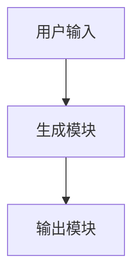

                 


# 实现基于AI Agent的智能艺术创作系统

## 关键词：AI Agent, 智能艺术创作, 生成对抗网络, 强化学习, 艺术创作系统

## 摘要：本文将详细介绍如何基于AI Agent实现智能艺术创作系统。从AI Agent的基本概念到生成模型的原理，从系统架构设计到项目实战，全面解析智能艺术创作系统的实现过程。通过本文，读者将能够理解并掌握基于AI Agent的艺术创作系统的核心技术与实现方法。

---

# 第1章: AI Agent与智能艺术创作的背景

## 1.1 AI Agent的基本概念

### 1.1.1 什么是AI Agent

AI Agent（人工智能代理）是指能够感知环境并采取行动以实现目标的智能实体。它可以是一个软件程序、机器人或其他智能系统，通过传感器获取信息，并通过执行器与环境交互。AI Agent的核心目标是通过自主决策和行动来优化目标函数。

$$
\text{AI Agent} = \{\text{感知} \rightarrow \text{决策} \rightarrow \text{行动}\}
$$

### 1.1.2 AI Agent的核心特征

AI Agent的核心特征包括：

1. **自主性**：能够在没有外部干预的情况下自主运行。
2. **反应性**：能够实时感知环境并做出反应。
3. **目标导向**：通过目标函数驱动行为。
4. **学习能力**：能够通过经验改进性能。

### 1.1.3 AI Agent在艺术创作中的潜力

AI Agent在艺术创作中的潜力巨大。它可以通过生成对抗网络（GAN）生成高质量的艺术作品，或者通过强化学习优化艺术创作的过程。AI Agent还可以作为人类艺术家的辅助工具，帮助他们探索新的创作方式。

---

## 1.2 智能艺术创作的背景与现状

### 1.2.1 艺术创作的数字化转型

随着技术的发展，艺术创作逐渐从传统的手工创作向数字化创作转型。计算机视觉、自然语言处理和机器学习等技术的应用，使得艺术创作更加高效和多样化。

### 1.2.2 当前智能艺术创作的主要技术

当前智能艺术创作的主要技术包括：

1. **生成对抗网络（GAN）**：用于生成图像、音乐等艺术作品。
2. **变分自编码器（VAE）**：用于生成具有特定风格的艺术作品。
3. **强化学习**：用于优化艺术创作的过程。

### 1.2.3 智能艺术创作的市场与应用

智能艺术创作的市场正在快速增长。从数字绘画到音乐生成，AI Agent在艺术创作中的应用越来越广泛。艺术家、设计师和科技公司都在积极探索AI Agent在艺术创作中的潜力。

---

## 1.3 本章小结

本章介绍了AI Agent的基本概念及其在艺术创作中的潜力，分析了智能艺术创作的背景与现状。通过本章，读者可以理解AI Agent在艺术创作中的重要性。

---

# 第2章: 基于AI Agent的艺术创作系统的核心概念

## 2.1 AI Agent在艺术创作中的角色

### 2.1.1 AI Agent作为创作工具

AI Agent可以作为创作工具，帮助人类艺术家生成灵感、优化设计。例如，AI Agent可以通过GAN生成图像，为艺术家提供创作素材。

### 2.1.2 AI Agent作为创作主体

AI Agent也可以作为创作主体，独立生成艺术作品。例如，AI Agent可以通过强化学习优化艺术创作的过程，生成高质量的艺术作品。

### 2.1.3 AI Agent与人类艺术家的协作模式

AI Agent与人类艺术家的协作模式包括：

1. **辅助模式**：AI Agent帮助人类艺术家生成灵感或优化设计。
2. **独立模式**：AI Agent独立生成艺术作品。
3. **混合模式**：AI Agent与人类艺术家共同创作艺术作品。

### 2.2 艺术创作的生成模型

#### 2.2.1 基于生成对抗网络（GAN）的艺术创作

生成对抗网络（GAN）由生成器和判别器组成。生成器的目标是生成能够欺骗判别器的图像，判别器的目标是区分真实图像和生成图像。

生成器的损失函数：
$$
L_{\text{生成器}} = \log(1 - D(G(x)))
$$

判别器的损失函数：
$$
L_{\text{判别器}} = \log(D(x)) + \log(1 - D(G(x)))
$$

其中，$D(x)$表示判别器对输入图像$x$的判断概率，$G(x)$表示生成器生成的图像。

#### 2.2.2 基于变分自编码器（VAE）的艺术创作

变分自编码器（VAE）通过编码器将输入图像编码为潜在空间的向量，然后通过解码器生成图像。

编码器的损失函数：
$$
L_{\text{编码器}} = \mathbb{E}_{x}[ \text{KL}(q(x|z) || p(z))]
$$

解码器的损失函数：
$$
L_{\text{解码器}} = -\mathbb{E}_{z}[ \log p(x|z)]
$$

#### 2.2.3 其他生成模型在艺术创作中的应用

除了GAN和VAE，其他生成模型如Flow-based模型和Diffusion模型也在艺术创作中得到广泛应用。

---

## 2.3 强化学习在艺术创作中的应用

### 2.3.1 强化学习的基本原理

强化学习通过智能体与环境的交互，学习最优策略。智能体通过执行动作获得奖励，目标是最大化累计奖励。

强化学习的数学模型：
$$
R = \sum_{t=1}^T r_t
$$

其中，$R$表示总奖励，$r_t$表示第$t$步的奖励。

### 2.3.2 强化学习在艺术创作中的具体应用

强化学习可以用于优化艺术创作的过程。例如，AI Agent可以通过强化学习优化图像生成的参数，生成更符合人类审美的艺术作品。

### 2.3.3 强化学习与生成模型的结合

强化学习可以与生成模型（如GAN）结合，生成更高质量的艺术作品。例如，生成器可以通过强化学习优化生成图像的风格和细节。

---

## 2.4 本章小结

本章详细介绍了AI Agent在艺术创作中的角色，分析了生成模型和强化学习在艺术创作中的应用。通过本章，读者可以理解AI Agent在艺术创作中的多种角色和技术实现方式。

---

# 第3章: 基于AI Agent的艺术创作系统的算法原理

## 3.1 基于生成对抗网络（GAN）的生成模型

### 3.1.1 GAN的基本结构

生成对抗网络（GAN）由生成器和判别器组成。生成器的目标是生成能够欺骗判别器的图像，判别器的目标是区分真实图像和生成图像。

### 3.1.2 GAN的训练过程

GAN的训练过程包括两个阶段：生成器的训练和判别器的训练。生成器通过最小化判别器的输出概率来优化生成图像，判别器通过最大化真实图像的输出概率和最小化生成图像的输出概率来优化判别能力。

### 3.1.3 GAN在艺术创作中的应用案例

GAN在艺术创作中的应用案例包括生成抽象艺术、生成数字绘画等。

---

## 3.2 基于变分自编码器（VAE）的生成模型

### 3.2.1 VAE的基本结构

变分自编码器（VAE）由编码器和解码器组成。编码器将输入图像编码为潜在空间的向量，解码器将潜在向量解码为图像。

### 3.2.2 VAE的训练过程

VAE的训练过程包括两个阶段：编码器的训练和解码器的训练。编码器通过最小化KL散度来优化潜在向量的分布，解码器通过最大化似然函数来优化生成图像的质量。

### 3.2.3 VAE在艺术创作中的应用案例

VAE在艺术创作中的应用案例包括生成特定风格的艺术作品、生成高质量的图像等。

---

## 3.3 基于强化学习的生成模型

### 3.3.1 强化学习的基本原理

强化学习通过智能体与环境的交互，学习最优策略。智能体通过执行动作获得奖励，目标是最大化累计奖励。

### 3.3.2 强化学习在艺术创作中的具体实现

强化学习可以用于优化艺术创作的过程。例如，AI Agent可以通过强化学习优化图像生成的参数，生成更符合人类审美的艺术作品。

### 3.3.3 强化学习与生成模型的结合

强化学习可以与生成模型（如GAN）结合，生成更高质量的艺术作品。例如，生成器可以通过强化学习优化生成图像的风格和细节。

---

## 3.4 本章小结

本章详细介绍了基于AI Agent的艺术创作系统的算法原理，包括GAN、VAE和强化学习的实现方式。通过本章，读者可以理解这些算法在艺术创作中的具体应用。

---

# 第4章: 基于AI Agent的艺术创作系统的系统分析与架构设计

## 4.1 系统功能设计

### 4.1.1 系统的功能模块划分

基于AI Agent的艺术创作系统主要包括以下几个功能模块：

1. **输入模块**：接收用户的输入，如图像、文本等。
2. **生成模块**：通过生成模型生成艺术作品。
3. **输出模块**：将生成的艺术作品输出，如保存为图像文件。

### 4.1.2 各功能模块的交互关系

输入模块接收用户的输入，传递给生成模块，生成模块生成艺术作品后，传递给输出模块进行保存或展示。

### 4.1.3 系统的功能流程图



---

## 4.2 系统架构设计

### 4.2.1 系统架构的分层设计

基于AI Agent的艺术创作系统的架构可以分为三层：

1. **表示层**：与用户交互，展示生成的艺术作品。
2. **业务逻辑层**：处理用户的输入，调用生成模型生成艺术作品。
3. **数据访问层**：存储和管理生成的艺术作品。

### 4.2.2 各层次之间的关系

表示层通过业务逻辑层与生成模型交互，业务逻辑层通过数据访问层管理生成的艺术作品。

### 4.2.3 系统架构的实现方式

系统架构可以基于微服务架构实现，每个功能模块独立运行，通过API进行交互。

---

## 4.3 系统接口设计

### 4.3.1 系统内部接口设计

系统内部接口包括生成模块与业务逻辑层的交互接口，数据访问层与业务逻辑层的交互接口。

### 4.3.2 系统外部接口设计

系统外部接口包括用户与系统的交互接口，如API接口。

### 4.3.3 接口的交互流程

用户通过API接口发送请求，业务逻辑层调用生成模块生成艺术作品，生成结果返回给用户。

---

## 4.4 本章小结

本章详细介绍了基于AI Agent的艺术创作系统的系统分析与架构设计，包括功能模块划分、系统架构设计和接口设计。通过本章，读者可以理解系统的整体架构和实现方式。

---

# 第5章: 基于AI Agent的艺术创作系统的项目实战

## 5.1 环境安装与配置

### 5.1.1 开发环境的选择

推荐使用Python 3.8及以上版本，安装必要的库如TensorFlow、Keras、PyTorch等。

### 5.1.2

---

## 5.2 项目核心代码实现

### 5.2.1 生成器的实现

```python
import tensorflow as tf
from tensorflow.keras import layers

def build_generator():
    generator = tf.keras.Sequential([
        layers.Dense(256, activation='relu'),
        layers.Dense(128, activation='relu'),
        layers.Dense(64, activation='relu'),
        layers.Dense(32, activation='relu'),
        layers.Dense(16, activation='relu'),
        layers.Dense(1, activation='sigmoid')
    ])
    return generator
```

### 5.2.2 判别器的实现

```python
def build_discriminator():
    discriminator = tf.keras.Sequential([
        layers.Dense(16, activation='relu'),
        layers.Dense(32, activation='relu'),
        layers.Dense(64, activation='relu'),
        layers.Dense(128, activation='relu'),
        layers.Dense(1, activation='sigmoid')
    ])
    return discriminator
```

### 5.2.3 GAN的训练过程

```python
def train_gan(generator, discriminator, dataset, epochs=100):
    for epoch in range(epochs):
        for batch in dataset:
            # 训练判别器
            with tf.GradientTape() as d_tape:
                d_loss = tf.keras.losses.binary_crossentropy(discriminator(batch), tf.zeros_like(discriminator(batch)))
            d_grad = d_tape.gradient(d_loss, discriminator.trainable_weights)
            d_optimizer = tf.keras.optimizers.Adam()
            d_optimizer.apply_gradients(zip(d_grad, discriminator.trainable_weights))

            # 训练生成器
            with tf.GradientTape() as g_tape:
                g_loss = tf.keras.losses.binary_crossentropy(discriminator(generator(batch)), tf.ones_like(discriminator(generator(batch))))
            g_grad = g_tape.gradient(g_loss, generator.trainable_weights)
            g_optimizer = tf.keras.optimizers.Adam()
            g_optimizer.apply_gradients(zip(g_grad, generator.trainable_weights))
```

---

## 5.3 项目小结

本章通过一个简单的项目实战，展示了基于AI Agent的艺术创作系统的实现过程。通过本章，读者可以理解如何将理论知识应用到实际项目中。

---

# 作者：AI天才研究院 & 禅与计算机程序设计艺术

---

通过本文，读者可以全面理解基于AI Agent的智能艺术创作系统的实现过程和应用场景。从基本概念到算法原理，从系统架构设计到项目实战，本文详细讲解了实现基于AI Agent的艺术创作系统的各个方面。希望本文能够为读者提供有价值的参考和启示。

