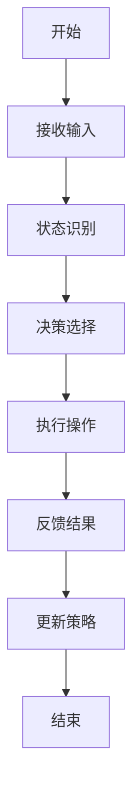
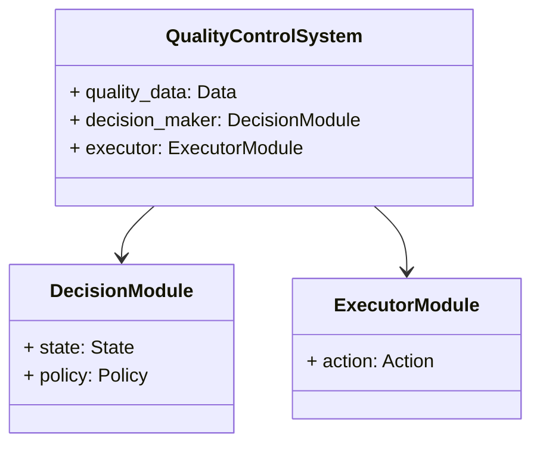
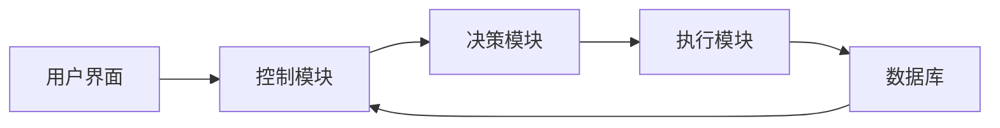
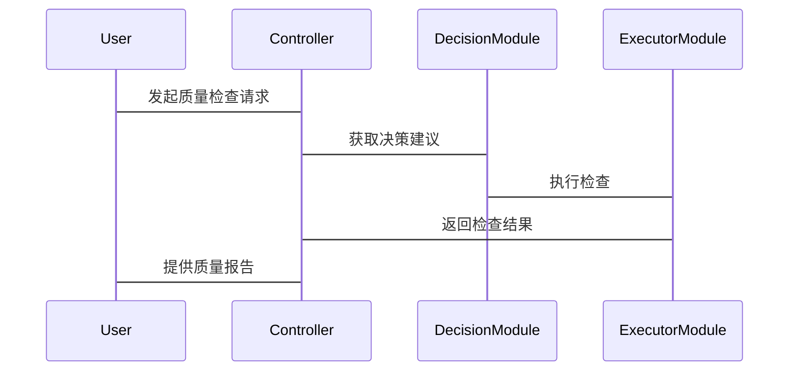

                 


# 实现基于AI Agent的智能质量控制系统

> 关键词：AI Agent, 智能质量控制系统, 强化学习, 系统架构, 项目实战

> 摘要：本文详细探讨了如何利用AI Agent技术构建智能质量控制系统。从背景到核心概念，从算法原理到系统架构，从项目实战到最佳实践，系统性地介绍了基于AI Agent的质量控制系统的设计与实现方法。本文结合理论与实践，通过丰富的图表和代码示例，深入剖析了该系统的实现细节，为读者提供了全面的指导。

---

## 第1章: 智能质量控制系统的背景与需求

### 1.1 传统质量控制系统的局限性
- **核心问题**：传统质量控制系统依赖人工检查，效率低、误差大、难以应对复杂场景。
- **痛点分析**：数据处理能力有限，无法实时反馈，难以实现闭环优化。
- **边界与外延**：传统系统主要依赖规则和经验，缺乏智能性和自适应性。

### 1.2 AI Agent在质量控制中的应用前景
- **基本概念**：AI Agent是一种能够感知环境、自主决策并执行任务的智能体。
- **价值分析**：通过AI Agent，质量控制系统能够实现实时监控、智能决策和自适应优化。
- **区别对比**：AI Agent系统相比传统系统，具有更高的灵活性和智能化。

### 1.3 本章小结
- 核心概念回顾：AI Agent的基本原理和应用场景。
- 问题背景总结：传统系统的局限性和AI Agent的优势。
- 下文展开提示：接下来将详细探讨AI Agent的核心模块和实现原理。

---

## 第2章: AI Agent的基本原理与核心概念

### 2.1 AI Agent的定义与分类
- **定义**：AI Agent是一种能够感知环境、自主决策并执行任务的智能实体。
- **分类**：基于智能水平可分为反应式Agent、认知式Agent和混合式Agent。
- **对比分析**：通过表格对比不同类型的AI Agent的特点。

| 类型      | 特点                           | 适用场景                     |
|-----------|--------------------------------|------------------------------|
| 反应式    | 基于当前感知做出实时反应       | 简单环境，实时任务           |
| 认知式    | 具有推理和规划能力             | 复杂环境，需要策略优化       |
| 混合式    | 结合反应式和认知式的特点       | 综合环境，复杂任务           |

### 2.2 AI Agent的核心模块与功能
- **感知模块**：通过传感器或数据源获取环境信息。
- **决策模块**：基于感知信息进行分析和决策。
- **执行模块**：根据决策结果执行具体操作。

### 2.3 AI Agent的实体关系与系统架构
- **ER图**：
```mermaid
er
    actor: 用户
    system: AI Agent系统
    quality_data: 质量数据
    decision_maker: 决策模块
    executor: 执行模块
    relation: 用户 -> AI Agent系统
    relation: 质量数据 -> AI Agent系统
    relation: 决策模块 -> 执行模块
```

### 2.4 本章小结
- 核心概念总结：AI Agent的基本原理和功能模块。
- 模块与关系梳理：感知、决策、执行模块的协同工作。
- 下文展开提示：接下来将探讨AI Agent的质量控制算法原理。

---

## 第3章: AI Agent质量控制算法的原理与实现

### 3.1 基于强化学习的质量控制算法
- **强化学习的基本原理**：通过试错机制学习最优策略。
- **在质量控制中的应用**：通过强化学习优化质量控制流程。
- **算法流程图**：


### 3.2 算法实现的数学模型
- **Q-learning算法公式**：
$$ Q(s, a) = Q(s, a) + \alpha \left( r + \gamma \max_{a'} Q(s', a') - Q(s, a) \right) $$

### 3.3 实现细节与代码示例
- **Python代码示例**：
```python
import numpy as np
import gym

# 初始化环境
env = gym.make('CartPole-v1')
env.seed(42)

# 超参数设置
alpha = 0.1
gamma = 0.99
epsilon = 0.1

# 状态和动作空间
state_space = env.observation_space.shape[0]
action_space = env.action_space.n

# 初始化Q表
Q = np.zeros((state_space, action_space))

# 训练过程
for episode in range(1000):
    state = env.reset()
    total_reward = 0
    done = False
    while not done:
        if np.random.random() < epsilon:
            action = np.random.randint(action_space)
        else:
            action = np.argmax(Q[state])
        
        next_state, reward, done, info = env.step(action)
        
        Q[state, action] = Q[state, action] + alpha * (reward + gamma * np.max(Q[next_state]) - Q[state, action])
        
        total_reward += reward
        state = next_state
    
    epsilon = max(epsilon * 0.99, 0.01)
    print(f"Episode {episode}, Total Reward: {total_reward}")
```

### 3.4 本章小结
- 算法原理总结：强化学习的基本原理和Q-learning算法的实现。
- 代码分析：Python代码实现强化学习算法。
- 下文展开提示：接下来将探讨系统架构设计与实现。

---

## 第4章: 基于AI Agent的质量控制系统架构设计

### 4.1 系统功能设计
- **领域模型类图**：


### 4.2 系统架构设计
- **整体架构图**：


### 4.3 系统接口设计与交互流程
- **交互序列图**：


### 4.4 本章小结
- 系统架构总结：模块之间的关系和功能划分。
- 交互流程梳理：从用户请求到结果返回的整体流程。
- 下文展开提示：接下来将探讨项目实战与代码实现。

---

## 第5章: 基于AI Agent的质量控制系统项目实战

### 5.1 环境安装与配置
- **安装依赖**：
  ```bash
  pip install gym numpy matplotlib
  ```

### 5.2 核心代码实现
- **质量控制核心代码**：
```python
def quality_control_process():
    while True:
        state = get_current_state()
        action = decision_maker.predict(state)
        next_state, reward, done = execute_action(action)
        update_Q_table(state, action, reward)
        if done:
            break
```

### 5.3 代码解读与功能分析
- **代码功能**：实时获取状态，决策模块预测动作，执行模块执行操作，并更新Q表。
- **案例分析**：通过具体案例展示系统如何优化质量控制流程。

### 5.4 本章小结
- 项目实现总结：从环境安装到代码实现的全过程。
- 案例分析：系统在实际应用中的优化效果。
- 下文展开提示：接下来将探讨系统优化与注意事项。

---

## 第6章: 基于AI Agent的质量控制系统的优化与扩展

### 6.1 系统优化策略
- **性能优化**：通过并行计算和模型压缩提升系统效率。
- **模型优化**：采用更先进的强化学习算法（如DQN）提升决策精度。

### 6.2 系统扩展方向
- **多Agent协作**：实现多个AI Agent协同工作，提升系统整体性能。
- **边缘计算集成**：将AI Agent部署到边缘设备，实现本地实时监控。

### 6.3 注意事项与最佳实践
- **注意事项**：
  - 确保数据质量和实时性。
  - 定期更新模型以适应环境变化。
  - 处理好模型的可解释性问题。
- **最佳实践**：
  - 从小规模项目开始，逐步扩展。
  - 保持代码的可维护性和可扩展性。
  - 定期进行系统测试和优化。

### 6.4 本章小结
- 优化策略总结：性能优化和模型优化的方法。
- 扩展方向展望：多Agent协作和边缘计算的应用前景。
- 下文展开提示：结束全文，总结核心观点。

---

## 第7章: 总结与展望

### 7.1 核心观点总结
- AI Agent技术为质量控制系统带来了智能化和自适应能力。
- 通过强化学习和系统架构优化，能够显著提升质量控制效率。

### 7.2 未来展望
- 更先进的AI技术（如大语言模型）将进一步提升质量控制系统的智能化水平。
- 多模态数据融合将为质量控制带来新的可能性。

### 7.3 结语
- AI Agent技术的应用前景广阔，随着技术的进步，智能质量控制系统将更加高效、智能和人性化。

---

## 作者：AI天才研究院/AI Genius Institute & 禅与计算机程序设计艺术 /Zen And The Art of Computer Programming

---

**注意**：以上目录大纲仅提供文章的结构和内容概要，具体实现时需要根据实际需求补充详细内容。

