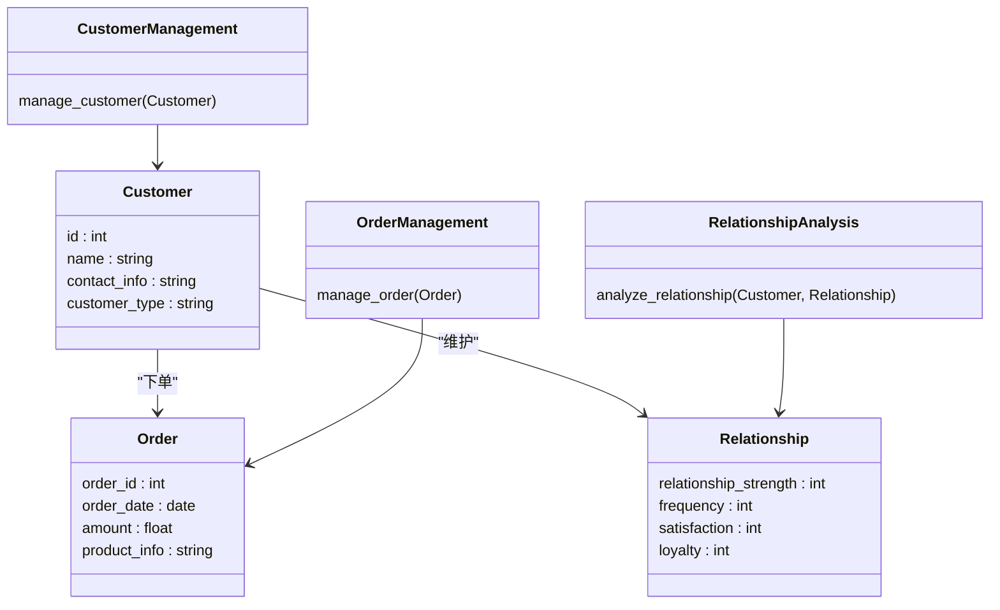

                 


# 客户关系管理集成

> 关键词：客户关系管理（CRM）、系统集成、数据模型、算法原理、系统架构、项目实战

> 摘要：本文深入探讨客户关系管理（CRM）集成的核心概念、系统架构、算法原理及项目实战。通过详细分析CRM集成的背景、核心要素、系统设计、算法实现及实际案例，帮助读者全面理解CRM集成的理论与实践。文章内容涵盖从系统分析到算法实现的全过程，适合技术人员、项目经理及企业决策者阅读。

---

## 第1章: 客户关系管理集成的背景与概念

### 1.1 客户关系管理（CRM）的定义与核心要素

CRM（Customer Relationship Management）是指企业通过管理与客户之间的关系，以提升客户满意度、忠诚度和企业收益为目标的一系列管理活动。CRM的核心要素包括：

- **客户信息管理**：收集、存储和管理客户的基本信息（如姓名、联系方式、地址等）。
- **客户行为分析**：分析客户的购买行为、互动频率、满意度等。
- **客户细分**：根据客户特征和行为将客户分成不同的群体，以便进行个性化管理。
- **客户互动管理**：通过邮件、电话、在线聊天等方式与客户互动，提供个性化的服务。
- **客户生命周期管理**：从潜在客户到忠实客户的全生命周期管理。

CRM的演进经历了从简单的客户信息记录到智能化的客户行为预测，再到如今的个性化服务推荐的阶段。随着企业信息化的快速发展，CRM系统已经成为企业提升竞争力的重要工具。

---

### 1.2 客户关系管理集成的背景与意义

随着企业信息化的深入发展，企业内部的系统越来越多，如ERP（企业资源计划）、SCM（供应链管理）、财务系统、销售系统等。这些系统往往各自独立，形成数据孤岛，导致信息无法有效共享和利用。CRM集成的目标是将这些系统中的数据和功能整合起来，实现数据的统一管理和业务流程的无缝衔接。

CRM集成的意义主要体现在以下几个方面：

1. **数据共享与利用**：通过集成，企业可以将分散在各个系统中的客户数据整合到一个统一的平台中，避免数据重复和不一致。
2. **提升业务效率**：通过集成，企业可以实现跨系统的业务流程自动化，减少人工操作，提升业务效率。
3. **增强客户体验**：通过集成，企业可以提供个性化的客户服务，提升客户的满意度和忠诚度。
4. **支持数据驱动决策**：通过集成，企业可以利用统一的数据源进行数据分析，为决策提供支持。

---

### 1.3 客户关系管理集成的目标与范围

CRM集成的目标是通过整合企业内外部的系统、数据和流程，实现客户信息的统一管理、业务流程的自动化以及数据的高效利用。CRM集成的范围包括：

- **系统集成**：将企业内部的ERP、财务系统、销售系统等与CRM系统集成，实现数据共享。
- **数据集成**：整合来自不同系统和渠道的客户数据，建立统一的客户数据库。
- **流程集成**：将CRM系统与企业的业务流程（如销售、营销、客服）集成，实现流程的自动化。
- **技术集成**：采用合适的技术手段（如API、数据仓库、ETL工具等）实现系统的集成。

---

## 第2章: 客户关系管理集成的核心概念与联系

### 2.1 集成的核心概念原理

CRM集成的核心在于实现数据的统一管理和业务流程的整合。以下是CRM集成的核心概念：

- **数据模型**：数据模型是CRM系统的核心，它定义了数据的结构、关系和存储方式。通过数据模型，可以实现客户、订单、产品等实体的统一管理。
- **系统架构**：CRM系统的架构决定了系统的功能模块划分和模块之间的交互方式。常见的CRM系统架构包括分层架构（如表现层、业务逻辑层、数据访问层）。
- **业务流程**：CRM系统的业务流程包括客户管理、订单管理、营销管理等，通过集成实现流程的自动化和高效执行。

---

### 2.2 核心概念属性特征对比表格

以下是CRM集成中涉及的核心概念及其属性特征对比：

| 概念 | 属性 | 特征 |
|------|------|------|
| 客户 | ID | 姓名、联系方式、客户类型 |
| 订单 | 订单号 | 订单日期、金额、产品信息 |
| 关系 | 关系强度 | 频率、满意度、忠诚度 |

---

### 2.3 ER实体关系图

以下是CRM集成中的ER实体关系图，展示了客户、订单和关系之间的关系：

```mermaid
erDiagram
    customer {
        id : int
        name : string
        contact_info : string
        customer_type : string
    }
    order {
        order_id : int
        order_date : date
        amount : float
        product_info : string
    }
    relationship {
        relationship_strength : int
        frequency : int
        satisfaction : int
        loyalty : int
    }
    customer --> relationship : "维护"
    order --> customer : "属于"
```

---

## 第3章: 客户关系管理集成的系统分析与架构设计

### 3.1 系统分析

#### 3.1.1 问题场景介绍

企业在进行CRM集成时，通常面临以下问题：

- 数据分散：客户信息分散在多个系统中，导致数据不一致和难以管理。
- 业务流程不畅：不同部门之间的业务流程缺乏协同，导致效率低下。
- 数据孤岛：系统之间无法有效共享数据，导致资源浪费。

#### 3.1.2 项目目标与范围

项目目标：实现企业内部CRM系统的集成，整合客户、订单、产品等数据，提升业务效率和客户满意度。

项目范围：包括系统设计、数据集成、业务流程整合、系统测试和上线部署。

#### 3.1.3 需求分析与功能分解

需求分析：
- 提供统一的客户视图，实现客户信息的集中管理。
- 实现订单管理功能，支持订单的创建、查询和修改。
- 提供客户关系分析功能，支持客户细分和关系预测。
- 实现自动化营销功能，支持个性化推荐和邮件营销。

功能分解：
- 客户管理模块：包括客户信息的录入、查询和修改。
- 订单管理模块：包括订单的创建、查询和修改。
- 关系分析模块：包括客户细分、关系预测和可视化。
- 营销管理模块：包括营销活动的策划、执行和效果分析。

---

### 3.2 系统功能设计

#### 3.2.1 领域模型类图

以下是CRM系统的领域模型类图：



---

### 3.3 系统架构设计

#### 3.3.1 分层架构设计

以下是CRM系统的分层架构图：


---

## 第4章: 客户关系管理集成的算法原理与实现

### 4.1 算法原理

在CRM集成中，常用算法包括：

- **聚类算法**：用于客户细分，如K-means算法。
- **回归算法**：用于客户流失预测，如线性回归算法。
- **分类算法**：用于客户行为预测，如决策树算法。

---

### 4.2 线性回归算法原理

线性回归是一种常用的回归分析方法，用于预测客户流失率。其数学模型如下：

$$ y = \beta_0 + \beta_1x + \epsilon $$

其中，$y$ 是预测目标（如客户流失率），$x$ 是自变量（如客户年龄、购买频率），$\beta_0$ 和 $\beta_1$ 是回归系数，$\epsilon$ 是误差项。

---

### 4.3 线性回归算法实现

以下是线性回归算法的Python代码实现：

```python
import numpy as np
from sklearn.linear_model import LinearRegression

# 示例数据
X = np.array([[1], [2], [3], [4], [5]])
y = np.array([2, 4, 5, 4, 6])

# 创建线性回归模型
model = LinearRegression()

# 训练模型
model.fit(X, y)

# 预测
print(model.predict([[6]]))
```

---

## 第5章: 客户关系管理集成的项目实战

### 5.1 环境安装与配置

以下是CRM集成项目的环境安装步骤：

1. 安装Python和Jupyter Notebook。
2. 安装必要的库，如`numpy`、`pandas`、`scikit-learn`。
3. 安装CRM系统（如Salesforce）。

---

### 5.2 系统核心实现源代码

以下是CRM系统的核心实现代码：

```python
class Customer:
    def __init__(self, id, name, contact_info, customer_type):
        self.id = id
        self.name = name
        self.contact_info = contact_info
        self.customer_type = customer_type

class Order:
    def __init__(self, order_id, order_date, amount, product_info):
        self.order_id = order_id
        self.order_date = order_date
        self.amount = amount
        self.product_info = product_info
```

---

## 第6章: 客户关系管理集成的最佳实践与小结

### 6.1 最佳实践

- **数据质量管理**：确保数据的准确性、完整性和一致性。
- **系统集成测试**：在集成过程中，进行全面的系统测试，确保各个模块协同工作。
- **用户培训**：对员工进行CRM系统的培训，确保用户能够熟练使用系统。

---

### 6.2 小结

CRM集成是企业信息化的重要组成部分，通过集成可以实现数据的统一管理、业务流程的自动化以及客户体验的提升。本文从背景、核心概念、系统架构、算法原理到项目实战，全面介绍了CRM集成的理论与实践。

---

作者：AI天才研究院/AI Genius Institute & 禅与计算机程序设计艺术 /Zen And The Art of Computer Programming

