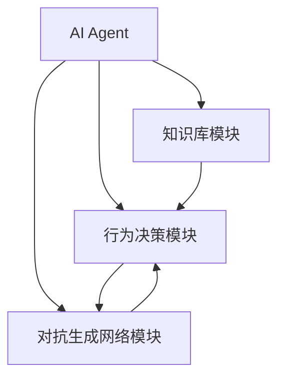
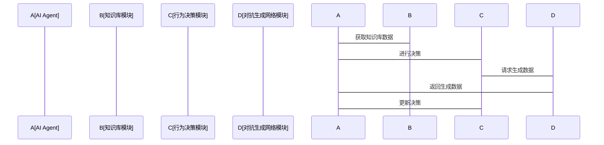

                 


# 对抗生成网络在AI Agent开发中的应用

---

## 关键词

- 对抗生成网络
- AI Agent
- 深度学习
- 生成模型
- 智能决策

---

## 摘要

对抗生成网络（GANs）作为一种强大的生成模型，在AI Agent开发中展现了巨大的潜力。本文将深入探讨GANs的基本原理及其在AI Agent中的应用，从系统架构设计到实际项目实现，全面分析如何利用GANs提升AI Agent的数据生成能力、智能决策能力和交互能力。文章结合理论与实践，通过具体案例分析，揭示GANs在AI Agent开发中的核心作用，并为读者提供详尽的实现指南。

---

## 正文

### 第1章：对抗生成网络与AI Agent的背景介绍

#### 1.1 对抗生成网络的基本概念

- **生成对抗网络（GANs）**  
  GANs由Ian Goodfellow等人提出，是一种生成模型，由生成器（Generator）和判别器（Discriminator）组成。生成器的目标是生成与真实数据相似的样本，而判别器的目标是区分真实数据和生成数据。通过对抗训练，生成器和判别器不断优化，最终生成高质量的数据。

- **AI Agent**  
  AI Agent是一种智能体，能够感知环境、执行任务并做出决策。AI Agent的核心能力包括数据处理、知识表示、推理和决策。在复杂环境中，AI Agent需要处理大量数据，生成多样化的数据样本是其能力的重要组成部分。

#### 1.2 问题背景与应用需求

- **数据生成的挑战**  
  AI Agent的开发往往需要大量多样化和高质量的数据来训练模型。传统的数据收集方法成本高、效率低，而GANs可以生成大量高质量的数据，为AI Agent的训练提供了新的解决方案。

- **对抗生成网络的优势**  
  GANs具有强大的生成能力，能够生成逼真的数据，适用于图像生成、文本生成等多种任务。在AI Agent开发中，GANs可以用于生成模拟用户输入、虚拟环境数据等，帮助模型更好地学习和决策。

#### 1.3 GANs的核心概念与属性

- **生成器与判别器**  
  - 生成器通过学习真实数据的分布，生成与真实数据相似的样本。
  - 判别器通过分类真实数据和生成数据，提供反馈以优化生成器。

- **对抗训练机制**  
  GANs的核心是生成器和判别器的对抗训练。生成器的目标是最小化判别器的错误率，而判别器的目标是最大化正确分类真实数据的能力。

- **GANs的优缺点**  
  - 优点：生成高质量数据，适用于多种任务。
  - 缺点：训练不稳定，易出现模式坍缩问题。

---

### 第2章：生成对抗网络的数学模型与公式

#### 2.1 GANs的基本数学框架

- **生成器的损失函数**  
  $$ L_{G} = \mathbb{E}_{z}[ -\log(D(G(z)))] $$
  其中，$z$是生成器的输入噪声，$D(G(z))$是判别器对生成样本的判别结果。

- **判别器的损失函数**  
  $$ L_{D} = \mathbb{E}_{x}[ -\log(D(x))] + \mathbb{E}_{z}[ \log(1 - D(G(z)))] $$$
  其中，$x$是真实数据，$z$是生成器的输入噪声。

- **联合优化目标**  
  GANs的目标是最小化生成器的损失函数和最大化判别器的损失函数：
  $$ \min_{G} \max_{D} L_{D} $$

#### 2.2 WGAN-GP的改进模型

- **Wasserstein距离**  
  WGAN引入了Wasserstein距离，通过优化地球移动距离来衡量生成数据与真实数据的差异。

- **梯度惩罚项**  
  为了解决WGAN训练不稳定的问题，WGAN-GP引入了梯度惩罚项：
  $$ \lambda \mathbb{E}_{z}[ (||\nabla G(z)||_2 - 1)^2 ] $$
  其中，$\lambda$是惩罚系数。

- **WGAN-GP的损失函数**  
  $$ L_{WGAN-GP} = \mathbb{E}_{x}[ D(x) ] - \mathbb{E}_{z}[ G(z) ] + \lambda \mathbb{E}_{z}[ (||\nabla G(z)||_2 - 1)^2 ] $$

---

### 第3章：AI Agent的系统架构设计

#### 3.1 AI Agent的功能模块划分

- **知识库模块**  
  用于存储和管理AI Agent所需的知识，包括生成的数据样本、规则库等。

- **行为决策模块**  
  基于当前状态和知识库信息，生成决策和行动计划。

- **对抗生成网络模块**  
  负责生成多样化的数据样本，支持AI Agent的学习和决策。

#### 3.2 系统功能设计

- **数据生成与训练模块**  
  使用GANs生成多样化的数据样本，用于训练其他模块。

- **对抗训练模块**  
  对生成器和判别器进行对抗训练，优化生成器的生成能力。

- **智能决策模块**  
  基于生成的数据样本和知识库信息，进行智能决策和行动选择。

#### 3.3 系统架构图



---

### 第4章：项目实战与代码实现

#### 4.1 项目环境安装与配置

```bash
pip install tensorflow-gpu==2.5.0 keras==2.5.0 numpy==1.21.2
```

#### 4.2 GANs模型实现

```python
import numpy as np
from tensorflow.keras import layers
from tensorflow.keras.models import Model
from tensorflow.keras.losses import binary_crossentropy
from tensorflow.keras.optimizers import Adam

def build_generator(input_dim=100):
    model = layers.Dense(256, activation='relu')(input_layer)
    model = layers.Dense(128, activation='relu')(model)
    model = layers.Dense(784, activation='sigmoid')(model)
    return Model(inputs=input_layer, outputs=model)

def build_discriminator(input_dim=784):
    model = layers.Dense(256, activation='relu')(input_layer)
    model = layers.Dense(128, activation='relu')(model)
    model = layers.Dense(1, activation='sigmoid')(model)
    return Model(inputs=input_layer, outputs=model)

def wasserstein_loss(y_true, y_pred):
    return K.mean(y_pred - y_true)

generator = build_generator()
discriminator = build_discriminator()

# 编译模型
discriminator.compile(loss='binary_crossentropy', optimizer=Adam(learning_rate=0.0002), metrics=['accuracy'])
generator.compile(loss='binary_crossentropy', optimizer=Adam(learning_rate=0.0002))
```

#### 4.3 系统交互流程



---

### 第5章：最佳实践与总结

#### 5.1 最佳实践

- **训练策略**  
  - 使用合适的超参数，如学习率、批量大小等。
  - 定期保存生成器和判别器的权重，防止训练中断。

- **模型调优**  
  - 调整生成器和判别器的网络结构，避免生成样本的质量下降。
  - 使用早停机制，防止模型过拟合。

- **评估指标**  
  - 使用生成样本的质量评估指标，如Inception分数、Fréchet Inception Distance（FID）等。

#### 5.2 总结

对抗生成网络在AI Agent开发中的应用为AI Agent提供了强大的数据生成能力，支持其在复杂环境中的智能决策和交互。通过本文的深入分析和实战案例，读者可以掌握GANs的核心原理和系统架构设计，为实际开发提供参考。

---

## 作者信息

作者：AI天才研究院/AI Genius Institute & 禅与计算机程序设计艺术 /Zen And The Art of Computer Programming

---

以上是完整的目录大纲和文章内容，按照逻辑逐步展开，结合理论与实践，深入浅出地阐述了对抗生成网络在AI Agent开发中的应用。

