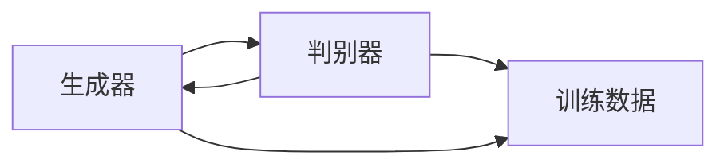
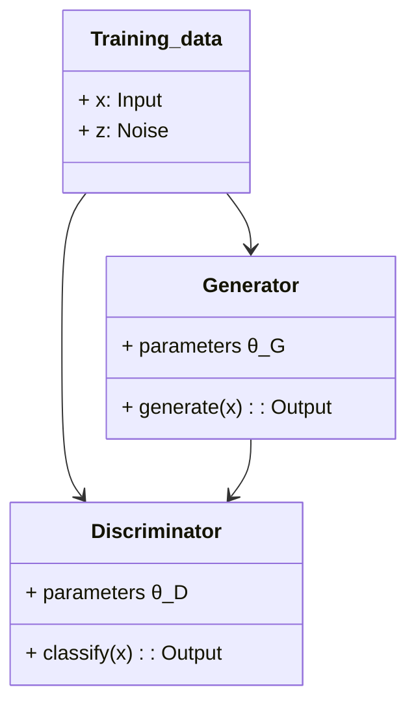
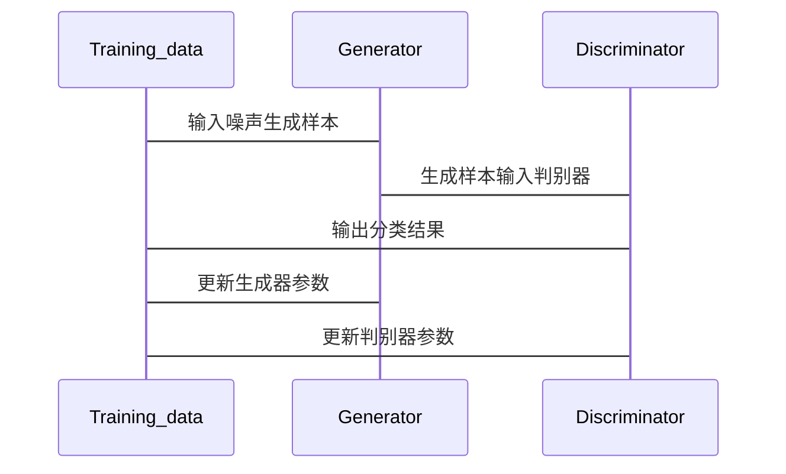

                 


# 对抗训练：提高AI Agent对噪声和攻击的鲁棒性

> 关键词：对抗训练，AI Agent，鲁棒性，噪声，攻击，生成对抗网络（GAN）

> 摘要：本文详细探讨了对抗训练在提高AI Agent对噪声和攻击的鲁棒性中的应用。通过分析对抗训练的基本概念、算法原理、系统设计、项目实战以及扩展与展望，本文为读者提供了从理论到实践的全面指导，帮助他们在复杂的环境下构建更稳健的AI系统。

---

# 第一部分: 对抗训练基础

## 第1章: 对抗训练概述

### 1.1 对抗训练的基本概念

#### 1.1.1 什么是对抗训练
对抗训练是一种通过同时训练两个模型（生成器和判别器）来提高模型鲁棒性的技术。生成器试图生成能够欺骗判别器的样本，而判别器则试图区分真实样本和生成样本。这种对抗过程使得模型在面对噪声和攻击时更具鲁棒性。

#### 1.1.2 对抗训练的核心目标
对抗训练的核心目标是通过模拟攻击和防御的过程，使AI Agent能够识别和抵抗各种类型的噪声和对抗攻击，从而在复杂环境中保持稳定性和准确性。

#### 1.1.3 对抗训练在AI Agent中的应用
在AI Agent中，对抗训练可以用于提高语音识别、图像识别、自然语言处理等任务的鲁棒性。例如，在语音助手中，对抗训练可以帮助识别和抵抗噪声干扰，确保语音识别的准确性。

### 1.2 对抗训练的背景与挑战

#### 1.2.1 AI Agent面临的噪声问题
AI Agent在实际应用中常常会面临各种噪声干扰，例如语音中的背景噪音、图像中的随机噪声等。这些噪声可能导致模型的识别错误，影响用户体验。

#### 1.2.2 对抗攻击的定义与分类
对抗攻击是指通过故意添加噪声或干扰，使得模型输出错误结果的行为。对抗攻击可以分为白盒攻击和黑盒攻击，白盒攻击是指攻击者知道模型的内部结构，黑盒攻击则是指攻击者只知道模型的输入输出。

#### 1.2.3 对抗训练的必要性与边界
对抗训练的必要性在于，通过模拟对抗攻击，模型可以在训练过程中学习到如何抵抗这些攻击，从而提高模型的鲁棒性。然而，对抗训练也有其边界，例如训练数据的质量、模型的复杂性等，都会影响对抗训练的效果。

### 1.3 对抗训练的核心要素

#### 1.3.1 对抗样本的生成与识别
对抗样本是通过对抗训练生成的，目的是欺骗模型使其产生错误的输出。生成对抗样本的过程包括生成器的设计和对抗样本的评估。

#### 1.3.2 对抗训练的数学模型
对抗训练的数学模型主要基于生成对抗网络（GAN），包括生成器和判别器的损失函数设计。

#### 1.3.3 对抗训练的评估指标
对抗训练的评估指标包括生成样本的质量、判别器的分类准确率、模型的鲁棒性等。

---

## 第2章: 对抗训练的核心概念与联系

### 2.1 对抗训练的核心原理

#### 2.1.1 对抗网络的结构与功能
对抗网络由生成器和判别器组成。生成器负责生成对抗样本，判别器负责区分真实样本和生成样本。通过交替训练生成器和判别器，模型可以逐步提高对抗能力。

#### 2.1.2 对抗训练的损失函数
对抗训练的损失函数包括生成器的损失和判别器的损失。生成器的损失函数旨在欺骗判别器，而判别器的损失函数旨在区分真实样本和生成样本。

#### 2.1.3 对抗训练的优化策略
对抗训练的优化策略包括使用不同的优化算法（如Adam）、调整学习率、平衡生成器和判别器的损失函数等。

### 2.2 对抗训练与传统机器学习的对比

#### 2.2.1 传统机器学习的特点
传统机器学习模型通常依赖于大量的标注数据，训练过程中没有考虑对抗攻击的因素。因此，这些模型在面对对抗攻击时往往表现较差。

#### 2.2.2 对抗训练的独特优势
对抗训练的独特优势在于通过模拟对抗攻击，模型可以在训练过程中学习到如何抵抗这些攻击，从而提高模型的鲁棒性。

#### 2.2.3 两者的联系与区别
尽管对抗训练和传统机器学习在目标上有所不同，但它们都依赖于优化算法和损失函数的设计。对抗训练的独特之处在于其考虑了模型与攻击者之间的博弈关系。

### 2.3 对抗训练的系统架构

#### 2.3.1 对抗训练的系统组成
对抗训练系统通常包括生成器、判别器、训练数据和对抗样本生成模块。生成器和判别器通过交替训练来提高模型的鲁棒性。

#### 2.3.2 对抗训练的实体关系图


#### 2.3.3 对抗训练的流程图
```mermaid
graph TD
G[生成器] --> D[判别器]
D --> "输出结果"
G --> "更新生成器参数"
D --> "更新判别器参数"
Training_data[训练数据] --> G
Training_data --> D
```

---

## 第3章: 对抗训练的数学模型与公式

### 3.1 对抗训练的数学基础

#### 3.1.1 对抗网络的数学表示
生成器和判别器的数学表示通常使用概率模型或神经网络。生成器的目标是最大化判别器的错误率，而判别器的目标是最大化正确分类的真实样本。

#### 3.1.2 损失函数的数学推导
生成器的损失函数和判别器的损失函数可以通过优化理论进行推导。生成器的损失函数通常表示为判别器输出的对数似然函数，而判别器的损失函数则表示为真实样本和生成样本的对数似然函数。

#### 3.1.3 对抗训练的优化算法
对抗训练通常使用梯度下降算法，如Adam优化器。生成器和判别器的参数更新通常交替进行，以保持模型的平衡。

### 3.2 对抗训练的数学公式

#### 3.2.1 对抗网络的损失函数
生成器的损失函数：
$$ L_G = -\mathbb{E}_{z}[\log(1 - D(G(z))) ] $$
判别器的损失函数：
$$ L_D = -\mathbb{E}_{x}[ \log(D(x)) ] - \mathbb{E}_{z}[ \log(1 - D(G(z))) ] $$

#### 3.2.2 梯度下降的数学表达
生成器参数更新：
$$ \theta_G = \theta_G - \eta \frac{\partial L_G}{\partial \theta_G} $$
判别器参数更新：
$$ \theta_D = \theta_D - \eta \frac{\partial L_D}{\partial \theta_D} $$

---

## 第4章: 对抗训练的系统设计

### 4.1 系统架构设计

#### 4.1.1 对抗训练系统的组成
对抗训练系统通常包括生成器、判别器、训练数据和对抗样本生成模块。

#### 4.1.2 对抗训练系统的类图


#### 4.1.3 对抗训练系统的交互流程


### 4.2 对抗训练的接口设计

#### 4.2.1 对抗训练的API设计
生成器和判别器可以通过API接口进行交互，例如：
```python
def generate(self, z):
    pass
def discriminate(self, x):
    pass
```

#### 4.2.2 对抗训练的交互协议
生成器和判别器通过交替训练协议进行交互，例如：
```python
for step in range(num_steps):
    # 更新生成器
    z = generate_noise()
    x_gen = generator(z)
    loss_G = generator_loss(x_gen, D(x_gen))
    update_G(loss_G)
    # 更新判别器
    x_real = real_data()
    loss_D = discriminator_loss(x_real, D(x_real)) + generator_loss(x_gen, D(x_gen))
    update_D(loss_D)
```

---

## 第5章: 对抗训练的项目实战

### 5.1 项目环境搭建

#### 5.1.1 环境要求
需要安装Python、TensorFlow或PyTorch等深度学习框架，以及一些常用的数据处理库。

#### 5.1.2 安装依赖
```bash
pip install numpy tensorflow matplotlib
```

### 5.2 对抗训练的核心实现

#### 5.2.1 生成器实现
```python
import tensorflow as tf
from tensorflow import keras

def build_generator(input_dim, output_dim):
    model = keras.Sequential()
    model.add(keras.layers.Dense(256, activation='relu', input_dim=input_dim))
    model.add(keras.layers.Dense(512, activation='relu'))
    model.add(keras.layers.Dense(output_dim, activation='sigmoid'))
    return model
```

#### 5.2.2 判别器实现
```python
def build_discriminator(input_dim):
    model = keras.Sequential()
    model.add(keras.layers.Dense(512, activation='relu', input_dim=input_dim))
    model.add(keras.layers.Dense(256, activation='relu'))
    model.add(keras.layers.Dense(1, activation='sigmoid'))
    return model
```

### 5.3 对抗训练的训练过程

#### 5.3.1 训练循环
```python
def train(generator, discriminator, x_train, z_train, epochs=100, batch_size=32):
    for epoch in range(epochs):
        # 更新生成器
        z = np.random.normal(0, 1, (batch_size, 100))
        x_gen = generator.predict(z)
        loss_G = generator.train_on_batch(z, np.zeros((batch_size, 1)))
        # 更新判别器
        x_real = x_train[:batch_size]
        loss_D_real = discriminator.train_on_batch(x_real, np.ones((batch_size, 1)))
        loss_D_fake = discriminator.train_on_batch(x_gen, np.zeros((batch_size, 1)))
        total_loss_D = loss_D_real + loss_D_fake
        print(f"Epoch {epoch}: G_loss={loss_G}, D_loss={total_loss_D}")
```

### 5.4 实际案例分析

#### 5.4.1 案例背景
假设我们有一个图像分类任务，目标是在存在噪声干扰的情况下准确分类图像。

#### 5.4.2 训练结果
通过对抗训练，生成器能够生成对抗样本，使得判别器在面对这些样本时能够准确分类真实样本，从而提高模型的鲁棒性。

#### 5.4.3 模型评估
在对抗训练完成后，需要对模型进行评估，确保其在面对噪声和对抗攻击时的准确性。

### 5.5 项目小结

#### 5.5.1 项目总结
通过对抗训练，我们成功提高了AI Agent在噪声和攻击环境中的鲁棒性。

#### 5.5.2 经验教训
对抗训练的收敛速度较慢，需要合理调整生成器和判别器的参数。

#### 5.5.3 注意事项
在实际应用中，需要根据具体任务调整生成器和判别器的结构，同时注意训练数据的质量。

---

## 第6章: 对抗训练的扩展与展望

### 6.1 对抗训练的前沿技术

#### 6.1.1 智能对抗训练
智能对抗训练通过引入自适应策略，进一步提高模型的鲁棒性。

#### 6.1.2 联合对抗训练
联合对抗训练是指同时训练多个生成器和判别器，以提高模型的泛化能力。

#### 6.1.3 对抗训练的自动化
通过自动化技术，对抗训练可以更高效地进行，例如使用自动化调参和超参数优化。

### 6.2 对抗训练的挑战与解决方案

#### 6.2.1 训练效率问题
对抗训练的收敛速度较慢，可以通过优化算法改进。

#### 6.2.2 模型过拟合问题
模型过拟合可以通过正则化技术解决，例如添加Dropout层。

#### 6.2.3 对抗攻击的多样性
对抗攻击的多样性可以通过引入多种攻击策略，增强模型的鲁棒性。

### 6.3 对抗训练的未来发展方向

#### 6.3.1 更高效的对抗训练算法
未来的研究方向包括设计更高效的对抗训练算法，例如使用强化学习框架。

#### 6.3.2 对抗训练的跨领域应用
对抗训练可以在更多领域中应用，例如自然语言处理、计算机视觉等。

#### 6.3.3 对抗训练的伦理问题
对抗训练的伦理问题，例如对抗攻击的滥用，也需要引起关注。

### 6.4 最佳实践 tips

#### 6.4.1 对抗训练的实践建议
在实际应用中，需要合理调整生成器和判别器的结构，同时注意训练数据的质量。

#### 6.4.2 对抗训练的注意事项
在对抗训练中，需要关注模型的收敛性和鲁棒性，避免过拟合。

#### 6.4.3 对抗训练的拓展建议
未来的研究可以关注对抗训练的自动化和智能化，提高模型的泛化能力。

---

# 第七章: 总结与展望

## 7.1 总结

对抗训练是一种有效的提高AI Agent鲁棒性的技术，通过对生成器和判别器的交替训练，模型可以在复杂环境中保持稳定性和准确性。

## 7.2 展望

未来，对抗训练将在更多领域中应用，同时研究者们也将探索更高效的算法和更广泛的应用场景，以应对日益复杂的对抗环境。

---

# 作者

作者：AI天才研究院/AI Genius Institute & 禅与计算机程序设计艺术 /Zen And The Art of Computer Programming

