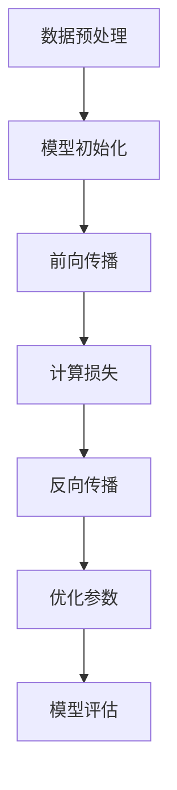
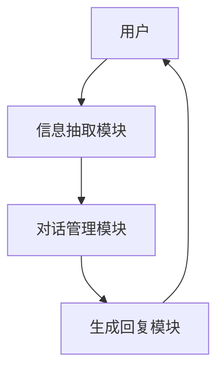
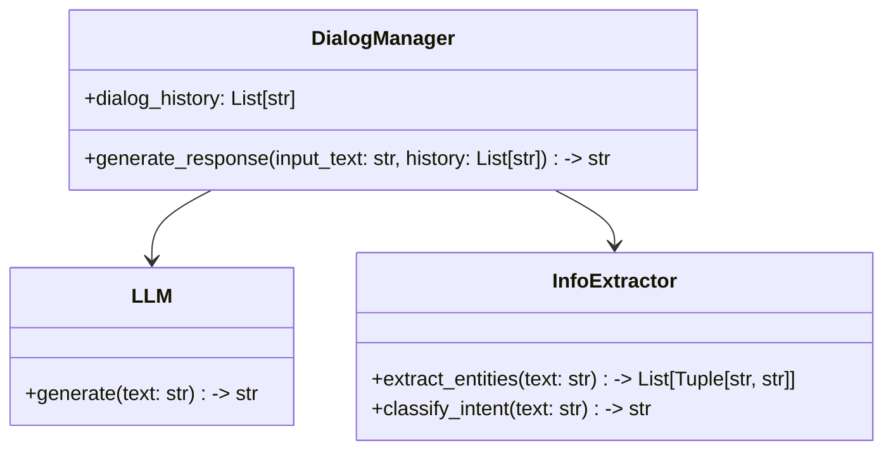

                 


# 对话式AI Agent：提升LLM的自然语言交互能力

## 关键词：对话式AI Agent, 大语言模型（LLM）, 自然语言处理（NLP）, 人机交互, 对话管理, 信息抽取

## 摘要：对话式AI Agent通过利用大语言模型（LLM）提升自然语言交互能力，实现更自然、高效的用户对话体验。本文从LLM的基本原理出发，深入探讨对话式AI Agent的设计与实现，系统架构设计，项目实战，并总结最佳实践和未来发展趋势。

---

## 第1章：对话式AI Agent概述

### 1.1 对话式AI Agent的定义与核心概念

#### 1.1.1 对话式AI Agent的定义
对话式AI Agent是一种基于自然语言处理技术的智能代理，能够通过文本或语音与用户进行交互，理解用户意图并生成相应的回复。它结合了大语言模型（LLM）的强大能力，提供更自然、更智能的对话体验。

#### 1.1.2 对话式AI Agent的核心功能
- **信息抽取**：从用户输入中提取关键信息，如意图、实体等。
- **对话管理**：根据对话历史和当前上下文，生成合适的回复。
- **生成回复**：利用LLM生成自然流畅的回复，满足用户需求。

#### 1.1.3 对话式AI Agent的应用场景
- **智能客服**：提供24/7的客户支持服务。
- **虚拟助手**：如Siri、Alexa等，帮助用户完成日常任务。
- **教育助手**：辅助学生学习，解答问题。
- **医疗咨询**：提供初步的医疗建议和信息查询。

---

### 1.2 对话式AI Agent的发展背景

#### 1.2.1 自然语言处理技术的发展
自然语言处理（NLP）技术的进步，尤其是大语言模型的出现，使得对话式AI Agent能够更准确地理解用户意图并生成自然的回复。

#### 1.2.2 大语言模型（LLM）的崛起
大语言模型如GPT-3、GPT-4等，通过海量数据的训练，具备强大的文本生成和理解能力，为对话式AI Agent提供了坚实的技术基础。

#### 1.2.3 对话式AI Agent的市场需求
随着用户对智能化服务需求的增加，对话式AI Agent在多个领域的应用需求日益增长，推动了其快速发展。

---

## 第2章：大语言模型（LLM）基础

### 2.1 大语言模型的基本原理

#### 2.1.1 什么是大语言模型
大语言模型是一种基于深度学习的模型，通过大量数据的训练，能够理解和生成人类语言。

#### 2.1.2 LLM的核心特点
- **大规模训练数据**：通常使用互联网上的海量文本数据进行训练。
- **自监督学习**：模型通过预测下一个词来学习语言结构。
- **多任务能力**：模型可以执行多种NLP任务，如文本生成、问答、翻译等。

#### 2.1.3 LLM的训练过程
1. 数据预处理：清洗、分词、生成训练样本。
2. 模型初始化：使用随机权重初始化模型参数。
3. 前向传播：输入数据，计算模型输出。
4. 损失计算：计算预测输出与真实标签之间的差异。
5. 反向传播：通过梯度下降优化模型参数。
6. 模型评估：验证模型在测试数据上的性能。

**算法原理讲解：**

**训练过程的数学模型：**

$$
\text{损失函数} = -\sum_{i=1}^{n} \log P(w_i | w_{<i})
$$

其中，$P(w_i | w_{<i})$ 表示在给定前一个词的情况下，当前词的概率。

**训练过程的mermaid流程图：**



---

### 2.2 主流大语言模型介绍

#### 2.2.1 GPT系列模型
GPT（Generative Pre-trained Transformer）由OpenAI开发，通过多层Transformer架构实现强大的文本生成能力。

#### 2.2.2 BERT及其变体
BERT（Bidirectional Encoder Representations from Transformers）由Google开发，采用双向Transformer架构，擅长文本理解和问答任务。

#### 2.2.3 其他知名大模型
- **PaLM**：由Google开发，专为对话式AI设计。
- **Megatron-LM**：由Facebook开发，支持大规模分布式训练。

---

## 第3章：对话式AI Agent的设计与实现

### 3.1 对话式AI Agent的设计目标

#### 3.1.1 提供自然的对话体验
通过理解用户意图和上下文，生成自然流畅的回复，使对话过程更接近人类对话。

#### 3.1.2 实现高效的对话管理
根据对话历史，合理安排对话流程，确保对话的连贯性和高效性。

#### 3.1.3 确保系统的可扩展性
设计模块化架构，便于后续功能扩展和性能优化。

---

### 3.2 对话式AI Agent的核心模块

#### 3.2.1 信息抽取模块

**功能：** 从用户输入中提取关键信息，如意图、实体等。

**实现步骤：**
1. 使用NLP工具（如spaCy）进行分词和实体识别。
2. 结合预定义的意图分类模型（如SVM或神经网络）进行意图识别。

**示例代码：**

```python
import spacy

nlp = spacy.load("en_core_web_sm")
doc = nlp("I want to book a flight to Paris.")
entities = [(ent.text, ent.label_) for ent in doc.ents]
intents = classify_intent(doc)
```

---

#### 3.2.2 对话管理模块

**功能：** 根据对话历史和当前上下文，生成合适的回复。

**实现步骤：**
1. 维护对话历史记录，包括用户输入和系统回复。
2. 基于对话历史，使用状态机或规则引擎决定下一步动作。

**示例代码：**

```python
class DialogManager:
    def __init__(self):
        self.dialog_history = []
    
    def add_to_history(self, utterance):
        self.dialog_history.append(utterance)
    
    def get_response(self, input_text):
        # 使用预训练模型生成回复
        response = generate_response(input_text, self.dialog_history)
        return response
```

---

#### 3.2.3 生成回复模块

**功能：** 利用LLM生成自然流畅的回复。

**实现步骤：**
1. 将用户输入和对话历史输入到LLM中，生成候选回复。
2. 根据预设的评估指标（如相关性、流畅性）选择最优回复。

**示例代码：**

```python
from transformers import GPT2Tokenizer, GPT2ModelWithLMHead

tokenizer = GPT2Tokenizer.from_pretrained('gpt2')
model = GPT2ModelWithLMHead.from_pretrained('gpt2')

def generate_response(input_text, history):
    full_prompt = history + [input_text]
    inputs = tokenizer('\n'.join(full_prompt), return_tensors='np')
    outputs = model.generate(inputs.input_ids, max_length=100, do_sample=True)
    response = tokenizer.decode(outputs[0][0], skip_special_tokens=True)
    return response
```

---

## 第4章：系统架构设计

### 4.1 系统整体架构

**系统架构设计：**



---

### 4.2 系统功能设计

#### 4.2.1 对话式AI Agent的领域模型

**领域模型：**



---

### 4.3 系统接口设计

#### 4.3.1 对话管理模块接口

- **输入：** 用户输入文本和对话历史。
- **输出：** 系统回复文本。

#### 4.3.2 信息抽取模块接口

- **输入：** 用户输入文本。
- **输出：** 实体和意图信息。

---

## 第5章：项目实战

### 5.1 环境安装

**Python环境配置：**

```bash
pip install transformers spacy
python -m spacy download en_core_web_sm
```

---

### 5.2 核心代码实现

#### 5.2.1 信息抽取模块实现

```python
import spacy

nlp = spacy.load("en_core_web_sm")

def extract_entities(text):
    doc = nlp(text)
    entities = []
    for ent in doc.ents:
        entities.append((ent.text, ent.label_))
    return entities
```

---

#### 5.2.2 对话管理模块实现

```python
class DialogManager:
    def __init__(self):
        self.dialog_history = []
    
    def add_to_history(self, utterance):
        self.dialog_history.append(utterance)
    
    def get_response(self, input_text):
        # 使用预训练模型生成回复
        response = generate_response(input_text, self.dialog_history)
        return response
```

---

### 5.3 系统测试与优化

#### 5.3.1 系统测试

- **测试用例设计：** 包括正常流程测试、异常处理测试等。
- **性能测试：** 测量系统在高并发情况下的响应时间。

#### 5.3.2 系统优化

- **模型优化：** 通过数据增强和模型微调提高生成回复的质量。
- **架构优化：** 使用异步处理和分布式架构提升系统性能。

---

## 第6章：最佳实践与注意事项

### 6.1 最佳实践

- **数据质量：** 确保训练数据的多样性和代表性。
- **模型调优：** 根据具体任务需求，对模型进行微调和优化。
- **用户体验：** 设计友好的交互界面，提供多语言支持。

### 6.2 注意事项

- **数据隐私：** 注意保护用户数据，遵守相关法律法规。
- **模型可解释性：** 提供清晰的解释，增强用户信任。

---

## 第7章：未来发展趋势与挑战

### 7.1 未来发展趋势

- **多模态对话式AI Agent：** 结合视觉、听觉等多模态信息，提供更丰富的交互体验。
- **个性化服务：** 根据用户偏好和行为提供定制化服务。
- **边缘计算：** 通过边缘计算提升对话式AI Agent的实时性和响应速度。

### 7.2 当前面临的技术挑战

- **计算资源限制：** 大模型的训练和推理需要大量计算资源。
- **模型泛化能力：** 模型在不同领域和场景中的泛化能力有待提升。
- **对话上下文理解：** 如何更准确地理解复杂对话上下文仍是一个挑战。

---

## 附录

### 附录A：常用工具与库

- **Transformers库**：用于加载和使用预训练模型。
- **spaCy**：用于信息抽取和自然语言处理。
- **Hugging Face**：提供丰富的预训练模型和工具。

### 附录B：参考文献

- 教材：《深度学习》—— Ian Goodfellow
- 论文：《Attention Is All You Need》—— Vaswani et al.
- 官方文档：Hugging Face Transformers库文档

---

## 作者：AI天才研究院 & 禅与计算机程序设计艺术

---

以上是《对话式AI Agent：提升LLM的自然语言交互能力》的完整目录大纲和文章内容，希望对您有所帮助！

