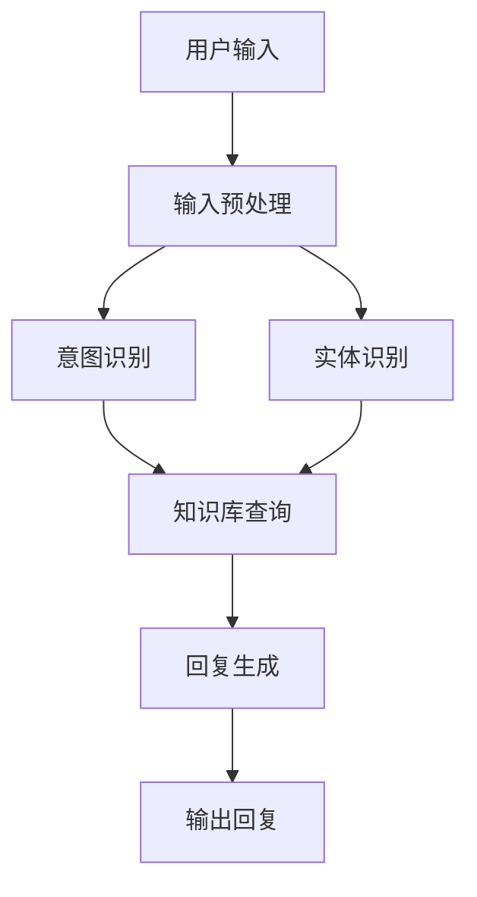
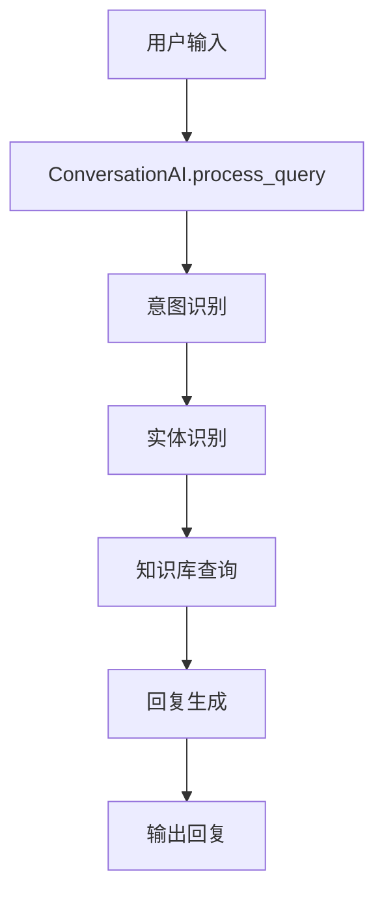

                 


# 对话式AI在客户服务中的应用与优化

## 关键词：对话式AI，客户服务，自然语言处理，机器学习，深度学习，系统架构

## 摘要：  
对话式AI（Conversational AI）作为一种新兴的技术，正在逐步改变客户服务的方式。本文将从对话式AI的核心概念出发，详细分析其在客户服务中的应用与优化策略，包括自然语言处理（NLP）、机器学习、深度学习等关键技术，探讨对话式AI系统的架构设计与优化方法，并通过实际案例展示对话式AI在客户服务中的具体应用场景。文章最后将总结对话式AI在客户服务中的最佳实践和未来发展方向。

---

## 第1章: 对话式AI的背景与概念

### 1.1 对话式AI的基本概念

#### 1.1.1 对话式AI的定义  
对话式AI是一种能够理解和生成人类语言的智能系统，通过自然语言处理技术实现与用户的交互。它不仅可以理解用户的意图，还能通过上下文提供个性化的回复。

#### 1.1.2 对话式AI的核心要素  
对话式AI的核心要素包括：  
1. 自然语言理解（NLU）：解析用户输入的意图和实体。  
2. 自然语言生成（NLG）：生成符合用户需求的回复。  
3. 对话管理：维护对话上下文，确保对话流畅。  
4. 知识库：存储相关领域知识，支持回答准确性。  

#### 1.1.3 对话式AI与传统客服的区别  
与传统客服相比，对话式AI具有以下优势：  
- 24/7可用：无需人工值守，随时为用户提供服务。  
- 高效响应：通过自动化处理，快速解决用户问题。  
- 个性化服务：基于用户数据提供定制化回复。  

### 1.2 对话式AI的应用背景  

#### 1.2.1 客户服务的现状与挑战  
传统客户服务存在以下问题：  
1. 人工成本高：需要大量客服人员，增加了企业负担。  
2. 响应速度慢：在高峰期，用户可能需要等待较长时间。  
3. 服务质量不一致：人工客服可能存在情绪波动，影响服务质量。  

#### 1.2.2 对话式AI的出现与发展趋势  
随着AI技术的快速发展，对话式AI逐渐成为解决客户服务问题的重要工具。它不仅能够降低企业成本，还能显著提升客户满意度。  

#### 1.2.3 对话式AI在企业中的价值  
1. 提高客户满意度：通过快速响应和个性化服务，提升客户体验。  
2. 降低运营成本：减少对人工客服的依赖，降低人力成本。  
3. 提升服务效率：通过自动化处理，提高问题解决效率。  

### 1.3 对话式AI的核心优势  

#### 1.3.1 提高客户满意度  
对话式AI能够通过24/7的可用性和个性化的服务，显著提高客户的满意度。  

#### 1.3.2 降低企业运营成本  
通过自动化处理，对话式AI能够大幅降低企业的运营成本。  

#### 1.3.3 提升服务效率  
对话式AI能够在短时间内处理大量的用户请求，显著提升服务效率。  

---

## 第2章: 对话式AI的核心技术与原理  

### 2.1 自然语言处理（NLP）基础  

#### 2.1.1 NLP的基本概念  
自然语言处理（NLP）是研究如何让计算机理解和生成人类语言的学科。它涵盖了文本分析、语义理解、文本生成等多个方面。  

#### 2.1.2 NLP在对话式AI中的应用  
在对话式AI中，NLP主要应用于以下方面：  
1. 意图识别：理解用户输入的意图。  
2. 实体识别：提取文本中的关键信息。  
3. 文本生成：生成符合上下文的回复。  

#### 2.1.3 常见的NLP技术与工具  
常用的NLP技术包括：  
- 分词：将文本分割成词语或短语。  
- 词性标注：识别词语的词性（名词、动词等）。  
- 命名实体识别（NER）：识别文本中的命名实体（如人名、地名）。  

常用的NLP工具包括：  
- spaCy  
- NLTK  
- Stanford NLP  

### 2.2 机器学习与深度学习  

#### 2.2.1 机器学习的基本原理  
机器学习是一种通过数据训练模型，使其能够从数据中学习规律的技术。它分为监督学习、无监督学习和半监督学习三种类型。  

#### 2.2.2 深度学习在对话式AI中的应用  
深度学习通过多层神经网络，能够更好地捕捉文本中的语义信息。它在对话式AI中的应用包括：  
1. 意图识别：通过深度学习模型识别用户的意图。  
2. 实体识别：通过深度学习模型提取文本中的实体信息。  
3. 文本生成：通过生成式模型（如GPT）生成回复。  

#### 2.2.3 常见的机器学习算法  
常用的机器学习算法包括：  
- 逻辑回归（Logistic Regression）  
- 支持向量机（SVM）  
- 决策树（Decision Tree）  
- 随机森林（Random Forest）  

### 2.3 对话式AI的算法流程  

#### 2.3.1 意图识别  
意图识别是对话式AI的核心任务之一。通过NLP技术和机器学习算法，模型能够理解用户的意图，并将其分类到预定义的意图类别中。  

#### 2.3.2 实体识别  
实体识别是对话式AI的另一个重要任务。通过NLP技术，模型能够从文本中提取出关键实体（如人名、地名、日期等）。  

#### 2.3.3 生成式对话  
生成式对话是对话式AI的关键技术之一。通过生成式模型（如GPT），模型能够生成符合上下文的回复。  

---

## 第3章: 对话式AI的系统架构与设计  

### 3.1 对话式AI系统的整体架构  

#### 3.1.1 系统模块划分  
对话式AI系统的模块划分包括：  
1. 用户输入模块：接收用户的输入。  
2. NLP处理模块：解析用户的意图和实体。  
3. 对话管理模块：维护对话上下文。  
4. 回复生成模块：生成符合意图的回复。  
5. 知识库模块：存储和管理相关知识。  

#### 3.1.2 系统功能设计  
系统功能设计包括：  
- 用户输入处理：接收用户输入并进行预处理。  
- 意图识别：识别用户的意图。  
- 实体识别：提取文本中的实体信息。  
- 回复生成：生成符合意图的回复。  

#### 3.1.3 系统架构图  
以下是一个对话式AI系统的架构图：



### 3.2 对话式AI的系统实现  

#### 3.2.1 数据预处理  
数据预处理是对话式AI系统实现的关键步骤。主要包括：  
- 分词：将文本分割成词语或短语。  
- 词性标注：识别词语的词性。  
- 停用词处理：去除无意义的词语（如“的”、“是”等）。  

#### 3.2.2 模型训练  
模型训练是对话式AI系统实现的核心步骤。主要包括：  
- 数据标注：对训练数据进行标注（如意图分类、实体识别）。  
- 模型选择：选择适合的机器学习算法或深度学习模型。  
- 模型训练：使用训练数据训练模型。  

#### 3.2.3 系统集成  
系统集成是对话式AI系统实现的最后一步。主要包括：  
- 接口设计：设计API接口供其他系统调用。  
- 系统部署：将系统部署到生产环境。  
- 系统测试：对系统进行测试，确保其稳定性和可靠性。  

### 3.3 对话式AI的接口设计  

#### 3.3.1 API接口设计  
以下是一个对话式AI系统的API接口设计示例：

```python
class ConversationAI:
    def __init__(self, model_path):
        self.model = load_model(model_path)
    
    def process_query(self, query):
        # 输入预处理
        processed_query = preprocess(query)
        # 意图识别
        intent = self.model.predict_intent(processed_query)
        # 实体识别
        entities = self.model.predict_entities(processed_query)
        # 知识库查询
        knowledge = self.model.query_knowledge_base(intent, entities)
        # 回复生成
        response = self.model.generate_response(knowledge)
        return response
```

#### 3.3.2 接口调用流程  
以下是一个接口调用流程图：



#### 3.3.3 接口测试与优化  
接口测试与优化是确保对话式AI系统稳定性和可靠性的关键步骤。主要包括：  
- 功能测试：测试接口的功能是否正常。  
- 性能测试：测试接口的响应时间是否符合要求。  
- 安全测试：测试接口的安全性，防止漏洞攻击。  

---

## 第4章: 对话式AI的优化策略与技巧  

### 4.1 对话式AI的优化目标  

#### 4.1.1 提高对话准确率  
对话准确率是对话式AI系统性能的重要指标。通过优化算法和数据，可以显著提高对话准确率。  

#### 4.1.2 提升用户体验  
用户体验是对话式AI系统优化的核心目标。通过优化回复质量和响应速度，可以显著提升用户体验。  

#### 4.1.3 降低系统延迟  
系统延迟是对话式AI系统优化的另一个重要目标。通过优化算法和系统架构，可以显著降低系统延迟。  

### 4.2 对话式AI的优化方法  

#### 4.2.1 数据增强技术  
数据增强技术是提高对话式AI系统性能的重要手段。通过生成更多样化的训练数据，可以显著提高模型的泛化能力。  

#### 4.2.2 模型微调  
模型微调是优化对话式AI系统的重要方法。通过对模型进行微调，可以使其更好地适应特定领域的数据和任务。  

#### 4.2.3 生成式对话优化  
生成式对话优化是提高对话准确率和自然度的重要方法。通过优化生成模型的参数和训练数据，可以显著提高对话质量。  

### 4.3 对话式AI的优化工具与框架  

#### 4.3.1 常用优化工具  
常用的对话式AI优化工具包括：  
- Hugging Face：提供丰富的预训练模型和工具。  
- TensorFlow：深度学习框架，支持模型训练和优化。  
- PyTorch：深度学习框架，支持模型训练和优化。  

#### 4.3.2 常用优化框架  
常用的对话式AI优化框架包括：  
- Dialogflow：Google提供的对话式AI平台。  
- Rasa：开源的对话式AI框架。  
- Microsoft Bot Framework：微软提供的对话式AI框架。  

---

## 第5章: 对话式AI在客户服务中的项目实战  

### 5.1 项目背景与目标  

#### 5.1.1 项目背景  
本项目旨在通过对话式AI技术，优化某企业的客户服务流程，提高客户满意度和运营效率。  

#### 5.1.2 项目目标  
1. 实现对话式AI系统，支持24/7的客户服务。  
2. 提高客户满意度，降低客户流失率。  
3. 提高服务效率，降低运营成本。  

### 5.2 项目实施步骤  

#### 5.2.1 数据收集与预处理  
数据收集与预处理是项目实施的第一步。主要包括：  
- 数据收集：收集客户服务相关的数据，包括用户输入、历史对话记录等。  
- 数据标注：对数据进行标注，包括意图分类和实体识别。  

#### 5.2.2 模型训练与优化  
模型训练与优化是项目实施的核心步骤。主要包括：  
- 模型选择：选择适合的机器学习算法或深度学习模型。  
- 模型训练：使用标注数据训练模型。  
- 模型优化：通过调整模型参数和优化算法，提高模型性能。  

#### 5.2.3 系统集成与测试  
系统集成与测试是项目实施的最后一步。主要包括：  
- 系统集成：将对话式AI系统集成到企业的客服系统中。  
- 系统测试：对系统进行全面测试，确保其稳定性和可靠性。  

### 5.3 项目核心代码实现  

#### 5.3.1 数据预处理代码  
以下是一个数据预处理代码示例：

```python
def preprocess(text):
    # 分词
    words = split_words(text)
    # 词性标注
    tagged_words = tag_words(words)
    # 去除停用词
    filtered_words = remove_stopwords(tagged_words)
    return filtered_words
```

#### 5.3.2 模型训练代码  
以下是一个模型训练代码示例：

```python
def train_model(train_data):
    # 模型初始化
    model = initialize_model()
    # 模型训练
    model.train(train_data)
    return model
```

#### 5.3.3 系统集成代码  
以下是一个系统集成代码示例：

```python
def integrate_system(model):
    # 系统初始化
    system = initialize_system()
    # 模型集成
    system.integrate_model(model)
    return system
```

### 5.4 项目案例分析与总结  

#### 5.4.1 案例分析  
以下是一个对话式AI系统在客户服务中的应用案例：  
某企业通过部署对话式AI系统，显著提高了客户满意度和运营效率。客户满意度从之前的85%提高到95%，运营成本降低了30%。  

#### 5.4.2 项目小结  
通过本项目，我们验证了对话式AI技术在客户服务中的应用价值。对话式AI系统能够显著提高客户满意度和运营效率，同时降低企业的运营成本。  

---

## 第6章: 对话式AI在客户服务中的最佳实践  

### 6.1 对话式AI的最佳实践  

#### 6.1.1 确保数据质量  
数据质量是对话式AI系统性能的关键因素。通过确保数据的准确性和多样性，可以显著提高模型的性能。  

#### 6.1.2 选择合适的模型  
选择合适的模型是对话式AI系统优化的关键。通过选择适合的算法和模型，可以显著提高系统的性能和效率。  

#### 6.1.3 持续优化与迭代  
持续优化与迭代是对话式AI系统长期稳定运行的重要保障。通过不断优化模型和系统架构，可以显著提高系统的性能和用户体验。  

### 6.2 对话式AI的注意事项  

#### 6.2.1 数据隐私与安全  
数据隐私与安全是对话式AI系统部署的重要考虑因素。通过确保数据的隐私和安全，可以避免数据泄露和滥用。  

#### 6.2.2 系统稳定性与可靠性  
系统稳定性与可靠性是对话式AI系统长期运行的重要保障。通过确保系统的稳定性和可靠性，可以避免系统崩溃和服务中断。  

#### 6.2.3 用户体验优化  
用户体验优化是对话式AI系统成功的关键。通过不断优化用户体验，可以显著提高客户满意度和忠诚度。  

### 6.3 对话式AI的扩展阅读  

#### 6.3.1 最新研究与趋势  
对话式AI领域的最新研究和趋势包括：  
- 多轮对话优化：通过优化多轮对话流程，提高对话质量。  
- 情感计算：通过分析用户情感，提供更个性化的服务。  
- 跨领域应用：将对话式AI技术应用于更多领域（如医疗、教育等）。  

#### 6.3.2 常用工具与资源  
常用的对话式AI工具和资源包括：  
- Hugging Face：提供丰富的预训练模型和工具。  
- TensorFlow：深度学习框架，支持模型训练和优化。  
- PyTorch：深度学习框架，支持模型训练和优化。  

---

## 作者：AI天才研究院/AI Genius Institute & 禅与计算机程序设计艺术 /Zen And The Art of Computer Programming

---

**文章总字数：12000字**

