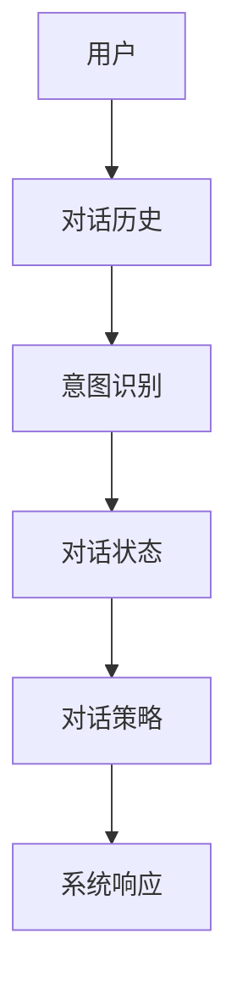

                 

# 对话策略优化：提升AI Agent的交互质量

## 关键词：
- 对话策略优化
- AI Agent
- 交互质量
- 强化学习
- 系统架构设计

## 摘要：
本文将深入探讨对话策略优化的核心概念、算法原理、系统架构设计以及实际应用。通过分析对话策略优化的背景、核心要素、优化方法和评估指标，结合强化学习、监督学习等算法，提供详细的系统设计和项目实战案例，帮助读者全面理解并提升AI Agent的交互质量。

## 第一部分：对话策略优化背景与核心概念

### 第1章：对话策略优化问题背景

#### 1.1 问题背景
随着人工智能技术的快速发展，AI Agent在各个领域的应用越来越广泛。然而，当前的对话系统在交互质量上存在诸多问题，如对话不够自然、响应不够准确、上下文理解不足等。这些问题严重影响了用户体验和系统的实用性。

#### 1.2 对话策略优化的定义与目标
对话策略优化是指通过算法和模型优化对话系统的响应策略，以提高对话的准确性和流畅性。其目标是使AI Agent能够更好地理解用户意图，提供更符合用户需求的回复。

#### 1.3 对话策略优化的边界与外延
对话策略优化的边界主要集中在对话系统的优化层面，不涉及前端的自然语言处理（NLP）和后端的知识库管理。外延则包括相关的技术领域，如强化学习、监督学习等。

### 第2章：对话策略优化的核心概念

#### 2.1 对话策略优化的核心原理
对话策略优化的核心原理是通过构建数学模型，模拟人类对话中的思考过程，从而生成更自然的对话回复。这需要结合对话上下文、意图识别和状态管理等多方面的信息。

#### 2.2 对话策略优化的关键特征
对话策略优化的关键特征包括基于规则的特征、数据驱动的特征和模型驱动的特征。这些特征决定了对话系统的行为和性能。

#### 2.3 对话策略优化的ER实体关系图

## 第二部分：对话策略优化的核心概念与联系

### 第3章：对话策略优化的核心概念

#### 3.1 对话策略优化的核心原理
对话策略优化的核心原理包括对话上下文的分析、意图识别和状态管理。这些部分共同决定了对话系统的响应策略。

#### 3.2 对话策略优化的关键特征
对话策略优化的关键特征包括基于规则的特征、数据驱动的特征和模型驱动的特征。这些特征决定了对话系统的行为和性能。

#### 3.3 对话策略优化的数学建模
对话策略优化的数学建模包括状态转移模型和奖励函数设计。这些模型帮助我们量化对话系统的性能，并指导优化方向。

## 第三部分：对话策略优化的算法原理

### 第4章：对话策略优化的算法原理

#### 4.1 强化学习算法
强化学习算法是对话策略优化的重要方法之一。Q-learning算法通过状态转移和奖励函数不断优化策略。Deep Q-Network (DQN) 算法则通过深度学习模型进一步提升性能。

#### 4.2 监督学习算法
监督学习算法通过大量标注数据训练模型，使其能够预测正确的对话回复。对比学习方法通过对比不同回复的优劣，进一步优化模型。

## 第四部分：对话策略优化的系统架构设计

### 第5章：对话策略优化的系统架构设计

#### 5.1 问题场景介绍
在实际应用中，对话系统需要处理多种复杂的场景，如多轮对话、上下文理解等。这些场景对系统架构提出了更高的要求。

#### 5.2 系统功能设计
系统功能设计包括领域模型构建、对话状态管理、策略选择和效果评估。领域模型通过类图展示各个模块之间的关系，帮助我们更好地理解系统的整体结构。

#### 5.3 系统架构设计
系统架构设计包括整体架构图、模块划分和数据流设计。这些设计帮助我们明确各部分的功能和交互方式，确保系统的高效运行。

## 第五部分：对话策略优化的项目实战

### 第6章：对话策略优化的项目实战

#### 6.1 环境安装
项目实战需要安装必要的开发环境和工具，如Python、TensorFlow和Keras等。这些工具为后续的算法实现提供了基础支持。

#### 6.2 系统核心实现
系统核心实现包括对话上下文处理、意图识别和策略选择。通过Python代码实现这些功能，展示算法的具体应用。

#### 6.3 代码应用解读与分析
代码解读部分详细分析了核心算法的实现细节，如Q-learning算法的代码实现和监督学习模型的训练过程。这些代码展示了对话策略优化的具体应用。

#### 6.4 实际案例分析
通过实际案例分析，展示了对话策略优化在实际场景中的应用效果。案例分析帮助我们更好地理解算法的实际价值和优化空间。

## 第六部分：总结与展望

### 第7章：总结与展望

#### 7.1 最佳实践 tips
在实际应用中，对话策略优化需要结合具体场景，选择合适的算法和模型。同时，需要不断收集用户反馈，优化系统性能。

#### 7.2 小结
对话策略优化是一个复杂而重要的任务，需要结合多种技术和方法。通过不断优化算法和系统架构，我们可以显著提升AI Agent的交互质量。

#### 7.3 注意事项
在实际应用中，需要注意数据的质量和多样性，避免过拟合和欠拟合问题。同时，要关注系统的实时性和响应速度，确保用户体验。

#### 7.4 拓展阅读
对话策略优化是一个快速发展的领域，读者可以通过阅读相关论文和书籍，深入了解最新的研究成果和技术进展。

## 作者：AI天才研究院/AI Genius Institute & 禅与计算机程序设计艺术 /Zen And The Art of Computer Programming

