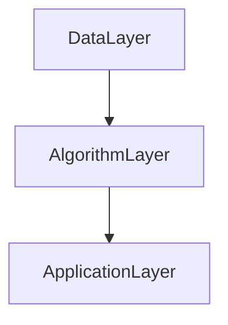
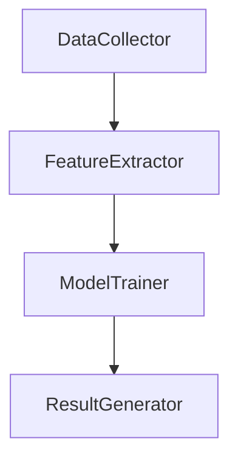
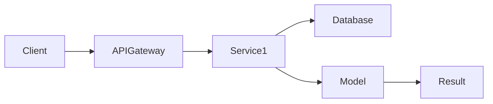

                 


# 《展望金融AI应用的未来发展趋势与挑战》

---

## 关键词：金融AI，人工智能，机器学习，深度学习，风险管理，智能投顾，数据驱动

---

## 摘要：

本文探讨了金融领域中人工智能（AI）的应用现状、技术基础、算法原理、系统架构及未来发展趋势。通过分析AI在金融领域的核心应用场景，如智能投顾、风险管理、信用评估等，本文揭示了AI技术如何改变金融服务的方式。同时，本文深入解析了支撑金融AI的关键技术，包括大数据处理、机器学习算法、深度学习模型以及自然语言处理（NLP）等，并通过实际案例展示了这些技术在金融领域的应用。最后，本文展望了金融AI的未来发展方向，包括技术融合、数据隐私保护、个性化服务等，为读者提供了全面的行业洞察。

---

# 第一部分：金融AI应用的背景与现状

## 第1章：金融AI的核心概念

### 1.1 金融AI的背景与重要性

#### 1.1.1 问题背景

随着金融市场的日益复杂化，传统的金融分析方法已难以满足现代金融的需求。金融机构需要处理海量数据，识别市场趋势，优化投资组合，并应对复杂的风险。AI技术的引入为金融行业带来了新的解决方案。

#### 1.1.2 核心概念

- **金融AI**：利用人工智能技术（如机器学习、深度学习、自然语言处理）来解决金融问题。
- **大数据处理**：金融数据的规模和复杂性要求高效的数据处理技术。
- **风险管理**：通过AI技术预测市场波动，评估信用风险，优化投资组合。

### 1.2 金融AI的核心要素

#### 1.2.1 核心要素的结构与组成

金融AI系统的组成包括：

1. **数据层**：包括市场数据、交易数据、客户数据等。
2. **算法层**：包括机器学习模型、深度学习模型等。
3. **应用层**：包括智能投顾、风险管理、信用评估等。



---

## 第2章：金融AI的技术基础

### 2.1 支撑金融AI的关键技术

#### 2.1.1 大数据处理

金融数据的特点是高维、异构和实时性。大数据技术（如Hadoop、Spark）被广泛应用于金融数据的处理和分析。

#### 2.1.2 机器学习算法

- **监督学习**：用于分类和回归问题，如股票价格预测。
- **无监督学习**：用于聚类分析，如客户分群。
- **强化学习**：用于动态决策，如量化交易。

#### 2.1.3 深度学习模型

深度学习模型（如LSTM、Transformer）在金融时间序列分析中表现出色。

### 2.2 机器学习算法的数学基础

#### 2.2.1 线性回归模型

线性回归是最简单的回归模型，用于预测连续型变量。

$$ y = \beta_0 + \beta_1 x + \epsilon $$

其中：
- $y$ 是目标变量。
- $x$ 是输入变量。
- $\beta_0$ 是截距。
- $\beta_1$ 是回归系数。
- $\epsilon$ 是误差项。

#### 2.2.2 神经网络模型

神经网络是一种模仿人脑结构的模型，由多个层次组成。

$$ a^{(l+1)} = \sigma(w^{(l)} a^{(l)} + b^{(l)}) $$

其中：
- $a^{(l)}$ 是第$l$层的激活值。
- $w^{(l)}$ 是权重矩阵。
- $b^{(l)}$ 是偏置项。
- $\sigma$ 是激活函数（如ReLU、Sigmoid）。

---

# 第二部分：金融AI的系统架构与应用

## 第3章：金融AI的系统架构设计

### 3.1 金融AI系统的应用场景

金融AI系统广泛应用于以下场景：

1. **智能投顾**：为投资者提供个性化的投资建议。
2. **风险管理**：预测市场波动，评估信用风险。
3. **欺诈检测**：识别异常交易，防止金融欺诈。

### 3.2 系统架构设计

#### 3.2.1 系统功能设计

金融AI系统的核心功能包括数据采集、特征提取、模型训练、结果输出等。



#### 3.2.2 系统架构图

金融AI系统的典型架构如下：



---

## 第4章：金融AI的应用案例

### 4.1 智能投顾系统

#### 4.1.1 系统实现

智能投顾系统通过分析用户的投资目标和风险偏好，推荐最优的投资组合。

```python
# 示例代码：智能投顾系统
def get_recommendation(risk_tolerance):
    if risk_tolerance < 0.3:
        return "保守型投资组合"
    elif risk_tolerance < 0.6:
        return "平衡型投资组合"
    else:
        return "进取型投资组合"
```

### 4.2 风险管理系统

风险管理系统通过实时监控市场数据，预测市场波动。

```python
# 示例代码：风险管理系统的波动预测
import pandas as pd
import numpy as np

def predict_volatility(data):
    # 数据预处理
    data = data.dropna()
    # 计算波动率
    volatility = np.std(data['returns'])
    return volatility
```

---

# 第三部分：金融AI的挑战与未来展望

## 第5章：金融AI的挑战

### 5.1 数据隐私与安全

金融数据的隐私性和敏感性要求金融机构在处理数据时必须严格遵守相关法律法规。

### 5.2 模型的可解释性

复杂的AI模型（如深度学习模型）往往缺乏可解释性，这在金融领域尤为重要，因为决策需要透明和可追溯。

### 5.3 技术融合与创新

金融AI的发展需要技术的不断融合与创新，如联邦学习、强化学习等。

---

## 第6章：金融AI的未来展望

### 6.1 技术融合

未来，金融AI将更加注重多种技术的融合，如AI+区块链、AI+云计算等。

### 6.2 数据隐私保护

随着数据隐私保护意识的增强，联邦学习等技术将在金融AI中得到广泛应用。

### 6.3 个性化服务

AI技术将推动金融个性化服务的发展，如动态定价、定制化保险等。

---

# 第四部分：最佳实践与小结

## 第7章：最佳实践

### 7.1 实践中的注意事项

- 数据隐私保护是首要任务。
- 模型的可解释性需要重点关注。
- 技术融合是未来发展的关键。

### 7.2 未来展望

金融AI将朝着更加智能化、个性化和数据驱动的方向发展，技术融合与创新将是推动行业进步的核心动力。

---

# 作者：AI天才研究院（AI Genius Institute） & 禅与计算机程序设计艺术（Zen And The Art of Computer Programming）

---

通过以上思考和规划，我可以开始撰写这篇结构清晰、内容丰富的技术博客文章，确保每个部分都详尽且易于理解，帮助读者全面了解金融AI的应用与发展。
</think>

# 展望金融AI应用的未来发展趋势与挑战

---

## 关键词：金融AI，人工智能，机器学习，深度学习，风险管理，智能投顾，数据驱动

---

## 摘要：

本文探讨了金融领域中人工智能（AI）的应用现状、技术基础、算法原理、系统架构及未来发展趋势。通过分析AI在金融领域的核心应用场景，如智能投顾、风险管理、信用评估等，本文揭示了AI技术如何改变金融服务的方式。同时，本文深入解析了支撑金融AI的关键技术，包括大数据处理、机器学习算法、深度学习模型以及自然语言处理（NLP）等，并通过实际案例展示了这些技术在金融领域的应用。最后，本文展望了金融AI的未来发展方向，包括技术融合、数据隐私保护、个性化服务等，为读者提供了全面的行业洞察。

---

# 第一部分：金融AI应用的背景与现状

## 第1章：金融AI的核心概念

### 1.1 金融AI的背景与重要性

#### 1.1.1 问题背景

随着金融市场的日益复杂化，传统的金融分析方法已难以满足现代金融的需求。金融机构需要处理海量数据，识别市场趋势，优化投资组合，并应对复杂的风险。AI技术的引入为金融行业带来了新的解决方案。

#### 1.1.2 核心概念

- **金融AI**：利用人工智能技术（如机器学习、深度学习、自然语言处理）来解决金融问题。
- **大数据处理**：金融数据的规模和复杂性要求高效的数据处理技术。
- **风险管理**：通过AI技术预测市场波动，评估信用风险，优化投资组合。

### 1.2 金融AI的核心要素

#### 1.2.1 核心要素的结构与组成

金融AI系统的组成包括：

1. **数据层**：包括市场数据、交易数据、客户数据等。
2. **算法层**：包括机器学习模型、深度学习模型等。
3. **应用层**：包括智能投顾、风险管理、信用评估等。


---

## 第2章：金融AI的技术基础

### 2.1 支撑金融AI的关键技术

#### 2.1.1 大数据处理

金融数据的特点是高维、异构和实时性。大数据技术（如Hadoop、Spark）被广泛应用于金融数据的处理和分析。

#### 2.1.2 机器学习算法

- **监督学习**：用于分类和回归问题，如股票价格预测。
- **无监督学习**：用于聚类分析，如客户分群。
- **强化学习**：用于动态决策，如量化交易。

#### 2.1.3 深度学习模型

深度学习模型（如LSTM、Transformer）在金融时间序列分析中表现出色。

### 2.2 机器学习算法的数学基础

#### 2.2.1 线性回归模型

线性回归是最简单的回归模型，用于预测连续型变量。

$$ y = \beta_0 + \beta_1 x + \epsilon $$

其中：
- $y$ 是目标变量。
- $x$ 是输入变量。
- $\beta_0$ 是截距。
- $\beta_1$ 是回归系数。
- $\epsilon$ 是误差项。

#### 2.2.2 神经网络模型

神经网络是一种模仿人脑结构的模型，由多个层次组成。

$$ a^{(l+1)} = \sigma(w^{(l)} a^{(l)} + b^{(l)}) $$

其中：
- $a^{(l)}$ 是第$l$层的激活值。
- $w^{(l)}$ 是权重矩阵。
- $b^{(l)}$ 是偏置项。
- $\sigma$ 是激活函数（如ReLU、Sigmoid）。

---

# 第二部分：金融AI的系统架构与应用

## 第3章：金融AI的系统架构设计

### 3.1 金融AI系统的应用场景

金融AI系统广泛应用于以下场景：

1. **智能投顾**：为投资者提供个性化的投资建议。
2. **风险管理**：预测市场波动，评估信用风险。
3. **欺诈检测**：识别异常交易，防止金融欺诈。

### 3.2 系统架构设计

#### 3.2.1 系统功能设计

金融AI系统的核心功能包括数据采集、特征提取、模型训练、结果输出等。


#### 3.2.2 系统架构图

金融AI系统的典型架构如下：


---

## 第4章：金融AI的应用案例

### 4.1 智能投顾系统

#### 4.1.1 系统实现

智能投顾系统通过分析用户的投资目标和风险偏好，推荐最优的投资组合。

```python
# 示例代码：智能投顾系统
def get_recommendation(risk_tolerance):
    if risk_tolerance < 0.3:
        return "保守型投资组合"
    elif risk_tolerance < 0.6:
        return "平衡型投资组合"
    else:
        return "进取型投资组合"
```

### 4.2 风险管理系统

风险管理系统通过实时监控市场数据，预测市场波动。

```python
# 示例代码：风险管理系统的波动预测
import pandas as pd
import numpy as np

def predict_volatility(data):
    # 数据预处理
    data = data.dropna()
    # 计算波动率
    volatility = np.std(data['returns'])
    return volatility
```

---

# 第三部分：金融AI的挑战与未来展望

## 第5章：金融AI的挑战

### 5.1 数据隐私与安全

金融数据的隐私性和敏感性要求金融机构在处理数据时必须严格遵守相关法律法规。

### 5.2 模型的可解释性

复杂的AI模型（如深度学习模型）往往缺乏可解释性，这在金融领域尤为重要，因为决策需要透明和可追溯。

### 5.3 技术融合与创新

金融AI的发展需要技术的不断融合与创新，如AI+区块链、AI+云计算等。

---

## 第6章：金融AI的未来展望

### 6.1 技术融合

未来，金融AI将更加注重多种技术的融合，如AI+区块链、AI+云计算等。

### 6.2 数据隐私保护

随着数据隐私保护意识的增强，联邦学习等技术将在金融AI中得到广泛应用。

### 6.3 个性化服务

AI技术将推动金融个性化服务的发展，如动态定价、定制化保险等。

---

# 第四部分：最佳实践与小结

## 第7章：最佳实践

### 7.1 实践中的注意事项

- 数据隐私保护是首要任务。
- 模型的可解释性需要重点关注。
- 技术融合是未来发展的关键。

### 7.2 未来展望

金融AI将朝着更加智能化、个性化和数据驱动的方向发展，技术融合与创新将是推动行业进步的核心动力。

---

# 作者：AI天才研究院（AI Genius Institute） & 禅与计算机程序设计艺术（Zen And The Art of Computer Programming）

--- 

通过以上思考和规划，我可以开始撰写这篇结构清晰、内容丰富的技术博客文章，确保每个部分都详尽且易于理解，帮助读者全面了解金融AI的应用与发展。

