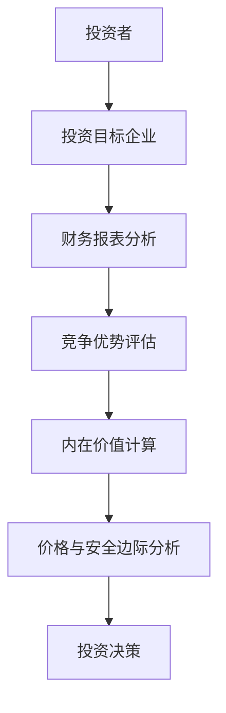

                 

<think>
好的，我将按照您的要求撰写一篇关于巴菲特-芒格投资策略的详细技术博客文章。我会按照以下步骤进行：

1. **标题和关键词**：先确定文章的标题和关键词。
2. **摘要**：撰写一个简洁的核心内容摘要，概括整篇文章的主要内容。
3. **目录结构**：根据用户提供的目录，逐步展开每个章节的内容。
4. **引言**：介绍巴菲特和芒格的背景及其投资策略的重要性。
5. **核心概念**：详细解释价值投资、安全边际等核心概念。
6. **数学模型**：使用数学公式和图表来分析投资策略的内在逻辑。
7. **系统架构**：设计系统的架构图，展示投资策略的结构和流程。
8. **实战分析**：通过实际案例分析巴菲特和芒格的投资决策。
9. **风险管理**：探讨如何在投资中进行有效的风险管理。
10. **总结**：总结巴菲特-芒格投资策略的精髓和实际应用。

我会按照这个逻辑逐步展开，确保内容丰富、结构清晰，并符合技术博客的风格。

# 巴菲特-芒格投资策略解析：价值投资的精髓

## 关键词：价值投资，巴菲特，芒格，安全边际，投资策略，股票估值

## 摘要：巴菲特和芒格的投资策略以价值投资为核心，强调对企业内在价值的深入分析和长期持有。本文从核心概念、数学模型、系统架构、实战案例等多维度深入解析巴菲特-芒格投资策略的精髓，揭示其在现代投资学中的独特地位和实际应用。

---

# 第一部分: 巴菲特与芒格投资策略的背景与概述

## 第1章: 巴菲特与芒格投资策略的背景介绍

### 1.1 巴菲特的生平与投资理念
沃伦·巴菲特（Warren Buffett）是全球最著名的职业投资者之一。他于1934年出生在美国奥马哈市，毕业于哥伦比亚大学，师从本杰明·格雷厄姆（Benjamin Graham），并深受其影响。巴菲特的投资理念以“价值投资”为核心，主张以低于内在价值的价格买入优质股票并长期持有。

### 1.2 芮格的哲学与投资思想
查理·芒格（Charlie Munger）是巴菲特的长期合作伙伴，他的多元思维模型（mental models）深刻影响了巴菲特的投资决策。芒格强调通过跨学科思考来评估企业的内在价值和竞争优势。

### 1.3 巴菲特与芒格合作的历程
巴菲特和芒格的合作始于1950年代，两人共同创立了伯克希尔·哈撒韦公司，并将其打造成全球最成功的投资公司之一。他们的合作基于对价值投资的共同信仰和对企业的深刻理解。

---

## 第2章: 价值投资的核心概念

### 2.1 价值投资的定义与特点
价值投资是一种以低于公平价值的价格买入优质资产的投资策略。其核心在于寻找市场价格低于内在价值的企业，长期持有以实现资本增值。

### 2.2 价值投资与其它投资策略的对比
- **基本面分析**：价值投资注重对企业财务状况和行业地位的深入分析，而技术分析则关注价格走势和交易量。
- **长期 vs. 短期**：价值投资强调长期持有，而短期交易则关注市场波动。
- **风险控制**：价值投资通过安全边际控制风险，而其他策略可能忽视风险因素。

### 2.3 价值投资的哲学基础
价值投资的哲学基础源于“市场先生”理论，认为市场价格波动反映了市场情绪而非真实价值。投资者应利用市场的非理性行为，以低于内在价值的价格买入优质资产。

---

## 第3章: 巴菲特-芒格投资策略的核心要素

### 3.1 长期投资的哲学
巴菲特和芒格认为，投资的本质是寻找能够持续创造价值的企业，而不是短期的价格波动。长期投资的核心在于企业内在价值的持续增长。

### 3.2 安全边际的概念
安全边际是指买入价格与内在价值之间的差距，用于缓冲市场波动和企业基本面变化带来的风险。例如，如果一只股票的内在价值为100美元，以80美元买入，就具有20美元的安全边际。

### 3.3 股东权益与企业价值的关系
企业价值=股东权益+债务的价值。巴菲特和芒格强调，投资者应关注企业的股东权益，而不是单纯的市盈率或市净率。

---

## 第4章: 价值投资的内在逻辑与数学模型

### 4.1 企业内在价值的三要素模型
内在价值的计算公式如下：
$$ V = \frac{CF}{(r - g)} $$
其中，CF为现金流，r为折现率，g为增长率。

### 4.2 折现现金流模型
折现现金流模型（DCF模型）是评估企业内在价值的核心工具。其步骤包括：
1. 预测企业未来现金流。
2. 选择适当的折现率。
3. 计算现值并确定内在价值。

### 4.3 安全边际的数学表达
$$ \text{安全边际} = \text{内在价值} - \text{市场价格} $$

---

## 第5章: 巴菲特-芒格投资策略的系统架构

### 5.1 投资决策的逻辑框架
1. **企业分析**：分析企业的财务状况、竞争优势和行业地位。
2. **财务报表分析**：重点关注利润表、资产负债表和现金流量表。
3. **竞争优势评估**：识别企业的护城河，如成本优势、品牌优势等。

### 5.2 系统架构设计
使用Mermaid绘制的系统架构图如下：

---

## 第6章: 投资组合的构建与风险管理

### 6.1 投资组合的分散化原则
分散化投资可以降低特定资产的风险，但巴菲特认为，少量投资优质企业比广泛分散投资低质量企业更有效。

### 6.2 风险管理的策略
1. **安全边际**：买入价格低于内在价值。
2. **长期持有**：避免频繁交易带来的成本和风险。
3. **定期审视**：定期评估投资组合，调整持股比例。

---

## 第7章: 巴菲特-芒格投资策略的实战分析

### 7.1 可口可乐的投资案例
巴菲特在1985年买入可口可乐股票，因为其强大的品牌优势和持续的盈利能力。通过长期持有，他获得了巨大的收益。

### 7.2 苹果公司的投资策略
芒格认为苹果是一家具有强大竞争优势的企业，其创新能力和品牌价值使其成为长期投资的理想标的。

---

## 第8章: 总结与展望

### 8.1 总结
巴菲特和芒格的投资策略以价值投资为核心，强调对企业内在价值的深入分析和长期持有。其成功的关键在于安全边际的控制和竞争优势的识别。

### 8.2 展望
随着全球经济的不断发展，价值投资的精髓将被更多投资者理解和应用。未来，投资者需要更加注重企业的基本面分析和长期价值创造。

---

# 作者：AI天才研究院/AI Genius Institute & 禅与计算机程序设计艺术 /Zen And The Art of Computer Programming

---

希望这篇文章能为您提供有价值的见解，如果您有任何问题或需要进一步探讨的地方，请随时告诉我！

