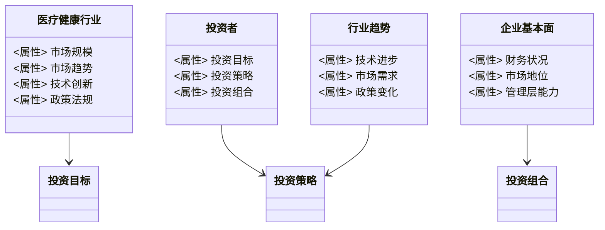
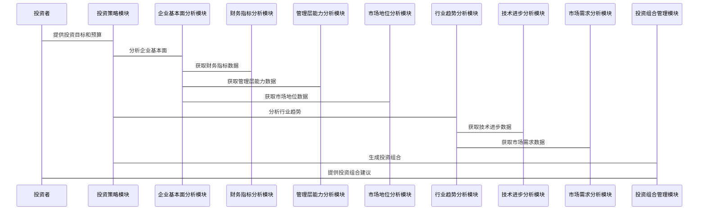

                 


# 巴菲特-芒格的医疗健康投资：长期增长潜力的行业

## 关键词：
巴菲特, 芒格, 医疗健康投资, 长期增长, 行业潜力

## 摘要：
本文将深入探讨巴菲特和芒格在医疗健康领域的投资策略和长期增长潜力。通过对医疗健康行业的现状、趋势以及两位投资大师的投资理念的结合分析，揭示该行业在未来几年中的投资机会和潜在回报。

---

## 第1章: 巴菲特与芒格的投资理念概述

### 1.1 巴菲特与芒格的投资哲学

#### 1.1.1 巴菲特的价值投资理念
- 巴菲特的价值投资理念强调寻找具有持续竞争优势的公司，关注其内在价值和安全边际。
- 投资不仅仅是买股票，而是买企业的一部分。
- 长期持有，避免频繁交易。

#### 1.1.2 芒格的多元思维模型
- 芒格倡导“多元思维模型”，即通过多个学科的思维方式来理解复杂问题。
- 强调交叉思维，将不同领域的知识结合起来，形成全面的分析框架。
- 通过“反过来想”来避免决策错误。

#### 1.1.3 两人投资理念的异同点
- 巴菲特更注重企业的财务指标和安全边际。
- 芒格更注重多维度的分析和风险控制。
- 两人共同点：长期投资、价值投资、避免情绪化决策。

### 1.2 医疗健康行业的特殊性

#### 1.2.1 医疗健康行业的定义与范围
- 医疗健康行业涵盖医疗服务、药品研发、医疗设备、健康保险等多个领域。
- 全球医疗健康市场规模庞大，且持续增长。

#### 1.2.2 医疗健康行业的特点与发展趋势
- 行业需求刚性强，受经济波动影响较小。
- 技术创新驱动行业增长，如基因编辑、人工智能在医疗中的应用。
- 人口老龄化加剧，医疗需求进一步增加。

#### 1.2.3 医疗健康行业与巴菲特投资理念的契合点
- 医疗健康行业具有稳定的现金流和持续的市场需求。
- 优秀的医疗企业具备强大的护城河，符合巴菲特的价值投资理念。

### 1.3 巴菲特与芒格对医疗健康行业的关注

#### 1.3.1 巴菲特医疗健康投资的经典案例
- 投资于强生公司（Johnson & Johnson）：强生是一家多元化医疗健康公司，具备强大的研发能力和市场地位。
- 投资于辉瑞制药（Pfizer）：辉瑞在药品研发和疫苗开发方面具有领先地位。

#### 1.3.2 芒格在医疗健康领域的投资观点
- 芒格曾投资于Genentech（基因泰克），该公司在癌症治疗药物方面取得了突破性进展。
- 芒格认为，医疗健康行业具有巨大的未满足需求，尤其是在发展中国家市场。

#### 1.3.3 两人对医疗健康行业的长期看好理由
- 医疗需求的刚性增长。
- 技术进步带来的投资机会。
- 优秀企业的竞争优势明显，符合长期投资的价值理念。

---

## 第2章: 医疗健康行业的现状与投资机会

### 2.1 医疗健康行业的现状分析

#### 2.1.1 全球医疗健康行业的市场规模与增长趋势
- 根据世界卫生组织的数据，全球医疗健康市场规模已超过 10 万亿美元，且年增长率保持在 5% 以上。
- 发达国家的医疗支出占 GDP 的比例较高，发展中国家的医疗支出也在快速增长。

#### 2.1.2 美国医疗健康行业的特点与现状
- 美国是全球最大的医疗市场，占全球医疗支出的 37%。
- 美国医疗体系以市场驱动为主，私人保险和医院体系发达。
- 美国医疗健康行业的技术创新能力强，研发投入占比较高。

#### 2.1.3 中国医疗健康行业的现状与发展趋势
- 中国医疗健康行业正处于快速发展的阶段，市场规模预计将在未来几年内达到数万亿美元。
- 中国政府推动医疗体制改革，鼓励社会资本进入医疗领域。
- 中国医疗健康行业的需求主要来自人口老龄化和消费升级。

### 2.2 医疗健康行业的投资机会

#### 2.2.1 医疗技术与创新的驱动作用
- 生物技术：基因编辑、细胞治疗等领域具有巨大潜力。
- 人工智能：AI 在医疗诊断、药物研发中的应用日益广泛。
- 数字医疗：远程医疗、电子健康记录系统的快速发展。

#### 2.2.2 医疗服务行业的增长潜力
- 医院连锁经营：通过规模化和标准化管理降低成本。
- 健康管理：预防性医疗服务和健康管理机构的需求增长。
- 医疗保险：商业保险与医疗服务体系的深度融合。

#### 2.2.3 医药行业的研发与并购机会
- 创新药物研发：新药开发周期缩短，研发投入回报率高。
- 医药并购：通过并购整合资源，快速扩大市场份额。
- 医药企业的国际化战略：中国企业在全球市场的布局。

### 2.3 巴菲特与芒格视角下的行业机会

#### 2.3.1 从巴菲特的护城河理论看医疗健康行业的投资价值
- 医疗健康行业的优秀企业通常具备强大的品牌优势和市场准入壁垒。
- 护城河包括专利保护、技术优势、成本优势和客户忠诚度。
- 投资者应寻找那些能够持续扩大竞争优势的企业。

#### 2.3.2 从芒格的多元思维模型分析医疗健康行业的未来趋势
- 医疗健康行业是一个高度复杂和动态变化的领域，需要多维度的分析。
- 结合宏观经济、政策法规、技术创新等多个因素进行综合判断。
- 通过跨学科的思维方式，发现潜在的投资机会和风险。

---

## 第3章: 巴菲特与芒格的投资策略与医疗健康行业的结合

### 3.1 巴菲特的价值投资策略在医疗健康行业的应用

#### 3.1.1 价值投资的核心要素
- 寻找具有持续盈利能力的企业。
- 评估企业的财务健康状况，包括资产负债表和利润表。
- 关注企业的管理层和治理结构。

#### 3.1.2 医疗健康行业中的价值投资标的
- 具备强大研发能力的制药公司。
- 具备品牌优势的医疗器械企业。
- 具备稳定现金流的医疗服务机构。

#### 3.1.3 巴菲特医疗健康投资的经典案例分析
- 强生公司的投资案例：强生是一家多元化医疗健康公司，巴菲特看好其稳定的现金流和市场地位。
- 辉瑞制药的投资案例：辉瑞在疫苗和创新药物方面的研发能力受到巴菲特的青睐。

### 3.2 芒格的多元思维模型在医疗健康投资中的应用

#### 3.2.1 多元思维模型的定义与特点
- 多元思维模型是一种通过多个学科的思维方式来理解复杂问题的方法。
- 强调交叉思维，避免单一视角的局限性。
- 通过多维度分析，降低决策错误的风险。

#### 3.2.2 医疗健康行业的复杂性与多元思维模型的必要性
- 医疗健康行业涉及多个领域，包括生物技术、人工智能、政策法规等。
- 行业变化快，需要动态调整投资策略。
- 多元思维模型可以帮助投资者更好地把握行业趋势和投资机会。

#### 3.2.3 芒格视角下的医疗健康行业投资框架
- 关注企业的基本面：包括财务状况、管理层能力和市场地位。
- 评估行业趋势：包括技术创新、政策变化和市场需求。
- 综合判断：结合多维度的分析，做出投资决策。

---

## 第4章: 医疗健康行业的投资框架与策略

### 4.1 投资框架的建立

#### 4.1.1 从巴菲特的价值投资框架出发
- 确定投资目标：寻找具有持续竞争优势的企业。
- 评估企业价值：通过财务指标和市场地位进行判断。
- 长期持有：避免短期波动的影响。

#### 4.1.2 结合芒格的多元思维模型
- 从多个维度分析行业趋势和企业基本面。
- 关注宏观经济、政策法规和技术创新。
- 通过多维度的分析，降低投资风险。

### 4.2 投资策略的具体实施

#### 4.2.1 确定投资目标
- 确定投资领域的细分市场：如制药、医疗器械、医疗服务等。
- 选择具有竞争优势的企业：包括技术创新、品牌优势和市场地位。
- 关注企业的财务健康状况：包括盈利能力、现金流和资产负债表。

#### 4.2.2 投资组合的构建
- 分散投资：通过投资不同领域的企业降低风险。
- 长期持有：避免频繁交易，降低交易成本。
- 定期评估：根据市场变化和企业基本面调整投资组合。

#### 4.2.3 风险管理
- 设置止损点：在投资组合中设定止损点，避免重大亏损。
- 关注行业风险：包括政策变化、技术风险和市场风险。
- 保持灵活性：根据市场变化及时调整投资策略。

---

## 第5章: 投资框架的系统分析与架构设计方案

### 5.1 问题场景介绍

#### 5.1.1 医疗健康行业的投资挑战
- 市场竞争激烈，企业利润空间有限。
- 技术创新快，投资风险高。
- 政策变化频繁，影响企业经营。

#### 5.1.2 投资者面临的困境
- 如何在复杂多变的市场中找到优质企业。
- 如何通过系统化的方法降低投资风险。
- 如何制定长期投资策略。

### 5.2 项目介绍

#### 5.2.1 项目目标
- 建立一个基于巴菲特和芒格投资理念的医疗健康投资框架。
- 提供一套系统化的投资方法，帮助投资者在医疗健康领域实现长期收益。

#### 5.2.2 项目范围
- 分析医疗健康行业的现状和趋势。
- 研究巴菲特和芒格的投资策略。
- 结合两者理念，提出投资框架和策略。

### 5.3 系统功能设计

#### 5.3.1 领域模型（Mermaid 类图）


#### 5.3.2 系统架构设计（Mermaid 架构图）


#### 5.3.3 系统接口设计
- 投资者与投资策略模块的接口：投资者提供投资目标和预算，投资策略模块根据目标生成投资组合。
- 企业基本面分析模块与投资组合管理模块的接口：企业基本面分析模块提供财务指标和市场地位信息，投资组合管理模块根据这些信息调整投资组合。

#### 5.3.4 系统交互（Mermaid 序列图）


---

## 第6章: 项目实战与投资案例分析

### 6.1 环境安装

#### 6.1.1 投资分析工具
- 使用Excel或投资分析软件（如Morningstar）进行数据分析。
- 通过网络获取行业报告和公司财务报表。

#### 6.1.2 数据来源
- 公司财务报表：包括利润表、资产负债表和现金流表。
- 行业报告：包括市场规模、市场趋势和竞争对手分析。
- 政策法规：包括政府发布的相关政策和法规。

### 6.2 系统核心实现源代码

#### 6.2.1 投资组合管理系统
```python
# 投资组合管理系统示例代码

class InvestmentPortfolio:
    def __init__(self, budget):
        self.budget = budget
        self.portfolio = {}

    def add_investment(self, company, amount):
        if company in self.portfolio:
            self.portfolio[company] += amount
        else:
            self.portfolio[company] = amount
        self.budget -= amount

    def remove_investment(self, company, amount):
        if company in self.portfolio:
            self.portfolio[company] -= amount
            if self.portfolio[company] == 0:
                del self.portfolio[company]
            self.budget += amount

    def get_portfolio_value(self):
        return sum(self.portfolio.values())
```

#### 6.2.2 企业基本面分析模块
```python
# 企业基本面分析模块示例代码

class CompanyAnalysis:
    def __init__(self, name, revenue, profit_margin, market_share):
        self.name = name
        self.revenue = revenue
        self.profit_margin = profit_margin
        self.market_share = market_share

    def get_financial_health(self):
        if self.revenue > 1000000000 and self.profit_margin > 10% and self.market_share > 20%:
            return "Excellent"
        elif self.revenue > 500000000 and self.profit_margin > 5% and self.market_share > 10%:
            return "Good"
        else:
            return "Poor"
```

### 6.3 代码应用解读与分析

#### 6.3.1 投资组合管理系统的应用
- 通过投资组合管理系统，投资者可以管理多个投资标的，调整投资比例。
- 系统会根据预算和投资目标生成投资组合建议。

#### 6.3.2 企业基本面分析模块的应用
- 通过企业基本面分析模块，投资者可以快速评估企业的财务状况和市场地位。
- 系统会根据企业基本面指标给出“Excellent”、“Good”或“Poor”的财务健康状况评价。

### 6.4 投资案例分析

#### 6.4.1 案例一：强生公司投资分析
- 公司基本面：强生是一家多元化医疗健康公司，收入稳定，利润 margins 健康，市场地位稳固。
- 投资策略：长期持有，定期评估公司业绩和行业趋势。

#### 6.4.2 案例二：基因泰克投资分析
- 公司基本面：基因泰克在癌症治疗药物方面具有领先地位，研发投入高，市场前景广阔。
- 投资策略：关注公司的技术创新和研发能力，长期持有。

### 6.5 项目小结
- 投资组合管理系统和企业基本面分析模块可以帮助投资者更好地管理投资组合和评估企业价值。
- 通过系统化的方法，投资者可以降低投资风险，提高投资效率。

---

## 第7章: 投资框架的最佳实践与小结

### 7.1 最佳实践 Tips

#### 7.1.1 投资策略
- 长期投资：避免短期波动，关注企业的长期价值。
- 价值投资：寻找具有持续竞争优势的企业。
- 风险管理：设置止损点，分散投资组合。

#### 7.1.2 分析工具
- 使用Excel或投资分析软件进行数据处理和分析。
- 关注行业报告和公司财报，获取最新的行业动态和企业信息。

#### 7.1.3 学习与交流
- 阅读巴菲特和芒格的投资经典书籍，学习他们的投资理念。
- 参与投资论坛和社区，与同行交流经验。

### 7.2 小结

#### 7.2.1 投资框架的核心要素
- 价值投资理念：寻找具有持续竞争优势的企业。
- 多元思维模型：通过多维度分析降低投资风险。
- 长期持有策略：避免短期波动，获取长期收益。

#### 7.2.2 医疗健康行业的投资机会
- 技术创新带来的投资机会。
- 人口老龄化带来的刚性需求。
- 医疗服务和医药行业的增长潜力。

### 7.3 注意事项

#### 7.3.1 风险提示
- 投资有风险，需谨慎决策。
- 避免盲目跟风，关注企业的基本面。
- 注意政策变化对行业的影响。

#### 7.3.2 投资者需具备的能力
- 具备基本的财务分析能力。
- 熟悉医疗健康行业的特点和趋势。
- 具备长期投资的耐心和信心。

### 7.4 未来展望

#### 7.4.1 医疗健康行业的未来趋势
- 人工智能和生物技术的进一步发展。
- 医疗服务的全球化和国际化。
- 医疗保险与医疗服务体系的深度融合。

#### 7.4.2 投资者的未来机会
- 通过技术创新实现投资收益。
- 关注新兴市场的投资机会。
- 通过长期投资获取稳定回报。

---

## 附录: 术语表与参考文献

### 附录 A: 术语表
- 巴菲特：沃伦·巴菲特，世界著名投资者，伯克希尔哈撒韦公司创始人。
- 芒格：查理·芒格，伯克希尔哈撒韦公司副主席，倡导多元思维模型。
- 护城河：企业竞争优势的保护屏障，包括专利、品牌、成本优势等。
- 价值投资：寻找具有持续竞争优势和合理估值的企业进行投资。

### 附录 B: 参考文献
- 巴菲特：《巴菲特致股东的信》。
- 芒格：《穷查理宝典》。
- 医疗健康行业：世界卫生组织报告，美国医疗协会报告。
- 投资分析：《投资学》（CFA教材）。

---

## 作者：AI天才研究院/AI Genius Institute & 禅与计算机程序设计艺术/Zen And The Art of Computer Programming

---

这篇博客文章通过系统化的分析和实际案例，探讨了巴菲特和芒格在医疗健康领域的投资策略，并结合行业趋势和企业基本面分析，为投资者提供了长期增长潜力的行业洞察。希望这篇文章能够为医疗健康领域的投资者提供有价值的参考和指导。

