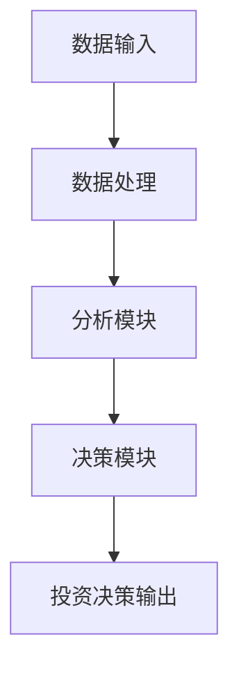
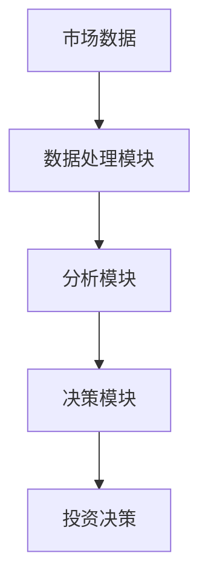
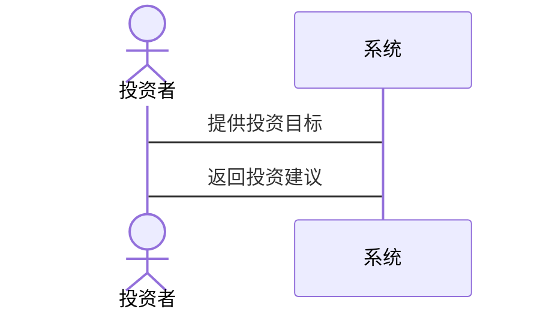

                 

# 巴菲特-芒格的新兴市场投资策略：机遇与风险的平衡

## 关键词：巴菲特, 芒格, 新兴市场, 投资策略, 价值投资, 风险管理

## 摘要：  
本文探讨了巴菲特和芒格在新兴市场中的投资策略，分析了如何在新兴市场中寻找投资机会，平衡风险与收益。通过价值投资的核心理念、新兴市场的特点、投资策略的构建与实施，以及风险管理的多层次分析，本文为投资者提供了系统化的投资框架和实用的策略建议。

---

## 第1章 巴菲特与芒格的投资哲学

### 1.1 巴菲特与芒格的投资哲学概述

#### 1.1.1 巴菲特的价值投资理念
- **核心思想**：巴菲特的价值投资理念强调寻找被市场低估的优质企业，关注企业的内在价值，而非短期市场波动。
- **安全边际**：巴菲特定义的安全边际是“内在价值 - 市场价格”，确保投资的安全性。
- **长期思维**：巴菲特倡导长期投资，避免短期市场波动的干扰。

#### 1.1.2 芒格的多元思维模型
- **跨学科思维**：芒格强调将多个学科的知识交叉应用，形成多元思维模型，以更好地理解投资标的的本质。
- **逆向思维**：芒格常常建议投资者“寻找非共识的机会”，即在市场冷落时寻找低估的投资标的。

#### 1.1.3 两人合作的投资策略
- **互补性**：巴菲特的价值投资与芒格的多元思维模型形成了完美的互补，前者注重企业基本面，后者注重全局性思考。
- **长期合作成果**：两人共同管理的伯克希尔哈撒韦公司，通过长期价值投资策略，取得了显著的超额收益。

### 1.2 新兴市场的定义与特点

#### 1.2.1 新兴市场的定义
- **新兴市场**：指那些经济快速增长、但尚未完全工业化的国家，如中国、印度、巴西等。
- **市场规模**：新兴市场的经济规模庞大，但市场结构相对不成熟，波动性较高。

#### 1.2.2 新兴市场的经济特征
- **高增长潜力**：新兴市场通常具有较高的经济增长率，尤其是在制造业、科技和服务业领域。
- **市场波动性**：新兴市场的股票和汇率波动较大，容易受到外部环境的影响。
- **政策影响**：新兴市场往往受到政府政策的较大影响，包括货币政策、财政政策和行业监管。

#### 1.2.3 新兴市场的投资机会
- **低估企业**：新兴市场中许多优质企业可能被市场低估，为价值投资者提供了机会。
- **成长型企业**：新兴市场的经济结构转型提供了许多成长型企业，具有长期增长潜力。

### 1.3 价值投资的核心要素

#### 1.3.1 安全边际的定义与计算
- **安全边际**：巴菲特提出的“安全边际”是内在价值与市场价格的差额，确保投资的安全性。
- **计算方法**：内在价值 = 股东权益 + 流动资产 - 流动负债 - 长期负债；安全边际 = 内在价值 - 市场价格。

#### 1.3.2 内在价值的评估方法
- **DCF模型**：通过现金流折现法（DCF）评估企业的内在价值，考虑未来现金流的现值。
- **竞争优势分析**：评估企业的竞争优势，如成本优势、品牌优势和市场地位。

#### 1.3.3 市场先生的概念与作用
- **市场先生**：巴菲特提出的市场先生概念，强调市场情绪的波动性，投资者应避免被市场情绪左右。
- **独立思考**：投资者应基于对企业内在价值的独立判断，而非市场情绪做出投资决策。

---

## 第2章 新兴市场的投资策略

### 2.1 新兴市场的行业分析

#### 2.1.1 高增长行业
- **科技行业**：新兴市场的科技企业具有较高的增长潜力，尤其是在互联网和人工智能领域。
- **消费升级行业**：随着中产阶级的崛起，消费升级行业（如食品、饮料、家电）具有较大的增长空间。

#### 2.1.2 行业竞争优势分析
- **成本优势**：评估企业在生产成本、供应链管理等方面的优势。
- **品牌影响力**：评估企业在目标市场中的品牌知名度和影响力。

### 2.2 投资策略的构建

#### 2.2.1 投资组合的构建
- **分散投资**：将投资组合分散到不同的行业和企业，降低单一投资的风险。
- **长期持有**：巴菲特强调长期持有的策略，避免频繁交易带来的成本和风险。

#### 2.2.2 动态调整策略
- **定期评估**：定期评估投资组合的表现，调整持仓结构，以适应市场变化。
- **逆向投资**：在市场恐慌时，寻找被低估的投资标的进行逆向投资。

### 2.3 风险管理策略

#### 2.3.1 风险评估与对冲
- **风险分类**：将投资风险分为市场风险、流动性风险和信用风险，并分别进行评估。
- **对冲策略**：通过投资不同类型资产或使用金融衍生工具对冲部分风险。

#### 2.3.2 风险控制的具体措施
- **设定止损点**：在投资组合中设定止损点，以限制潜在的损失。
- **分散投资**：通过分散投资降低单一资产的风险。

---

## 第3章 投资策略的数学模型与算法

### 3.1 投资组合优化的数学模型

#### 3.1.1 现代投资组合理论（MPT）
- **公式**：$$\text{投资组合的收益} = \sum_{i=1}^{n} w_i \times r_i$$
  其中，\( w_i \) 是第 \( i \) 个资产的权重，\( r_i \) 是第 \( i \) 个资产的预期收益。
- **应用**：通过优化权重分配，使得在给定风险水平下，投资组合的收益最大化。

#### 3.1.2 风险调整后的收益模型
- **夏普比率**：$$\text{夏普比率} = \frac{r_p - r_f}{\sigma_p}$$
  其中，\( r_p \) 是投资组合的预期收益，\( r_f \) 是无风险利率，\( \sigma_p \) 是投资组合的收益标准差。

### 3.2 投资组合的风险管理策略

#### 3.2.1 风险VaR模型
- **在险价值（VaR）**：$$\text{VaR} = \text{损失的金额} \text{在一定置信水平下}$$
- **应用**：通过计算VaR，投资者可以量化投资组合在极端情况下的潜在损失。

#### 3.2.2 投资组合的动态调整算法
- **算法步骤**：
  1. 计算投资组合的当前收益与风险。
  2. 对比目标收益与风险，决定是否需要调整。
  3. 调整权重，使投资组合的风险调整后收益最大化。
  4. 定期重新评估并调整。

---

## 第4章 系统分析与架构设计

### 4.1 投资决策系统的架构设计

#### 4.1.1 系统功能模块
- **数据输入模块**：收集市场数据、公司财务数据等。
- **分析模块**：进行基本面分析、估值分析和风险评估。
- **决策模块**：基于分析结果，生成投资决策。

#### 4.1.2 系统架构图

### 4.2 数据流与交互设计

#### 4.2.1 数据流设计

#### 4.2.2 交互设计

---

## 第5章 项目实战：新兴市场投资策略的应用

### 5.1 投资环境分析

#### 5.1.1 市场分析
- **目标市场**：选择一个新兴市场，如印度或巴西。
- **行业分析**：选择具有高增长潜力的行业，如科技和消费行业。

#### 5.1.2 公司分析
- **竞争优势**：评估目标公司的竞争优势，如成本优势和品牌影响力。
- **财务状况**：分析公司的财务健康状况，包括盈利能力、偿债能力等。

### 5.2 投资组合的构建

#### 5.2.1 股票选择
- **筛选标准**：选择具有竞争优势、财务健康、估值合理的公司。
- **权重分配**：根据风险承受能力和预期收益，分配各股票的权重。

#### 5.2.2 动态调整
- **定期评估**：每季度或每半年评估投资组合的表现。
- **调整策略**：根据市场变化和公司基本面变化，调整持仓结构。

### 5.3 风险管理与监控

#### 5.3.1 风险监控
- **风险指标**：监控VaR、夏普比率等风险指标，确保投资组合的风险在可控范围内。
- **定期审查**：定期审查投资组合的风险敞口，及时调整对冲策略。

#### 5.3.2 对冲策略
- **金融衍生工具**：使用期货、期权等金融衍生工具对冲市场风险。
- **资产配置**：通过资产配置分散投资风险，降低单一资产的风险敞口。

---

## 第6章 总结与展望

### 6.1 总结
- 本文详细探讨了巴菲特和芒格在新兴市场中的投资策略，分析了新兴市场的特点和投资机会。
- 通过价值投资的核心理念和风险管理策略，为投资者提供了系统化的投资框架。

### 6.2 展望
- 随着新兴市场的不断发展，投资者需要更加关注全球经济形势和市场变化，灵活调整投资策略。
- 未来，新兴市场的投资机会将更加多样化，投资者需要结合全球经济趋势和企业基本面进行投资决策。

---

## 作者：AI天才研究院 & 禅与计算机程序设计艺术

---

通过本文的系统分析和策略建议，投资者可以更好地理解巴菲特和芒格的投资理念，并在新兴市场中实现风险与收益的平衡。

