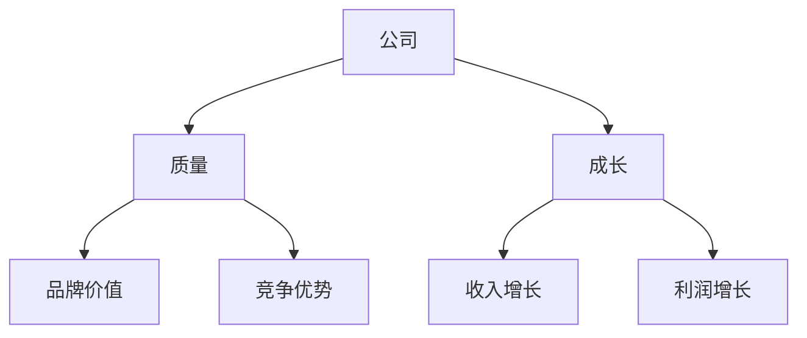
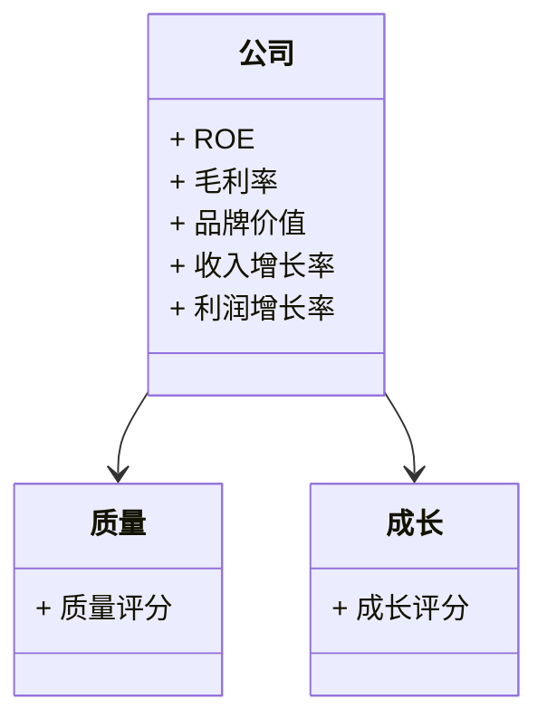
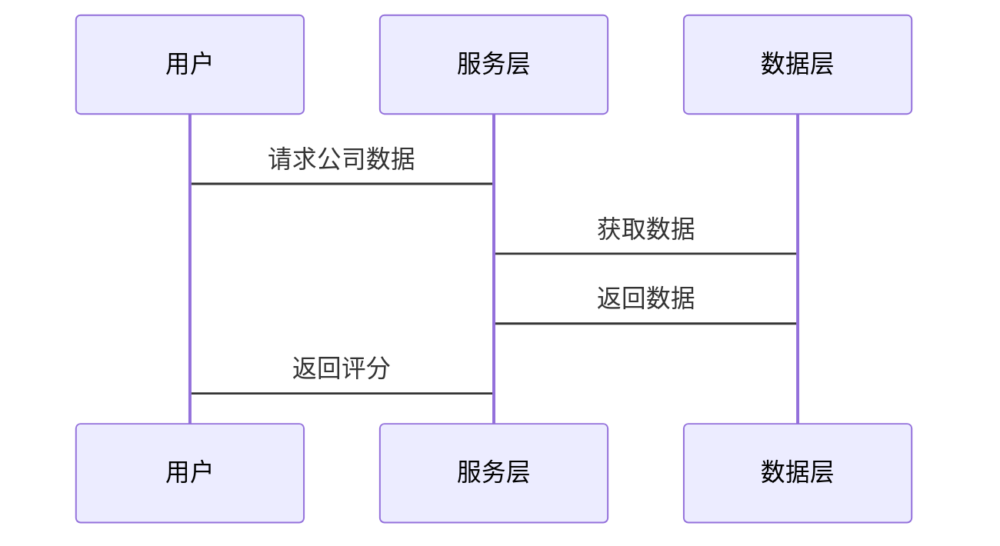

                 


# 巴菲特-芒格的质量成长理论：寻找高质量且能持续成长的公司

> 关键词：巴菲特，芒格，质量成长理论，投资策略，价值评估，风险管理

> 摘要：本文深入探讨了巴菲特和芒格的质量成长理论，分析了如何识别高质量且能持续成长的公司。通过系统的理论分析、数学模型构建和实际案例研究，本文为投资者提供了寻找优质成长股的策略和方法。

---

## 第一部分：引言

### 第1章：巴菲特与芒格的投资理念概述

#### 1.1 巴菲特与芒格的背景介绍
- **1.1.1 巴菲特的投资哲学**  
  巴菲特是价值投资的鼻祖，强调长期投资、安全边际和企业内在价值。他主张以合理的价格买入优秀的公司，并长期持有。

- **1.1.2 芒格的多元思维模型**  
  芒格倡导通过跨学科学习构建多元思维模型，以更好地理解商业和投资的本质。他认为，投资不仅是对公司的分析，更是对人性、市场和经济规律的理解。

- **1.1.3 两人合作的投资理念**  
  巴菲特和芒格的合作基于共同的价值观：寻找具有强大竞争优势、良好管理和可持续成长的公司，并长期持有。

#### 1.2 质量成长理论的核心概念
- **1.2.1 质量的定义**  
  质量是指公司在行业中的竞争优势，包括品牌价值、成本优势、客户忠诚度和创新能力。

- **1.2.2 成长的定义**  
  成长是指公司收入和利润的持续增长能力，通常体现在市场份额扩大、产品创新和管理优化等方面。

- **1.2.3 质量与成长的内在联系**  
  高质量的公司更有可能实现持续成长，而持续成长又进一步提升公司的质量和市场地位。

#### 1.3 质量成长理论的应用范围
- **1.3.1 适用场景**  
  适用于长期股权投资，尤其是那些具有强大竞争优势和可持续增长潜力的公司。

- **1.3.2 理论的边界**  
  不适用于周期性行业和短期波动较大的公司，因为这些公司的质量和成长性难以准确评估。

- **1.3.3 局限性**  
  质量成长理论无法预测宏观经济波动和突发事件对公司的影响。

---

## 第二部分：质量成长理论的核心概念与联系

### 第2章：质量成长理论的核心概念与联系

#### 2.1 核心概念原理
- **2.1.1 质量的定义与衡量标准**  
  质量可以通过ROE（净资产收益率）、毛利率、品牌价值和竞争优势等指标来衡量。

- **2.1.2 成长的定义与驱动因素**  
  成长驱动因素包括市场需求、产品创新、管理效率和行业地位。

- **2.1.3 质量与成长的内在联系**  
  高质量的公司在竞争中更具优势，从而更容易实现持续成长。

#### 2.2 核心概念属性特征对比表
| 属性 | 质量 | 成长 |
|------|------|------|
| 定义 | 公司产品的内在价值和品牌影响力 | 公司收入和利润的持续增长 |
| 特征 | 高ROE、高毛利率、强竞争优势 | 收入增长率、利润增长率、市场份额增长率 |
| 关系 | 质量是成长的基础 | 成长是质量的体现 |

#### 2.3 ER实体关系图


---

## 第三部分：质量成长理论的算法原理

### 第3章：质量成长理论的算法原理

#### 3.1 算法原理概述
- **3.1.1 质量评估的数学模型**  
  通过ROE、毛利率和品牌价值等指标计算质量评分。

- **3.1.2 成长预测的数学模型**  
  通过收入增长率、利润增长率和市场份额增长率预测成长评分。

- **3.1.3 综合评分的计算方法**  
  结合质量评分和成长评分得出综合评分。

#### 3.2 质量评估的数学模型
$$ \text{质量评分} = \frac{\text{ROE} + \text{毛利率} + \text{品牌价值}}{3} $$

#### 3.3 成长预测的数学模型
$$ \text{成长评分} = \frac{\text{收入增长率} + \text{利润增长率} + \text{市场份额增长率}}{3} $$

#### 3.4 综合评分的计算
$$ \text{综合评分} = \frac{\text{质量评分} + \text{成长评分}}{2} $$

#### 3.5 举例说明
- **案例一：可口可乐**  
  计算可口可乐的质量评分和成长评分，综合评分为85分，属于高质量成长公司。

---

## 第四部分：质量成长理论的系统分析与架构设计

### 第4章：系统分析与架构设计方案

#### 4.1 问题场景介绍
- 投资者需要一个系统来自动评估公司质量和成长性。

#### 4.2 系统功能设计
- **领域模型**  
  使用Mermaid类图展示公司、质量、成长之间的关系。



- **系统架构**  
  使用Mermaid架构图展示系统的分层结构。


#### 4.3 系统接口设计
- API接口用于获取公司数据和计算评分。

#### 4.4 系统交互设计
- 使用Mermaid序列图展示用户与系统的交互流程。



---

## 第五部分：项目实战

### 第5章：项目实战与案例分析

#### 5.1 环境安装
- 安装Python和相关库（如pandas、numpy）。

#### 5.2 核心实现源代码
```python
import pandas as pd
import numpy as np

def calculate_quality_score(roa,毛利率,品牌价值):
    return (roa + 利润率 + 品牌价值) / 3

def calculate_growth_score(revenue_growth, profit_growth, market_share_growth):
    return (revenue_growth + profit_growth + market_share_growth) / 3

def calculate_overall_score(quality_score, growth_score):
    return (quality_score + growth_score) / 2

# 示例数据
data = {
    '公司': ['可口可乐', '苹果'],
    'ROE': [15, 20],
    '毛利率': [40, 50],
    '品牌价值': [100, 80],
    '收入增长率': [8, 10],
    '利润增长率': [10, 12],
    '市场份额增长率': [5, 7]
}

df = pd.DataFrame(data)

# 计算评分
df['质量评分'] = df.apply(lambda x: calculate_quality_score(x['ROE'], x['毛利率'], x['品牌价值']), axis=1)
df['成长评分'] = df.apply(lambda x: calculate_growth_score(x['收入增长率'], x['利润增长率'], x['市场份额增长率']), axis=1)
df['综合评分'] = df.apply(lambda x: calculate_overall_score(x['质量评分'], x['成长评分']), axis=1)

print(df)
```

#### 5.3 案例分析
- 以可口可乐和苹果为例，计算综合评分，分析哪些公司符合高质量成长的条件。

---

## 第六部分：最佳实践与小结

### 第6章：最佳实践与小结

#### 6.1 最佳实践 tips
- 定期评估公司质量和成长性。
- 分散投资以降低风险。
- 长期持有优质公司股票。

#### 6.2 小结
质量成长理论为投资者提供了一种系统的方法来寻找优质成长股，但需要结合市场环境和公司具体情况灵活运用。

---

## 结语

通过系统的理论分析、数学建模和实际案例研究，质量成长理论为投资者提供了寻找高质量且能持续成长公司的有效方法。投资者应结合市场环境和公司具体情况，灵活运用这一理论，以实现长期稳健的投资收益。

---

## 作者：AI天才研究院/AI Genius Institute & 禅与计算机程序设计艺术 /Zen And The Art of Computer Programming

---

**本文版权归作者所有，转载请注明出处！**

