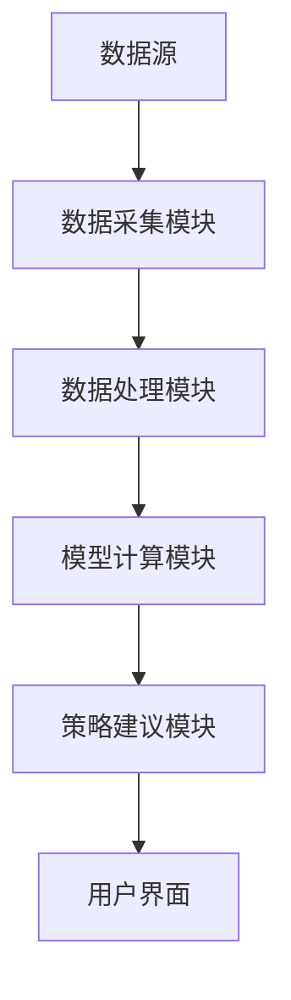
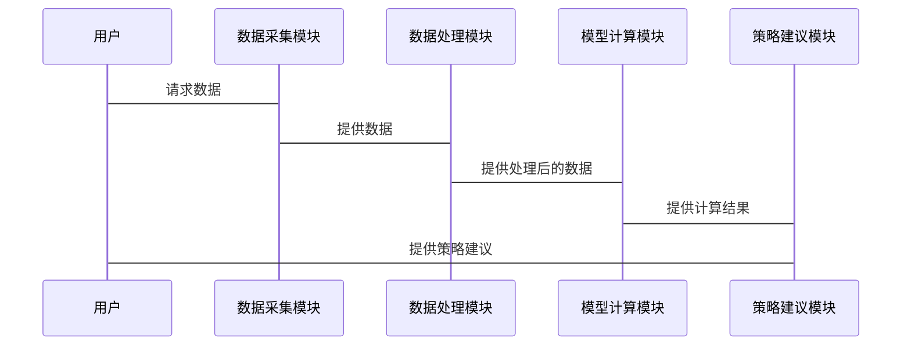

                 


# 巴菲特-芒格的通胀对冲策略：如何保护投资组合

> 关键词：通胀对冲，巴菲特，芒格，投资策略，资产配置，风险管理

> 摘要：本文详细探讨了巴菲特和芒格在应对通胀风险方面的独特策略，分析了他们如何通过价值投资、分散投资和优质资产配置来构建抗通胀的投资组合。文章结合了理论分析、数学建模和实际案例，为投资者提供了一套系统化的通胀对冲方案。

---

# 第1章: 通胀与投资的基本概念

## 1.1 通胀的基本概念与分类

### 1.1.1 通胀的定义与表现形式

通胀（Inflation）是指物价总水平在一段时间内持续上涨，导致货币购买力下降的经济现象。通常用消费者价格指数（CPI）或生产者价格指数（PPI）来衡量。通胀的表现形式包括：

1. **温和通胀**：CPI年涨幅在2%~3%，属于正常经济现象。
2. **恶性通胀**：CPI月涨幅超过5%，可能导致货币贬值和经济不稳定。
3. **成本推动型通胀**：由生产成本上升引发。
4. **需求拉动型通胀**：由总需求超过总供给引发。

### 1.1.2 不同类型通胀的特征对比

| 类型          | 主要特征               | 对投资的影响             |
|---------------|------------------------|--------------------------|
| 温和通胀      | 缓慢、可控             | 增加债券收益率，股市波动小 |
| 恶性通胀      | 剧烈、不可控           | 货币贬值，资产价值下降    |
| 成本推动型    | 生产成本上升           | 利润压缩，企业盈利能力下降 |
| 需求拉动型    | 需求超过供给           | 资产价格上涨，经济过热     |

### 1.1.3 通胀对经济和投资的影响

通胀对经济的影响是多方面的，包括：

- **个人消费**：货币购买力下降，消费能力减弱。
- **企业经营**：成本上升，利润减少，影响投资信心。
- **金融市场**：债券收益率上升，股市波动加剧。

---

## 1.2 巴菲特与芒格的投资哲学

### 1.2.1 巴菲特的价值投资理念

巴菲特的价值投资理念强调：

1. **长期持有优质资产**：选择具有持续盈利能力和强大竞争优势的企业。
2. **安全边际**：以低于内在价值的价格买入资产。
3. **股息与再投资**：通过股息再投资创造复利效应。

### 1.2.2 芒格的多元思维模型

芒格的多元思维模型强调：

1. **跨学科思考**：将物理学、心理学、经济学等知识融入投资决策。
2. **避免情绪化决策**：保持理性和客观。
3. **寻找"第二层思维"**：寻找市场未充分定价的机会。

### 1.2.3 两人投资策略的异同点

| 方面          | 巴菲特             | 芒格               |
|---------------|------------------|-------------------|
| 核心理念      | 价值投资          | 多元思维模型       |
| 投资风格      | 长期持有优质股     | 分散投资，寻找定价权企业 |
| 风险管理      | 重视安全边际       | 重视企业护城河     |

---

# 第2章: 巴菲特-芒格的通胀对冲策略

## 2.1 巴菲特的通胀对冲工具

### 2.1.1 持有优质股票的长期策略

巴菲特认为，优质股票能够抵御通胀的影响，原因在于：

1. **企业盈利能力稳定**：优质企业在通胀周期中能够通过提价保持利润。
2. **股息再投资**：通过复利效应降低通胀对收益的侵蚀。

### 2.1.2 避免高负债企业的投资原则

巴菲特避免投资于高负债企业，因为这些企业在通胀环境下会面临更大的财务压力。

### 2.1.3 伯克希尔哈撒韦的资产配置模型

伯克希尔的资产配置模型注重分散投资，同时配置债券、股票和实业，以平衡通胀风险。

---

## 2.2 芒格的通胀对冲方法

### 2.2.1 分散投资：构建抗通胀投资组合

芒格认为，分散投资是抵御通胀的有效手段。通过投资不同资产类别，降低单一资产的通胀风险。

### 2.2.2 重视企业护城河：寻找具备定价权的企业

芒格偏好那些具备定价权的企业，这些企业在通胀周期中能够通过提价转移成本压力。

### 2.2.3 长期持有优质债券：降低通胀风险

芒格建议在通胀预期上升时，配置优质债券以锁定固定收益。

---

## 2.3 巴菲特与芒格策略的对比与融合

### 2.3.1 两人策略的主要差异

| 方面          | 巴菲特             | 芒格               |
|---------------|------------------|-------------------|
| 重点           | 股票投资          | 分散投资，债券配置 |
| 风险控制       | 重视安全边际       | 重视企业护城河     |

### 2.3.2 策略融合的优化方案

结合巴菲特和芒格的策略，可以采取以下优化方案：

1. **分散投资**：配置股票、债券和实业，降低通胀风险。
2. **长期持有优质资产**：选择具备定价权和竞争优势的企业。
3. **动态调整**：根据通胀预期变化，及时调整资产配置。

---

## 2.3.3 通胀对冲策略的适用场景分析

| 场景          | 适用策略           | 理由               |
|---------------|--------------------|--------------------|
| 温和通胀       | 长期持有优质资产     | 企业盈利能力稳定     |
| 恶性通胀       | 配置债券和现金      | 降低资产损失风险    |
| 经济复苏阶段    | 增加股票配置        | 企业盈利改善        |

---

# 第3章: 通胀对冲的数学模型与算法

## 3.1 通胀对冲的数学模型

### 3.1.1 通胀对冲的基本数学公式

$$ \text{通胀对冲收益} = \text{投资组合收益} - \text{通胀影响} $$

其中，通胀影响可以通过以下公式计算：

$$ \text{通胀影响} = \text{投资组合价值} \times \text{通胀率} $$

### 3.1.2 投资组合的通胀敏感性分析

投资组合的通胀敏感性可以通过以下公式计算：

$$ \text{敏感性} = \frac{\Delta \text{投资组合价值}}{\Delta \text{通胀率}} $$

### 3.1.3 资产配置的优化模型

资产配置的优化模型可以通过以下步骤实现：

1. 确定投资目标和风险承受能力。
2. 选择合适的资产类别。
3. 计算各资产类别的权重。
4. 调整权重以优化风险收益比。

---

## 3.2 算法实现与代码示例

### 3.2.1 通胀风险评估算法

```python
def inflation_risk_assessment(assets, inflation_rate):
    # 计算各资产的通胀影响
    inflation_impact = [asset * inflation_rate for asset in assets]
    # 计算整体通胀风险
    total_risk = sum(inflation_impact)
    return total_risk
```

### 3.2.2 投资组合优化算法

```python
def portfolio_optimization(assets, inflation_rate):
    import numpy as np
    # 计算各资产的预期收益
    expected_returns = np.array([asset * (1 + inflation_rate) for asset in assets])
    # 计算协方差矩阵
    covariance_matrix = np.cov(expected_returns)
    # 计算最优权重
    weights = np.linalg.inv(covariance_matrix).dot(expected_returns)
    return weights
```

---

## 3.3 数学公式详细解读

### 3.3.1 通胀对冲的基本数学公式

通胀对冲的核心在于通过投资组合的收益抵消通胀的影响。公式为：

$$ \text{实际收益} = \text{名义收益} - \text{通胀率} $$

其中，名义收益是投资组合的总收益，通胀率是扣除的通胀影响。

---

# 第4章: 投资组合的系统分析与架构设计

## 4.1 系统分析

### 4.1.1 投资组合管理的系统目标

系统目标包括：

1. 实时监控通胀指标。
2. 自动调整投资组合。
3. 提供通胀对冲策略建议。

### 4.1.2 系统功能模块划分

系统功能模块包括：

1. 数据采集模块：采集通胀数据和市场数据。
2. 模型计算模块：计算投资组合的通胀影响。
3. 策略建议模块：生成通胀对冲策略建议。

### 4.1.3 系统需求分析

系统需求包括：

1. 实时数据采集。
2. 多资产类别支持。
3. 自动化策略调整。

---

## 4.2 系统架构设计

### 4.2.1 系统架构图



### 4.2.2 模块间的交互关系

模块间的交互关系如下：

1. 数据采集模块从数据源获取数据。
2. 数据处理模块对数据进行清洗和转换。
3. 模型计算模块基于处理后的数据计算投资组合的通胀影响。
4. 策略建议模块根据计算结果生成对冲策略建议。
5. 用户界面展示策略建议。

---

## 4.3 系统接口设计

### 4.3.1 数据接口

数据接口包括：

1. CPI数据接口。
2. 股票数据接口。
3. 债券数据接口。

### 4.3.2 算法接口

算法接口包括：

1. 通胀风险评估接口。
2. 投资组合优化接口。

---

## 4.4 系统交互设计

### 4.4.1 系统交互流程图



---

# 第5章: 项目实战：构建抗通胀投资组合

## 5.1 环境配置与工具安装

### 5.1.1 投资分析工具的选择

推荐使用以下工具：

1. **Python**：数据处理和建模。
2. **Pandas**：数据分析。
3. **Matplotlib**：数据可视化。
4. **Yahoo Finance API**：获取市场数据。

---

## 5.2 核心代码实现

### 5.2.1 数据分析与可视化代码

```python
import pandas as pd
import matplotlib.pyplot as plt

# 获取CPI数据
cpi_data = pd.read_csv('cpi.csv')
# 绘制CPI趋势图
plt.plot(cpi_data['日期'], cpi_data['CPI'])
plt.xlabel('日期')
plt.ylabel('CPI')
plt.title('CPI趋势图')
plt.show()
```

### 5.2.2 投资组合优化代码

```python
import numpy as np

def optimize_portfolio(assets, inflation_rate):
    # 计算各资产的预期收益
    expected_returns = np.array([asset * (1 + inflation_rate) for asset in assets])
    # 计算协方差矩阵
    covariance_matrix = np.cov(expected_returns)
    # 计算最优权重
    weights = np.linalg.inv(covariance_matrix).dot(expected_returns)
    return weights

assets = [100, 200, 300]
inflation_rate = 0.02
weights = optimize_portfolio(assets, inflation_rate)
print("最优权重:", weights)
```

---

## 5.3 项目小结

通过本项目，我们可以实现以下目标：

1. 实时监控通胀指标。
2. 自动化计算投资组合的通胀影响。
3. 生成个性化的通胀对冲策略建议。

---

# 第6章: 总结与注意事项

## 6.1 最佳实践 tips

1. **定期审查投资组合**：根据通胀预期变化调整资产配置。
2. **分散投资**：避免过度集中于某一种资产。
3. **关注企业定价权**：选择具备定价权的企业。

## 6.2 小结

巴菲特和芒格的通胀对冲策略为我们提供了一套系统化的投资方法。通过结合理论分析、数学建模和实际案例，我们可以有效降低通胀对投资组合的影响。

## 6.3 注意事项

1. **市场风险**：通胀对冲策略不能完全消除市场风险。
2. **操作风险**：投资决策需要谨慎，避免盲目跟风。
3. **合规性**：遵守相关法律法规，确保投资行为合法合规。

---

# 作者

作者：AI天才研究院/AI Genius Institute & 禅与计算机程序设计艺术 /Zen And The Art of Computer Programming

---

**注：** 本文为技术博客文章，内容基于公开资料整理，不构成投资建议。

