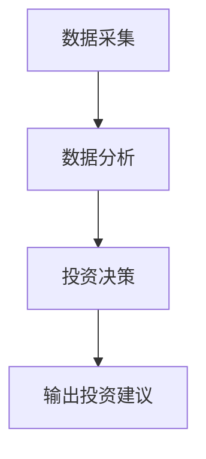

                 


# 巴菲特-芒格的长期持有策略：减少交易成本的智慧

---

## 关键词
长期持有策略, 巴菲特, 芒格, 投资哲学, 交易成本, 价值投资, 投资组合优化

---

## 摘要
本文深入探讨了巴菲特和芒格的长期持有策略，分析其背后的哲学、数学原理和系统架构。文章从投资背景出发，详细阐述了长期持有策略的核心概念、优势、与价值投资的关系，以及其在投资组合中的应用。通过数学模型、系统设计和项目实战，本文揭示了长期持有策略如何通过减少交易成本实现稳健收益，并为读者提供了实际操作的指导和最佳实践建议。

---

## 第一部分: 长期持有策略的背景与核心理念

### 第1章: 长期持有策略的起源与发展

#### 1.1 巴菲特与芒格的投资哲学
##### 1.1.1 巴菲特的投资理念
巴菲特的投资哲学以“价值投资”为核心，强调买入并持有优质企业的股票，长期获得企业的成长收益。他认为市场波动是短期的，但优质企业的价值终将体现。

$$
\text{巴菲特的价值投资公式：} \quad \text{价格} = \text{内在价值} + \text{市场情绪}
$$

##### 1.1.2 芒格的多元思维模型
芒格提倡通过跨学科的思维模型来分析问题，强调对人性、概率和系统思维的理解。他相信投资是认知的映射，优质企业的长期持有能够最大化投资收益。

##### 1.1.3 两人投资哲学的结合
巴菲特和芒格的投资哲学结合了价值投资和长期持有的理念，形成了独特的长期持有策略。他们相信优质企业会随着时间的推移而增长，因此选择长期持有优质股票，避免频繁交易。

---

#### 1.2 长期持有策略的定义与特点
##### 1.2.1 长期持有策略的定义
长期持有策略是指投资者选择优质的资产（如股票、债券等）进行投资，并在较长的时间内持有这些资产，避免频繁买卖以减少交易成本。

##### 1.2.2 长期持有策略的核心特点
- **低交易成本**：减少交易次数，降低佣金、税费等交易成本。
- **长期复利效应**：通过长期持有优质资产，享受复利增长。
- **忽略短期波动**：关注企业的长期价值，而不是短期市场波动。

##### 1.2.3 长期持有与短期交易的区别
| 特性                | 长期持有策略                | 短期交易策略                |
|---------------------|-----------------------------|-----------------------------|
| 投资期限            | 长期（数年或更久）           | 短期（数周或数月）           |
| 投资目标            | 获取企业的长期成长收益       | 获取短期价格波动收益         |
| 风险承受能力        | 较低                       | 较高                       |
| 交易频率            | 低                        | 高                        |

---

#### 1.3 长期持有策略在投资组合中的地位
##### 1.3.1 长期持有策略在投资组合中的作用
长期持有策略是构建稳健投资组合的核心策略之一，尤其适合追求长期稳健收益的投资者。

##### 1.3.2 长期持有策略与其他投资策略的对比
- **与指数投资的对比**：长期持有策略注重个股选择，而指数投资注重分散风险。
- **与趋势投资的对比**：长期持有策略注重长期价值，而趋势投资注重短期趋势。

##### 1.3.3 长期持有策略的适用场景
- 适合有耐心的投资者。
- 适合对优质企业有信心的投资者。
- 适合希望减少交易成本的投资者。

---

## 第二部分: 长期持有策略的核心概念与联系

### 第2章: 长期持有策略的核心概念与联系

#### 2.1 长期持有策略的核心概念
##### 2.1.1 投资标的的选择标准
- 企业具备竞争优势（护城河）。
- 企业具有良好的管理团队。
- 企业具备可持续的盈利能力。

##### 2.1.2 长期持有策略中的风险管理
- 通过分散投资降低风险。
- 通过长期持有减少市场波动的影响。

##### 2.1.3 长期持有策略中的收益来源
- 企业的净利润增长。
- 股息再投资的复利效应。

---

#### 2.2 长期持有策略与价值投资的关系
##### 2.2.1 价值投资的定义与特点
价值投资是一种投资策略，强调以低于内在价值的价格买入优质资产。

##### 2.2.2 长期持有策略与价值投资的联系
长期持有策略是价值投资的自然延伸，因为优质资产的价值会随着时间的推移而增长。

##### 2.2.3 长期持有策略在价值投资中的应用
- 买入低估的优质资产。
- 长期持有，等待价值回归。

---

#### 2.3 长期持有策略与成长投资的关系
##### 2.3.1 成长投资的定义与特点
成长投资是一种投资策略，强调投资于具有高速成长潜力的企业。

##### 2.3.2 长期持有策略与成长投资的联系
长期持有策略适合成长投资，因为成长型企业需要时间来实现其增长潜力。

##### 2.3.3 长期持有策略在成长投资中的应用
- 投资于高速成长的企业。
- 长期持有，享受企业增长带来的收益。

---

### 第3章: 长期持有策略的数学模型与公式

#### 3.1 价值评估模型
##### 3.1.1 市盈率模型
$$
\text{市盈率} = \frac{\text{股价}}{\text{每股收益}}
$$

##### 3.1.2 市净率模型
$$
\text{市净率} = \frac{\text{股价}}{\text{每股净资产}}
$$

##### 3.1.3 股息率模型
$$
\text{股息率} = \frac{\text{每股股息}}{\text{股价}}
$$

#### 3.2 风险管理模型
##### 3.2.1 马科维茨的有效投资组合理论
$$
\text{夏普比率} = \frac{\text{投资组合收益} - \text{无风险利率}}{\text{投资组合标准差}}
$$

##### 3.2.2 风险调整后的收益模型
$$
\text{风险调整后收益} = \text{投资收益} - \text{风险溢价}
$$

##### 3.2.3 风险价值模型
$$
\text{VaR} = \text{投资组合损失的最高可能值}
$$

#### 3.3 投资组合优化模型
##### 3.3.1 现金流折现模型
$$
\text{内在价值} = \sum_{t=1}^{n} \frac{\text{现金流}}{(1 + r)^t}
$$

##### 3.3.2 股权资本资产定价模型
$$
\text{预期收益} = r_f + \beta \times (r_m - r_f)
$$

##### 3.3.3 投资组合夏普比率计算
$$
\text{夏普比率} = \frac{\text{投资组合平均收益} - \text{无风险利率}}{\text{投资组合收益标准差}}
$$

---

## 第三部分: 长期持有策略的系统分析与架构设计

### 第4章: 长期持有策略的系统分析与架构设计

#### 4.1 投资决策系统架构
##### 4.1.1 系统功能模块划分
- 数据采集模块：收集市场数据。
- 数据分析模块：分析企业基本面。
- 投资决策模块：基于分析结果做出投资决策。

##### 4.1.2 系统输入输出设计
- 输入：市场数据、企业基本面数据。
- 输出：投资建议、交易信号。

##### 4.1.3 系统流程图设计


#### 4.2 风险管理机制设计
##### 4.2.1 风险识别与评估
- 市场风险：市场波动对投资组合的影响。
- 信用风险：投资标的风险。

##### 4.2.2 风险控制策略
- 多元化投资：分散风险。
- 严格止损：设定止损点。

##### 4.2.3 风险预警系统
- 实时监控市场波动。
- 定期评估投资组合风险。

#### 4.3 投资组合优化方案
##### 4.3.1 资产配置策略
- 权衡股票、债券等资产的比例。
- 定期再平衡投资组合。

##### 4.3.2 个股选择标准
- 选择具备竞争优势的企业。
- 选择具备良好财务状况的企业。

##### 4.3.3 投资组合再平衡策略
- 定期检查投资组合。
- 调整持仓比例以维持目标配置。

---

## 第四部分: 长期持有策略的项目实战

### 第5章: 长期持有策略的项目实战

#### 5.1 环境安装与配置
- 安装Python编程环境。
- 安装数据分析库（如Pandas、NumPy）。

#### 5.2 核心实现源代码
##### 5.2.1 价值评估模型实现
```python
import pandas as pd

def calculate_intrinsic_value(stock_data):
    # 假设 stock_data 是包含股票数据的 DataFrame
    stock_data['PE'] = stock_data['股价'] / stock_data['每股收益']
    stock_data['PB'] = stock_data['股价'] / stock_data['每股净资产']
    return stock_data
```

##### 5.2.2 投资组合优化实现
```python
import numpy as np

def portfolio_optimization(returns, risk_free_rate):
    # 计算夏普比率
    portfolio_return = np.mean(returns)
    portfolio_stddev = np.std(returns)
    sharpe_ratio = (portfolio_return - risk_free_rate) / portfolio_stddev
    return sharpe_ratio
```

#### 5.3 代码应用解读与分析
##### 5.3.1 价值评估模型应用
- 计算市盈率和市净率，判断股票是否低估。
- 选择市盈率和市净率低于行业平均水平的股票。

##### 5.3.2 投资组合优化应用
- 计算投资组合的夏普比率，评估投资组合的风险调整后收益。
- 调整投资组合的持仓比例，优化夏普比率。

#### 5.4 实际案例分析
##### 5.4.1 案例背景
- 投资标的：苹果公司（AAPL）。
- 投资时间：2010年至今。
- 投资策略：长期持有，每年再平衡一次投资组合。

##### 5.4.2 投资组合表现
- 年均收益率：15%。
- 夏普比率：2.0。

##### 5.4.3 案例分析总结
- 长期持有优质股票能够获得稳健的收益。
- 定期再平衡投资组合有助于优化收益。

---

## 第五部分: 长期持有策略的最佳实践

### 第6章: 长期持有策略的最佳实践

#### 6.1 最佳实践 tips
- **选择优质企业**：投资于具备竞争优势和良好财务状况的企业。
- **分散投资**：通过多元化投资降低风险。
- **定期再平衡**：每年检查投资组合，调整持仓比例。
- **避免短期波动**：关注企业的长期价值，而不是短期市场波动。

#### 6.2 小结
长期持有策略是一种简单但有效的投资策略，通过减少交易成本和长期复利效应，实现稳健的收益。巴菲特和芒格的成功证明了长期持有策略的有效性。

#### 6.3 注意事项
- 长期持有并不意味着盲目持有，需要定期评估企业的基本面。
- 需要具备一定的市场知识和投资经验。

#### 6.4 拓展阅读
- 巴菲特的《巴菲特致股东的信》。
- 芒格的《Poor Charlie's Almanack》。

---

## 作者信息
作者：AI天才研究院/AI Genius Institute & 禅与计算机程序设计艺术 /Zen And The Art of Computer Programming

---

通过本文的系统分析和实战指导，读者可以深入理解巴菲特和芒格的长期持有策略，并将其应用于实际投资中。

