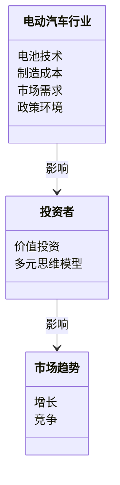
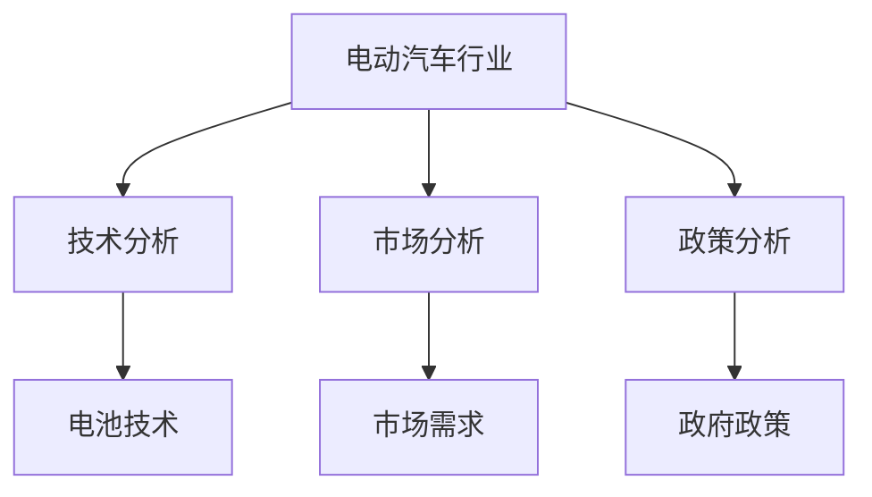
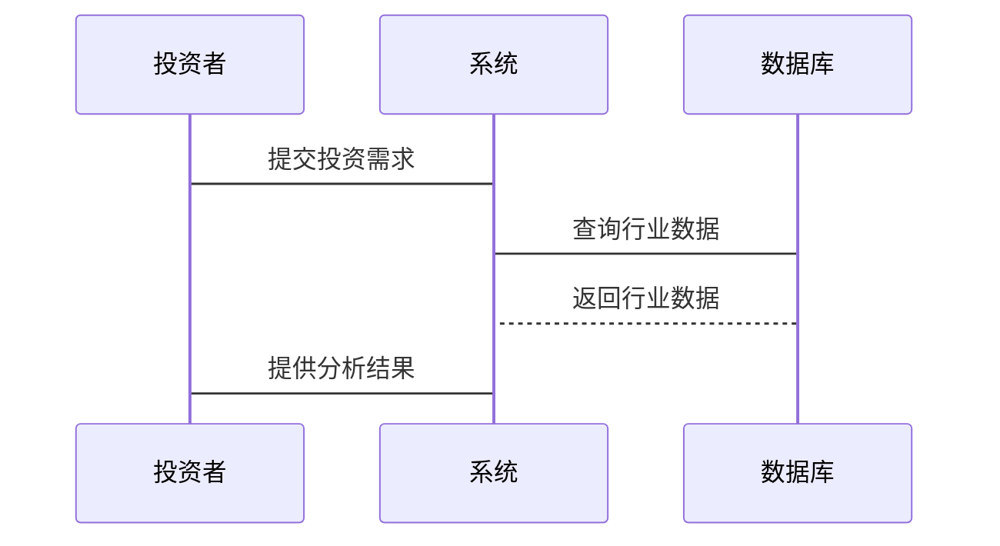

                 

# 巴菲特-芒格看电动汽车行业：未来出行的变革

---

## 关键词：巴菲特，芒格，电动汽车，投资分析，未来趋势，技术发展

---

## 摘要：

本文从巴菲特和芒格的投资哲学出发，结合电动汽车行业的技术发展、市场需求和政策环境，深入分析了这一行业的未来趋势和投资机会。通过技术分析、市场预测和案例研究，探讨了巴菲特和芒格如何看待电动汽车行业的变革，并提出了相应的投资策略和风险管理建议。

---

# 第一部分：引言

## 1.1 巴菲特与芒格的投资哲学

### 1.1.1 巴菲特的价值投资理念

巴菲特的价值投资理念强调长期投资、安全边际和企业内在价值。他主张投资那些具有强大竞争优势、良好管理团队和可持续盈利能力的企业。这种理念的核心在于寻找“价格合理”的优秀企业，而非短期市场波动。

### 1.1.2 芒格的多元思维模型

芒格的多元思维模型强调通过跨学科的思维方式来分析问题。他认为，投资者应该从物理学、心理学、经济学等多个角度出发，全面理解企业的经营环境和内在逻辑。这种思维方式帮助芒格避免了单一视角的局限性。

### 1.1.3 巴菲特与芒格的合伙关系

巴菲特和芒格的合作基于对价值投资的共同理解。芒格作为巴菲特的“智囊”，以其多元思维模型为巴菲特提供了独特的视角，而巴菲特则为芒格提供了丰富的投资实践经验和资源。

---

## 1.2 电动汽车行业的兴起

### 1.2.1 电动汽车行业的背景与现状

随着全球能源危机和环境污染问题的加剧，电动汽车行业迅速崛起。政府政策的支持、技术的进步以及消费者环保意识的提高，推动了电动汽车市场的快速发展。

### 1.2.2 电动汽车行业的技术发展

电动汽车的核心技术包括电池技术、电机技术和智能化技术。近年来，电池技术的突破（如锂离子电池）显著提升了电动汽车的续航里程和性能。

### 1.2.3 巴菲特与芒格对电动汽车行业的关注

巴菲特和芒格对电动汽车行业的关注源于其巨大的市场潜力和技术创新。他们认为，电动汽车行业可能成为未来出行方式的主导力量。

---

# 第二部分：电动汽车行业的背景分析

## 2.1 电动汽车行业的现状与趋势

### 2.1.1 电动汽车市场的增长

电动汽车市场近年来增长迅速，全球销量持续上升。中国、欧洲和美国成为主要的市场增长区域。

### 2.1.2 电动汽车技术的演进

电动汽车技术的演进主要体现在电池能量密度的提升、充电速度的加快以及智能化技术的应用。

### 2.1.3 巴菲特与芒格对电动汽车行业的关注

巴菲特和芒格认为，电动汽车行业的技术进步和市场需求将推动行业持续增长。

---

## 2.2 巴菲特与芒格的投资视角

### 2.2.1 巴菲特对电动汽车行业的看法

巴菲特认为，电动汽车行业的长期增长潜力巨大，但需要关注企业的竞争优势和盈利能力。

### 2.2.2 芒格对电动汽车行业的分析

芒格强调，电动汽车行业的技术门槛和政策环境是影响投资决策的关键因素。

### 2.2.3 巴菲特与芒格的共识与分歧

两者在行业前景上有共识，但在具体投资标的筛选上存在分歧。巴菲特更倾向于选择具有强大竞争优势的企业，而芒格则更注重企业的管理团队和创新能力。

---

# 第三部分：电动汽车行业的核心因素

## 3.1 技术创新与成本控制

### 3.1.1 电池技术的重要性

电池技术是电动汽车的核心技术，直接影响车辆的续航里程和成本。锂离子电池技术的突破显著提升了电动汽车的性能。

### 3.1.2 制造成本的影响

制造成本是电动汽车企业盈利能力的关键因素。通过技术创新和规模化生产，可以有效降低制造成本。

### 3.1.3 技术创新与企业竞争力

技术创新是电动汽车企业核心竞争力的体现。拥有自主知识产权和技术优势的企业更具市场竞争力。

---

## 3.2 市场需求与政策支持

### 3.2.1 全球电动汽车市场的增长

全球电动汽车市场呈现快速增长态势，特别是在中国和欧洲市场。

### 3.2.2 政策对电动汽车行业的影响

政府政策（如补贴、税收优惠）对电动汽车行业的发展具有重要推动作用。

### 3.2.3 市场需求的未来预测

未来，随着技术进步和成本下降，电动汽车市场需求将进一步扩大。

---

## 3.3 供应链与全球化布局

### 3.3.1 电动汽车供应链的关键环节

电动汽车供应链包括电池原材料、电机、电控系统等关键环节。

### 3.3.2 全球化布局的重要性

全球化布局可以帮助企业降低生产成本，提高供应链的稳定性。

### 3.3.3 供应链风险与应对策略

供应链风险包括原材料价格波动和地缘政治风险。企业需要通过多元化采购和技术创新来应对风险。

---

# 第四部分：电动汽车行业的未来趋势

## 4.1 技术进步与产业整合

### 4.1.1 电池技术的突破

未来，电池技术的进一步突破将提升电动汽车的续航里程和充电速度。

### 4.1.2 电动汽车智能化的发展

智能化技术（如自动驾驶和车联网）将推动电动汽车行业的进一步发展。

### 4.1.3 产业整合的趋势

电动汽车行业的整合将加速，大型企业将通过并购和合作扩大市场份额。

---

## 4.2 市场格局与投资机会

### 4.2.1 电动汽车市场的未来格局

未来，电动汽车市场将呈现寡头垄断格局，少数具有技术优势和成本优势的企业将占据主导地位。

### 4.2.2 投资机会与风险管理

投资者应关注具有技术优势和成本优势的企业，同时注意行业政策和市场风险。

### 4.2.3 未来研究方向

未来，研究方向将集中在电池技术、智能化技术和全球市场布局等方面。

---

# 第五部分：系统分析与架构设计

## 5.1 问题场景介绍

电动汽车行业的复杂性要求投资者具备系统思维，从技术、市场、政策等多个维度进行分析。

## 5.2 项目介绍

以电动汽车行业为研究对象，构建一个系统化的分析框架，帮助投资者全面理解行业动态。

## 5.3 系统功能设计

### 5.3.1 领域模型

使用Mermaid绘制领域模型类图，展示行业的主要实体及其关系。

## 5.4 系统架构设计

### 5.4.1 系统架构

使用Mermaid绘制系统架构图，展示系统的各个模块及其关系。

## 5.5 系统接口设计

### 5.5.1 系统接口

电动汽车行业的分析需要与多个外部系统接口对接，包括市场数据系统、政策数据库等。

## 5.6 系统交互设计

### 5.6.1 系统交互

使用Mermaid绘制系统交互序列图，展示投资者与系统之间的交互过程。

---

# 第六部分：项目实战

## 6.1 环境安装

### 6.1.1 系统环境

建议使用Python 3.8及以上版本，安装必要的库（如pandas、numpy、matplotlib）。

### 6.1.2 安装步骤

1. 安装Python
2. 安装必要的库：pip install pandas numpy matplotlib

---

## 6.2 核心实现

### 6.2.1 电动汽车市场数据的分析

#### 6.2.1.1 数据获取

使用Python代码从公开数据源获取电动汽车市场的销售数据。

#### 6.2.1.2 数据分析

使用pandas进行数据清洗和分析。

#### 6.2.1.3 数据可视化

使用matplotlib绘制市场趋势图。

### 6.2.2 电池技术的预测

#### 6.2.2.1 技术预测模型

使用回归分析预测电池技术的未来发展趋势。

#### 6.2.2.2 模型实现

编写Python代码实现回归分析。

---

## 6.3 实际案例分析

### 6.3.1 案例选择

以特斯拉为例，分析其市场表现和技术创新。

### 6.3.2 数据分析

使用Python代码分析特斯拉的财务数据和市场表现。

---

## 6.4 项目小结

通过项目实战，投资者可以更好地理解电动汽车行业的技术发展和市场趋势，从而做出更明智的投资决策。

---

# 第七部分：最佳实践与总结

## 7.1 最佳实践 tips

### 7.1.1 投资策略

投资者应关注企业的技术优势、成本控制和市场布局。

### 7.1.2 风险管理

投资者应分散投资，避免过度集中于单一企业或行业。

## 7.2 小结

本文从巴菲特和芒格的投资哲学出发，结合电动汽车行业的技术发展和市场趋势，提出了相应的投资策略和风险管理建议。

## 7.3 注意事项

投资者应关注行业政策变化和技术进步，及时调整投资策略。

## 7.4 拓展阅读

建议读者阅读巴菲特和芒格的著作，深入了解他们的投资哲学和思维方式。

---

# 结语

电动汽车行业的变革不仅改变了出行方式，也带来了巨大的投资机会。通过巴菲特和芒格的视角，投资者可以更好地理解这一行业的未来发展趋势，并做出更明智的投资决策。

---

# 作者：AI天才研究院 & 禅与计算机程序设计艺术

