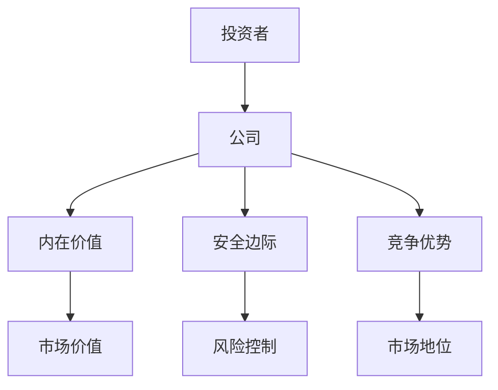
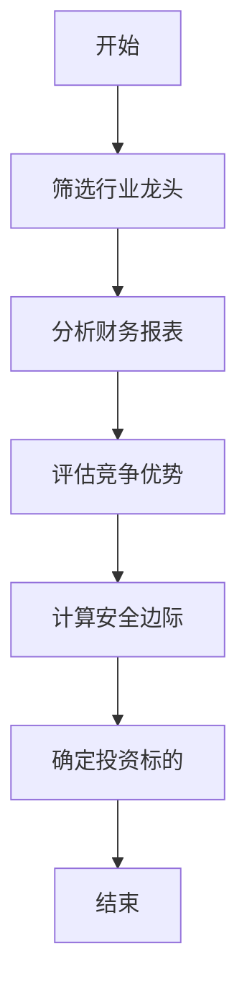
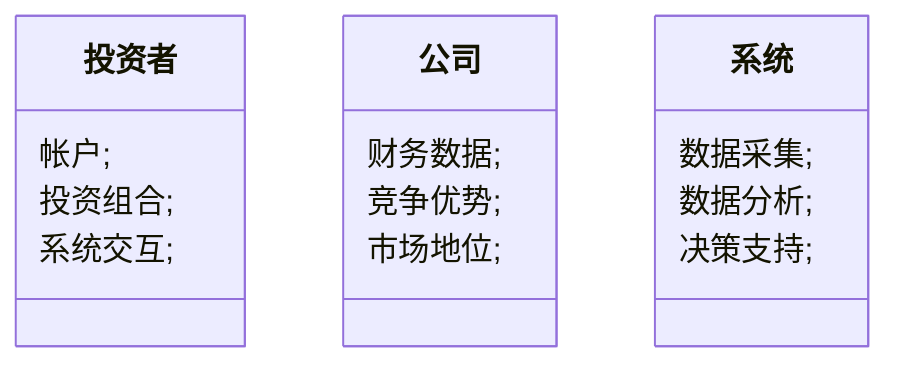
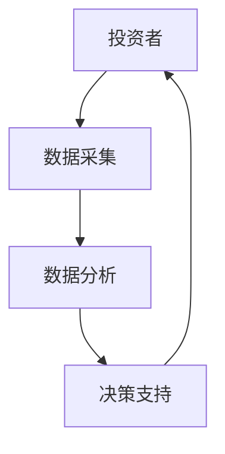
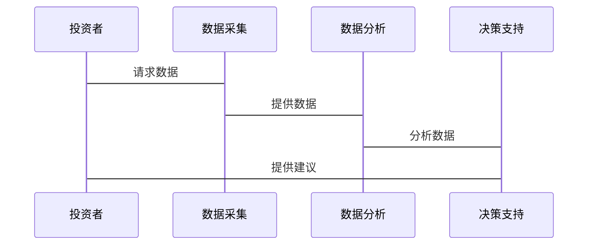

                 


# 巴菲特-芒格策略在全球市场的适用性

## 关键词：
- 价值投资
- 全球市场
- 投资策略
- 安全边际
- 竞争优势
- 内在价值

## 摘要：
本文探讨巴菲特和芒格的价值投资策略在全球市场中的适用性。通过分析他们的投资哲学、核心概念和算法模型，结合实际案例，评估这些策略在全球不同市场环境下的表现和挑战。文章还提供了系统架构和项目实战，帮助读者理解和应用这些策略。

---

## 第一部分: 巴菲特-芒格策略的全球投资哲学

## 第1章: 巴菲特与芒格的投资理念概述

### 1.1 巴菲特与芒格的生平与投资哲学

#### 1.1.1 巴菲特的生平与投资理念
沃伦·巴菲特是世界著名投资者，倡导价值投资。他的理念强调购买低于内在价值的股票，长期持有。他注重企业的财务健康、竞争优势和管理团队。

#### 1.1.2 芒格的生平与投资哲学
查理·芒格是巴菲特的合作伙伴，提倡多元思维模型，强调独立思考和避免情绪化决策。他认为投资是理解企业内在价值的过程。

#### 1.1.3 巴菲特与芒格合作的投资哲学
两人结合了价值投资和多元思维模型，注重安全边际和竞争优势，强调长期投资和风险管理。

### 1.2 价值投资的核心理念

#### 1.2.1 价值投资的定义
价值投资是寻找市场价格低于内在价值的股票。内在价值是企业未来现金流的现值。

#### 1.2.2 价值投资的核心原则
- 购买优质企业。
- 长期持有。
- 避免短期波动。
- 注重安全边际。

#### 1.2.3 价值投资与全球市场的结合
将价值投资应用于不同市场的优质企业，需考虑文化、法规和经济环境差异。

### 1.3 巴菲特-芒格策略的全球适用性

#### 1.3.1 全球市场的多样性与复杂性
不同市场有不同法规、文化和经济环境，影响企业价值和投资策略。

#### 1.3.2 巴菲特-芒格策略在全球市场的潜在应用
在新兴市场寻找优质企业，利用多元化投资分散风险。

#### 1.3.3 策略适用性的边界与限制
策略在不同市场表现不一，需考虑市场波动和企业特性。

---

## 第二部分: 巴菲特-芒格策略的核心概念与联系

## 第2章: 巴菲特-芒格策略的核心概念与联系

### 2.1 核心概念的定义与解释

#### 2.1.1 内在价值
企业未来现金流的现值，是投资决策的基础。

#### 2.1.2 安全边际
市场价格低于内在价值的比例，提供缓冲以应对错误评估。

#### 2.1.3 竞争优势
企业在市场中独特的优势，如品牌、技术或成本优势。

### 2.2 核心概念的对比分析

#### 2.2.1 内在价值与市场价值对比
内在价值是目标，市场价值是结果。两者差异决定投资机会。

#### 2.2.2 安全边际与风险控制对比
安全边际通过价格折扣降低风险，风险控制是整体策略的一部分。

#### 2.2.3 竞争优势与市场地位对比
竞争优势决定市场地位，稳固地位带来持续盈利能力。

### 2.3 核心概念的ER实体关系图



---

## 第三部分: 巴菲特-芒格策略的算法原理

## 第3章: 巴菲特-芒格策略的算法原理

### 3.1 选股模型的算法流程

#### 3.1.1 算法流程



#### 3.1.2 约束条件

- 行业龙头：市场份额大、财务健康。
- 财务指标：低市盈率、高ROE。
- 竞争优势：独特产品或成本优势。
- 安全边际：股价低于内在价值。

### 3.2 算法实现

#### 3.2.1 内在价值计算

$$\text{内在价值} = \sum_{t=1}^{n} \frac{\text{现金流}_t}{(1 + r)^t}$$

#### 3.2.2 竞争优势分析

```python
def hascompetitiveadvantage(financial_data):
    roe = financial_data['roe']
    market_share = financial_data['market_share']
    return roe > 20 and market_share > 0.3
```

#### 3.2.3 安全边际计算

```python
def calculate_margin_of_safety(intrinsic_value, market_price):
    return (intrinsic_value - market_price) / intrinsic_value
```

---

## 第四部分: 巴菲特-芒格策略的系统分析与架构设计

## 第4章: 巴菲特-芒格策略的系统分析与架构设计

### 4.1 问题场景介绍

#### 4.1.1 投资者需求
投资者需要一个系统来分析全球市场的投资机会，评估企业的内在价值和竞争优势。

### 4.2 系统功能设计

#### 4.2.1 领域模型



#### 4.2.2 系统架构



#### 4.2.3 系统接口设计

- 数据接口：从数据库获取公司数据。
- 分析接口：计算内在价值和竞争优势。
- 决策接口：生成投资建议。

#### 4.2.4 系统交互



---

## 第五部分: 巴菲特-芒格策略的项目实战

## 第5章: 巴菲特-芒格策略的项目实战

### 5.1 环境安装

#### 5.1.1 工具安装
- Python 3.9+
- Pandas、NumPy、Scikit-learn

### 5.2 核心实现

#### 5.2.1 数据清洗

```python
import pandas as pd

def clean_data(data):
    data = data.dropna()
    data = data[~data['revenue'].isnull()]
    return data
```

#### 5.2.2 竞争优势分析

```python
import pandas as pd

def analyze_competition(data):
    data['market_share'] = data['revenue'] / data['industry_revenue']
    data['roa'] = data['net_profit'] / data['total_assets']
    return data
```

#### 5.2.3 投资决策

```python
def make_investment_decision(data):
    data['intrinsic_value'] = data['cash_flows'].cumsum() / (1 + data['discount_rate'])
    data['margin_of_safety'] = (data['intrinsic_value'] - data['market_price']) / data['intrinsic_value']
    return data[data['margin_of_safety'] > 0.2]
```

### 5.3 案例分析

#### 5.3.1 苹果公司

- 内在价值：基于未来现金流计算。
- 竞争优势：品牌和技术。

#### 5.3.2 亚马逊

- 内在价值：考虑未来增长。
- 竞争优势：物流和技术。

---

## 第六部分: 巴菲特-芒格策略的最佳实践

## 第6章: 巴菲特-芒格策略的最佳实践

### 6.1 总结与反思

- 长期投资的重要性。
- 竞争优势的识别。
- 安全边际的计算。

### 6.2 小结

巴菲特和芒格的策略在全球市场中依然有效，需结合市场环境调整。

### 6.3 注意事项

- 避免情绪化决策。
- 定期评估投资组合。
- 保持学习和适应能力。

### 6.4 拓展阅读

- 巴菲特的《投资之道》。
- 芮小华的《价值投资实战》。

---

## 作者：AI天才研究院/AI Genius Institute & 禅与计算机程序设计艺术 /Zen And The Art of Computer Programming

