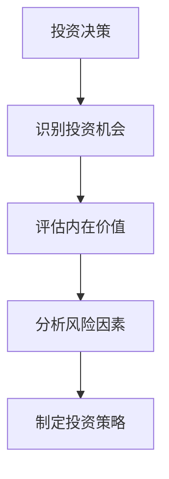

                 

# 巴菲特与芒格：'二营长'的价值投资搭档之道

> 关键词：巴菲特, 芒格, 价值投资, 投资搭档, 投资策略, 决策框架, 复利效应

> 摘要：本文深入探讨了巴菲特和芒格作为价值投资领域的顶级搭档，如何通过互补性合作和长期价值投资策略实现投资成功。文章分析了他们的投资理念、决策框架、风险管理方法，并结合实际案例，揭示了他们如何通过系统化的方法和长期思维实现投资目标。本文还提供了价值投资者在实际操作中的实用建议和最佳实践。

---

## 第一部分：价值投资的背景与核心理念

### 第1章：价值投资的定义与核心要素

#### 1.1 价值投资的定义
价值投资是一种投资策略，强调以低于内在价值的价格购买优质资产。其核心在于识别市场定价错误的机会，并长期持有这些资产，直到市场重新评估其真实价值。

#### 1.2 价值投资的核心要素
- **内在价值**：资产在未来现金流的现值，反映了其真实价值。
- **安全边际**：购买价格低于内在价值的程度，提供了风险缓冲。
- **长期思维**：关注企业的长期盈利能力，而非短期市场波动。

#### 1.3 价值投资与市场波动的关系
市场波动为价值投资者提供了以折扣价买入优质资产的机会。巴菲特和芒格通过逆周期投资，利用市场的恐慌和贪婪情绪，捕捉低估的投资机会。

---

## 第2章：巴菲特与芒格的投资理念

### 2.1 巴菲特的投资哲学

#### 2.1.1 股票选择标准
- **护城河**：企业具备竞争优势，能够持续盈利。
- **管理层**：诚实、可靠且有能力的管理层。
- **财务健康**：低债务、稳定的现金流。

#### 2.1.2 投资策略
- **集中投资**：将资金集中在少数优质资产上，以最大化复利效应。
- **长期持有**：避免频繁交易，降低交易成本，专注企业的长期价值。

### 2.2 芒格的多元思维模型

#### 2.2.1 多元思维模型的定义
多元思维模型是一种通过多个学科和角度分析问题的方法，帮助投资者避免单一视角的局限性。

#### 2.2.2 多元思维模型的应用
- **跨学科分析**：结合心理学、经济学、物理学等学科，全面评估企业的内在价值。
- **逆向思维**：从反方向思考问题，寻找市场的非共识观点。

#### 2.2.3 多元思维模型的实践
芒格通过广泛阅读和思考，构建了涵盖多个领域的知识体系，帮助他在投资决策中做出更明智的选择。

---

## 第3章：巴菲特与芒格的决策框架

### 3.1 投资决策的系统化方法

#### 3.1.1 决策流程
1. **识别投资机会**：通过市场研究和数据分析，寻找具备竞争优势的企业。
2. **评估内在价值**：使用DCF模型等工具计算企业的内在价值。
3. **分析风险因素**：识别可能影响企业价值的负面因素。
4. **制定投资策略**：根据分析结果，决定是否投资及投资规模。

#### 3.1.2 决策工具与方法
- **DCF模型**：现金流折现法，用于评估企业的内在价值。
- **ROE与ROA分析**：衡量企业的盈利能力。

### 3.2 决策框架的可视化

---

## 第4章：巴菲特与芒格的投资策略

### 4.1 价值投资的实施步骤

#### 4.1.1 确定投资目标
- **长期目标**：构建一个能够持续产生现金流的投资组合。
- **短期目标**：通过短期投资机会，积累资金用于长期投资。

#### 4.1.2 构建投资组合
- **资产配置**：根据市场环境和个人风险承受能力，分配不同资产的比例。
- **分散投资**：通过投资多个优质资产，降低投资风险。

### 4.2 投资组合的优化

#### 4.2.1 资产配置的动态调整
- **定期审视**：根据市场变化和个人财务状况，调整资产配置。
- **再平衡**：保持投资组合的分散性和风险可控性。

#### 4.2.2 投资组合的风险管理
- **止损策略**：设定止损点，避免重大损失。
- **风险分散**：通过投资不同行业的企业，降低特定行业风险。

---

## 第5章：巴菲特与芒格的成功案例分析

### 5.1 伯克希尔的运作模式

#### 5.1.1 公司治理
- **股东价值**：伯克希尔始终以股东利益为核心，通过长期稳定的回报赢得投资者信任。
- **透明披露**：巴菲特坚持每年发布致股东的信，保持与股东的沟通。

#### 5.1.2 投资案例
- **可口可乐投资**：巴菲特通过长期持有可口可乐股票，获得了稳定的股息收入和资本增值。
- **苹果投资**：芒格通过多元思维模型，识别出苹果公司的长期竞争优势，并建议巴菲特投资。

### 5.2 投资决策的实战分析

#### 5.2.1 投资环境分析
- **宏观经济因素**：关注利率、通货膨胀、经济周期等宏观经济指标，评估其对投资组合的影响。
- **行业趋势**：分析行业的发展前景，选择具备增长潜力的企业。

#### 5.2.2 投资策略的调整
- **动态调整**：根据市场变化和个人财务状况，灵活调整投资策略。
- **风险管理**：通过定期评估投资组合的风险，采取相应的风险管理措施。

---

## 第6章：价值投资的实战技巧与注意事项

### 6.1 投资心态的培养

#### 6.1.1 避免情绪化决策
- **耐心等待**：在市场恐慌时保持冷静，避免盲目跟风。
- **理性分析**：在市场高涨时保持理性，避免过度乐观。

#### 6.1.2 坚持长期思维
- **复利效应**：通过长期持有优质资产，实现财富的指数增长。
- **持续学习**：不断更新知识和技能，提升投资决策的准确性。

### 6.2 投资能力的提升

#### 6.2.1 知识储备
- **广泛阅读**：涉猎经济学、心理学、金融学等领域的书籍，构建多元知识体系。
- **案例研究**：通过分析经典投资案例，总结经验教训，提升投资能力。

#### 6.2.2 技能培养
- **数据分析**：熟练掌握财务报表分析、估值模型等工具，提高投资决策的科学性。
- **决策框架**：建立系统的投资决策框架，确保投资过程的规范性和一致性。

---

## 第7章：价值投资的未来展望与启示

### 7.1 价值投资的未来趋势

#### 7.1.1 数字化转型
- **科技驱动**：利用大数据、人工智能等技术，提高投资分析的效率和准确性。
- **量化投资**：通过量化模型，实现投资决策的自动化和系统化。

#### 7.1.2 可持续投资
- **ESG投资**：关注企业的环境、社会和治理因素，推动投资的可持续发展。

### 7.2 对投资者的启示

#### 7.2.1 投资理念的传承
- **长期思维**：坚持价值投资理念，注重企业的长期价值。
- **风险管理**：在复杂多变的市场环境中，保持稳健的投资策略。

#### 7.2.2 投资方法的创新
- **技术辅助**：借助科技手段，提升投资分析的深度和广度。
- **多元化投资**：通过多元化配置，降低投资风险，提高收益稳定性。

---

## 附录

### 附录A：巴菲特与芒格的经典语录

#### A.1 巴菲特语录
- “价格是你支付的，价值是你得到的。”
- “我们相信，通过持有优质股票并长期持有，可以获得超越市场的回报。”

#### A.2 芒格语录
- “我们寻找的是那些具有持续竞争优势，并且管理层诚实可靠的企业。”
- “多元思维模型可能是我最宝贵的资产。”

### 附录B：价值投资相关书籍推荐

#### B.1 经典书籍
- 《聪明的投资者》——本杰明·格雷厄姆
- 《投资的艺术》——菲利普·费雪
- 《沃伦·巴菲特传》——罗伯特·哈格斯特朗

### 附录C：投资工具与资源

#### C.1 估值工具
- 股权自由现金流模型
- 市盈率、市净率等估值指标

#### C.2 数据来源
- 财务报表分析工具
- 行业研究报告

---

## 作者信息

作者：AI天才研究院/AI Genius Institute & 禅与计算机程序设计艺术 /Zen And The Art of Computer Programming

---

这篇文章通过系统化的分析和丰富的实战案例，全面揭示了巴菲特和芒格的价值投资策略和搭档之道。从理论到实践，从分析到决策，为读者提供了全面的指导和启示，帮助读者在投资领域取得长期成功。

