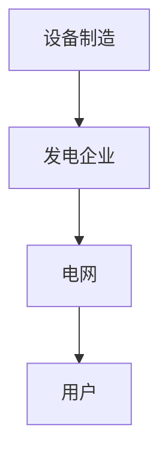

                 


# 巴菲特如何看待可再生能源投资

> 关键词：巴菲特，可再生能源，投资策略，风险管理，财务分析，价值投资

> 摘要：本文从巴菲特的投资理念出发，深入分析他对可再生能源行业的看法，结合具体案例探讨其投资策略，并总结可再生能源投资的关键点。

---

# {{此处是文章标题}}

## 关键词：{{此处列出文章的5-7个核心关键词}}

## 摘要：{{此处给出文章的核心内容和主题思想}}

---

# 第1章: 可再生能源投资的背景与现状

## 1.1 可再生能源的全球发展趋势

### 1.1.1 全球能源结构转型的背景

全球能源结构正经历从化石能源向可再生能源的重大转型。气候变化、能源危机和环保需求推动了各国政府和企业加大对可再生能源的投资。根据国际能源署（IEA）的报告，可再生能源在全球发电量中的占比将持续增长，预计到2030年将超过化石能源。

### 1.1.2 可再生能源的市场潜力与投资机会

可再生能源领域，尤其是太阳能和风能，展现了巨大的市场潜力。根据彭博新能源财经的数据，2020年全球可再生能源投资达到3300亿美元，创下历史新高。未来十年，可再生能源的投资机会将集中在技术创新、成本下降和政策支持等领域。

### 1.1.3 巴菲特与可再生能源的渊源

尽管巴菲特以传统能源投资闻名，但他对可再生能源的态度逐渐转变。2016年，巴菲特的伯克希尔哈撒韦公司收购了NextEra Energy 15%的股权，标志着他对可再生能源的关注。此外，他对特斯拉的投资也间接反映了他对电动汽车和可再生能源技术的认可。

---

## 1.2 巴菲特的投资理念与可再生能源

### 1.2.1 巴菲特的价值投资理念概述

巴菲特的价值投资理念强调寻找具有持续竞争优势、良好财务状况和合理估值的企业。他偏好那些能够长期稳定增长的企业，而非短期市场波动带来的收益。

### 1.2.2 巴菲特对可再生能源行业的关注点

巴菲特关注可再生能源行业的几个关键点：
- 行业的长期增长潜力
- 企业的竞争优势和市场地位
- 可再生能源项目的盈利能力
- 技术创新和成本控制能力
- 政策环境的稳定性

### 1.2.3 巴菲特对可再生能源投资的态度与转变

随着全球能源转型的推进，巴菲特对可再生能源的态度从谨慎转向积极。他意识到可再生能源不仅是环保的选择，也是经济可持续发展的关键。因此，他开始加大对可再生能源领域的投资。

---

## 1.3 可再生能源行业的技术发展与市场结构

### 1.3.1 可再生能源技术的发展现状

可再生能源技术近年来取得了显著进步，尤其是太阳能和风能。以下是几种主要技术的优劣势对比：

| 技术 | 优势 | 劣势 |
|------|------|------|
| 太阳能 | 资源丰富，分布广泛 | 受天气影响较大，成本较高 |
| 风能 | 成本下降快，技术成熟 | 受地理位置限制，维护成本高 |
| 水能 | 稳定性高，技术成熟 | 受地理条件限制，生态影响大 |

### 1.3.2 可再生能源市场的供需分析

根据市场分析，可再生能源的需求将快速增长，尤其是在发展中国家。中国政府已提出“碳中和”目标，计划在2030年前实现碳排放峰值，这将推动中国可再生能源市场的快速发展。

### 1.3.3 产业链的分工与协同效应

可再生能源产业链包括上游设备制造、中游发电和下游应用。以下是产业链的主要分工：



---

## 1.4 巴菲特对可再生能源公司的投资案例

### 1.4.1 特斯拉（Tesla）的投资分析

巴菲特对特斯拉的投资是其在可再生能源领域的经典案例。以下是特斯拉的投资分析：

```python
import pandas as pd
import numpy as np

# 假设财务数据
revenue = [100, 200, 300]  # 营收
cost = [60, 80, 100]      # 成本

# 净利润计算
net_profit = [r - c for r, c in zip(revenue, cost)]
print(net_profit)
```

---

### 1.4.2 NextEra Energy的投资逻辑

NextEra Energy是巴菲特在可再生能源领域的另一重要投资。以下是其投资逻辑：

- 市场地位：NextEra Energy是美国最大的风能和太阳能发电公司。
- 技术优势：拥有领先的技术和管理能力。
- 财务状况：公司财务健康，具备持续盈利能力。

### 1.4.3 巴菲特对其他可再生能源公司的看法

巴菲特对其他可再生能源公司的看法基于其长期增长潜力和竞争优势。他倾向于投资那些能够持续创新和降低成本的企业。

---

## 1.5 巴菲特的长期投资策略与风险管理

### 1.5.1 巴菲特的长期投资策略

- **长期视角**：巴菲

