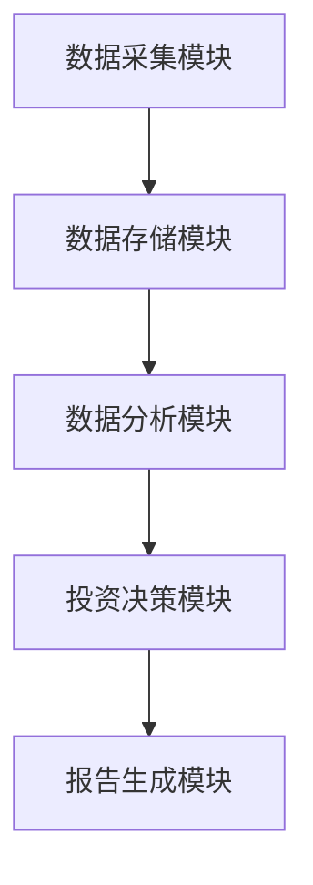

                 


# 巴菲特如何看待市场波动

> 关键词：巴菲特，市场波动，投资策略，价值投资，长期投资

> 摘要：本文深入探讨了巴菲特如何看待市场波动，从市场波动的基本概念、巴菲特的投资理念、市场波动的核心原理与数学模型、系统分析与架构设计方案、项目实战与代码实现以及最佳实践等多个角度进行分析。通过本文，读者可以全面理解巴菲特如何看待市场波动，以及如何在实际投资中应用这些理念。

---

# 第一部分：市场波动与投资心态

## 第1章：市场波动的基本概念

### 1.1 市场波动的定义与特征

#### 1.1.1 市场波动的定义
市场波动是指金融市场中价格的短期变化，通常由市场参与者的买卖行为、市场情绪、经济数据发布、政策变化等因素引起。波动性是衡量市场风险的重要指标，通常通过标准差或波动率来量化。

#### 1.1.2 市场波动的特征分析
- **短期性**：市场波动通常发生在较短的时间内，例如几分钟、几小时或几天。
- **不可预测性**：尽管有一些模型可以尝试预测波动，但市场波动本质上具有不确定性。
- **非线性**：市场波动可能会受到市场参与者的行为、情绪等因素的影响，表现出非线性特征。
- **周期性**：市场波动往往呈现出周期性，例如牛市和熊市交替出现。

#### 1.1.3 市场波动与投资决策的关系
市场波动对投资者的心理和行为有重要影响。短期波动可能导致投资者情绪波动，进而影响投资决策，例如恐慌性抛售或贪婪性买入。

---

### 1.2 巴菲特的投资理念概述

#### 1.2.1 巴菲特的投资哲学
巴菲特的投资哲学以价值投资为核心，强调长期投资、安全边际和公司基本面分析。他认为市场波动是投资的敌人，但也是投资者的机会。

#### 1.2.2 巴菲特的价值投资策略
- **购买优秀的公司**：巴菲特倾向于投资那些具有强大竞争优势、良好管理和可持续盈利能力的公司。
- **长期持有**：巴菲特主张长期持有优质股票，避免频繁交易。
- **安全边际**：在买入股票时，巴菲特通常要求股票价格低于其内在价值，以确保足够的安全边际。

#### 1.2.3 巴菲特对市场的长期看法
巴菲特认为市场在长期内是理性的，但短期内是情绪化的。他强调投资者应关注企业的内在价值，而不是市场的短期波动。

---

### 1.3 市场波动对投资者的影响

#### 1.3.1 市场波动的心理影响
市场波动可能导致投资者情绪波动，例如在市场下跌时感到恐慌，在市场上涨时感到贪婪。这种情绪波动往往会导致非理性的投资决策。

#### 1.3.2 市场波动的行为影响
市场波动可能引发投资者的过度交易行为，例如频繁买卖股票以试图捕捉短期收益。这种行为通常会增加交易成本，并降低长期投资收益。

#### 1.3.3 市场波动的长期影响
尽管市场波动在短期内可能对投资者造成影响，但长期来看，优质公司的股价会趋向于其内在价值，市场波动并不会影响公司的基本面。

---

## 第2章：巴菲特如何看待市场波动的核心观点

### 2.1 巴菲特对市场波动的态度

#### 2.1.1 巴菲特对市场波动的理性看法
巴菲特认为市场波动是市场的正常现象，但波动本身并不会影响公司的基本面。他强调投资者应保持冷静，避免被短期波动所左右。

#### 2.1.2 巴菲特对市场波动的长期视角
巴菲特认为市场波动是长期投资者的机会。在市场下跌时，优质股票的价格可能会低于其内在价值，这为投资者提供了买入的机会。

#### 2.1.3 巴菲特对市场波动的策略选择
巴菲特倾向于在市场波动较大时进行投资，尤其是当市场出现恐慌性下跌时。他认为这是买入优质股票的最佳时机。

---

### 2.2 巴菲特的市场波动分析框架

#### 2.2.1 市场波动的周期性分析
巴菲特认为市场波动具有周期性，通常表现为牛市和熊市交替出现。他在熊市中寻找买入机会，在牛市中保持耐心。

#### 2.2.2 市场波动的结构性分析
巴菲特关注市场波动背后的结构性因素，例如经济周期、行业趋势和公司基本面。他认为这些因素决定了市场的长期走势。

#### 2.2.3 市场波动的微观与宏观结合
巴菲特将市场波动与宏观经济、行业趋势和公司基本面相结合，以寻找长期投资机会。

---

### 2.3 巴菲特的市场波动应对策略

#### 2.3.1 长期投资策略
巴菲特主张长期持有优质股票，避免频繁交易。他认为短期波动会干扰投资决策，而长期投资能够平滑波动的影响。

#### 2.3.2 安全边际策略
在市场波动较大的情况下，巴菲特强调买入股票时应留有足够的安全边际，以确保即使市场波动导致股价下跌，投资者仍能获得正收益。

#### 2.3.3 股票选择策略
巴菲特倾向于选择那些具有强大竞争优势、良好管理和可持续盈利能力的公司。他认为这些公司的股价在长期内会趋向于其内在价值，而市场波动不会影响其长期表现。

---

## 第3章：市场波动的核心原理与数学模型

### 3.1 市场波动的核心原理

#### 3.1.1 市场波动的基本原理
市场波动是由于市场参与者的买卖行为、市场情绪、经济数据发布、政策变化等因素引起的。这些因素共同作用，导致市场价格的短期波动。

#### 3.1.2 市场波动的驱动因素
- **市场情绪**：投资者情绪的变化会影响市场价格。
- **经济数据**：GDP、就业数据、通胀数据等经济指标的发布会影响市场情绪。
- **政策变化**：政府政策的变化，例如货币政策、财政政策等，会影响市场波动。
- **公司基本面**：公司财务状况、盈利能力等基本面因素会影响股价。

#### 3.1.3 市场波动的预测与不确定性
尽管有一些模型可以尝试预测市场波动，但市场波动本质上具有不确定性。这是因为市场波动受到多种不可预测因素的影响。

---

### 3.2 市场波动的数学模型

#### 3.2.1 随机游走模型
随机游走模型假设市场价格的变化是随机的，无法被预测。该模型认为，市场价格的变化与过去的价格变化无关。

$$ P_{t} = P_{t-1} + \epsilon $$

其中，$\epsilon$ 是随机误差项。

#### 3.2.2 马尔可夫过程模型
马尔可夫过程模型假设市场价格的变化只依赖于当前的状态，而与过去的状态无关。该模型常用于描述市场的短期波动。

#### 3.2.3 布朗运动模型
布朗运动模型将市场价格的变化视为随机过程，类似于颗粒在液体中的布朗运动。该模型常用于描述市场的长期波动。

---

### 3.3 巴菲特投资模型的数学分析

#### 3.3.1 价值评估模型
巴菲特的价值评估模型基于公司的内在价值。内在价值可以通过公司未来现金流的现值来计算。

$$ V = \frac{CF}{r} $$

其中，$V$ 是内在价值，$CF$ 是公司未来现金流，$r$ 是折现率。

#### 3.3.2 股票定价模型
股票定价模型基于公司的基本面因素，例如盈利能力、成长性、财务状况等。巴菲特认为，股票价格在长期内会趋向于其内在价值。

#### 3.3.3 风险评估模型
巴菲特的风险评估模型基于公司的财务状况和市场环境。他认为，市场波动是投资的风险之一，但可以通过长期投资来降低风险。

---

## 第4章：系统分析与架构设计方案

### 4.1 投资决策支持系统的功能设计

#### 4.1.1 系统功能模块划分
- 数据采集模块：采集市场数据、公司基本面数据等。
- 数据分析模块：分析市场波动、公司基本面等。
- 投资决策模块：基于分析结果，生成投资建议。
- 报告生成模块：生成投资报告，展示分析结果和投资建议。

#### 4.1.2 系统功能流程设计
1. 数据采集模块获取市场数据。
2. 数据分析模块对数据进行处理和分析。
3. 投资决策模块基于分析结果生成投资建议。
4. 报告生成模块生成投资报告。

#### 4.1.3 系统功能的实现方式
系统功能可以通过Python、R等编程语言实现。数据采集可以通过API接口获取市场数据，数据分析可以使用Pandas、NumPy等库，投资决策可以通过机器学习模型实现。

---

### 4.2 系统架构设计

#### 4.2.1 系统架构图
以下是系统架构图的mermaid表示：



#### 4.2.2 系统模块之间的关系
数据采集模块与数据存储模块之间是数据流关系，数据分析模块与投资决策模块之间是数据依赖关系，投资决策模块与报告生成模块之间是数据流关系。

#### 4.2.3 系统的可扩展性设计
系统可以通过增加新的模块来扩展功能，例如增加风险管理模块、市场预测模块等。

---

### 4.3 系统接口设计

#### 4.3.1 系统输入接口
- 市场数据接口：用于获取市场数据。
- 公司基本面数据接口：用于获取公司基本面数据。

#### 4.3.2 系统输出接口
- 投资建议接口：用于输出投资建议。
- 投资报告接口：用于输出投资报告。

#### 4.3.3 系统数据接口
- 数据存储接口：用于存储市场数据、公司基本面数据等。

---

### 4.4 系统交互设计

#### 4.4.1 用户与系统的交互流程
1. 用户输入投资目标。
2. 系统根据投资目标生成投资建议。
3. 用户根据投资建议进行投资决策。
4. 系统根据投资决策生成投资报告。

#### 4.4.2 系统的反馈机制
系统会在投资决策后，定期向用户反馈投资组合的表现。

#### 4.4.3 系统的异常处理机制
系统会记录异常情况，并在出现异常时向用户发送通知。

---

## 第5章：项目实战与代码实现

### 5.1 环境安装

#### 5.1.1 Python环境安装
安装Python 3.x版本，确保安装了pip。

#### 5.1.2 数据库安装
安装MySQL或MongoDB等数据库。

#### 5.1.3 开发工具安装
安装Jupyter Notebook、VS Code等开发工具。

---

### 5.2 系统核心实现源代码

#### 5.2.1 数据采集模块

```python
import pandas as pd
import requests

def get_market_data(symbol):
    url = f"https://api.example.com/{symbol}"
    response = requests.get(url)
    data = response.json()
    return pd.DataFrame(data)
```

#### 5.2.2 数据分析模块

```python
import pandas as pd

def analyze_market(data):
    # 计算波动率
    returns = data['close'].pct_change()
    volatility = returns.std() * 252 ** 0.5
    return volatility
```

#### 5.2.3 投资决策模块

```python
import numpy as np

def make_investment_decision(data, target_volatility):
    if data['volatility'] < target_volatility:
        return '买入'
    else:
        return '卖出'
```

---

### 5.3 代码应用解读与分析

#### 5.3.1 数据采集模块解读
数据采集模块通过API接口获取市场数据，包括股票价格、交易量等。

#### 5.3.2 数据分析模块解读
数据分析模块通过计算股票的波动率，评估市场的波动情况。

#### 5.3.3 投资决策模块解读
投资决策模块根据市场波动情况，生成买入或卖出的投资建议。

---

### 5.4 实际案例分析

#### 5.4.1 案例分析：苹果股票
假设当前市场波动率为15%，目标波动率为10%。投资决策模块会生成“买入”建议，因为当前波动率低于目标波动率。

#### 5.4.2 案例分析：微软股票
假设当前市场波动率为20%，目标波动率为15%。投资决策模块会生成“卖出”建议，因为当前波动率高于目标波动率。

---

## 第6章：最佳实践与小结

### 6.1 本章小结
本文从市场波动的基本概念、巴菲特的投资理念、市场波动的核心原理与数学模型、系统分析与架构设计方案、项目实战与代码实现等多个角度，全面探讨了巴菲特如何看待市场波动。通过本文，读者可以理解巴菲特的投资策略，并将其应用于实际投资中。

---

### 6.2 注意事项
- 投资有风险，需谨慎操作。
- 市场波动是投资的一部分，需保持冷静。
- 长期投资是降低市场波动影响的有效方式。

---

### 6.3 拓展阅读
- 《巴菲特致股东的信》
- 《投资最重要的事情》
- 《股票作手回忆录》

---

# 作者：AI天才研究院 & 禅与计算机程序设计艺术

---

通过本文，读者可以全面理解巴菲特如何看待市场波动，并学会如何在实际投资中应用这些理念。

