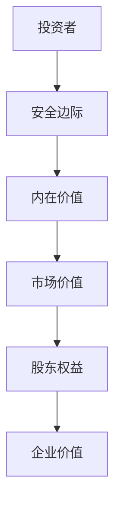
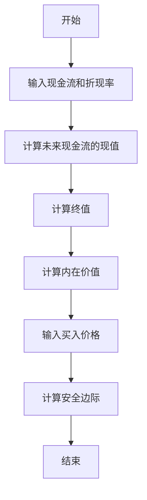
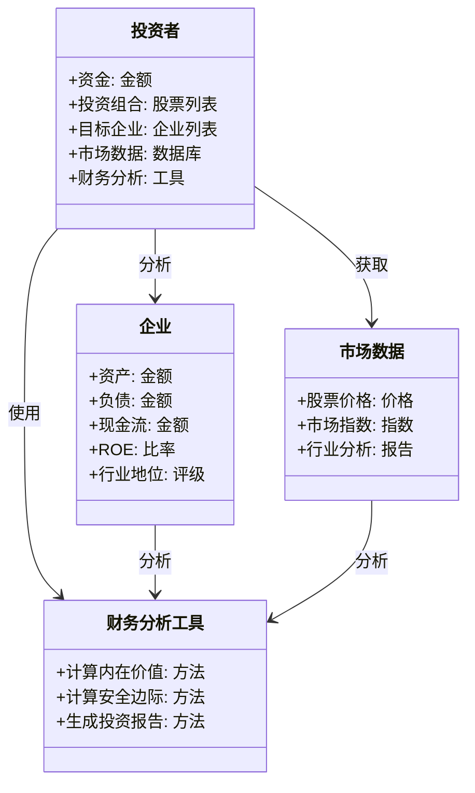
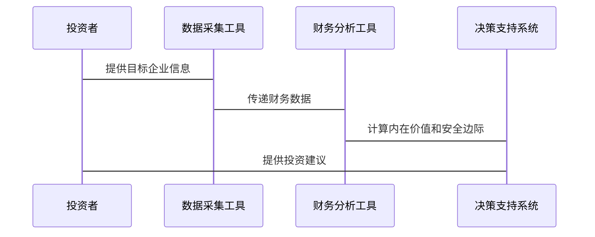

                 


# 巴菲特如何运用价值投资理念

## 关键词：价值投资, 巴菲特, 内在价值, 安全边际, 股东权益

## 摘要：  
巴菲特作为全球最著名的价值投资者之一，他的投资理念深刻影响了全球金融领域。本文将从价值投资的核心概念、算法原理、数学模型、系统分析、项目实战等多个方面，全面解析巴菲特如何运用价值投资理念进行投资决策，并通过实际案例分析其成功经验。文章内容详实，结构清晰，旨在帮助读者深入理解价值投资的本质和应用。

---

# 第一部分: 价值投资的核心概念与背景

## 第1章: 价值投资的核心概念与背景

### 1.1 价值投资的定义与核心要素

#### 1.1.1 价值投资的定义  
价值投资是一种投资策略，其核心是通过分析企业的内在价值，寻找市场价格低于内在价值的股票进行投资。巴菲特将价值投资的理念总结为：以合理的价格买入一家优秀的公司。

#### 1.1.2 价值投资的核心要素  
- **内在价值**：企业未来现金流的现值，是衡量企业价值的核心标准。  
- **安全边际**：买入价格低于内在价值的幅度，以确保投资的安全性。  
- **长期视角**：关注企业的长期盈利能力，而非短期市场波动。  

#### 1.1.3 价值投资与其它投资理念的区别  
- **基本面分析**：价值投资注重对企业财务状况和行业地位的分析，而技术分析则关注价格走势和成交量。  
- **长期与短期**：价值投资强调长期持有，而短线交易关注短期价格波动。  

---

### 1.2 巴菲特的价值投资哲学

#### 1.2.1 巴菲特的投资理念  
巴菲特的价值投资理念可以总结为“买Cheap Good”。他强调投资优质企业，并以合理的价格买入。  

#### 1.2.2 巴菲特的投资策略  
- **集中投资**：将资金集中在少数优质企业上，避免分散投资。  
- **长期持有**：避免频繁交易，长期持有优质企业股票。  
- **安全边际**：确保买入价格低于内在价值，以降低投资风险。  

#### 1.2.3 巴菲特的价值投资原则  
- **只投资自己理解的行业**：巴菲特只投资他熟悉的行业，如消费、金融、能源等。  
- **关注企业的ROE**：巴菲特重视企业的净资产收益率（ROE），认为这是衡量企业盈利能力的重要指标。  
- **关注管理层**：巴菲特注重企业的管理层素质，认为优秀的管理层能够为股东创造更多价值。  

---

### 1.3 价值投资的历史与发展

#### 1.3.1 价值投资的起源  
价值投资理念起源于20世纪初，本杰明·格雷厄姆和戴维·多德是该理念的奠基人。他们提出“安全边际”和“内在价值”等核心概念。  

#### 1.3.2 价值投资的发展历程  
- **早期发展**：20世纪30年代至50年代，格雷厄姆和多德的理论逐渐被投资者接受。  
- **巴菲特时代**：巴菲特将价值投资理念发扬光大，成为全球最著名的价值投资者。  
- **现代发展**：价值投资理念不断演变，与其他投资策略相结合，形成多元化的发展方向。  

#### 1.3.3 价值投资在现代金融中的地位  
价值投资是金融领域的重要理论之一，其核心思想对现代投资理论产生了深远影响。  

---

### 1.4 价值投资的适用场景与边界

#### 1.4.1 价值投资的适用场景  
- **市场低估阶段**：当市场整体估值较低时，价值投资更容易找到被低估的股票。  
- **稳定行业**：价值投资更适合投资于消费、金融等稳定行业，而非周期性较强行业。  

#### 1.4.2 价值投资的边界与限制  
- **信息不对称**：投资者需要掌握企业的详细信息，这对个人投资者来说可能较为困难。  
- **市场波动**：价值投资需要面对市场的短期波动，可能对短期资金需求造成压力。  

#### 1.4.3 价值投资与市场周期的关系  
价值投资在市场低估时更具优势，而在市场高估时可能需要调整策略。  

---

### 1.5 本章小结  
本章从价值投资的核心概念、巴菲特的投资哲学、历史发展以及适用场景等方面，全面介绍了价值投资的基本框架。接下来，我们将深入探讨价值投资的核心概念与联系。

---

# 第二部分: 价值投资的核心概念与联系

## 第2章: 价值投资的核心概念原理

### 2.1 安全边际

#### 2.1.1 安全边际的定义  
安全边际是指买入价格与内在价值之间的差距，确保投资的安全性。  

#### 2.1.2 安全边际的计算方法  
- **公式**：安全边际 = 买入价格 - 内在价值  
- **实例**：假设某股票的内在价值为100元，买入价格为80元，则安全边际为20元。  

#### 2.1.3 安全边际在投资中的作用  
- **降低风险**：安全边际确保即使市场波动，投资也不会出现大幅亏损。  
- **长期收益**：通过安全边际，投资者能够在长期获得超额收益。  

---

### 2.2 内在价值

#### 2.2.1 内在价值的定义  
内在价值是企业未来现金流的现值，是衡量企业价值的最终标准。  

#### 2.2.2 内在价值的计算方法  
- **公式**：  
  $$ \text{内在价值} = \sum_{t=1}^{n} \frac{\text{现金流}_t}{(1 + r)^t} $$  
  其中，$r$ 是折现率，$n$ 是预测期数。  

#### 2.2.3 内在价值与市场价值的关系  
- **市场价值**：市场价值是股票的市场价格，可能高于或低于内在价值。  
- **投资机会**：当市场价值低于内在价值时，投资具有安全边际。  

---

### 2.3 股东权益

#### 2.3.1 股东权益的定义  
股东权益是企业在扣除负债后的剩余价值，是股东对企业的所有权。  

#### 2.3.2 股东权益的计算公式  
$$ \text{股东权益} = \text{资产} - \text{负债} $$  

#### 2.3.3 股东权益与企业价值的关系  
- 股东权益是企业价值的重要组成部分，反映了企业的净资产价值。  
- 企业价值 = 股东权益 + 负债  

---

### 2.4 核心概念对比表格

| **概念**       | **定义**                                                                 |
|----------------|--------------------------------------------------------------------------|
| 内在价值       | 企业未来现金流的现值，是衡量企业价值的核心标准。                      |
| 市场价值       | 股票的市场价格，可能高于或低于内在价值。                              |
| 安全边际       | 买入价格与内在价值的差距，确保投资的安全性。                          |
| 股东权益       | 企业在扣除负债后的剩余价值，反映股东对企业的所有权。                |

---

### 2.5 实体关系图（Mermaid流程图）



---

### 2.6 本章小结  
本章详细介绍了价值投资中的核心概念，包括安全边际、内在价值和股东权益。通过对比表格和流程图，读者可以更清晰地理解这些概念之间的关系。接下来，我们将深入探讨价值投资的算法原理和数学模型。

---

# 第三部分: 价值投资的算法原理与数学模型

## 第3章: 价值投资的算法原理

### 3.1 内在价值的计算算法

#### 3.1.1 现金流折现法  
现金流折现法是计算内在价值的核心方法。以下是计算步骤：  

1. **预测未来现金流**：根据企业的财务状况和行业前景，预测未来5-10年的自由现金流。  
2. **选择折现率**：通常使用企业的加权平均资本成本（WACC）作为折现率。  
3. **计算现值**：将未来现金流折现，计算其现值。  
4. **终值计算**：假设企业在未来某一年不再产生现金流，计算其终值。  
5. **总内在价值**：将现值和终值相加，得到企业的总内在价值。  

#### 3.1.2 现金流折现法的公式  
$$ \text{内在价值} = \sum_{t=1}^{n} \frac{\text{现金流}_t}{(1 + r)^t} + \frac{\text{终值}}{(1 + r)^n} $$  

#### 3.1.3 实例分析  
假设某企业未来5年的现金流分别为100、120、140、160、180万元，折现率为10%。计算其内在价值：  

$$ \text{内在价值} = \frac{100}{1.1} + \frac{120}{1.1^2} + \frac{140}{1.1^3} + \frac{160}{1.1^4} + \frac{180}{1.1^5} $$  

---

### 3.2 安全边际的计算算法

#### 3.2.1 安全边际计算公式  
$$ \text{安全边际} = \text{买入价格} - \text{内在价值} $$  

#### 3.2.2 安全边际的选择  
巴菲特通常选择安全边际为内在价值的30%以上，即买入价格为内在价值的70%以下。  

---

### 3.3 数学模型与公式

#### 3.3.1 内在价值计算公式  
$$ \text{内在价值} = \sum_{t=1}^{n} \frac{\text{现金流}_t}{(1 + r)^t} + \frac{\text{终值}}{(1 + r)^n} $$  

#### 3.3.2 安全边际计算公式  
$$ \text{安全边际} = \text{买入价格} - \text{内在价值} $$  

---

### 3.4 算法流程图（Mermaid流程图）



---

### 3.5 本章小结  
本章通过现金流折现法，详细介绍了内在价值的计算算法，并展示了安全边际的计算方法。通过公式和流程图，读者可以清晰地理解价值投资的数学模型。接下来，我们将从系统分析的角度，进一步探讨价值投资的架构设计。

---

# 第四部分: 价值投资的系统分析与架构设计

## 第4章: 价值投资的系统分析与架构设计

### 4.1 问题场景介绍

#### 4.1.1 投资者面临的挑战  
- 信息不对称：投资者需要获取企业的详细财务数据。  
- 市场波动：市场波动可能影响投资决策。  
- 时间成本：价值投资需要长期持有，对资金流动性要求较低。  

#### 4.1.2 价值投资的系统需求  
- 数据采集：获取企业的财务数据和行业信息。  
- 数据分析：计算内在价值和安全边际。  
- 决策支持：提供投资建议和风险评估。  

---

### 4.2 系统功能设计（领域模型Mermaid类图）



---

### 4.3 系统架构设计（Mermaid架构图）


---

### 4.4 系统接口设计

#### 4.4.1 数据接口  
- **输入接口**：投资者输入目标企业的财务数据和市场数据。  
- **输出接口**：系统输出内在价值和安全边际的计算结果。  

#### 4.4.2 交互接口  
- **投资建议**：系统根据计算结果，为投资者提供买入、卖出或持有建议。  

---

### 4.5 系统交互设计（Mermaid序列图）



---

### 4.6 本章小结  
本章从系统分析的角度，探讨了价值投资的架构设计和接口设计。通过类图、架构图和序列图，读者可以更清晰地理解价值投资的系统实现。接下来，我们将通过项目实战，进一步验证价值投资理念的应用。

---

# 第五部分: 价值投资的项目实战

## 第5章: 价值投资的项目实战

### 5.1 环境安装与数据准备

#### 5.1.1 环境安装  
- **数据源**：使用Yahoo Finance获取股票数据。  
- **工具**：使用Python和Pandas进行数据分析。  
- **算法库**：使用numpy和scipy进行数值计算。  

#### 5.1.2 数据准备  
- 下载目标企业的历史财务数据和市场数据。  
- 确保数据的完整性和准确性。  

---

### 5.2 核心实现源代码

#### 5.2.1 计算内在价值的Python代码

```python
import numpy as np
import pandas as pd

def calculate_intrinsic_value(cash_flows, discount_rate, terminal_value):
    """
    计算内在价值
    """
    # 计算未来现金流的现值
    present_value = 0
    for t in range(len(cash_flows)):
        present_value += cash_flows[t] / (1 + discount_rate) ** (t + 1)
    # 计算终值的现值
    present_value += terminal_value / (1 + discount_rate) ** (len(cash_flows) + 1)
    return present_value

# 示例数据
cash_flows = [100, 120, 140, 160, 180]  # 未来5年的现金流
discount_rate = 0.10
terminal_value = 2000  # 第6年的终值

# 计算内在价值
intrinsic_value = calculate_intrinsic_value(cash_flows, discount_rate, terminal_value)
print(f"内在价值为：{intrinsic_value:.2f} 元")
```

#### 5.2.2 计算安全边际的Python代码

```python
def calculate_margin_of_safety.purchase_price, intrinsic_value):
    """
    计算安全边际
    """
    return purchase_price - intrinsic_value

# 示例数据
purchase_price = 80  # 买入价格
intrinsic_value = 100  # 内在价值

# 计算安全边际
margin_of_safety = calculate_margin_of_safety(purchase_price, intrinsic_value)
print(f"安全边际为：{margin_of_safety:.2f} 元")
```

---

### 5.3 代码应用解读与分析

#### 5.3.1 内在价值计算代码解读  
- **输入**：未来现金流、折现率和终值。  
- **输出**：内在价值的现值。  
- **应用场景**：用于评估企业的内在价值，判断其是否被低估。  

#### 5.3.2 安全边际计算代码解读  
- **输入**：买入价格和内在价值。  
- **输出**：安全边际的数值。  
- **应用场景**：用于评估投资的安全性，确保买入价格低于内在价值。  

---

### 5.4 实际案例分析

#### 5.4.1 案例背景  
以巴菲特投资的可口可乐为例，分析其价值投资策略。  

#### 5.4.2 数据分析  
- **现金流**：可口可乐未来5年的现金流预测。  
- **折现率**：使用可口可乐的WACC（加权平均资本成本）作为折现率。  
- **终值**：假设可口可乐在未来某一年停止增长，计算其终值。  

#### 5.4.3 投资建议  
- **买入价格**：低于内在价值的价格。  
- **安全边际**：确保买入价格低于内在价值的一定比例。  

---

### 5.5 本章小结  
本章通过实际案例分析，展示了价值投资理念在实战中的应用。通过Python代码的实现，读者可以更好地理解内在价值和安全边际的计算方法。接下来，我们将总结价值投资的最佳实践，并给出投资建议。

---

# 第六部分: 价值投资的最佳实践与总结

## 第6章: 价值投资的最佳实践与总结

### 6.1 投资策略与注意事项

#### 6.1.1 长期投资  
价值投资强调长期持有，避免频繁交易。  

#### 6.1.2 集中投资  
集中投资于少数优质企业，降低投资风险。  

#### 6.1.3 价值发现  
寻找市场价格低于内在价值的企业，确保投资的安全性。  

#### 6.1.4 风险管理  
通过安全边际和分散投资，降低投资风险。  

---

### 6.2 项目小结

#### 6.2.1 核心收获  
- 价值投资的核心在于内在价值和安全边际。  
- 巴菲特的投资哲学强调长期持有和集中投资。  

#### 6.2.2 项目经验  
- 价值投资需要深入分析企业的财务状况和行业前景。  
- 安全边际是确保投资安全的关键因素。  

---

### 6.3 最佳实践 Tips

#### 6.3.1 投资前的准备工作  
- 了解企业的财务数据和行业信息。  
- 计算企业的内在价值和安全边际。  

#### 6.3.2 投资中的注意事项  
- 避免短期波动，关注长期价值。  
- 保持分散投资，降低风险。  

---

### 6.4 本章小结  
本章总结了价值投资的最佳实践，强调了长期投资、集中投资和风险管理的重要性。通过本章的学习，读者可以更好地应用价值投资理念进行投资决策。

---

# 作者：AI天才研究院/AI Genius Institute & 禅与计算机程序设计艺术/Zen And The Art of Computer Programming

