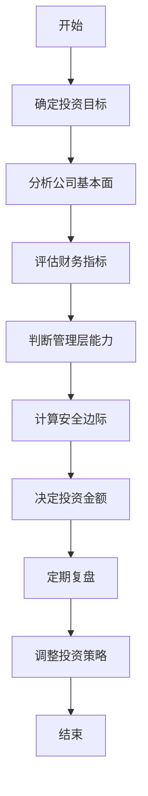
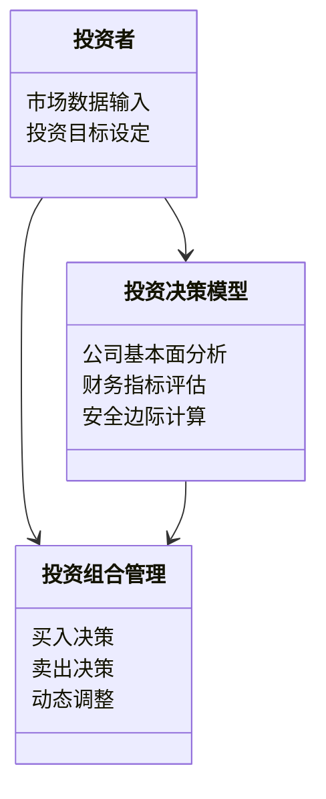
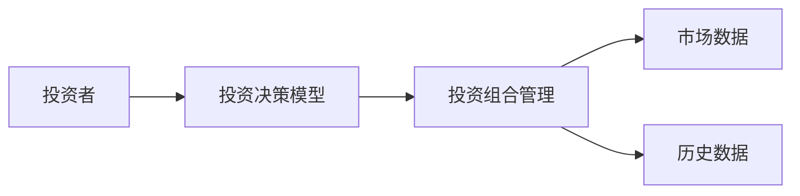
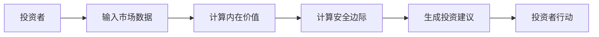

                 


# 巴菲特的'大赌注'：何时集中投资是明智之举

---

## 关键词：
- 巴菲特投资策略
- 集中投资
- 价值投资
- 安全边际
- 投资决策模型

---

## 摘要：
本文深入分析了巴菲特的集中投资策略，探讨了其背后的投资哲学、选股标准和决策框架。通过数学模型、系统分析和实际案例，揭示了集中投资的智慧与时机选择，帮助读者在投资决策中做出明智选择。

---

## 第一部分：巴菲特的投资理念与集中投资策略

### 第1章：巴菲特的投资理念概述

#### 1.1 巴菲特的投资哲学
- **价值投资的定义与核心思想**
  - 价值投资：寻找市场低估的股票，长期持有，等待市场重新评估其价值。
  - 核心思想：市场先生是疯狂的，但市场最终会反映企业的内在价值。

- **巴菲特的价值投资策略**
  - 寻找具有持续竞争优势的企业。
  - 买入价格远低于内在价值的股票。

- **巴菲特投资理念的演变**
  - 早期关注低市盈率和低市净率的股票。
  - 后期转向寻找具有强大护城河的企业。

#### 1.2 集中投资的定义与特点
- **集中投资的定义**
  - 将大部分资金投资于少数几只股票，尤其是那些具有长期竞争优势的企业。

- **集中投资的核心特征**
  - 高度集中：投资组合中通常只持有少数几只股票。
  - 长期持有：耐心等待企业的价值增长。

- **集中投资与分散投资的对比**
  - 集中投资：风险较高，但潜在回报也高。
  - 分散投资：风险较低，但潜在回报也较低。

#### 1.3 巴菲特集中投资的智慧
- **巴菲特集中投资的逻辑**
  - 集中投资于少数具有长期竞争优势的企业，可以最大化投资回报。
  - 分散投资相当于“把钱平均分配给平庸的企业”，而集中投资则可以“把钱分配给最优秀的企业”。

- **巴菲特集中投资的成功案例**
  - 伯克希尔 Hathaway 对可口可乐的投资：长期持有，获得丰厚回报。

- **巴菲特集中投资的风险控制**
  - 选择具有强大护城河的企业。
  - 买入价格具有安全边际。

---

### 第2章：巴菲特集中投资的核心策略

#### 2.1 巴菲特的选股标准
- **公司基本面分析**
  - 企业盈利能力：ROE（净资产收益率）高且稳定。
  - 企业成长性：收入和利润持续增长。

- **财务指标评估**
  - 低市盈率（P/E）和低市净率（P/B）：买入价格远低于内在价值。
  - 高股息率：部分企业通过高股息回报股东。

- **管理团队的考察**
  - 管理层诚信可靠，具有长期愿景。

#### 2.2 巴菲特的长期投资策略
- **长期投资的定义与优势**
  - 长期投资：持有股票数年甚至数十年，等待企业的内在价值增长。
  - 优势：避免短期市场波动的干扰，获得企业的长期增长收益。

- **巴菲特长期投资的实践**
  - 伯克希尔 Hathaway 对 IBM 的投资：长期持有，获得技术进步的收益。

- **长期投资的风险与挑战**
  - 市场波动：短期股价可能大幅波动，但长期来看股价会回归内在价值。
  - 时间成本：长期投资需要耐心等待。

#### 2.3 巴菲特的投资组合管理
- **投资组合的构建原则**
  - 选择具有长期竞争优势的企业。
  - 买入价格具有安全边际。

- **投资组合的动态调整**
  - 定期复盘：评估企业的发展情况和市场变化。
  - 动态调整：根据市场变化和企业情况调整持仓。

- **投资组合的风险分散**
  - 集中投资于少数几家企业，但每家企业都具有强大的竞争优势。
  - 通过买入价格的安全边际分散风险。

---

### 第3章：巴菲特集中投资的数学模型与决策框架

#### 3.1 巴菲特投资决策的数学模型
- **价值评估模型**
  - 内在价值计算公式：
    $$ \text{内在价值} = \frac{\text{年现金流}}{\text{贴现率}} $$
  - 买入价格的安全边际：
    $$ \text{买入价格} \leq \text{内在价值} \times (1 - \text{安全边际比例}) $$

- **市场情绪分析模型**
  - 市场恐慌时买入优质股票。
  - 市场狂热时卖出或减少买入。

- **投资回报预测模型**
  - 预测企业的未来现金流，计算内部收益率（IRR）。

#### 3.2 巴菲特投资决策的流程图


#### 3.3 巴菲特投资决策的表格对比
| 指标       | 重要性 | 巴菲特的标准       | 其他投资者的标准       |
|------------|--------|-------------------|-----------------------|
| 市盈率     | 高     | 低于行业平均       | 低于市场平均           |
| 净资产收益率 | 高     | 高于15%           | 高于行业平均           |
| 管理层能力 | 高     | 有长期愿景且诚信   | 管理层能力一般         |

---

## 第二部分：巴菲特集中投资的系统分析与架构设计方案

### 第4章：系统分析与架构设计方案

#### 4.1 问题场景介绍
- 投资者需要在市场中选择具有长期竞争优势的企业。
- 通过数学模型和流程图辅助投资决策。

#### 4.2 项目介绍
- 开发一个基于巴菲特集中投资策略的投资决策支持系统。

#### 4.3 系统功能设计（领域模型）


#### 4.4 系统架构设计（系统架构图）


#### 4.5 系统交互设计（交互流程图）


---

## 第三部分：项目实战与案例分析

### 第5章：项目实战

#### 5.1 环境安装
- 需要安装 Python 和相关数据分析库（如 Pandas、NumPy）。
- 使用 Jupyter Notebook 进行数据分析和建模。

#### 5.2 核心实现源代码
```python
import pandas as pd
import numpy as np

def calculate_intrinsic_value(eps, growth_rate, discount_rate):
    """
    计算企业的内在价值（简化版）
    """
    return eps * (1 + growth_rate) / discount_rate

# 示例数据
eps = 10
growth_rate = 0.1
discount_rate = 0.08

intrinsic_value = calculate_intrinsic_value(eps, growth_rate, discount_rate)
print(f"内在价值: {intrinsic_value:.2f}")
```

#### 5.3 代码应用解读与分析
- 计算企业的内在价值，判断是否低于当前股价。
- 如果内在价值高于当前股价，则具有投资价值。

#### 5.4 实际案例分析
- 以可口可乐为例，计算其内在价值和安全边际。
- 结论：可口可乐具有强大的竞争优势和较高的安全边际。

#### 5.5 项目小结
- 通过代码实现巴菲特的集中投资策略，验证其在实际案例中的有效性。

---

## 第四部分：最佳实践与总结

### 第6章：最佳实践

#### 6.1 投资者注意事项
- **选择具有长期竞争优势的企业。**
- **买入价格具有安全边际。**
- **长期持有，耐心等待。**

#### 6.2 小结
- 巴菲特的集中投资策略是一种有效的投资方法。
- 通过数学模型和系统架构设计，可以辅助投资者做出更明智的投资决策。

#### 6.3 拓展阅读
- 巴菲特的《投资之道》
- 《证券分析》（本杰明·格雷厄姆）

---

## 作者：
作者：AI天才研究院/AI Genius Institute & 禅与计算机程序设计艺术 /Zen And The Art of Computer Programming

