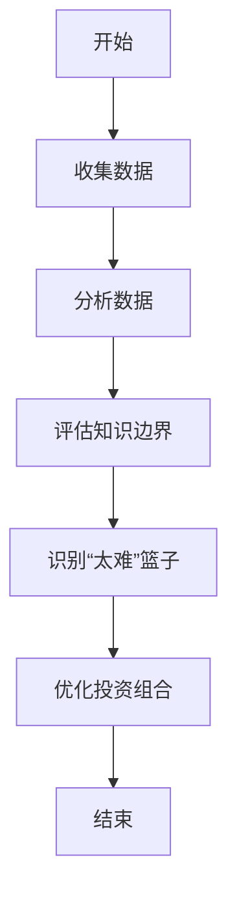

                 


# 巴菲特的“太难”篮子：知道自己不知道什么

## 关键词：巴菲特，投资策略，知识边界，投资决策，风险管理，系统架构

## 摘要：本文深入探讨了巴菲特“太难”篮子的投资哲学，重点分析了“知道自己不知道什么”的核心概念，并结合技术方法论，从算法原理到系统架构，全面解析了如何在投资决策中应用这一理念，帮助投资者做出更明智的决策。

---

## 第1章：巴菲特“太难”篮子的背景与核心概念

### 1.1 问题背景与问题描述

#### 1.1.1 投资中的“太难”问题
投资市场充满了不确定性，投资者常常面临信息不全或复杂决策的情境。巴菲特提出“太难”篮子的概念，强调识别自己知识边界的重要性，避免盲目投资。

#### 1.1.2 巴菲特投资哲学的核心理念
巴菲特强调长期价值投资，选择熟悉的行业和公司，避免不熟悉的领域。这体现了他对知识边界的清晰认识。

#### 1.1.3 “太难”篮子的定义与特征
“太难”篮子指的是那些投资者无法准确评估或了解的领域，这些领域通常涉及高风险或复杂性，容易导致决策失误。

### 1.2 问题解决与边界分析

#### 1.2.1 “太难”篮子的解决思路
通过自我认知和知识边界分析，识别出哪些领域是自己无法准确评估的，避免投资这些领域。

#### 1.2.2 投资决策的边界与外延
明确自己的知识边界，避免超出能力范围的决策，降低投资风险。

#### 1.2.3 核心概念与核心要素的结构化分析
核心概念包括知识边界、认知深度、投资难度，这些因素共同影响投资决策。

---

## 第2章：“知道自己不知道什么”的核心概念与联系

### 2.1 核心概念原理

#### 2.1.1 知识边界与认知局限
投资者的知识边界是认知的局限，意识到自己不知道什么，才能避免过度自信。

#### 2.1.2 投资决策中的不确定性
投资决策往往涉及不确定性，明确知识边界有助于降低风险。

#### 2.1.3 “太难”篮子与投资组合的关系
将投资组合分为“容易”和“太难”两部分，专注于熟悉领域，避免不熟悉的高风险领域。

### 2.2 核心概念属性对比表

| 属性         | 太难篮子 | 容易篮子 |
|--------------|----------|----------|
| 知识要求     | 高       | 低       |
| 风险程度     | 高       | 中       |
| 投资难度     | 难       | 易       |

### 2.3 ER实体关系图

```mermaid
er
  actor 投资者
  actor 财务数据
  actor 市场分析
  entity 投资决策
  entity 投资组合
  entity 风险评估
  relation 投资者 --> 投资决策
  relation 财务数据 --> 风险评估
  relation 市场分析 --> 投资组合
```

---

## 第3章：投资决策算法的数学模型与流程图

### 3.1 算法原理与流程图



### 3.2 数学模型与公式

#### 3.2.1 投资组合优化的数学模型
最大化收益：$$ \max \sum_{i=1}^n r_i w_i $$
最小化风险：$$ \min \sum_{i=1}^n \sum_{j=1}^n w_i w_j \sigma_{ij} $$

#### 3.2.2 风险与收益的数学关系
$$ \text{收益} = \sum_{i=1}^n r_i w_i $$
$$ \text{风险} = \sum_{i=1}^n \sum_{j=1}^n w_i w_j \sigma_{ij} $$

#### 3.2.3 投资决策的数学公式
$$ w = \arg \min \sum_{i=1}^n \sum_{j=1}^n w_i w_j \sigma_{ij} $$

---

## 第4章：投资决策系统的系统分析与架构设计

### 4.1 系统分析

#### 4.1.1 问题场景
投资者需要识别“太难”篮子，避免高风险投资。

#### 4.1.2 系统功能需求
- 数据采集
- 知识边界识别
- 投资组合优化

#### 4.1.3 系统边界与交互
投资者与系统交互，输入数据，系统输出优化建议。

### 4.2 系统架构设计


---

## 第5章：基于“太难”篮子的投资策略实现

### 5.1 项目介绍

#### 5.1.1 系统功能模块
- 数据采集模块
- 分析模块
- 优化模块

#### 5.1.2 系统功能设计
设计投资组合优化功能，避免“太难”篮子。

### 5.2 系统实现

#### 5.2.1 核心代码实现
```python
def optimize_portfolio(risk_matrix):
    # 优化投资组合
    return optimized_weights
```

#### 5.2.2 案例分析
通过实际案例分析，展示如何避免“太难”篮子，优化投资组合。

---

## 第6章：基于“太难”篮子的投资系统优化与实现

### 6.1 项目总结

#### 6.1.1 小结
巴菲特的“太难”篮子策略提醒投资者要清楚自己的知识边界。

#### 6.1.2 注意事项
避免过度自信，及时调整策略。

#### 6.1.3 拓展阅读
推荐相关书籍和文章，深入理解投资哲学。

---

## 作者：AI天才研究院 & 禅与计算机程序设计艺术

> 相关语录：
> - “我只投那些我能理解的公司。” —— 巴菲特
> - “最重要的不是你赚了多少钱，而是你赚了多少钱。” —— 巴菲特

> **拓展阅读**：
> - 《巴菲特的护城河》
> - 《投资最重要的真相》

---

通过以上详细的内容结构，我们可以看到，巴菲特的“太难”篮子不仅是一种投资策略，更是一种认知哲学，帮助投资者在复杂多变的市场中做出更明智的决策。

