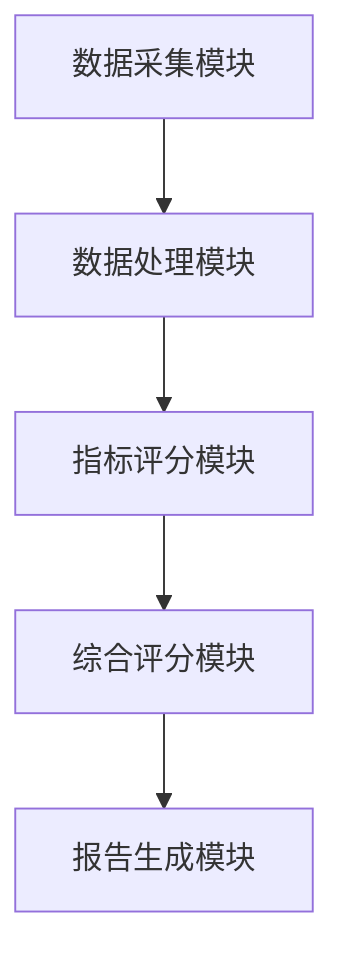

                 


```markdown
# 巴菲特的20格打孔卡投资法则

> 关键词：巴菲特，投资法则，打孔卡，价值投资，指标筛选

> 摘要：本文系统地介绍巴菲特的20格打孔卡投资法则，深入分析其核心概念、数学模型和系统架构，结合实际案例进行详细讲解，帮助读者掌握这一经典投资方法。

---

## 第一部分：巴菲特投资法则的背景与核心理念

### 第1章：巴菲特投资法则的背景

#### 1.1 巴菲特的投资哲学与方法

- 巴菲特的投资理念：长期价值投资，寻找具有持续竞争优势的企业。
- 巴菲特的选股标准：关注企业的财务健康、盈利能力、管理团队和行业地位。
- 打孔卡的由来：巴菲特曾提到过一种投资筛选方法，形象地称为“20格打孔卡”，用于系统地评估企业。

#### 1.2 打孔卡法则的起源与意义

- 打孔卡法则是一种投资筛选工具，通过设定多个关键指标，对企业进行综合评估。
- 该方法帮助投资者快速筛选出符合投资标准的企业，降低决策风险。

#### 1.3 打孔卡法则的核心目标与适用场景

- 核心目标：通过多维度指标筛选出具有长期投资价值的企业。
- 适用场景：适用于个人投资者和机构投资者，尤其适合长期价值投资策略。

---

## 第2章：20格打孔卡法则的核心指标与筛选标准

### 2.1 打孔卡法则的核心指标

- **财务指标**：ROE（净资产收益率）、ROA（资产回报率）、净利润率、毛利率。
- **资产质量指标**：资产负债率、流动比率、速动比率。
- **现金流指标**：自由现金流、现金流与净利润比率。
- **市场指标**：市盈率、市净率、股息率。

#### 2.1.1 财务指标

| 指标名称 | 定义 | 重要性 |
|----------|------|--------|
| ROE      | 净利润 / 平均股东权益 | 衡量企业使用股东资金的效率 |
| ROA      | 净利润 / 平均总资产   | 衡量企业资产的使用效率 |
| 净利率    | 净利润 / 收入       | 衡量企业的盈利能力 |
| 毛利率    | 毛利润 / 收入       | 衡量企业的成本控制能力 |

#### 2.1.2 资产质量指标

| 指标名称 | 定义 | 重要性 |
|----------|------|--------|
| 资产负债率 | 负债总额 / 资产总额 | 衡量企业的财务杠杆风险 |
| 流动比率  | 流动资产 / 流动负债 | 衡量企业的短期偿债能力 |
| 速动比率  | (流动资产 - 存货) / 流动负债 | 衡量企业的快速变现能力 |

#### 2.1.3 现金流指标

| 指标名称 | 定义 | 重要性 |
|----------|------|--------|
| 自由现金流 | 净利润 - 非现金支出 | 衡量企业的现金生成能力 |
| 现金流与净利润比率 | 自由现金流 / 净利润 | 衡量现金流与净利润的匹配程度 |

#### 2.1.4 市场指标

| 指标名称 | 定义 | 重要性 |
|----------|------|--------|
| 市盈率    | 股价 / 每股收益 | 衡量股票的估值水平 |
| 市净率    | 股价 / 每股净资产 | 衡量股票相对于账面价值的高低 |
| 股息率    | 每股股息 / 股价 | 衡量股票的分红能力 |

### 2.2 核心指标的筛选标准与权重分配

#### 2.2.1 指标权重的确定方法

- 根据指标的重要性进行权重分配，通常财务指标权重较大，市场指标权重较小。
- 示例权重分配：
  - ROE：30%
  - 净利率：25%
  - 资产负债率：20%
  - 市盈率：15%
  - 股息率：10%

#### 2.2.2 指标筛选的逻辑与优先级

- 优先筛选高ROE和高净利率的企业。
- 排除高负债率和高市盈率的企业。
- 优先选择股息率较高的企业。

---

## 第3章：打孔卡法则的数学模型与算法原理

### 3.1 打孔卡法则的数学模型

#### 3.1.1 指标评分函数的构建

- 每个指标赋予一定的权重，计算综合评分。
- 评分公式：
  \[
  \text{综合评分} = \sum_{i=1}^{n} w_i \times s_i
  \]
  其中，\( w_i \) 为指标 \( i \) 的权重，\( s_i \) 为指标 \( i \) 的评分。

#### 3.1.2 综合评分模型的建立

- 将20个指标按照权重和评分规则进行综合评分。
- 示例评分规则：
  - 指标评分范围：1-5分，5分为最优。
  - 根据指标实际值与标准值的偏离程度打分。

#### 3.1.3 模型的优化与调整

- 根据实际投资效果调整权重和评分标准。
- 定期更新指标和权重，适应市场变化。

### 3.2 打孔卡法则的算法实现

#### 3.2.1 数据预处理与清洗

- 数据来源：上市公司财务报表、股价数据。
- 数据清洗：处理缺失值、异常值。

#### 3.2.2 指标评分计算

- 使用预处理后的数据计算每个指标的评分。
- 示例代码：
  ```python
  def calculate_score(finance_data, weights):
      scores = {}
      for metric, weight in weights.items():
          # 根据指标值计算评分，例如：
          scores[metric] = 5 - abs(finance_data[metric] - target_value) / target_value * 4
      return scores
  ```

#### 3.2.3 综合评分与排序

- 计算综合评分并排序，选择评分最高的企业作为投资标的。
- 示例代码：
  ```python
  def calculate_total_score(scores, weights):
      total_score = 0
      for metric, weight in weights.items():
          total_score += scores[metric] * weight
      return total_score

  # 示例应用
  finance_data = {
      'ROE': 20,
      'ROA': 15,
      'net_profit_margin': 12,
      'debt_ratio': 0.5,
      'pe_ratio': 15,
      'dividend_yield': 2
  }
  weights = {
      'ROE': 0.3,
      'ROA': 0.25,
      'net_profit_margin': 0.2,
      'debt_ratio': 0.15,
      'pe_ratio': 0.1,
      'dividend_yield': 0.1
  }
  scores = calculate_score(finance_data, weights)
  total_score = calculate_total_score(scores, weights)
  print(f"Total score: {total_score}")
  ```

---

## 第4章：打孔卡法则的系统架构与实现

### 4.1 系统架构设计

#### 4.1.1 系统功能模块划分

- 数据采集模块：获取上市公司财务数据和股价数据。
- 数据处理模块：清洗和预处理数据。
- 指标评分模块：计算每个指标的评分。
- 综合评分模块：计算综合评分并排序。
- 报告生成模块：生成投资报告。

#### 4.1.2 数据流与模块交互关系



#### 4.1.3 系统架构的可扩展性与可维护性

- 模块化设计，便于后续扩展和维护。
- 支持多种数据源和多种指标的灵活配置。

### 4.2 数据结构与算法实现

#### 4.2.1 数据结构设计

- 数据存储：使用数据库存储企业信息和评分结果。
- 数据结构：表结构包括企业名称、指标值、评分结果等。

#### 4.2.2 算法实现步骤

1. 数据采集：获取企业财务数据。
2. 数据清洗：处理缺失值和异常值。
3. 指标评分：计算每个指标的评分。
4. 综合评分：计算综合评分并排序。
5. 生成报告：输出投资建议和报告。

#### 4.2.3 系统接口设计

- API接口：提供数据接口供其他系统调用。
- 接口文档：详细说明接口参数和返回结果。

---

## 第5章：打孔卡法则的项目实战

### 5.1 环境搭建与数据准备

#### 5.1.1 开发环境安装与配置

- 安装Python和相关库（pandas、numpy、scikit-learn）。
- 安装数据库（MySQL或PostgreSQL）。

#### 5.1.2 数据源获取与清洗

- 数据来源：股票网站、财经网站。
- 数据清洗：处理缺失值、异常值。

#### 5.1.3 数据预处理与特征提取

- 特征提取：从财务报表中提取相关指标。
- 数据标准化：对数据进行标准化处理。

### 5.2 核心算法实现

#### 5.2.1 指标评分计算代码

```python
import pandas as pd

def calculate_indicator_scores(data, target_values):
    scores = {}
    for indicator in data.columns:
        # 示例评分逻辑
        score = 5 - abs(data[indicator] - target_values[indicator]) / target_values[indicator] * 4
        scores[indicator] = score.round(2)
    return scores

# 示例数据
data = pd.DataFrame({
    'ROE': [20, 15, 25],
    'ROA': [12, 10, 15],
    'net_profit_margin': [10, 8, 12],
    'debt_ratio': [0.6, 0.5, 0.7],
    'pe_ratio': [18, 15, 12],
    'dividend_yield': [1.5, 2, 1]
})
target_values = {
    'ROE': 20,
    'ROA': 15,
    'net_profit_margin': 10,
    'debt_ratio': 0.5,
    'pe_ratio': 15,
    'dividend_yield': 1.5
}

scores = calculate_indicator_scores(data, target_values)
print(scores)
```

#### 5.2.2 综合评分排序代码

```python
def calculate_total_score(indicator_scores, weights):
    total_scores = []
    for index, row in indicator_scores.iterrows():
        total = 0
        for indicator in row.index:
            total += row[indicator] * weights[indicator]
        total_scores.append(total)
    return total_scores

# 示例权重
weights = {
    'ROE': 0.3,
    'ROA': 0.25,
    'net_profit_margin': 0.2,
    'debt_ratio': 0.15,
    'pe_ratio': 0.1,
    'dividend_yield': 0.1
}

# 示例计算
total_scores = calculate_total_score(scores, weights)
print(total_scores)
```

---

## 第6章：打孔卡法则的最佳实践与注意事项

### 6.1 最佳实践

#### 6.1.1 指标筛选的注意事项

- 定期更新指标和权重，适应市场变化。
- 结合宏观经济环境进行调整。

#### 6.1.2 投资组合的优化策略

- 分散投资，降低风险。
- 定期重新评估投资组合。

#### 6.1.3 风险控制与投资纪律

- 设定止损点，控制回撤。
- 遵循投资纪律，避免情绪化决策。

### 6.2 小结与总结

#### 6.2.1 打孔卡法则的核心要点回顾

- 系统性：通过多维度指标筛选企业。
- 逻辑性：指标权重和评分规则清晰。
- 可操作性：提供具体的实现方法和工具。

#### 6.2.2 投资者在实际应用中的常见误区

- 过度依赖指标，忽视企业基本面。
- 忽略宏观经济环境的影响。
- 缺乏长期视角，追求短期收益。

#### 6.2.3 未来投资环境的变化与适应策略

- 随着市场变化，及时调整指标和权重。
- 结合新兴行业和创新企业进行评估。

---

## 第7章：拓展阅读与深入思考

### 7.1 拓展阅读推荐

#### 7.1.1 巴菲特投资经典著作

- 《巴菲特的选股智慧》
- 《价值投资：巴菲特的思维方式》

#### 7.1.2 其他价值投资经典书籍

- 《投资的艺术》
- 《投资最重要的ことは何か？》

#### 7.1.3 金融分析与投资策略相关文献

- 《证券投资分析》
- 《机构投资策略》

### 7.2 深入思考

#### 7.2.1 打孔卡法则的局限性与改进方向

- 局限性：指标过于固定，可能无法适应复杂市场环境。
- 改进方向：引入更多动态指标，如行业景气度、管理层变动等。

#### 7.2.2 数值计算方法的优化

- 使用机器学习方法优化指标权重。
- 引入时间序列分析，考虑历史表现。

#### 7.2.3 系统架构的优化

- 采用分布式架构，提高数据处理效率。
- 引入实时数据流处理，提升投资决策的时效性。

---

## 作者：AI天才研究院/AI Genius Institute & 禅与计算机程序设计艺术 /Zen And The Art of Computer Programming
```

