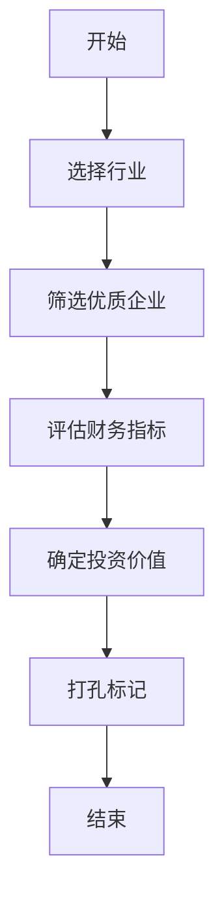
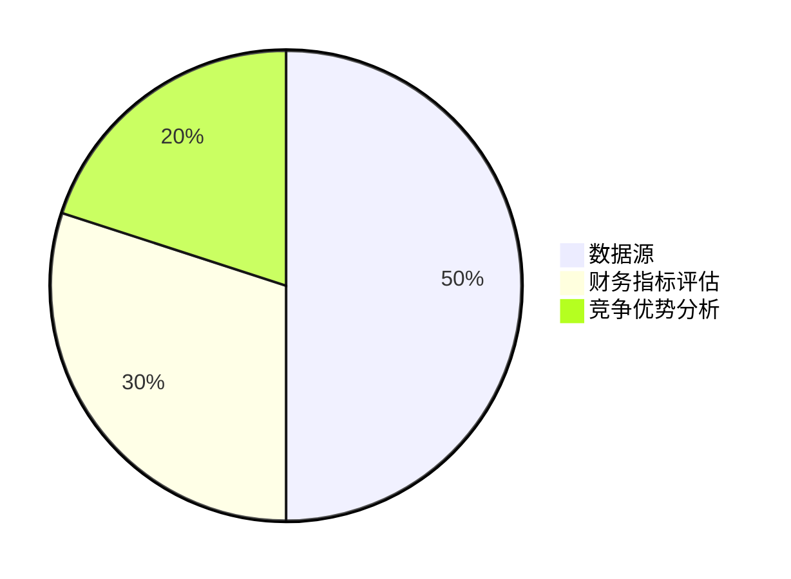
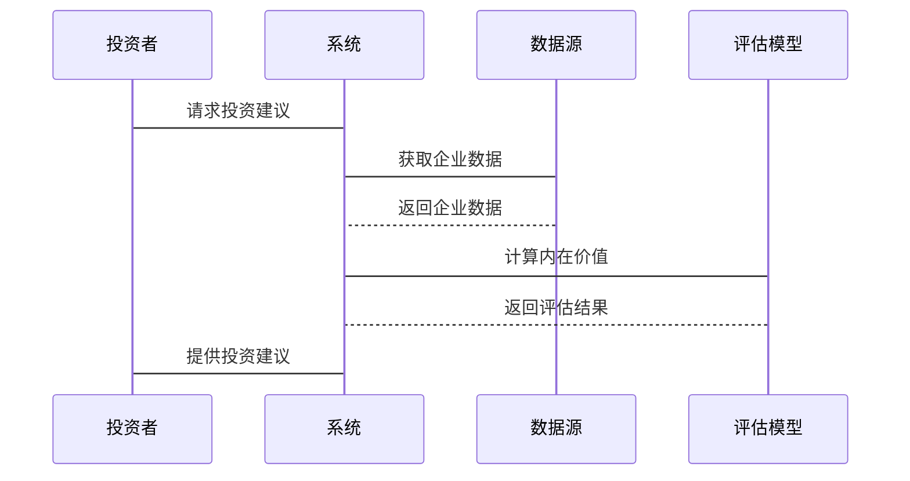

                 


# 巴菲特的20格打孔卡：集中投资的艺术

## 关键词：巴菲特，价值投资，集中投资，打孔卡，股票筛选，投资策略

## 摘要：本文深入探讨了巴菲特的20格打孔卡投资方法，分析其背后的理论基础、算法原理以及实际应用。通过详细讲解如何使用打孔卡进行股票筛选和投资决策，结合技术手段，帮助读者理解集中投资的艺术。

---

## 第一部分: 巴菲特的20格打孔卡概述

### 第1章: 巴菲特的生平与投资哲学

#### 1.1 巴菲特的生平简介
- **早年经历**：巴菲特出生于1934年，从小就展现出对投资的兴趣。他在青少年时期通过投资高尔夫球和可口可乐赚取了人生第一桶金。
- **投资理念的形成**：在哥伦比亚大学学习期间，巴菲特受到格雷厄姆的价值投资理论影响，形成了注重安全边际和内在价值的投资理念。
- **合伙人制度**：巴菲特早期通过合伙企业模式，与投资者共同投资，强调长期合作和利益共享。

#### 1.2 巴菲特的投资哲学
- **价值投资的核心理念**：寻找市场价格低于内在价值的股票，长期持有优质企业。
- **股票投资的长期视角**：巴菲聿认为，投资的目的是获得企业未来现金流的折现值，而不是短期价格波动。
- **投资中的安全边际**：通过买入价格低于内在价值的股票，降低投资风险。

### 第2章: 20格打孔卡的定义与特点

#### 2.1 20格打孔卡的定义
- **物理形态**：20格打孔卡是一种物理工具，由20个格子组成，每个格子代表一只股票。
- **投资中的应用**：通过在格子上打孔，巴菲特筛选出符合投资标准的股票，进行集中投资。
- **象征意义**：打孔卡象征着集中投资的原则，强调选择少数优质企业，长期持有。

#### 2.2 20格打孔卡的特点
- **集中投资的原则**：通过限制投资数量，强调集中投资，避免过度分散。
- **选股标准与流程**：筛选优质企业，评估财务指标，确定投资价值。
- **动态调整**：根据市场变化和企业情况，定期评估和调整投资组合。

### 第3章: 20格打孔卡与传统投资的区别

#### 3.1 传统投资方法的局限性
- **短期交易的风险**：频繁交易增加了交易成本和税收负担，降低了净收益。
- **非理性决策的影响**：投资者容易受到市场情绪影响，做出错误决策。
- **资产配置的不确定性**：分散投资可能导致收益不稳定，难以获得高回报。

#### 3.2 20格打孔卡的优势
- **长期视角的稳定性**：通过集中投资优质企业，降低短期波动的影响。
- **高效性**：通过严格筛选，减少低效投资，提高投资收益。
- **纪律性**：打孔卡的物理工具帮助投资者保持纪律，避免情绪化决策。

---

## 第二部分: 20格打孔卡的核心概念与联系

### 第4章: 打孔卡背后的算法原理

#### 4.1 价值评估模型
- **股票内在价值的计算**：巴菲特认为，股票的内在价值是未来现金流的现值，通过DCF模型计算。
- **财务指标的分析与权重分配**：评估企业的盈利能力、成长性和财务健康，确定其投资价值。
- **企业竞争优势的识别**：寻找具有持续竞争优势的企业，如低成本、高市场份额等。

#### 4.2 打孔卡算法的流程图



#### 4.3 算法实现的Python代码

```python
def calculate_intrinsic_value(financial_metrics):
    # 示例代码，具体实现需根据实际模型调整
    iv = sum(financial_metrics.values()) / len(financial_metrics)
    return iv

# 示例数据
metrics = {
    '市盈率': 15,
    'ROE': 12,
    '净利润率': 8,
    '资产负债率': 50
}

iv = calculate_intrinsic_value(metrics)
print(f"股票的内在价值为: {iv}")
```

### 第5章: 数学模型与公式

#### 5.1 股票内在价值的计算

股票的内在价值可以用以下公式计算：

$$
\text{内在价值} = \sum_{t=1}^{n} \frac{\text{现金流}_t}{(1 + r)^t}
$$

其中，\( r \) 是折现率，\( \text{现金流}_t \) 是第 \( t \) 年的现金流。

---

## 第三部分: 20格打孔卡的系统架构与应用

### 第6章: 系统分析与架构设计方案

#### 6.1 问题场景介绍
- 投资者需要一种高效的投资工具，筛选优质企业，进行集中投资。

#### 6.2 系统功能设计
- 数据收集：收集企业的财务数据和行业信息。
- 筛选标准：基于财务指标和竞争优势，筛选符合投资标准的企业。
- 投资决策：根据打孔卡算法，确定投资组合。

#### 6.3 系统架构设计



#### 6.4 系统接口设计
- 数据接口：从数据库或API获取企业数据。
- 评估接口：调用价值评估模型，计算股票的内在价值。
- 决策接口：根据评估结果，生成投资建议。

#### 6.5 系统交互序列图



### 第7章: 项目实战

#### 7.1 环境安装
- 安装Python和相关库（如pandas、numpy）。

#### 7.2 核心实现代码

```python
import pandas as pd
import numpy as np

def calculate_intrinsic_value(financial_metrics):
    iv = np.mean(financial_metrics)
    return iv

# 示例数据
metrics = pd.DataFrame({
    '市盈率': [15],
    'ROE': [12],
    '净利润率': [8],
    '资产负债率': [50]
})

iv = calculate_intrinsic_value(metrics)
print(f"股票的内在价值为: {iv}")
```

#### 7.3 代码应用解读
- 数据收集：从数据库中获取企业的财务数据。
- 评估模型：计算股票的内在价值。
- 投资建议：根据评估结果，生成投资建议。

#### 7.4 实际案例分析
- 选择一个行业，筛选优质企业，评估其内在价值，生成投资建议。

### 第8章: 最佳实践

#### 8.1 小结
- 20格打孔卡是一种高效的投资工具，帮助投资者集中投资优质企业。

#### 8.2 注意事项
- 定期评估投资组合，动态调整。
- 避免情绪化决策，保持投资纪律。

#### 8.3 拓展阅读
- 《巴菲特投资法则》
- 《价值投资入门》

---

## 结语

巴菲特的20格打孔卡是一种简单而有效的投资工具，通过集中投资优质企业，实现长期稳定的收益。本文详细介绍了打孔卡的背景、原理、算法和实际应用，帮助读者理解集中投资的艺术。

---

## 作者

作者：AI天才研究院/AI Genius Institute & 禅与计算机程序设计艺术 /Zen And The Art of Computer Programming

